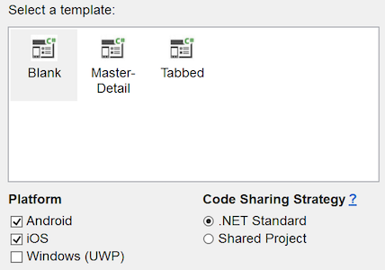

# Build your first Xamarin.Forms App

_Watch this video and follow along to create your first mobile app with Xamarin.Forms._

::: zone pivot="windows"

> [!Video https://channel9.msdn.com/Shows/XamarinShow/Building-Your-First-Android--iOS-App-in-Visual-Studio-2017/player]

## Step-by-step instructions for Windows

[ Download the sample](https://developer.xamarin.com/samples/xamarin-forms/GetStarted/FirstApp/)

Follow these steps along with the video above:

1. Choose **File > New > Project...** or press the **Create new project...** button, then select **Visual C# > Cross-Platform > Mobile App (Xamarin.Forms)**:

    [](images/win/01.png#lightbox)

2. Ensure **Android** and **iOS** are selected, with **.NET Standard** code sharing:

    [](images/win/02.png#lightbox)

3. Wait until the NuGet packages are restored (a "Restore completed" message will appear in the status bar).

4. Launch Android emulator by pressing the debug button (or the **Debug > Start Debugging** menu item).

5. Edit **MainPage.xaml**, adding this XAML before the end of the `</StackLayout>`:

    ```xaml
    <Button Text="Click Me" Clicked="Button_Clicked" />
    ```

6. Edit **MainPage.xaml.cs**, adding this code to the end of the class:

    ```csharp
    int count = 0;
    void Button_Clicked(object sender, System.EventArgs e)
    {
        count++;
        ((Button)sender).Text = $"You clicked {count} times.";
    }
    ```

7. Debug the app on Android:

    

    > [!TIP]
    > It is possible to build and debug the iOS app from Visual Studio with a
    > networked Mac computer. Refer to the [setup instructions](~/ios/get-started/installation/windows/index.md)
    > for more information.

::: zone-end
::: zone pivot="macos"

> [!Video https://channel9.msdn.com/Shows/XamarinShow/Building-Your-First-iOS--Android-App-in-Visual-Studio-for-Mac/player]

## Step-by-step instructions for Mac

[ Download the sample](https://developer.xamarin.com/samples/xamarin-forms/GetStarted/FirstApp/)

Follow these steps along with the video above:

1. Choose **File > New Solution...** or press the **New Project...** button, then select **Multiplatform > App > Blank Forms App**:

    [](images/01.png#lightbox)

2. Ensure **Android** and **iOS** are selected, with **.NET Standard** code sharing:

    [](images/02.png#lightbox)

3. Restore NuGet packages, by right-clicking on the solution:

    

4. Launch Android emulator by pressing the debug button (or **Run > Start Debugging**).

5. Edit **MainPage.xaml**, adding this XAML before the end of the `</StackLayout>`:

    ```xaml
    <Button Text="Click Me" Clicked="Handle_Clicked" />
    ```

6. Edit **MainPage.xaml.cs**, adding this code to the end of the class:

    ```csharp
    int count = 0;
    void Handle_Clicked(object sender, System.EventArgs e)
    {
        count++;
        ((Button)sender).Text = $"You clicked {count} times.";
    }
    ```

7. Debug the app on Android:

    

8. Right-click to set iOS to the **Startup Project**:

    [](images/08.png#lightbox)

9. Debug the app on iOS:

    

::: zone-end

You can download the completed code from the [samples gallery](https://developer.xamarin.com/samples/xamarin-forms/GetStarted/FirstApp/) or view it on [GitHub](https://github.com/xamarin/xamarin-forms-samples/tree/master/GetStarted/FirstApp).

## Next Steps

- [Single Page Quickstart](~/get-started/quickstarts/single-page.md) &ndash; Build a more functional app.
- [Xamarin.Forms Samples](~/xamarin-forms/samples/index.yml) &ndash; Download and run code examples and sample apps.
- [Creating Mobile Apps ebook](~/xamarin-forms/creating-mobile-apps-xamarin-forms/index.md) &ndash; In-depth chapters that teach Xamarin.Forms development, available as a PDF and including hundreds of additional samples.
