# Build your first Xamarin.Forms App

::: zone pivot="windows-vs2022"

## Step-by-step instructions for Windows

[ Download the sample](/samples/xamarin/xamarin-forms-samples/getstarted-firstapp/)

Follow these steps along with the video above:

1. Choose **File > New > Project...** or press the **Create new project...** button.

2. Search for "Xamarin" or choose **Mobile** from the **Project type** menu. Select the **Mobile App (Xamarin.Forms)** project type.

3. Choose a project name &ndash; the example uses "AwesomeApp".

4. Click on the **Blank** project type and ensure **Android** and **iOS** are selected:

    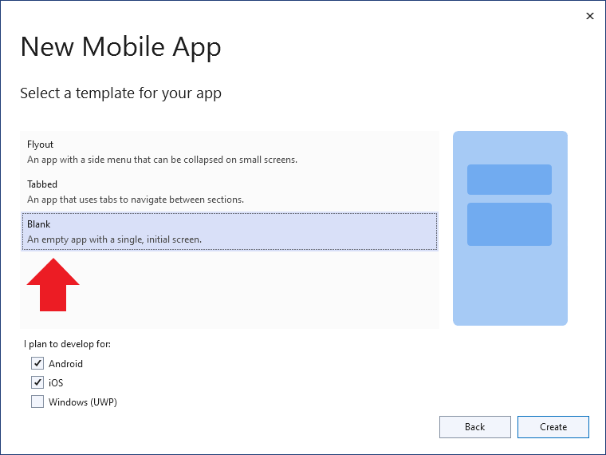

5. Wait until the NuGet packages are restored (a "Restore completed" message will appear in the status bar). 

6. New Visual Studio 2022 installations won't have Android SDKs installed, you may be prompted to install the most recent Android SDK:

    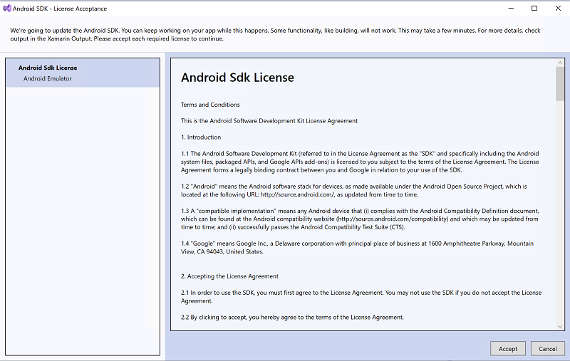

7. New Visual Studio 2022 installations won't have an Android emulator configured. Click the dropdown arrow on the **Debug** button and choose **Create Android Emulator** to launch the emulator creation screen:

    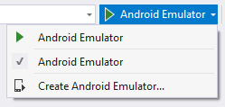

7. In the emulator creation screen, use the default settings and click the **Create** button:

    [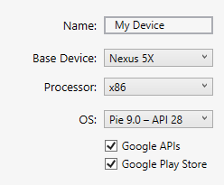](images/win-2019/create-emulator.png#lightbox)

8. Creating an emulator will return you to the Device Manager window. Click the **Start** button to launch the new emulator:

    

9. Visual Studio 2022 should now show the name of the new emulator on the **Debug** button:

    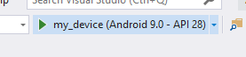

10. Click the **Debug** button to build and deploy the application to the Android emulator:

    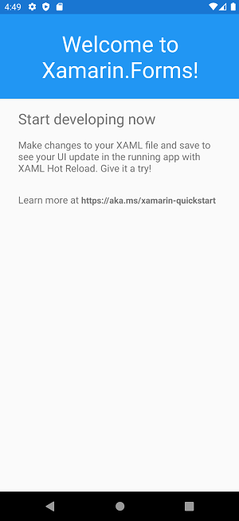

## Customize the application

The application can be customized to add interactive functionality. Perform the following steps to add user interaction to the application:

1. Edit **MainPage.xaml**, adding this XAML before the end of the `</StackLayout>`:

    ```xaml
    <Button Text="Click Me" Clicked="Button_Clicked" />
    ```

2. Edit **MainPage.xaml.cs**, adding this code to the end of the class:

    ```csharp
    int count = 0;
    void Button_Clicked(object sender, System.EventArgs e)
    {
        count++;
        ((Button)sender).Text = $"You clicked {count} times.";
    }
    ```

3. Debug the app on Android:

    

## Build an iOS app in Visual Studio 2022

It's possible to build and debug the iOS app from Visual Studio with a networked Mac computer. Refer to the [setup instructions](~/ios/get-started/installation/windows/index.md) for more information.

::: zone-end
::: zone pivot="windows-vs2019"

## Step-by-step instructions for Windows

[ Download the sample](/samples/xamarin/xamarin-forms-samples/getstarted-firstapp/)

Follow these steps along with the video above:

1. Choose **File > New > Project...** or press the **Create new project...** button:

    [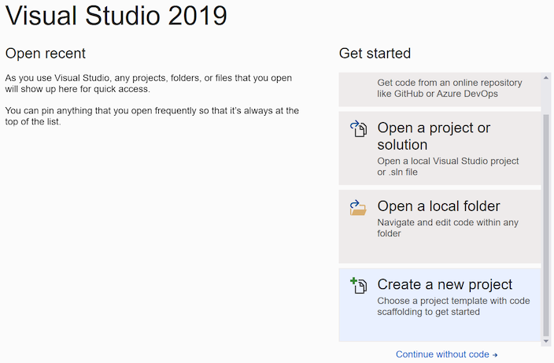](images/win-2019/01.png#lightbox)

2. Search for "Xamarin" or choose **Mobile** from the **Project type** menu. Select the **Mobile App (Xamarin.Forms)** project type:

    [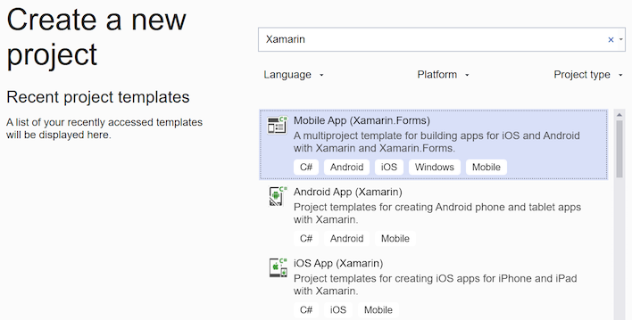](images/win-2019/02.png#lightbox)

3. Choose a project name &ndash; the example uses "AwesomeApp":

    [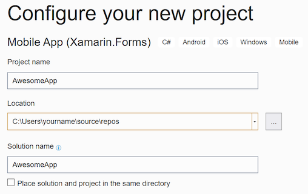](images/win-2019/03.png#lightbox)

4. Click on the **Blank** project type and ensure **Android** and **iOS** are selected:

    [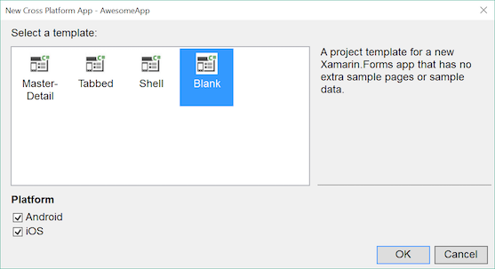](images/win-2019/04.png#lightbox)

5. Wait until the NuGet packages are restored (a "Restore completed" message will appear in the status bar).

6. New Visual Studio 2019 installations won't have an Android emulator configured. Click the dropdown arrow on the **Debug** button and choose **Create Android Emulator** to launch the emulator creation screen:

    

7. In the emulator creation screen, use the default settings and click the **Create** button:

    [](images/win-2019/create-emulator.png#lightbox)

8. Creating an emulator will return you to the Device Manager window. Click the **Start** button to launch the new emulator:

    

9. Visual Studio 2019 should now show the name of the new emulator on the **Debug** button:

    

10. Click the **Debug** button to build and deploy the application to the Android emulator:

    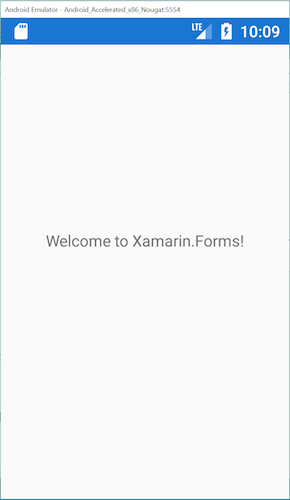

## Customize the application

The application can be customized to add interactive functionality. Perform the following steps to add user interaction to the application:

1. Edit **MainPage.xaml**, adding this XAML before the end of the `</StackLayout>`:

    ```xaml
    <Button Text="Click Me" Clicked="Button_Clicked" />
    ```

2. Edit **MainPage.xaml.cs**, adding this code to the end of the class:

    ```csharp
    int count = 0;
    void Button_Clicked(object sender, System.EventArgs e)
    {
        count++;
        ((Button)sender).Text = $"You clicked {count} times.";
    }
    ```

3. Debug the app on Android:

    

> [!NOTE]
> The sample application includes the additional interactive functionality that is not covered in the video.

## Build an iOS app in Visual Studio 2019

It's possible to build and debug the iOS app from Visual Studio with a networked Mac computer. Refer to the [setup instructions](~/ios/get-started/installation/windows/index.md) for more information.

This video covers the process of building and testing an iOS app using Visual Studio 2019 on Windows:

> [!Video https://learn.microsoft.com/shows/XamarinShow/Build-Your-First-iOS-App-with-Visual-Studio-2019-and-Xamarin/player]

::: zone-end
::: zone pivot="macos-vs2022"

## Step-by-step instructions for Mac

[ Download the sample](/samples/xamarin/xamarin-forms-samples/getstarted-firstapp/)

Follow these steps along with the video above:

1. Choose **File > New Solution...** or press the **New Project...** button, then select **Multiplatform > App > Blank Forms App**:

    [](images/01.png#lightbox)

2. Ensure **Android** and **iOS** are selected:

    [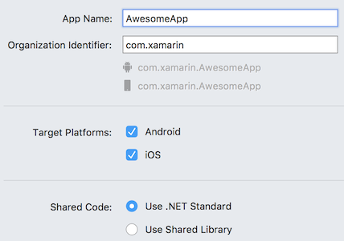](images/02.png#lightbox)

> [!NOTE]
> Only A-Z, a-z, ‘_’, '.', and numbers are supported characters for your App Name and Organization Identifier.

3. Restore NuGet packages, by right-clicking on the solution:

    

4. Launch Android emulator by pressing the debug button (or **Run > Start Debugging**).

5. Edit **MainPage.xaml**, adding this XAML before the end of the `</StackLayout>`:

    ```xaml
    <Button Text="Click Me" Clicked="Handle_Clicked" />
    ```

6. Edit **MainPage.xaml.cs**, adding this code to the end of the class:

    ```csharp
    int count = 0;
    void Handle_Clicked(object sender, System.EventArgs e)
    {
        count++;
        ((Button)sender).Text = $"You clicked {count} times.";
    }
    ```

7. Debug the app on Android:

    

8. Right-click to set iOS to the **Startup Project**:

    [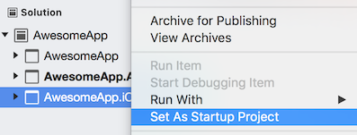](images/08.png#lightbox)

9. Debug the app on iOS by selecting an iOS simulator from the dropdown.

::: zone-end
::: zone pivot="macos-vs2019"

## Step-by-step instructions for Mac

[ Download the sample](/samples/xamarin/xamarin-forms-samples/getstarted-firstapp/)

Follow these steps along with the video above:

1. Choose **File > New Solution...** or press the **New Project...** button, then select **Multiplatform > App > Blank Forms App**:

    [](images/01.png#lightbox)

2. Ensure **Android** and **iOS** are selected, with **.NET Standard** code sharing:

    [](images/02.png#lightbox)

> [!NOTE]
> Only A-Z, a-z, ‘_’, '.', and numbers are supported characters for your App Name and Organization Identifier.

3. Restore NuGet packages, by right-clicking on the solution:

    

4. Launch Android emulator by pressing the debug button (or **Run > Start Debugging**).

5. Edit **MainPage.xaml**, adding this XAML before the end of the `</StackLayout>`:

    ```xaml
    <Button Text="Click Me" Clicked="Handle_Clicked" />
    ```

6. Edit **MainPage.xaml.cs**, adding this code to the end of the class:

    ```csharp
    int count = 0;
    void Handle_Clicked(object sender, System.EventArgs e)
    {
        count++;
        ((Button)sender).Text = $"You clicked {count} times.";
    }
    ```

7. Debug the app on Android:

    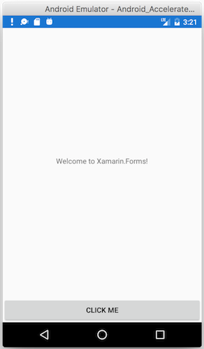

8. Right-click to set iOS to the **Startup Project**:

    [](images/08.png#lightbox)

9. Debug the app on iOS:

    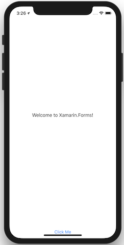

::: zone-end

You can download the completed code from the [samples gallery](/samples/xamarin/xamarin-forms-samples/getstarted-firstapp/) or view it on [GitHub](https://github.com/xamarin/xamarin-forms-samples/tree/master/GetStarted/FirstApp).

## Next Steps

- [Single Page Quickstart](~/get-started/quickstarts/app.md) &ndash; Build a more functional app.
- [Xamarin.Forms Samples](~/xamarin-forms/samples/index.md) &ndash; Download and run code examples and sample apps.
- [Creating Mobile Apps ebook](~/xamarin-forms/creating-mobile-apps-xamarin-forms/index.md) &ndash; In-depth chapters that teach Xamarin.Forms development, available as a PDF and including hundreds of additional samples.
