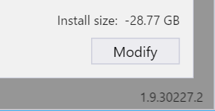
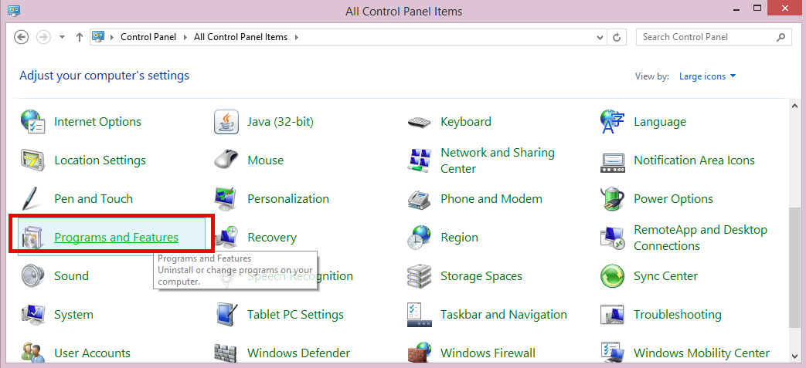

# Uninstall Xamarin from Visual Studio

This guide explains how to remove Xamarin from Visual Studio on Windows.

<a name="uninstallvs2017"></a>

## Visual Studio 2019 and Visual Studio 2017

Xamarin is uninstalled from Visual Studio 2019 and Visual Studio 2017 using the installer app:

1. Use the **Start menu** to open the **Visual Studio Installer**.

2. Press the **Modify** button for the instance you wish to change.

    [](uninstalling-xamarin-images/vs2017-02.png#lightbox)

3. In the **Workloads** tab, de-select the **Mobile Development with .NET** option
  (in the **Mobile & Gaming** section).

    [](uninstalling-xamarin-images/vs2017-03.png#lightbox)

4. Click the **Modify** button in the bottom right of the window.

5. The installer will remove the de-selected components
  (Visual Studio 2017 must be closed before the installer can make any changes).

    [](uninstalling-xamarin-images/vs2017-04.png#lightbox)

Individual Xamarin components (such as the Profiler or Workbooks) can be uninstalled
by switching to the **Individual Components** tab in step 3, and unchecking
specific components:

[](uninstalling-xamarin-images/vs2017-components.png#lightbox)

To uninstall Visual Studio 2017 completely, choose **Uninstall** from the
three-bar menu next to the **Launch** button.

[](uninstalling-xamarin-images/vs2017-uninstall.png#lightbox)

> [!IMPORTANT]
> If you have two (or more) instances of Visual Studio installed side-by-side (SxS) – such as a Release and a Preview version – uninstalling
> one instance might remove some Xamarin functionality from the other Visual Studio instance(s), including:
>
> - Xamarin Profiler
> - Xamarin Workbooks/Inspector
> - Xamarin Remote iOS Simulator
> - Apple Bonjour SDK
>
> Under certain conditions, uninstalling one of the SxS instances can result in the incorrect removal of these features. This may degrade the performance of the Xamarin Platform on the Visual Studio instance(s) that remain on the system after the uninstallation of the SxS instance.
>
>This is resolved by running the **Repair** option in the Visual Studio installer, which will re-install the missing components.

<a name="uninstallvs2015"></a>

## Visual Studio 2015 and earlier

To uninstall Visual Studio 2015 completely, use [the support answer on visualstudio.com](https://visualstudio.microsoft.com/vs/support/vs2015/uninstall-visual-studio-2015/).

Xamarin can be uninstalled from a Windows machine through **Control Panel**. Navigate to **Programs and Features** or **Programs > Uninstall a Program** as illustrated below:

 [](uninstalling-xamarin-images/image3.png#lightbox)

From the Control Panel, uninstall any of the following that are present:

- Xamarin
- Xamarin for Windows
- Xamarin.Android
- Xamarin.iOS
- Xamarin for Visual Studio

In Explorer, delete any remaining files from the Xamarin Visual Studio extension folders (all versions, including both Program Files and Program Files (x86)):

```
C:\Program Files*\Microsoft Visual Studio 1*.0\Common7\IDE\Extensions\Xamarin
```

Delete Visual Studio's MEF component cache directory, which should be located in the following location:

```
%LOCALAPPDATA%\Microsoft\VisualStudio\1*.0\ComponentModelCache
```

Check in the **VirtualStore** directory to see if Windows might have stored any overlay files for the **Extensions\Xamarin** or **ComponentModelCache** directories there:

```
%LOCALAPPDATA%\VirtualStore
```

Open the registry editor (regedit) and look for the following key:

```
HKEY_LOCAL_MACHINE\SOFTWARE\Wow6432Node\Microsoft\Windows\CurrentVersion\SharedDlls
```

Find and delete any entries that match this pattern:

```
C:\Program Files*\Microsoft Visual Studio 1*.0\Common7\IDE\Extensions\Xamarin
```

Look for this key:

```
HKEY_CURRENT_USER\Software\Microsoft\VisualStudio\1*.0\ExtensionManager\PendingDeletions
```

Delete any entries that look like they might be related to Xamarin. For example, anything containing the terms `mono` or `xamarin`.

Open an administrator cmd.exe command prompt, and then run the `devenv /setup` and `devenv /updateconfiguration` commands for each installed version of Visual Studio. For example, for Visual Studio 2015:

```cmd
"%ProgramFiles(x86)%\Microsoft Visual Studio 14.0\Common7\IDE\devenv.exe" /setup
"%ProgramFiles(x86)%\Microsoft Visual Studio 14.0\Common7\IDE\devenv.exe" /updateconfiguration
```
