# Create a Xamarin.Forms application quickstart

[ Download the sample](/samples/xamarin/xamarin-forms-samples/getstarted-notes-app/)

In this quickstart, you will learn how to:

- Create a Xamarin.Forms Shell application.
- Define the user interface for a page using eXtensible Application Markup Language (XAML), and interact with XAML elements from code.
- Describe the visual hierarchy of a Shell application by subclassing the `Shell` class.

The quickstart walks through how to create a cross-platform Xamarin.Forms Shell application, which enables you to enter a note and persist it to device storage. The final application is shown below:

[](app-images/screenshots1.png#lightbox)
[](app-images/screenshots2.png#lightbox)

::: zone pivot="windows"

### Prerequisites

- Visual Studio 2019 (latest release), with the **Mobile development with .NET** workload installed.
- Knowledge of C#.
- (optional) A paired Mac to build the application on iOS.

For more information about these prerequisites, see [Installing Xamarin](~/get-started/installation/index.md). For information about connecting Visual Studio 2019 to a Mac build host, see [Pair to Mac for Xamarin.iOS development](~/ios/get-started/installation/windows/connecting-to-mac/index.md).

## Get started with Visual Studio 2019

1. Launch Visual Studio 2019, and in the start window click **Create a new project** to create a new project:

    

2. In the **Create a new project** window, select **Mobile** in the **Project type** drop-down, select the **Mobile App (Xamarin.Forms)** template, and click the **Next** button:

    

3. In the **Configure your new project** window, set the **Project name** to **Notes**, choose a suitable location for the project, and click the **Create** button:   

    

    > [!IMPORTANT]
    > The C# and XAML snippets in this quickstart requires that the solution and project are both named **Notes**. Using a different name will result in build errors when you copy code from this quickstart into the project.

4. In the **New Mobile App** dialog, select the **Tabbed** template, and click the **Create** button:

    

    When the project has been created, close the **GettingStarted.txt** file.

    For more information about the .NET Standard library that gets created, see [Anatomy of a Xamarin.Forms Shell application](deepdive.md#anatomy-of-a-xamarinforms-application) in the [Xamarin.Forms Shell Quickstart Deep Dive](deepdive.md).

5. In **Solution Explorer**, in the **Notes** project, delete the following folders (and their contents):

    - **Models**
    - **Services**
    - **ViewModels**
    - **Views**

6. In **Solution Explorer**, in the **Notes** project, delete **GettingStarted.txt**.

7. In **Solution Explorer**, in the **Notes** project, add a new folder named **Views**.

8. In **Solution Explorer**, in the **Notes** project, select the **Views** folder, right-click, and select **Add > New Item...**. In the **Add New Item** dialog, select **Visual C# Items > Xamarin.Forms > Content Page**, name the new file **NotesPage**, and click the **Add** button:

    

    This will add a new page named **NotesPage** to the **Views** folder. This page will be the main page in the application.

9. In **Solution Explorer**, in the **Notes** project, double-click **NotesPage.xaml** to open it:

    

10. In **NotesPage.xaml**, remove all of the template code and replace it with the following code:

    ```xaml
    <?xml version="1.0" encoding="UTF-8"?>
    <ContentPage xmlns="http://xamarin.com/schemas/2014/forms"
                 xmlns:x="http://schemas.microsoft.com/winfx/2009/xaml"
                 x:Class="Notes.Views.NotesPage"
                 Title="Notes">
        <!-- Layout children vertically -->
        <StackLayout Margin="20">
            <Editor x:Name="editor"
                    Placeholder="Enter your note"
                    HeightRequest="100" />
            <!-- Layout children in two columns -->
            <Grid ColumnDefinitions="*,*">
                <Button Text="Save"
                        Clicked="OnSaveButtonClicked" />
                <Button Grid.Column="1"
                        Text="Delete"
                        Clicked="OnDeleteButtonClicked"/>
            </Grid>
        </StackLayout>
    </ContentPage>
    ```

    This code declaratively defines the user interface for the page, which consists of an [`Editor`](xref:Xamarin.Forms.Editor) for text input, and two [`Button`](xref:Xamarin.Forms.Button) objects that direct the application to save or delete a file. The two `Button` objects are horizontally laid out in a [`Grid`](xref:Xamarin.Forms.Grid), with the `Editor` and `Grid` being vertically laid out in a [`StackLayout`](xref:Xamarin.Forms.StackLayout). For more information about creating the user interface, see [User interface](deepdive.md#user-interface) in the [Xamarin.Forms Shell Quickstart Deep Dive](deepdive.md).

    Save the changes to **NotesPage.xaml** by pressing **CTRL+S**.  

12. In **Solution Explorer**, in the **Notes** project, double-click **NotesPage.xaml.cs** to open it:

    

12. In **NotesPage.xaml.cs**, remove all of the template code and replace it with the following code:

    ```csharp
    using System;
    using System.IO;
    using Xamarin.Forms;

    namespace Notes.Views
    {
        public partial class NotesPage : ContentPage
        {
            string _fileName = Path.Combine(Environment.GetFolderPath(Environment.SpecialFolder.LocalApplicationData), "notes.txt");

            public NotesPage()
            {
                InitializeComponent();

                // Read the file.
                if (File.Exists(_fileName))
                {
                    editor.Text = File.ReadAllText(_fileName);
                }
            }

            void OnSaveButtonClicked(object sender, EventArgs e)
            {
                // Save the file.
                File.WriteAllText(_fileName, editor.Text);
            }

            void OnDeleteButtonClicked(object sender, EventArgs e)
            {
                // Delete the file.
                if (File.Exists(_fileName))
                {
                    File.Delete(_fileName);
                }
                editor.Text = string.Empty;
            }
        }
    }
    ```

    This code defines a `_fileName` field, which references a file named `notes.txt` that will store note data in the local application data folder for the application. When the page constructor is executed the file is read, if it exists, and displayed in the [`Editor`](xref:Xamarin.Forms.Editor). When the **Save** [`Button`](xref:Xamarin.Forms.Button) is pressed the `OnSaveButtonClicked` event handler is executed, which saves the content of the `Editor` to the file. When the **Delete** `Button` is pressed the `OnDeleteButtonClicked` event handler is executed, which deletes the file, provided that it exists, and removes any text from the `Editor`. For more information about user interaction, see [Responding to user interaction](deepdive.md#responding-to-user-interaction) in the [Xamarin.Forms Shell Quickstart Deep Dive](deepdive.md).

    Save the changes to **NotesPage.xaml.cs** by pressing **CTRL+S**.    

13. In **Solution Explorer**, in the **Notes** project, select the **Views** folder, right-click, and select **Add > New Item...**. In the **Add New Item** dialog, select **Visual C# Items > Xamarin.Forms > Content Page**, name the new file **AboutPage**, and click the **Add** button:

    

    This will add a new page named **AboutPage** to the **Views** folder.

14. In **Solution Explorer**, in the **Notes** project, double-click **AboutPage.xaml** to open it:

    

15. In **AboutPage.xaml**, remove all of the template code and replace it with the following code:

    ```xaml
    <?xml version="1.0" encoding="UTF-8"?>
    <ContentPage xmlns="http://xamarin.com/schemas/2014/forms"
                 xmlns:x="http://schemas.microsoft.com/winfx/2009/xaml"
                 x:Class="Notes.Views.AboutPage"
                 Title="About">
        <!-- Layout children in two rows -->
        <Grid RowDefinitions="Auto,*">
            <Image Source="xamarin_logo.png"
                   BackgroundColor="{OnPlatform iOS=LightSlateGray, Android=#2196F3}"
                   VerticalOptions="Center"
                   HeightRequest="64" />
            <!-- Layout children vertically -->
            <StackLayout Grid.Row="1"
                         Margin="20"
                         Spacing="20">
                <Label FontSize="22">
                    <Label.FormattedText>
                        <FormattedString>
                            <FormattedString.Spans>
                                <Span Text="Notes"
                                      FontAttributes="Bold"
                                      FontSize="22" />
                                <Span Text=" v1.0" />
                            </FormattedString.Spans>
                        </FormattedString>
                    </Label.FormattedText>
                </Label>
                <Label Text="This app is written in XAML and C# with the Xamarin Platform." />
                <Button Text="Learn more"
                        Clicked="OnButtonClicked" />
            </StackLayout>
        </Grid>
    </ContentPage>
    ```

    This code declaratively defines the user interface for the page, which consists of an [`Image`](xref:Xamarin.Forms.Image), two [`Label`](xref:Xamarin.Forms.Label) objects that display text, and a [`Button`](xref:Xamarin.Forms.Button). The two `Label` objects and `Button` are vertically laid out in a [`StackLayout`](xref:Xamarin.Forms.StackLayout), with the `Image` and `StackLayout` being vertically laid out in a [`Grid`](xref:Xamarin.Forms.Grid). For more information about creating the user interface, see [User interface](deepdive.md#user-interface) in the [Xamarin.Forms Shell Quickstart Deep Dive](deepdive.md).

    Save the changes to **AboutPage.xaml** by pressing **CTRL+S**.    

16. In **Solution Explorer**, in the **Notes** project, double-click **AboutPage.xaml.cs** to open it:

    

17. In **AboutPage.xaml.cs**, remove all of the template code and replace it with the following code:

    ```csharp
    using System;
    using Xamarin.Essentials;
    using Xamarin.Forms;

    namespace Notes.Views
    {
        public partial class AboutPage : ContentPage
        {
            public AboutPage()
            {
                InitializeComponent();
            }

            async void OnButtonClicked(object sender, EventArgs e)
            {
                // Launch the specified URL in the system browser.
                await Launcher.OpenAsync("https://aka.ms/xamarin-quickstart");
            }
        }
    }
    ```

    This code defines the `OnButtonClicked` event handler, which is executed when the **Learn more** [`Button`](xref:Xamarin.Forms.Button) is pressed. When the button is pressed, a web browser is launched and the page represented by the URI argument to the `OpenAsync` method is displayed. For more information about user interaction, see [Responding to user interaction](deepdive.md#responding-to-user-interaction) in the [Xamarin.Forms Shell Quickstart Deep Dive](deepdive.md).

    Save the changes to **AboutPage.xaml.cs** by pressing **CTRL+S**.

18. In **Solution Explorer**, in the **Notes** project, double-click **AppShell.xaml** to open it:

    

19. In **AppShell.xaml**, remove all of the template code and replace it with the following code:

    ```xaml
    <?xml version="1.0" encoding="UTF-8"?>
    <Shell xmlns="http://xamarin.com/schemas/2014/forms"
           xmlns:x="http://schemas.microsoft.com/winfx/2009/xaml"
           xmlns:views="clr-namespace:Notes.Views"
           x:Class="Notes.AppShell">
        <!-- Display a bottom tab bar containing two tabs -->   
        <TabBar>
            <ShellContent Title="Notes"
                          Icon="icon_feed.png"
                          ContentTemplate="{DataTemplate views:NotesPage}" />
            <ShellContent Title="About"
                          Icon="icon_about.png"
                          ContentTemplate="{DataTemplate views:AboutPage}" />
        </TabBar>
    </Shell>
    ```    

    This code declaratively defines the visual hierarchy of the application, which consists of a `TabBar` containing two `ShellContent` objects. These objects don't represent any user interface elements, but rather the organization of the application's visual hierarchy. Shell will take these objects and produce the user interface for the content. For more information about creating the user interface, see [User interface](deepdive.md#user-interface) in the [Xamarin.Forms Shell Quickstart Deep Dive](deepdive.md).

    Save the changes to **AppShell.xaml** by pressing **CTRL+S**.    

20. In **Solution Explorer**, in the **Notes** project, expand **AppShell.xaml**, and double-click **AppShell.xaml.cs** to open it:

    

21. In **AppShell.xaml.cs**, remove all of the template code and replace it with the following code:

    ```csharp
    using Xamarin.Forms;

    namespace Notes
    {
        public partial class AppShell : Shell
        {
            public AppShell()
            {
                InitializeComponent();
            }
        }
    }
    ```

    Save the changes to **AppShell.xaml.cs** by pressing **CTRL+S**.

22. In **Solution Explorer**, in the **Notes** project, double-click **App.xaml** to open it:

    

23. In **App.xaml**, remove all of the template code and replace it with the following code:

    ```xaml
    <?xml version="1.0" encoding="utf-8" ?>
    <Application xmlns="http://xamarin.com/schemas/2014/forms"
                 xmlns:x="http://schemas.microsoft.com/winfx/2009/xaml"
                 x:Class="Notes.App">

    </Application>
    ```

    This code declaratively defines an `App` class, which is responsible for instantiating the application.

    Save the changes to **App.xaml** by pressing **CTRL+S**.    

24. In **Solution Explorer**, in the **Notes** project, expand **App.xaml**, and double-click **App.xaml.cs** to open it:

    

25. In **App.xaml.cs**, remove all of the template code and replace it with the following code:

    ```csharp
    using Xamarin.Forms;

    namespace Notes
    {
        public partial class App : Application
        {

            public App()
            {
                InitializeComponent();
                MainPage = new AppShell();
            }

            protected override void OnStart()
            {
            }

            protected override void OnSleep()
            {
            }

            protected override void OnResume()
            {
            }
        }
    }
    ```

    This code defines the code-behind for the `App` class, that is responsible for instantiating the application. It initializes the [`MainPage`](xref:Xamarin.Forms.Application.MainPage) property to the subclassed `Shell` object.

    Save the changes to **App.xaml.cs** by pressing **CTRL+S**.    

### Building the quickstart

1. In Visual Studio, select the **Build > Build Solution** menu item (or press F6). The solution will build and a success message will appear in the Visual Studio status bar:

      

    If there are errors, repeat the previous steps and correct any mistakes until the projects build successfully.

2. In the Visual Studio toolbar, press the **Start** button (the triangular button that resembles a Play button) to launch the application in your chosen Android emulator:

      

      

    Enter a note and press the **Save** button. Then, close the application and re-launch it to ensure the note you entered is reloaded.

    Press the **About** tab icon to navigate to the `AboutPage`:

      

    Press the **Learn more** button to launch the quickstarts web page.

    For more information about how the application is launched on each platform, see [Launching the application on each platform](deepdive.md#launch-the-application-on-each-platform) in the [Xamarin.Forms Quickstart Deep Dive](deepdive.md).

    > [!NOTE]
    > The following steps should only be carried out if you have a [paired Mac](~/ios/get-started/installation/windows/connecting-to-mac/index.md) that meets the system requirements for Xamarin.Forms development.    

3. In the Visual Studio toolbar, right-click on the **Notes.iOS** project, and select **Set as StartUp Project**.

      

4. In the Visual Studio toolbar, press the **Start** button (the triangular button that resembles a Play button) to launch the application in your chosen [iOS remote simulator](~/tools/ios-simulator/index.md):

      

      [](app-images/vs/notes1-ios-large.png#lightbox)

    Enter a note and press the **Save** button. Then, close the application and re-launch it to ensure the note you entered is reloaded.

    Press the **About** tab icon to navigate to the `AboutPage`:

      [](app-images/vs/notes2-ios-large.png#lightbox)

    Press the **Learn more** button to launch the quickstarts web page.

    For more information about how the application is launched on each platform, see [Launching the application on each platform](deepdive.md#launch-the-application-on-each-platform) in the [Xamarin.Forms Quickstart Deep Dive](deepdive.md).

::: zone-end
::: zone pivot="macos"

### Prerequisites

- Visual Studio for Mac (latest release), with iOS and Android platform support installed.
- Xcode (latest release).
- Knowledge of C#.

For more information about these prerequisites, see [Installing Xamarin](~/get-started/installation/index.md).

## Get started with Visual Studio for Mac

1. Launch Visual Studio for Mac, and in the start window click **New** to create a new project:

    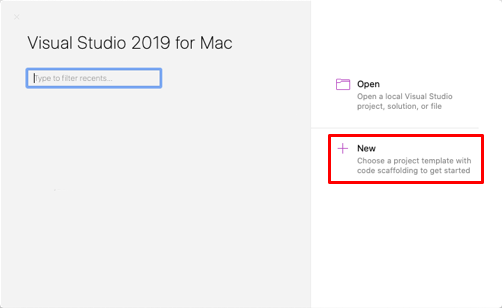

2. In the **Choose a template for your new project** dialog, click **Multiplatform > App**, select the **Shell Forms App** template, and click the **Next** button:

    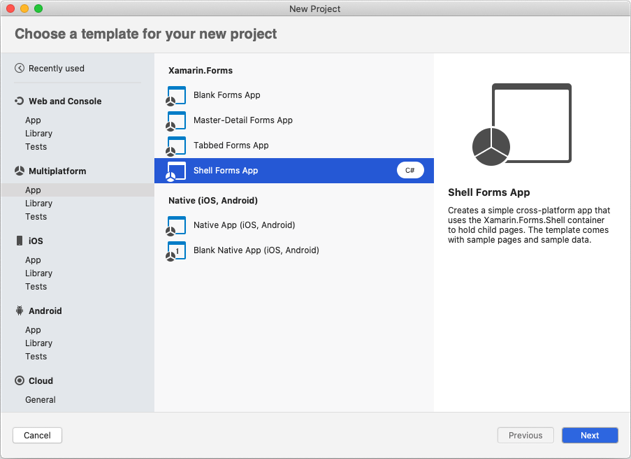

3. In the **Configure your Shell Forms app** dialog, name the new app **Notes**, and click the **Next** button:    

    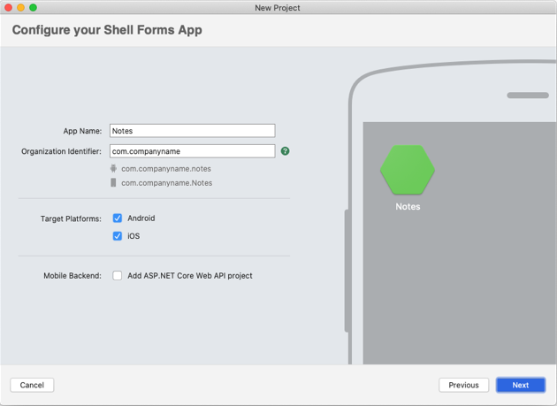

4. In the **Configure your new Shell Forms app** dialog, leave the Solution and Project names set to **Notes**, choose a suitable location for the project, and click the **Create** button to create the project:

    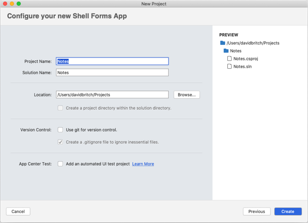

    > [!IMPORTANT]
    > The C# and XAML snippets in this quickstart requires that the solution and project are both named **Notes**. Using a different name will result in build errors when you copy code from this quickstart into the project.

    For more information about the .NET Standard library that gets created, see [Anatomy of a Xamarin.Forms Shell application](deepdive.md#anatomy-of-a-xamarinforms-application) in the [Xamarin.Forms Shell Quickstart Deep Dive](deepdive.md).

5. In the **Solution Pad**, in the **Notes** project, delete the following folders (and their contents):

    - **Models**
    - **Services**
    - **ViewModels**
    - **Views**

6. In the **Solution Pad**, in the **Notes** project, delete **GettingStarted.txt**.

7. In the **Solution Pad**, in the **Notes** project, add a new folder named **Views**.

8. In the **Solution Pad**, in the **Notes** project, select the **Views** folder, right-click, and select **Add > New File...**. In the **New File** dialog, select **Forms > Forms ContentPage XAML**, name the new file **NotesPage**, and click the **New** button:

    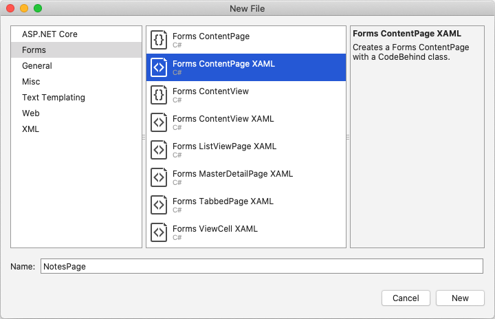

    This will add a new page named **NotesPage** to the **Views** folder. This page will be the main page in the application.

9. In the **Solution Pad**, in the **Notes** project, double-click **NotesPage.xaml** to open it:

    

10. In **NotesPage.xaml**, remove all of the template code and replace it with the following code:

    ```xaml
    <?xml version="1.0" encoding="UTF-8"?>
    <ContentPage xmlns="http://xamarin.com/schemas/2014/forms"
                 xmlns:x="http://schemas.microsoft.com/winfx/2009/xaml"
                 x:Class="Notes.Views.NotesPage"
                 Title="Notes">
        <!-- Layout children vertically -->
        <StackLayout Margin="20">
            <Editor x:Name="editor"
                    Placeholder="Enter your note"
                    HeightRequest="100" />
            <!-- Layout children in two columns -->
            <Grid ColumnDefinitions="*,*">
                <Button Text="Save"
                        Clicked="OnSaveButtonClicked" />
                <Button Grid.Column="1"
                        Text="Delete"
                        Clicked="OnDeleteButtonClicked"/>
            </Grid>
        </StackLayout>
    </ContentPage>
    ```

    This code declaratively defines the user interface for the page, which consists of an [`Editor`](xref:Xamarin.Forms.Editor) for text input, and two [`Button`](xref:Xamarin.Forms.Button) objects that direct the application to save or delete a file. The two `Button` objects are horizontally laid out in a [`Grid`](xref:Xamarin.Forms.Grid), with the `Editor` and `Grid` being vertically laid out in a [`StackLayout`](xref:Xamarin.Forms.StackLayout). For more information about creating the user interface, see [User interface](deepdive.md#user-interface) in the [Xamarin.Forms Shell Quickstart Deep Dive](deepdive.md).

    Save the changes to **NotesPage.xaml** by choosing **File > Save** (or by pressing **&#8984; + S**).

12. In the **Solution Pad**, in the **Notes** project, double-click **NotesPage.xaml.cs** to open it:

    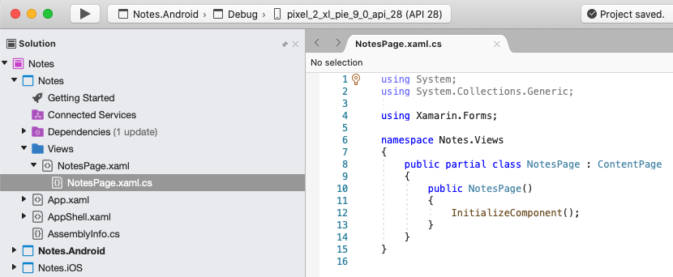

12. In **NotesPage.xaml.cs**, remove all of the template code and replace it with the following code:

    ```csharp
    using System;
    using System.IO;
    using Xamarin.Forms;

    namespace Notes.Views
    {
        public partial class NotesPage : ContentPage
        {
            string _fileName = Path.Combine(Environment.GetFolderPath(Environment.SpecialFolder.LocalApplicationData), "notes.txt");

            public NotesPage()
            {
                InitializeComponent();

                // Read the file.
                if (File.Exists(_fileName))
                {
                    editor.Text = File.ReadAllText(_fileName);
                }
            }

            void OnSaveButtonClicked(object sender, EventArgs e)
            {
                // Save the file.
                File.WriteAllText(_fileName, editor.Text);
            }

            void OnDeleteButtonClicked(object sender, EventArgs e)
            {
                // Delete the file.
                if (File.Exists(_fileName))
                {
                    File.Delete(_fileName);
                }
                editor.Text = string.Empty;
            }
        }
    }
    ```

    This code defines a `_fileName` field, which references a file named `notes.txt` that will store note data in the local application data folder for the application. When the page constructor is executed the file is read, if it exists, and displayed in the [`Editor`](xref:Xamarin.Forms.Editor). When the **Save** [`Button`](xref:Xamarin.Forms.Button) is pressed the `OnSaveButtonClicked` event handler is executed, which saves the content of the `Editor` to the file. When the **Delete** `Button` is pressed the `OnDeleteButtonClicked` event handler is executed, which deletes the file, provided that it exists, and removes any text from the `Editor`. For more information about user interaction, see [Responding to user interaction](deepdive.md#responding-to-user-interaction) in the [Xamarin.Forms Shell Quickstart Deep Dive](deepdive.md).

    Save the changes to **NotesPage.xaml.cs** by choosing **File > Save** (or by pressing **&#8984; + S**).

13. In the **Solution Pad**, in the **Notes** project, select the **Views** folder, right-click, and select **Add > New File...**. In the **New File** dialog, select **Forms > Forms ContentPage XAML**, name the new file **AboutPage**, and click the **New** button:

    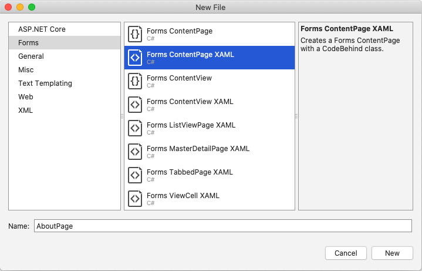

14. In the **Solution Pad**, in the **Notes** project, double-click **AboutPage.xaml** to open it:

    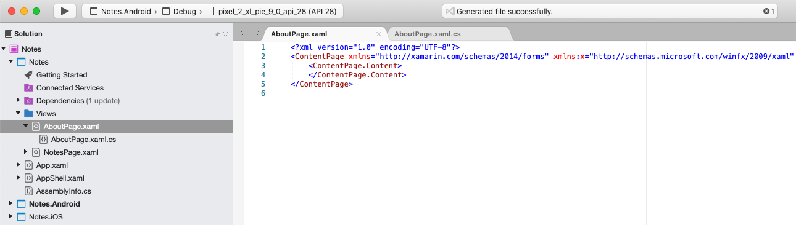

    This will add a new page named **AboutPage** to the **Views** folder.

15. In **AboutPage.xaml**, remove all of the template code and replace it with the following code:

    ```xaml
    <?xml version="1.0" encoding="UTF-8"?>
    <ContentPage xmlns="http://xamarin.com/schemas/2014/forms"
                 xmlns:x="http://schemas.microsoft.com/winfx/2009/xaml"
                 x:Class="Notes.Views.AboutPage"
                 Title="About">
        <!-- Layout children in two rows -->
        <Grid RowDefinitions="Auto,*">
            <Image Source="xamarin_logo.png"
                   BackgroundColor="{OnPlatform iOS=LightSlateGray, Android=#2196F3}"
                   VerticalOptions="Center"
                   HeightRequest="64" />
            <!-- Layout children vertically -->
            <StackLayout Grid.Row="1"
                         Margin="20"
                         Spacing="20">
                <Label FontSize="22">
                    <Label.FormattedText>
                        <FormattedString>
                            <FormattedString.Spans>
                                <Span Text="Notes"
                                      FontAttributes="Bold"
                                      FontSize="22" />
                                <Span Text=" v1.0" />
                            </FormattedString.Spans>
                        </FormattedString>
                    </Label.FormattedText>
                </Label>
                <Label Text="This app is written in XAML and C# with the Xamarin Platform." />
                <Button Text="Learn more"
                        Clicked="OnButtonClicked" />
            </StackLayout>
        </Grid>
    </ContentPage>
    ```

    This code declaratively defines the user interface for the page, which consists of an [`Image`](xref:Xamarin.Forms.Image), two [`Label`](xref:Xamarin.Forms.Label) objects that display text, and a [`Button`](xref:Xamarin.Forms.Button). The two `Label` objects and `Button` are vertically laid out in a [`StackLayout`](xref:Xamarin.Forms.StackLayout), with the `Image` and `StackLayout` being vertically laid out in a [`Grid`](xref:Xamarin.Forms.Grid). For more information about creating the user interface, see [User interface](deepdive.md#user-interface) in the [Xamarin.Forms Shell Quickstart Deep Dive](deepdive.md).

    Save the changes to **AboutPage.xaml** by choosing **File > Save** (or by pressing **&#8984; + S**).

16. In the **Solution Pad**, in the **Notes** project, double-click **AboutPage.xaml.cs** to open it:

    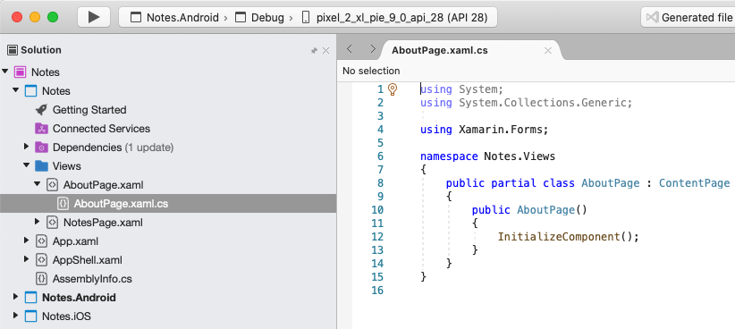

17. In **AboutPage.xaml.cs**, remove all of the template code and replace it with the following code:

    ```csharp
    using System;
    using Xamarin.Essentials;
    using Xamarin.Forms;

    namespace Notes.Views
    {
        public partial class AboutPage : ContentPage
        {
            public AboutPage()
            {
                InitializeComponent();
            }

            async void OnButtonClicked(object sender, EventArgs e)
            {
                // Launch the specified URL in the system browser.
                await Launcher.OpenAsync("https://aka.ms/xamarin-quickstart");
            }
        }
    }
    ```

    This code defines the `OnButtonClicked` event handler, which is executed when the **Learn more** [`Button`](xref:Xamarin.Forms.Button) is pressed. When the button is pressed, a web browser is launched and the page represented by the URI argument to the `OpenAsync` method is displayed. For more information about user interaction, see [Responding to user interaction](deepdive.md#responding-to-user-interaction) in the [Xamarin.Forms Shell Quickstart Deep Dive](deepdive.md).

    Save the changes to **AboutPage.xaml.cs** by choosing **File > Save** (or by pressing **&#8984; + S**).

18. In the **Solution Pad**, in the **Notes** project, double-click **AppShell.xaml** to open it:

    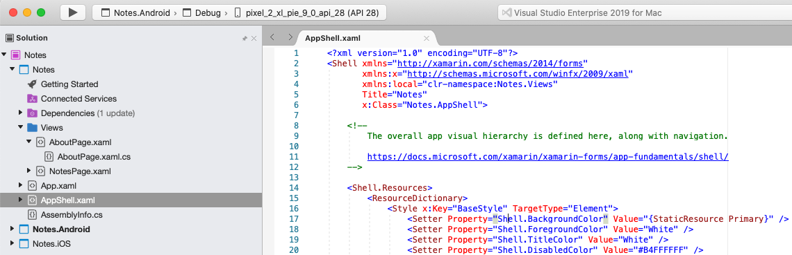

19. In **AppShell.xaml**, remove all of the template code and replace it with the following code:

    ```xaml
    <?xml version="1.0" encoding="UTF-8"?>
    <Shell xmlns="http://xamarin.com/schemas/2014/forms"
           xmlns:x="http://schemas.microsoft.com/winfx/2009/xaml"
           xmlns:views="clr-namespace:Notes.Views"
           x:Class="Notes.AppShell">
        <!-- Display a bottom tab bar containing two tabs -->
        <TabBar>
            <ShellContent Title="Notes"
                          Icon="icon_feed.png"
                          ContentTemplate="{DataTemplate views:NotesPage}" />
            <ShellContent Title="About"
                          Icon="icon_about.png"
                          ContentTemplate="{DataTemplate views:AboutPage}" />
        </TabBar>
    </Shell>
    ```    

    This code declaratively defines the visual hierarchy of the application, which consists of a `TabBar` containing two `ShellContent` objects. These objects don't represent any user interface elements, but rather the organization of the application's visual hierarchy. Shell will take these objects and produce the user interface for the content. For more information about creating the user interface, see [User interface](deepdive.md#user-interface) in the [Xamarin.Forms Shell Quickstart Deep Dive](deepdive.md).

    Save the changes to **AppShell.xaml** by choosing **File > Save** (or by pressing **&#8984; + S**).

20. In the **Solution Pad**, in the **Notes** project, expand **AppShell.xaml**, and double-click **AppShell.xaml.cs** to open it:

    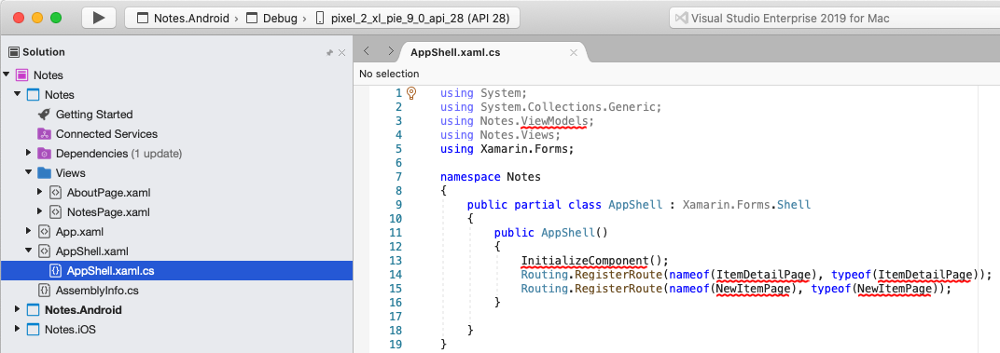

21. In **AppShell.xaml.cs**, remove all of the template code and replace it with the following code:

    ```csharp
    using Xamarin.Forms;

    namespace Notes
    {
        public partial class AppShell : Shell
        {
            public AppShell()
            {
                InitializeComponent();
            }
        }
    }
    ```

    Save the changes to **AppShell.xaml.cs** by choosing **File > Save** (or by pressing **&#8984; + S**).

22. In the **Solution Pad**, in the **Notes** project, double-click **App.xaml** to open it:

    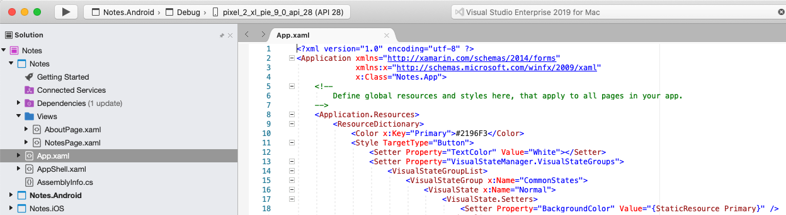

23. In **App.xaml**, remove all of the template code and replace it with the following code:

    ```xaml
    <?xml version="1.0" encoding="utf-8" ?>
    <Application xmlns="http://xamarin.com/schemas/2014/forms"
                 xmlns:x="http://schemas.microsoft.com/winfx/2009/xaml"
                 x:Class="Notes.App">

    </Application>
    ```

    This code declaratively defines an `App` class, which is responsible for instantiating the application.

    Save the changes to **App.xaml** by choosing **File > Save** (or by pressing **&#8984; + S**).

24. In the **Solution Pad**, in the **Notes** project, expand **App.xaml**, and double-click **App.xaml.cs** to open it:

    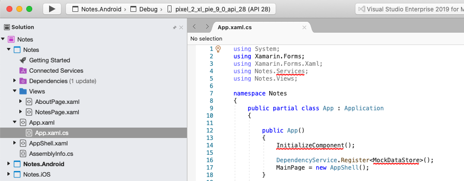

25. In **App.xaml.cs**, remove all of the template code and replace it with the following code:

    ```csharp
    using Xamarin.Forms;

    namespace Notes
    {
        public partial class App : Application
        {

            public App()
            {
                InitializeComponent();
                MainPage = new AppShell();
            }

            protected override void OnStart()
            {
            }

            protected override void OnSleep()
            {
            }

            protected override void OnResume()
            {
            }
        }
    }
    ```

    This code defines the code-behind for the `App` class, that is responsible for instantiating the application. It initializes the [`MainPage`](xref:Xamarin.Forms.Application.MainPage) property to the subclassed `Shell` object.

    Save the changes to **App.xaml.cs** by choosing **File > Save** (or by pressing **&#8984; + S**).

### Building the quickstart

1. In Visual Studio for Mac, select the **Build > Build All** menu item (or press **&#8984; + B**). The projects will build and a success message will appear in the Visual Studio for Mac toolbar:

      

    If there are errors, repeat the previous steps and correct any mistakes until the projects build successfully.

2. In the **Solution Pad**, select the **Notes.iOS** project, right-click, and select **Set As Startup Project**:

      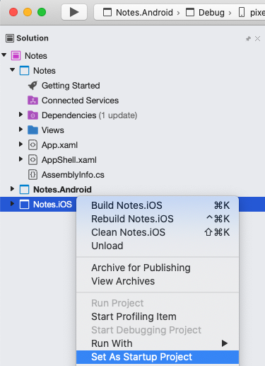

3. In the Visual Studio for Mac toolbar, press the **Start** button (the triangular button that resembles a Play button) to launch the application inside your chosen iOS Simulator:

      

      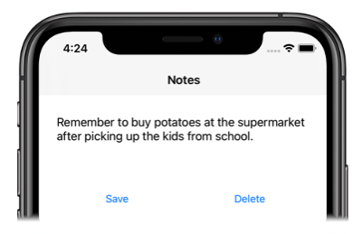

    Enter a note and press the **Save** button. Then, close the application and re-launch it to ensure the note you entered is reloaded.

    Press the **About** tab icon to navigate to the `AboutPage`:

      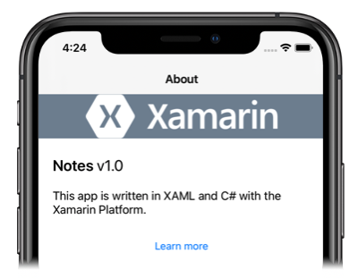

    Press the **Learn more** button to launch the quickstarts web page.

    For more information about how the application is launched on each platform, see [Launching the application on each platform](deepdive.md#launch-the-application-on-each-platform) in the [Xamarin.Forms Quickstart Deep Dive](deepdive.md).

4. In the **Solution Pad**, select the **Notes.Droid** project, right-click, and select **Set As Startup Project**:

      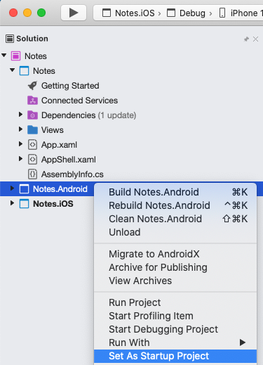

5. In the Visual Studio for Mac toolbar, press the **Start** button (the triangular button that resembles a Play button) to launch the application inside your chosen Android emulator:

      

    Enter a note and press the **Save** button. Then, close the application and re-launch it to ensure the note you entered is reloaded.

    Press the **About** tab icon to navigate to the `AboutPage`:

      

    Press the **Learn more** button to launch the quickstarts web page.

    For more information about how the application is launched on each platform, see [Launching the application on each platform](deepdive.md#launch-the-application-on-each-platform) in the [Xamarin.Forms Quickstart Deep Dive](deepdive.md).

::: zone-end

## Next steps

In this quickstart, you learned how to:

- Create a Xamarin.Forms Shell application.
- Define the user interface for a page using eXtensible Application Markup Language (XAML), and interact with XAML elements from code.
- Describe the visual hierarchy of a Shell application by subclassing the `Shell` class.

Continue to the next quickstart to add additional pages to this Xamarin.Forms Shell application.

> [!div class="nextstepaction"]
> [Next](navigation.md)

## Related links

- [Notes (sample)](/samples/xamarin/xamarin-forms-samples/getstarted-notes-app/)
- [Xamarin.Forms Shell quickstart deep dive](deepdive.md)
