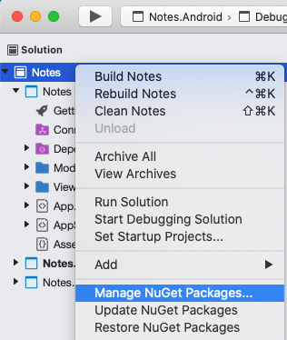
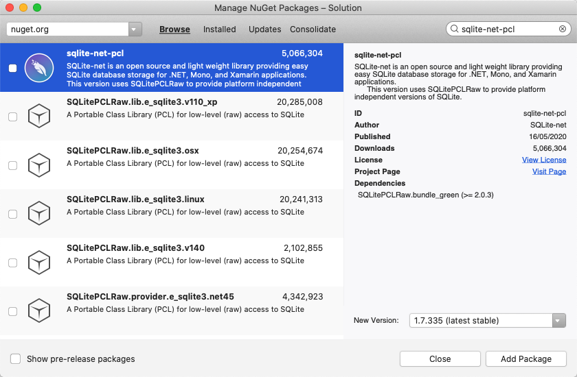
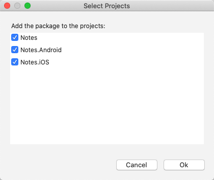

# Store data in a local SQLite.NET database

[ Download the sample](/samples/xamarin/xamarin-forms-samples/getstarted-notes-database/)

In this quickstart, you will learn how to:

- Store data locally in a SQLite.NET database.

The quickstart walks through how to store data in a local SQLite.NET database, from a Xamarin.Forms Shell application. The final application is shown below:

[](database-images/screenshots1.png#lightbox)
[](database-images/screenshots2.png#lightbox)

## Prerequisites

You should successfully complete the [previous quickstart](navigation.md) before attempting this quickstart. Alternatively, download the [previous quickstart sample](/samples/xamarin/xamarin-forms-samples/getstarted-notes-navigation/) and use it as the starting point for this quickstart.

::: zone pivot="windows"

## Update the app with Visual Studio

1. Launch Visual Studio and open the Notes solution.

2. In **Solution Explorer**, right-click the **Notes** solution and select **Manage NuGet Packages for Solution...**:

        

3. In the **NuGet Package Manager**, select the **Browse** tab, and search for the **sqlite-net-pcl** NuGet package.

    > [!WARNING]
    > There are many NuGet packages with similar names. The correct package has these attributes:
    > - **Authors:** SQLite-net
    > - **NuGet link:** [sqlite-net-pcl](https://www.nuget.org/packages/sqlite-net-pcl/)  
    >
    > Despite the package name, this NuGet package can be used in .NET Standard projects.

    In the **NuGet Package Manager**, select the correct **sqlite-net-pcl** package, check the **Project** checkbox, and click the **Install** button to add it to the solution:

    

    This package will be used to incorporate database operations into the application, and will be added to every project in the solution.

    > [!IMPORTANT]
    > SQLite.NET is a third-party library that's supported from the [praeclarum/sqlite-net repo](https://github.com/praeclarum/sqlite-net).

    Close the **NuGet Package Manager**.

4. In **Solution Explorer**, in the **Notes** project, open **Note.cs** in the **Models** folder and replace the existing code with the following code:

    ```csharp
    using System;
    using SQLite;

    namespace Notes.Models
    {
        public class Note
        {
            [PrimaryKey, AutoIncrement]
            public int ID { get; set; }
            public string Text { get; set; }
            public DateTime Date { get; set; }
        }
    }
    ```

    This class defines a `Note` model that will store data about each note in the application. The `ID` property is marked with `PrimaryKey` and `AutoIncrement` attributes to ensure that each `Note` instance in the SQLite.NET database will have a unique id provided by SQLite.NET.

    Save the changes to **Note.cs** by pressing **CTRL+S**.

    > [!WARNING]
    > The application will not currently build due to errors that will be fixed in subsequent steps.

5. In **Solution Explorer**, add a new folder named **Data** to the **Notes** project.

6. In **Solution Explorer**, in the **Notes** project, add a new class named **NoteDatabase** to the **Data** folder.

7. In **NoteDatabase.cs**, replace the existing code with the following code:

    ```csharp
    using System.Collections.Generic;
    using System.Threading.Tasks;
    using SQLite;
    using Notes.Models;

    namespace Notes.Data
    {
        public class NoteDatabase
        {
            readonly SQLiteAsyncConnection database;

            public NoteDatabase(string dbPath)
            {
                database = new SQLiteAsyncConnection(dbPath);
                database.CreateTableAsync<Note>().Wait();
            }

            public Task<List<Note>> GetNotesAsync()
            {
                //Get all notes.
                return database.Table<Note>().ToListAsync();
            }

            public Task<Note> GetNoteAsync(int id)
            {
                // Get a specific note.
                return database.Table<Note>()
                                .Where(i => i.ID == id)
                                .FirstOrDefaultAsync();
            }

            public Task<int> SaveNoteAsync(Note note)
            {
                if (note.ID != 0)
                {
                    // Update an existing note.
                    return database.UpdateAsync(note);
                }
                else
                {
                    // Save a new note.
                    return database.InsertAsync(note);
                }
            }

            public Task<int> DeleteNoteAsync(Note note)
            {
                // Delete a note.
                return database.DeleteAsync(note);
            }
        }
    }
    ```

    This class contains code to create the database, read data from it, write data to it, and delete data from it. The code uses asynchronous SQLite.NET APIs that move database operations to background threads. In addition, the `NoteDatabase` constructor takes the path of the database file as an argument. This path will be provided by the `App` class in the next step.

    Save the changes to **NoteDatabase.cs** by pressing **CTRL+S**.  

    > [!WARNING]
    > The application will not currently build due to errors that will be fixed in subsequent steps.

8. In **Solution Explorer**, in the **Notes** project, expand **App.xaml** and double-click **App.xaml.cs** to open it. Then replace the existing code with the following code:

    ```csharp
    using System;
    using System.IO;
    using Notes.Data;
    using Xamarin.Forms;

    namespace Notes
    {
        public partial class App : Application
        {
            static NoteDatabase database;

            // Create the database connection as a singleton.
            public static NoteDatabase Database
            {
                get
                {
                    if (database == null)
                    {
                        database = new NoteDatabase(Path.Combine(Environment.GetFolderPath(Environment.SpecialFolder.LocalApplicationData), "Notes.db3"));
                    }
                    return database;
                }
            }

            public App()
            {
                InitializeComponent();
                MainPage = new AppShell();
            }

            protected override void OnStart()
            {
            }

            protected override void OnSleep()
            {
            }

            protected override void OnResume()
            {
            }
        }
    }
    ```

    This code defines a `Database` property that creates a new `NoteDatabase` instance as a singleton, passing in the filename of the database as the argument to the `NoteDatabase` constructor. The advantage of exposing the database as a singleton is that a single database connection is created that's kept open while the application runs, therefore avoiding the expense of opening and closing the database file each time a database operation is performed.

    Save the changes to **App.xaml.cs** by pressing **CTRL+S**.  

    > [!WARNING]
    > The application will not currently build due to errors that will be fixed in subsequent steps.

9. In **Solution Explorer**, in the **Notes** project, expand **NotesPage.xaml** in the **Views** folder and open **NotesPage.xaml.cs**. Then replace the `OnAppearing` and `OnSelectionChanged` methods with the following code:

    ```csharp
    protected override async void OnAppearing()
    {
        base.OnAppearing();

        // Retrieve all the notes from the database, and set them as the
        // data source for the CollectionView.
        collectionView.ItemsSource = await App.Database.GetNotesAsync();
    }

    async void OnSelectionChanged(object sender, SelectionChangedEventArgs e)
    {
        if (e.CurrentSelection != null)
        {
            // Navigate to the NoteEntryPage, passing the ID as a query parameter.
            Note note = (Note)e.CurrentSelection.FirstOrDefault();
            await Shell.Current.GoToAsync($"{nameof(NoteEntryPage)}?{nameof(NoteEntryPage.ItemId)}={note.ID.ToString()}");
        }
    }    
    ```    

    The `OnAppearing` method populates the [`CollectionView`](xref:Xamarin.Forms.CollectionView) with any notes stored in the database. The `OnSelectionChanged` method navigates to the `NoteEntryPage`, passing the `ID` property of the selected `Note` object as a query parameter.

    Save the changes to **NotesPage.xaml.cs** by pressing **CTRL+S**.  

    > [!WARNING]
    > The application will not currently build due to errors that will be fixed in subsequent steps.

10. In **Solution Explorer**, expand **NoteEntryPage.xaml** in the **Views** folder and open **NoteEntryPage.xaml.cs**. Then replace the `LoadNote`, `OnSaveButtonClicked`, and `OnDeleteButtonClicked` methods with the following code:

      ```csharp
      async void LoadNote(string itemId)
      {
          try
          {
              int id = Convert.ToInt32(itemId);
              // Retrieve the note and set it as the BindingContext of the page.
              Note note = await App.Database.GetNoteAsync(id);
              BindingContext = note;
          }
          catch (Exception)
          {
              Console.WriteLine("Failed to load note.");
          }
      }

      async void OnSaveButtonClicked(object sender, EventArgs e)
      {
          var note = (Note)BindingContext;
          note.Date = DateTime.UtcNow;
          if (!string.IsNullOrWhiteSpace(note.Text))
          {
              await App.Database.SaveNoteAsync(note);
          }

          // Navigate backwards
          await Shell.Current.GoToAsync("..");
      }

      async void OnDeleteButtonClicked(object sender, EventArgs e)
      {
          var note = (Note)BindingContext;
          await App.Database.DeleteNoteAsync(note);

          // Navigate backwards
          await Shell.Current.GoToAsync("..");
      }
      ```    

      The `NoteEntryPage` uses the `LoadNote` method to retrieve the note from the database, whose ID was passed as a query parameter to the page, and store it as a `Note` object in the [`BindingContext`](xref:Xamarin.Forms.BindableObject.BindingContext) of the page. When the `OnSaveButtonClicked` event handler is executed, the `Note` instance is saved to the database and the application navigates back to the previous page. When the `OnDeleteButtonClicked` event handler is executed, the `Note` instance is deleted from the database and the application navigates back to the previous page.

      Save the changes to **NoteEntryPage.xaml.cs** by pressing **CTRL+S**.  

11. Build and run the project on each platform. For more information, see [Building the quickstart](app.md#building-the-quickstart).

    On the **NotesPage** press the **Add** button to navigate to the **NoteEntryPage** and enter a note. After saving the note the application will navigate back to the **NotesPage**.

    Enter several notes, of varying length, to observe the application behavior. Close the application and re-launch it to ensure that the notes you entered were saved to the database.

::: zone-end
::: zone pivot="macos"

## Update the app with Visual Studio for Mac

1. Launch Visual Studio for Mac and open the Notes solution.

2. In the **Solution Pad**, right-click the **Notes** solution and select **Manage NuGet Packages...**:

        

3. In the **Manage NuGet Packages** dialog, select the **Browse** tab, and search for the **sqlite-net-pcl** NuGet package.

    > [!WARNING]
    > There are many NuGet packages with similar names. The correct package has these attributes:
    > - **Authors:** SQLite-net
    > - **NuGet link:** [sqlite-net-pcl](https://www.nuget.org/packages/sqlite-net-pcl/)  
    >
    > Despite the package name, this NuGet package can be used in .NET Standard projects.

    In the **Manage NuGet Packages** dialog, select the **sqlite-net-pcl** package, and click the **Add Package** button to add it to the solution:

      

    This package will be used to incorporate database operations into the application.

4. In the **Select Projects** dialog, ensure that every checkbox is checked and press the **Ok** button:

    

    This will add the NuGet package to every project in the solution.

5. In the **Solution Pad**, in the **Notes** project, open **Note.cs** in the **Models** folder and replace the existing code with the following code:

    ```csharp
    using System;
    using SQLite;

    namespace Notes.Models
    {
        public class Note
        {
            [PrimaryKey, AutoIncrement]
            public int ID { get; set; }
            public string Text { get; set; }
            public DateTime Date { get; set; }
        }
    }
    ```

    This class defines a `Note` model that will store data about each note in the application. The `ID` property is marked with `PrimaryKey` and `AutoIncrement` attributes to ensure that each `Note` instance in the SQLite.NET database will have a unique id provided by SQLite.NET.

    Save the changes to **Note.cs** by choosing **File > Save** (or by pressing **&#8984; + S**).

    > [!WARNING]
    > The application will not currently build due to errors that will be fixed in subsequent steps.

6. In the **Solution Pad**, add a new folder named **Data** to the **Notes** project.

7. In the **Solution Pad**, in the **Notes** project, add a new class named **NoteDatabase** to the **Data** folder.

8. In **NoteDatabase.cs**, replace the existing code with the following code:

    ```csharp
    using System.Collections.Generic;
    using System.Threading.Tasks;
    using SQLite;
    using Notes.Models;

    namespace Notes.Data
    {
        public class NoteDatabase
        {
            readonly SQLiteAsyncConnection database;

            public NoteDatabase(string dbPath)
            {
                database = new SQLiteAsyncConnection(dbPath);
                database.CreateTableAsync<Note>().Wait();
            }

            public Task<List<Note>> GetNotesAsync()
            {
                //Get all notes.
                return database.Table<Note>().ToListAsync();
            }

            public Task<Note> GetNoteAsync(int id)
            {
                // Get a specific note.
                return database.Table<Note>()
                                .Where(i => i.ID == id)
                                .FirstOrDefaultAsync();
            }

            public Task<int> SaveNoteAsync(Note note)
            {
                if (note.ID != 0)
                {
                    // Update an existing note.
                    return database.UpdateAsync(note);
                }
                else
                {
                    // Save a new note.
                    return database.InsertAsync(note);
                }
            }

            public Task<int> DeleteNoteAsync(Note note)
            {
                // Delete a note.
                return database.DeleteAsync(note);
            }
        }
    }
    ```

    This class contains code to create the database, read data from it, write data to it, and delete data from it. The code uses asynchronous SQLite.NET APIs that move database operations to background threads. In addition, the `NoteDatabase` constructor takes the path of the database file as an argument. This path will be provided by the `App` class in the next step.

    Save the changes to **NoteDatabase.cs** by choosing **File > Save** (or by pressing **&#8984; + S**).

    > [!WARNING]
    > The application will not currently build due to errors that will be fixed in subsequent steps.

9. In the **Solution Pad**, in the **Notes** project, expand **App.xaml** and double-click **App.xaml.cs** to open it. Then replace the existing code with the following code:

    ```csharp
    using System;
    using System.IO;
    using Notes.Data;
    using Xamarin.Forms;

    namespace Notes
    {
        public partial class App : Application
        {
            static NoteDatabase database;

            // Create the database connection as a singleton.
            public static NoteDatabase Database
            {
                get
                {
                    if (database == null)
                    {
                        database = new NoteDatabase(Path.Combine(Environment.GetFolderPath(Environment.SpecialFolder.LocalApplicationData), "Notes.db3"));
                    }
                    return database;
                }
            }

            public App()
            {
                InitializeComponent();
                MainPage = new AppShell();
            }

            protected override void OnStart()
            {
            }

            protected override void OnSleep()
            {
            }

            protected override void OnResume()
            {
            }
        }
    }
    ```

    This code defines a `Database` property that creates a new `NoteDatabase` instance as a singleton, passing in the filename of the database as the argument to the `NoteDatabase` constructor. The advantage of exposing the database as a singleton is that a single database connection is created that's kept open while the application runs, therefore avoiding the expense of opening and closing the database file each time a database operation is performed.

    Save the changes to **App.xaml.cs** by choosing **File > Save** (or by pressing **&#8984; + S**).

    > [!WARNING]
    > The application will not currently build due to errors that will be fixed in subsequent steps.

10. In the **Solution Pad**, in the **Notes** project, expand **NotesPage.xaml** in the **Views** folder and open **NotesPage.xaml.cs**. Then replace the `OnAppearing` and `OnSelectionChanged` methods with the following code:

    ```csharp
    protected override async void OnAppearing()
    {
        base.OnAppearing();

        // Retrieve all the notes from the database, and set them as the
        // data source for the CollectionView.
        collectionView.ItemsSource = await App.Database.GetNotesAsync();
    }

    async void OnSelectionChanged(object sender, SelectionChangedEventArgs e)
    {
        if (e.CurrentSelection != null)
        {
            // Navigate to the NoteEntryPage, passing the ID as a query parameter.
            Note note = (Note)e.CurrentSelection.FirstOrDefault();
            await Shell.Current.GoToAsync($"{nameof(NoteEntryPage)}?{nameof(NoteEntryPage.ItemId)}={note.ID.ToString()}");
        }
    }    
    ```    

    The `OnAppearing` method populates the [`CollectionView`](xref:Xamarin.Forms.CollectionView) with any notes stored in the database. The `OnSelectionChanged` method navigates to the `NoteEntryPage`, passing the `ID` property of the selected `Note` object as a query parameter.

    Save the changes to **NotesPage.xaml.cs** by choosing **File > Save** (or by pressing **&#8984; + S**).

    > [!WARNING]
    > The application will not currently build due to errors that will be fixed in subsequent steps.

11. In the **Solution Pad**, expand **NoteEntryPage.xaml** in the **Views** folder and open **NoteEntryPage.xaml.cs**. Then replace the `LoadNote`, `OnSaveButtonClicked`, and `OnDeleteButtonClicked` methods with the following code:

      ```csharp
      async void LoadNote(string itemId)
      {
          try
          {
              int id = Convert.ToInt32(itemId);
              // Retrieve the note and set it as the BindingContext of the page.
              Note note = await App.Database.GetNoteAsync(id);
              BindingContext = note;
          }
          catch (Exception)
          {
              Console.WriteLine("Failed to load note.");
          }
      }

      async void OnSaveButtonClicked(object sender, EventArgs e)
      {
          var note = (Note)BindingContext;
          note.Date = DateTime.UtcNow;
          if (!string.IsNullOrWhiteSpace(note.Text))
          {
              await App.Database.SaveNoteAsync(note);
          }

          // Navigate backwards
          await Shell.Current.GoToAsync("..");
      }

      async void OnDeleteButtonClicked(object sender, EventArgs e)
      {
          var note = (Note)BindingContext;
          await App.Database.DeleteNoteAsync(note);

          // Navigate backwards
          await Shell.Current.GoToAsync("..");
      }
      ```    

      The `NoteEntryPage` uses the `LoadNote` method to retrieve the note from the database, whose ID was passed as a query parameter to the page, and store it as a `Note` object in the [`BindingContext`](xref:Xamarin.Forms.BindableObject.BindingContext) of the page. When the `OnSaveButtonClicked` event handler is executed, the `Note` instance is saved to the database and the application navigates back to the previous page. When the `OnDeleteButtonClicked` event handler is executed, the `Note` instance is deleted from the database and the application navigates back to the previous page.

      Save the changes to **NoteEntryPage.xaml.cs** by choosing **File > Save** (or by pressing **&#8984; + S**).

12. Build and run the project on each platform. For more information, see [Building the quickstart](app.md#building-the-quickstart).

    On the **NotesPage** press the **Add** button to navigate to the **NoteEntryPage** and enter a note. After saving the note the application will navigate back to the **NotesPage**.

    Enter several notes, of varying length, to observe the application behavior. Close the application and re-launch it to ensure that the notes you entered were saved to the database.

::: zone-end

## Next steps

In this quickstart, you learned how to:

- Store data locally in a SQLite.NET database.

Continue to the next quickstart to style the application with XAML styles.

> [!div class="nextstepaction"]
> [Next](styling.md)

## Related links

- [Notes (sample)](/samples/xamarin/xamarin-forms-samples/getstarted-notes-database/)
- [Xamarin.Forms Shell Quickstart Deep Dive](deepdive.md)
