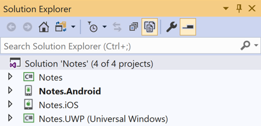
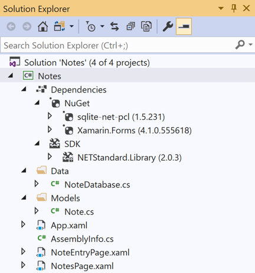
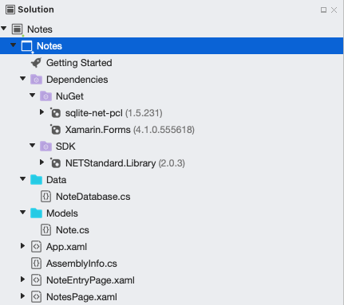

# Xamarin.Forms Quickstart Deep Dive

In the [Xamarin.Forms Quickstart](~/get-started/index.yml), the Notes application was built. This article reviews what has been built to gain an understanding of the fundamentals of how Xamarin.Forms Shell applications work.

::: zone pivot="windows"

## Introduction to Visual Studio

Visual Studio organizes code into *Solutions* and *Projects*. A solution is a container that can hold one or more projects. A project can be an application, a supporting library, a test application, and more. The Notes application consists of one solution containing three projects, as shown in the following screenshot:



The projects are:

- Notes – This project is the .NET Standard library project that holds all of the shared code and shared UI.
- Notes.Android – This project holds Android-specific code and is the entry point for the Android application.
- Notes.iOS – This project holds iOS-specific code and is the entry point for the iOS application.

## Anatomy of a Xamarin.Forms application

The following screenshot shows the contents of the Notes .NET Standard library project in Visual Studio:



The project has a **Dependencies** node that contains **NuGet** and **SDK** nodes:

- **NuGet** &ndash; the Xamarin.Forms, Xamarin.Essentials, Newtonsoft.Json, and sqlite-net-pcl NuGet packages that have been added to the project.
- **SDK** &ndash; the `NETStandard.Library` metapackage that references the complete set of NuGet packages that define .NET Standard.

::: zone-end
::: zone pivot="macos"

## Introduction to Visual Studio for Mac

[Visual Studio for Mac](/visualstudio/mac/) follows the Visual Studio practice of organizing code into *Solutions* and *Projects*. A solution is a container that can hold one or more projects. A project can be an application, a supporting library, a test application, and more. The Notes application consists of one solution containing three projects, as shown in the following screenshot:


The projects are:

- Notes – This project is the .NET Standard library project that holds all of the shared code and shared UI.
- Notes.Android – This project holds Android-specific code and is the entry point for Android applications.
- Notes.iOS – This project holds iOS specific-code and is the entry point for iOS applications.

## Anatomy of a Xamarin.Forms application

The following screenshot shows the contents of the Notes .NET Standard library project in Visual Studio for Mac:



The project has a **Dependencies** node that contains **NuGet** and **SDK** nodes:

- **NuGet** &ndash; the Xamarin.Forms, Xamarin.Essentials, Newtonsoft.Json, and sqlite-net-pcl NuGet packages that have been added to the project.
- **SDK** &ndash; the `NETStandard.Library` metapackage that references the complete set of NuGet packages that define .NET Standard.

::: zone-end

The project also consists of multiple files:

- **Data\NoteDatabase.cs** – This class contains code to create the database, read data from it, write data to it, and delete data from it.
- **Models\Note.cs** – This class defines a `Note` model whose instances store data about each note in the application.
- **Views\AboutPage.xaml** – The XAML markup for the `AboutPage` class, which defines the UI for the about page.
- **Views\AboutPage.xaml.cs** – The code-behind for the `AboutPage` class, which contains the business logic that is executed when the user interacts with the page.
- **Views\NotesPage.xaml** – The XAML markup for the `NotesPage` class, which defines the UI for the page shown when the application launches.
- **Views\NotesPage.xaml.cs** – The code-behind for the `NotesPage` class, which contains the business logic that is executed when the user interacts with the page.
- **Views\NoteEntryPage.xaml** – The XAML markup for the `NoteEntryPage` class, which defines the UI for the page shown when the user enters a note.
- **Views\NoteEntryPage.xaml.cs** – The code-behind for the `NoteEntryPage` class, which contains the business logic that is executed when the user interacts with the page.
- **App.xaml** – The XAML markup for the `App` class, which defines a resource dictionary for the application.
- **App.xaml.cs** – The code-behind for the `App` class, which is responsible for instantiating the Shell application, and for handling application lifecycle events.
- **AppShell.xaml** – The XAML markup for the `AppShell` class, which defines the visual hierarchy of the application.
- **AppShell.xaml.cs** – The code-behind for the `AppShell` class, which creates a route for the `NoteEntryPage` so that it can be navigated to programmatically.
- **AssemblyInfo.cs** – This file contains an application attribute about the project, that is applied at the assembly level.

For more information about the anatomy of a Xamarin.iOS application, see [Anatomy of a Xamarin.iOS Application](~/ios/get-started/hello-ios/hello-ios-deepdive.md#anatomy-of-a-xamarinios-application). For more information about the anatomy of a Xamarin.Android application, see [Anatomy of a Xamarin.Android Application](~/android/get-started/hello-android/hello-android-deepdive.md#anatomy).

## Architecture and application fundamentals

A Xamarin.Forms application is architected in the same way as a traditional cross-platform application. Shared code is typically placed in a .NET Standard library, and platform-specific applications consume the shared code. The following diagram shows an overview of this relationship for the Notes application:


To maximize the reuse of startup code, Xamarin.Forms applications have a single class named `App` that is responsible for instantiating the application on each platform, as shown in the following code example:

```csharp
using Xamarin.Forms;

namespace Notes
{
    public partial class App : Application
    {
        public App()
        {
            InitializeComponent();
            MainPage = new AppShell();
        }
        // ...
    }
}
```

This code sets the `MainPage` property of the `App` class to the `AppShell` object. The `AppShell` class defines the visual hierarchy of the application. Shell takes this visual hierarchy and produces the user interface for it. For more information about defining the visual hierarchy of the application, see [Application visual hierarchy](#application-visual-hierarchy).

In addition, the **AssemblyInfo.cs** file contains a single application attribute, that is applied at the assembly level:

```csharp
using Xamarin.Forms.Xaml;

[assembly: XamlCompilation(XamlCompilationOptions.Compile)]
```

The [`XamlCompilation`](xref:Xamarin.Forms.Xaml.XamlCompilationAttribute) attribute turns on the XAML compiler, so that XAML is compiled directly into intermediate language. For more information, see [XAML Compilation](~/xamarin-forms/xaml/xamlc.md).

## Launch the application on each platform

How the application is launched on each platform is specific to the platform.

### iOS

To launch the initial Xamarin.Forms page in iOS, the Notes.iOS project defines the `AppDelegate` class that inherits from the `FormsApplicationDelegate` class:

```csharp
namespace Notes.iOS
{
    [Register("AppDelegate")]
    public partial class AppDelegate : global::Xamarin.Forms.Platform.iOS.FormsApplicationDelegate
    {
        public override bool FinishedLaunching(UIApplication app, NSDictionary options)
        {
            global::Xamarin.Forms.Forms.Init();
            LoadApplication(new App());
            return base.FinishedLaunching(app, options);
        }
    }
}
```

The `FinishedLaunching` override initializes the Xamarin.Forms framework by calling the `Init` method. This causes the iOS-specific implementation of Xamarin.Forms to be loaded in the application before the root view controller is set by the call to the `LoadApplication` method.

### Android

To launch the initial Xamarin.Forms page in Android, the Notes.Android project includes code that creates an `Activity` with the `MainLauncher` attribute, with the activity inheriting from the `FormsAppCompatActivity` class:

```csharp
namespace Notes.Droid
{
    [Activity(Label = "Notes",
              Icon = "@mipmap/icon",
              Theme = "@style/MainTheme",
              MainLauncher = true,
              ConfigurationChanges = ConfigChanges.ScreenSize | ConfigChanges.Orientation)]
    public class MainActivity : global::Xamarin.Forms.Platform.Android.FormsAppCompatActivity
    {
        protected override void OnCreate(Bundle savedInstanceState)
        {
            TabLayoutResource = Resource.Layout.Tabbar;
            ToolbarResource = Resource.Layout.Toolbar;

            base.OnCreate(savedInstanceState);
            global::Xamarin.Forms.Forms.Init(this, savedInstanceState);
            LoadApplication(new App());
        }
    }
}
```

The `OnCreate` override initializes the Xamarin.Forms framework by calling the `Init` method. This causes the Android-specific implementation of Xamarin.Forms to be loaded in the application before the Xamarin.Forms application is loaded.

## Application visual hierarchy

Xamarin.Forms Shell applications define the visual hierarchy of the application in a class that subclasses the `Shell` class. In the Notes application this is the `Appshell` class:

```xaml
<Shell xmlns="http://xamarin.com/schemas/2014/forms"
       xmlns:x="http://schemas.microsoft.com/winfx/2009/xaml"
       xmlns:views="clr-namespace:Notes.Views"
       x:Class="Notes.AppShell">
    <TabBar>
        <ShellContent Title="Notes"
                      Icon="icon_feed.png"
                      ContentTemplate="{DataTemplate views:NotesPage}" />
        <ShellContent Title="About"
                      Icon="icon_about.png"
                      ContentTemplate="{DataTemplate views:AboutPage}" />
    </TabBar>
</Shell>
```

This XAML consists of two main objects:

- `TabBar`. The `TabBar` represents the bottom tab bar, and should be used when the navigation pattern for the application uses bottom tabs. The `TabBar` object is a child of the `Shell` object.
- `ShellContent`, which represents the `ContentPage` objects for each tab in the `TabBar`. Each `ShellContent` object is a child of the `TabBar` object.

These objects don't represent any user interface, but rather the organization of the application's visual hierarchy. Shell will take these objects and produce the navigation user interface for the content. Therefore, the `AppShell` class defines two pages that are navigable from bottom tabs. The pages are created on demand, in response to navigation.

For more information about Shell applications, see [Xamarin.Forms Shell](~/xamarin-forms/app-fundamentals/shell/index.md).

## User interface

There are several control groups used to create the user interface of a Xamarin.Forms application:

1. **Pages** – Xamarin.Forms pages represent cross-platform mobile application screens. The Notes application uses the [`ContentPage`](xref:Xamarin.Forms.ContentPage) class to display single screens. For more information about pages, see [Xamarin.Forms Pages](~/xamarin-forms/user-interface/controls/pages.md).
1. **Views** – Xamarin.Forms views are the controls displayed on the user interface, such as labels, buttons, and text entry boxes. The finished Notes application uses the [`CollectionView`](xref:Xamarin.Forms.CollectionView), [`Editor`](xref:Xamarin.Forms.Editor), and [`Button`](xref:Xamarin.Forms.Button) views. For more information about views, see [Xamarin.Forms Views](~/xamarin-forms/user-interface/controls/views.md).
1. **Layouts** – Xamarin.Forms layouts are containers used to compose views into logical structures. The Notes application uses the [`StackLayout`](xref:Xamarin.Forms.StackLayout) class to arrange views in a vertical stack, and the [`Grid`](xref:Xamarin.Forms.Grid) class to arrange buttons horizontally. For more information about layouts, see [Xamarin.Forms Layouts](~/xamarin-forms/user-interface/controls/layouts.md).

At runtime, each control will be mapped to its native equivalent, which is what will be rendered.

### Layout

The Notes application uses the [`StackLayout`](xref:Xamarin.Forms.StackLayout) to simplify cross-platform application development by automatically arranging views on the screen regardless of the screen size. Each child element is positioned one after the other, either horizontally or vertically in the order they were added. How much space the `StackLayout` will use depends on how the [`HorizontalOptions`](xref:Xamarin.Forms.View.HorizontalOptions) and [`VerticalOptions`](xref:Xamarin.Forms.View.HorizontalOptions) properties are set, but by default the `StackLayout` will try to use the entire screen.

The following XAML code shows an example of using a [`StackLayout`](xref:Xamarin.Forms.StackLayout) to layout the `NoteEntryPage`:

```xaml
<?xml version="1.0" encoding="UTF-8"?>
<ContentPage xmlns="http://xamarin.com/schemas/2014/forms"
             xmlns:x="http://schemas.microsoft.com/winfx/2009/xaml"
             x:Class="Notes.Views.NoteEntryPage"
             Title="Note Entry">
    ...    
    <StackLayout Margin="{StaticResource PageMargin}">
        <Editor Placeholder="Enter your note"
                Text="{Binding Text}"
                HeightRequest="100" />
        <Grid>
            ...
        </Grid>
    </StackLayout>    
</ContentPage>
```

By default the [`StackLayout`](xref:Xamarin.Forms.StackLayout) assumes a vertical orientation. However, it can be changed to a horizontal orientation by setting the [`StackLayout.Orientation`](xref:Xamarin.Forms.StackLayout.Orientation) property to the [`StackOrientation.Horizontal`](xref:Xamarin.Forms.StackOrientation.Horizontal) enumeration member.

> [!NOTE]
> The size of views can be set through the `HeightRequest` and `WidthRequest` properties.

For more information about the [`StackLayout`](xref:Xamarin.Forms.StackLayout) class, see [Xamarin.Forms StackLayout](~/xamarin-forms/user-interface/layouts/stacklayout.md).

### Responding to user interaction

An object defined in XAML can fire an event that is handled in the code-behind file. The following code example shows the `OnSaveButtonClicked` method in the code-behind for the `NoteEntryPage` class, which is executed in response to the [`Clicked`](xref:Xamarin.Forms.Button.Clicked) event firing on the *Save* button.

```csharp
async void OnSaveButtonClicked(object sender, EventArgs e)
{
    var note = (Note)BindingContext;
    note.Date = DateTime.UtcNow;
    if (!string.IsNullOrWhiteSpace(note.Text))
    {
        await App.Database.SaveNoteAsync(note);
    }
    await Shell.Current.GoToAsync("..");
}
```

The `OnSaveButtonClicked` method saves the note in the database, and navigates back to the previous page. For more information about navigation, see [Navigation](#navigation).

> [!NOTE]
> The code-behind file for a XAML class can access an object defined in XAML using the name assigned to it with the `x:Name` attribute. The value assigned to this attribute has the same rules as C# variables, in that it must begin with a letter or underscore and contain no embedded spaces.

The wiring of the save button to the `OnSaveButtonClicked` method occurs in the XAML markup for the `NoteEntryPage` class:

```xaml
<Button Text="Save"
        Clicked="OnSaveButtonClicked" />
```

### Lists

The [`CollectionView`](xref:Xamarin.Forms.CollectionView) is responsible for displaying a collection of items in a list. By default, list items are displayed vertically and each item is displayed in a single row.

The following code example shows the [`CollectionView`](xref:Xamarin.Forms.CollectionView) from the `NotesPage`:

```xaml
<CollectionView x:Name="collectionView"
                Margin="{StaticResource PageMargin}"
                SelectionMode="Single"
                SelectionChanged="OnSelectionChanged">
    <CollectionView.ItemsLayout>
        <LinearItemsLayout Orientation="Vertical"
                           ItemSpacing="10" />
    </CollectionView.ItemsLayout>
    <CollectionView.ItemTemplate>
        <DataTemplate>
            <StackLayout>
                <Label Text="{Binding Text}"
                       FontSize="Medium" />
                <Label Text="{Binding Date}"
                       TextColor="{StaticResource TertiaryColor}"
                       FontSize="Small" />
            </StackLayout>
        </DataTemplate>
    </CollectionView.ItemTemplate>
</CollectionView>
```

The layout of each row in the [`CollectionView`](xref:Xamarin.Forms.CollectionView) is defined within the [`CollectionView.ItemTemplate`](xref:Xamarin.Forms.ItemsView`1.ItemTemplate) element, and uses data binding to display any notes that are retrieved by the application. The [`CollectionView.ItemsSource`](xref:Xamarin.Forms.ItemsView`1.ItemsSource) property is set to the data source, in **NotesPage.xaml.cs**:

```csharp
protected override async void OnAppearing()
{
    base.OnAppearing();

    collectionView.ItemsSource = await App.Database.GetNotesAsync();
}
```    

This code populates the [`CollectionView`](xref:Xamarin.Forms.CollectionView) with any notes stored in the database, and is executed when the page appears.

When an item is selected in the [`CollectionView`](xref:Xamarin.Forms.CollectionView), the `SelectionChanged` event fires. An event handler, named `OnSelectionChanged`, is executed when the event fires:

```csharp
async void OnSelectionChanged(object sender, SelectionChangedEventArgs e)
{
    if (e.CurrentSelection != null)
    {
        // ...
    }
}
```

The `SelectionChanged` event can access the object that was associated with the item through the `e.CurrentSelection` property.

For more information about the  [`CollectionView`](xref:Xamarin.Forms.CollectionView) class, see [Xamarin.Forms CollectionView](~/xamarin-forms/user-interface/collectionview/index.md).

## Navigation

Navigation is performed in a Shell application by specifying a URI to navigate to. Navigation URIs have three components:

- A *route*, which defines the path to content that exists as part of the Shell visual hierarchy.
- A *page*. Pages that don't exist in the Shell visual hierarchy can be pushed onto the navigation stack from anywhere within a Shell application. For example, the `NoteEntryPage` isn't defined in the Shell visual hierarchy, but can be pushed onto the navigation stack as required.
- One or more *query parameters*. Query parameters are parameters that can be passed to the destination page while navigating.

A navigation URI doesn't have to include all three components, but when it does the structure is: //route/page?queryParameters

> [!NOTE]
> Routes can be defined on elements in the Shell visual hierarchy via the `Route` property. However, if the `Route` property isn't set, such as in the Notes application, a route is generated at runtime.

For more information about Shell navigation, see [Xamarin.Forms Shell navigation](~/xamarin-forms/app-fundamentals/shell/navigation.md).

### Register routes

To navigate to a page that doesn't exist in the Shell visual hierarchy requires it to first be registered with the Shell routing system. using the `Routing.RegisterRoute` method. In the Notes application, this occurs in the `AppShell` constructor:

```csharp
public partial class AppShell : Shell
{
    public AppShell()
    {
        // ...
        Routing.RegisterRoute(nameof(NoteEntryPage), typeof(NoteEntryPage));
    }
}
```

In this example, a route named `NoteEntryPage` is registered against the `NoteEntryPage` type. This page can then be navigated to using URI-based navigation, from anywhere in the application.

### Perform navigation

Navigation is performed by the `GoToAsync` method, which accepts an argument that represents the route to navigate to:

```csharp
await Shell.Current.GoToAsync("NoteEntryPage");
```

In this example, the `NoteEntryPage` is navigated to.

> [!IMPORTANT]
> A navigation stack is created when a page that's not in the Shell visual hierarchy is navigated to.

When navigating to a page, data can be passed to the page as a query parameter:

```csharp
async void OnSelectionChanged(object sender, SelectionChangedEventArgs e)
{
    if (e.CurrentSelection != null)
    {
        // Navigate to the NoteEntryPage, passing the ID as a query parameter.
        Note note = (Note)e.CurrentSelection.FirstOrDefault();
        await Shell.Current.GoToAsync($"{nameof(NoteEntryPage)}?{nameof(NoteEntryPage.ItemId)}={note.ID.ToString()}");
    }
}
```

This example retrieves the currently selected item in the [`CollectionView`](xref:Xamarin.Forms.CollectionView) and navigates to the `NoteEntryPage`, with the value of `ID` property of the `Note` object being passed as a query parameter to the `NoteEntryPage.ItemId` property.

To receive the passed data, the `NoteEntryPage` class is decorated with the `QueryPropertyAttribute`

```csharp
[QueryProperty(nameof(ItemId), nameof(ItemId))]
public partial class NoteEntryPage : ContentPage
{
    public string ItemId
    {
        set
        {
            LoadNote(value);
        }
    }
    // ...
}
```

The first argument for the `QueryPropertyAttribute` specifies that the `ItemId` property will receive the passed data, with the second argument specifying the query parameter id. Therefore, the `QueryPropertyAttribute` in the above example specifies that the `ItemId` property will receive the data passed in the `ItemId` query parameter from the URI in the `GoToAsync` method call. The `ItemId` property then calls the `LoadNote` method to retrieve the note from the device.

Backwards navigation is performed by specifying ".." as the argument to the `GoToAsync` method:

```csharp
await Shell.Current.GoToAsync("..");
```

For more information about backwards navigation, see [Backwards navigation](~/xamarin-forms/app-fundamentals/shell/navigation.md#backwards-navigation).

## Data binding

Data binding is used to simplify how a Xamarin.Forms application displays and interacts with its data. It establishes a connection between the user interface and the underlying application. The [`BindableObject`](xref:Xamarin.Forms.BindableObject) class contains much of the infrastructure to support data binding.

Data binding connects two objects, called the *source* and the *target*. The *source* object provides the data. The *target* object will consume (and often display) data from the source object. For example, an [`Editor`](xref:Xamarin.Forms.Editor) (*target* object) will commonly bind its [`Text`](xref:Xamarin.Forms.InputView.Text) property to a public `string` property in a *source* object. The following diagram illustrates the binding relationship:


The main benefit of data binding is that you no longer have to worry about synchronizing data between your views and data source. Changes in the *source* object are automatically pushed to the *target* object behind-the-scenes by the binding framework, and changes in the target object can be optionally pushed back to the *source* object.

Establishing data binding is a two-step process:

- The [`BindingContext`](xref:Xamarin.Forms.BindableObject.BindingContext) property of the *target* object must be set to the *source*.
- A binding must be established between the *target* and the *source*. In XAML, this is achieved by using the [`Binding`](xref:Xamarin.Forms.Xaml.BindingExtension) markup extension.

In the Notes application, the binding target is the [`Editor`](xref:Xamarin.Forms.Editor) that displays a note, while the `Note` instance set as the [`BindingContext`](xref:Xamarin.Forms.BindableObject.BindingContext) of `NoteEntryPage` is the binding source. Initially, the `BindingContext` of the `NoteEntryPage` is set when the page constructor executes:

```csharp
public NoteEntryPage()
{
    // ...
    BindingContext = new Note();
}
```

In this example, the page's `BindingContext` is set to a new `Note` when the `NoteEntryPage` is created. This handles the scenario of adding a new note to the application.

In addition, the page's `BindingContext` can also be set when navigation to the `NoteEntryPage` occurs, provided that an existing note was selected on the `NotesPage`:

```csharp
[QueryProperty(nameof(ItemId), nameof(ItemId))]
public partial class NoteEntryPage : ContentPage
{
    public string ItemId
    {
        set
        {
            LoadNote(value);
        }

        async void LoadNote(string itemId)
        {
            try
            {
                int id = Convert.ToInt32(itemId);
                // Retrieve the note and set it as the BindingContext of the page.
                Note note = await App.Database.GetNoteAsync(id);
                BindingContext = note;
            }
            catch (Exception)
            {
                Console.WriteLine("Failed to load note.");
            }
        }    
        // ...    
    }
}
```

In this example, when page navigation occurs the page's `BindingContext` is set to the selected `Note` object after it's been retrieved from the database.

> [!IMPORTANT]
> While the [`BindingContext`](xref:Xamarin.Forms.BindableObject.BindingContext) property of each *target* object can be individually set, this isn’t necessary. `BindingContext` is a special property that’s inherited by all its children. Therefore, when the `BindingContext` on the [`ContentPage`](xref:Xamarin.Forms.ContentPage) is set to a `Note` instance, all of the children of the `ContentPage` have the same `BindingContext`, and can bind to public properties of the `Note` object.

The [`Editor`](xref:Xamarin.Forms.Editor) in `NoteEntryPage` then binds to the `Text` property of the `Note` object:

```xaml
<Editor Placeholder="Enter your note"
        Text="{Binding Text}" />
```

A binding between the [`Editor.Text`](xref:Xamarin.Forms.InputView.Text) property and the `Text` property of the *source* object is established. Changes made in the `Editor` will automatically be propagated to the `Note` object. Similarly, if changes are made to the `Note.Text` property, the Xamarin.Forms binding engine will also update the contents of the `Editor`. This is known as a *two-way binding*.

For more information about data binding, see [Xamarin.Forms Data Binding](~/xamarin-forms/app-fundamentals/data-binding/index.md).

## Styling

Xamarin.Forms applications often contain multiple visual elements that have an identical appearance. Setting the appearance of each visual element can be repetitive and error prone. Instead, styles can be created that define the appearance, and then applied to the required visual elements.

The [`Style`](xref:Xamarin.Forms.Style) class groups a collection of property values into one object that can then be applied to multiple visual element instances. Styles are stored in a [`ResourceDictionary`](xref:Xamarin.Forms.ResourceDictionary), either at the application level, the page level, or the view level. Choosing where to define a `Style` impacts where it can be used:

- [`Style`](xref:Xamarin.Forms.Style) instances defined at the application level can be applied throughout the application.
- [`Style`](xref:Xamarin.Forms.Style) instances defined at the page level can be applied to the page and to its children.
- [`Style`](xref:Xamarin.Forms.Style) instances defined at the view level can be applied to the view and to its children.

> [!IMPORTANT]
> Any styles that are used throughout the application are stored in the application's resource dictionary to avoid duplication. However, XAML that's specific to a page shouldn't be included in the application's resource dictionary, as the resources will then be parsed at application startup instead of when required by a page. For more information, see [Reduce the application resource dictionary size](~/xamarin-forms/deploy-test/performance.md#reduce-the-application-resource-dictionary-size).

Each [`Style`](xref:Xamarin.Forms.Style) instance contains a collection of one or more [`Setter`](xref:Xamarin.Forms.Setter) objects, with each `Setter` having a [`Property`](xref:Xamarin.Forms.Setter.Property) and a [`Value`](xref:Xamarin.Forms.Setter.Value). The `Property` is the name of the bindable property of the element the style is applied to, and the `Value` is the value that is applied to the property. The following code example shows a style from `NoteEntryPage`:

```xaml
<ContentPage xmlns="http://xamarin.com/schemas/2014/forms"
             xmlns:x="http://schemas.microsoft.com/winfx/2009/xaml"
             x:Class="Notes.Views.NoteEntryPage"
             Title="Note Entry">
    <ContentPage.Resources>
        <!-- Implicit styles -->
        <Style TargetType="{x:Type Editor}">
            <Setter Property="BackgroundColor"
                    Value="{StaticResource AppBackgroundColor}" />
        </Style>
        ...
    </ContentPage.Resources>
    ...
</ContentPage>
```

This style is applied to any [`Editor`](xref:Xamarin.Forms.Editor) instances on the page.

When creating a [`Style`](xref:Xamarin.Forms.Style), the [`TargetType`](xref:Xamarin.Forms.Style.TargetType) property is always required.

> [!NOTE]
> Styling a Xamarin.Forms application is traditionally accomplished by using XAML styles. However, Xamarin.Forms also supports styling visual elements using Cascading Style Sheets (CSS). For more information, see [Styling Xamarin.Forms apps using Cascading Style Sheets (CSS)](~/xamarin-forms/user-interface/styles/css/index.md).

For more information about XAML styles, see [Styling Xamarin.Forms Apps using XAML Styles](~/xamarin-forms/user-interface/styles/xaml/index.md).

## Test and deployment

Visual Studio for Mac and Visual Studio both provide many options for testing and deploying an application. Debugging applications is a common part of the application development lifecycle and helps to diagnose code issues. For more information, see [Set a Breakpoint](https://github.com/xamarin/recipes/tree/master/Recipes/cross-platform/ide/debugging/set_a_breakpoint), [Step Through Code](https://github.com/xamarin/recipes/tree/master/Recipes/cross-platform/ide/debugging/step_through_code), and [Output Information to the Log Window](https://github.com/xamarin/recipes/tree/master/Recipes/cross-platform/ide/debugging/output_information_to_log_window).

Simulators are a good place to start deploying and testing an application, and feature useful functionality for testing applications. However, users will not consume the final application in a simulator, so applications should be tested on real devices early and often. For more information about iOS device provisioning, see [Device Provisioning](~/ios/get-started/installation/device-provisioning/index.md). For more information about Android device provisioning, see [Set Up Device for Development](~/android/get-started/installation/set-up-device-for-development.md).

## Next steps

This deep dive has examined the fundamentals of application development using Xamarin.Forms Shell. Suggested next steps include reading about the following functionality:

- Xamarin.Forms Shell reduces the complexity of mobile application development by providing the fundamental features that most mobile applications require. For more information, see [Xamarin.Forms Shell](~/xamarin-forms/app-fundamentals/shell/index.md).
- There are several control groups used to create the user interface of a Xamarin.Forms application. For more information, see [Controls Reference](~/xamarin-forms/user-interface/controls/index.md).
- Data binding is a technique for linking properties of two objects so that changes in one property are automatically reflected in the other property. For more information, see [Data Binding](~/xamarin-forms/app-fundamentals/data-binding/index.md).
- Xamarin.Forms provides multiple page navigation experiences, depending upon the page type being used. For more information, see [Navigation](~/xamarin-forms/app-fundamentals/navigation/index.md).
- Styles help to reduce repetitive markup, and allow an applications appearance to be more easily changed. For more information, see [Styling Xamarin.Forms Apps](~/xamarin-forms/user-interface/styles/index.md).
- Data templates provide the ability to define the presentation of data on supported views. For more information, see [Data Templates](~/xamarin-forms/app-fundamentals/templates/data-templates/index.md).
- Effects also allow the native controls on each platform to be customized. Effects are created in platform-specific projects by subclassing the [`PlatformEffect`](xref:Xamarin.Forms.PlatformEffect`2) class, and are consumed by attaching them to an appropriate Xamarin.Forms control. For more information, see [Effects](~/xamarin-forms/app-fundamentals/effects/index.md).
- Each page, layout, and view is rendered differently on each platform using a `Renderer` class that in turn creates a native control, arranges it on the screen, and adds the behavior specified in the shared code. Developers can implement their own custom `Renderer` classes to customize the appearance and/or behavior of a control. For more information, see [Custom Renderers](~/xamarin-forms/app-fundamentals/custom-renderer/index.md).
- Shared code can access native functionality through the [`DependencyService`](xref:Xamarin.Forms.DependencyService) class. For more information, see [Accessing Native Features with DependencyService](~/xamarin-forms/app-fundamentals/dependency-service/index.md).

## Related links

- [Xamarin.Forms Shell](~/xamarin-forms/app-fundamentals/shell/index.md)
- [eXtensible Application Markup Language (XAML)](~/xamarin-forms/xaml/index.yml)
- [Data Binding](~/xamarin-forms/app-fundamentals/data-binding/index.md)
- [Controls Reference](~/xamarin-forms/user-interface/controls/index.md)
- [Get Started Samples](/samples/browse/?products=xamarin&term=Xamarin.Forms%2bget%2bstarted)
- [Xamarin.Forms Samples](/samples/browse/?products=xamarin&term=Xamarin.Forms)
- [Xamarin.Forms API reference](xref:Xamarin.Forms)

## Related video

> [!Video https://learn.microsoft.com/shows/Xamarin-101/Xamarin-Solution-Architecture-4-of-11  ]

[!include[](~/essentials/includes/xamarin-show-essentials.md)]
