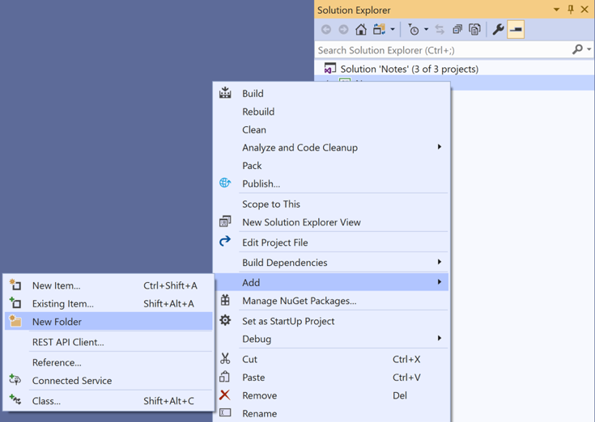
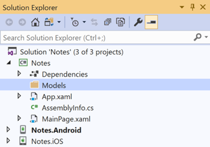
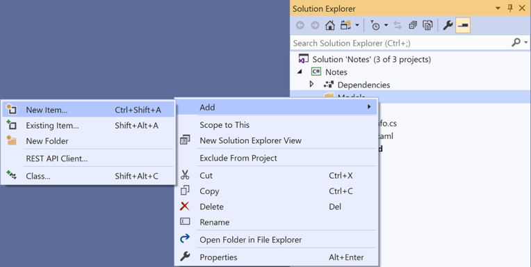
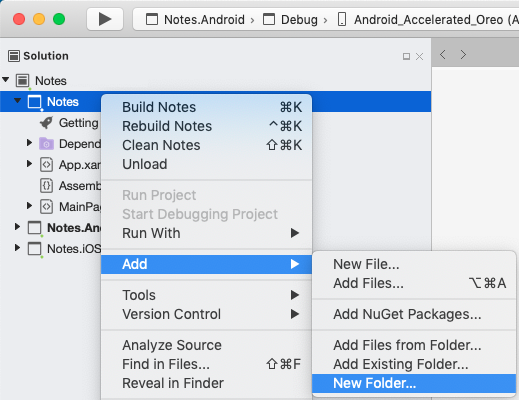
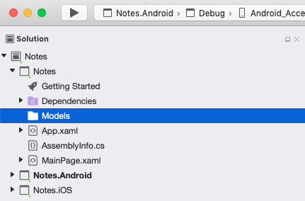
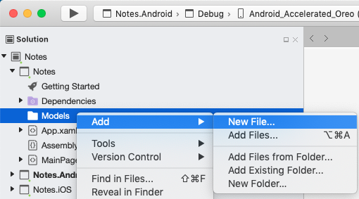

# Perform Navigation in a Multi-Page Xamarin.Forms Application

[ Download the sample](https://developer.xamarin.com/samples/xamarin-forms/GetStarted/Notes/MultiPage/)

In this quickstart, you will learn how to:

- Add additional pages to a Xamarin.Forms solution.
- Perform navigation between pages.
- Use data binding to synchronize data between user interface elements and their data source.

The quickstart walks through how to turn a single page cross-platform Xamarin.Forms application, capable of storing a single note, into a multi-page application, capable of storing multiple notes. The final application is shown below:

[](multi-page-images/screenshots1.png#lightbox "Notes Page")
[](multi-page-images/screenshots2.png#lightbox "Note Entry Page")

### Prerequisites

You should successfully complete the [previous quickstart](single-page.md) before attempting this quickstart. Alternatively, download the [previous quickstart sample](https://developer.xamarin.com/samples/xamarin-forms/GetStarted/Notes/SinglePage/) and use it as the starting point for this quickstart.

::: zone pivot="windows"

## Update the app with Visual Studio

1. Launch Visual Studio. On the start page click **Open Project / Solution**, and in the **Open Project** dialog select the solution file for the Notes project:

    

2. In **Solution Explorer**, right-click on the **Notes** project and select **Add > New Folder**:

    

3. In **Solution Explorer**, name the new folder **Models**:

    

4. In **Solution Explorer**, select the **Models** folder, right-click, and select **Add > New Item...**:

    

5. In the **Add New Item** dialog, select **Visual C# Items > Class**, name the new file **Note**, and click the **Add** button:

    

    This will add a class named **Note** to the **Models** folder of the **Notes** project.

6. In **Note.cs**, remove all of the template code and replace it with the following code:

    ```csharp
    using System;

    namespace Notes.Models
    {
        public class Note
        {
            public string Filename { get; set; }
            public string Text { get; set; }
            public DateTime Date { get; set; }
        }
    }
    ```

    This class defines a `Note` model that will store data about each note in the application.    

    Save the changes to **Note.cs** by pressing **CTRL+S**, and close the file.

7. In **Solution Explorer**, right-click on the **Notes** project and select **Add > New Item..**. In the **Add New Item** dialog, select **Visual C# Items > Xamarin.Forms > Content Page**, name the new file **NoteEntryPage**, and click the **Add** button:

    

    This will add a new page named **NoteEntryPage** to the root folder of the project. This page will be the second page in the application.

8. In **NoteEntryPage.xaml**, remove all of the template code and replace it with the following code:

      ```xaml
      <?xml version="1.0" encoding="UTF-8"?>
      <ContentPage xmlns="http://xamarin.com/schemas/2014/forms"
                   xmlns:x="http://schemas.microsoft.com/winfx/2009/xaml"
                   x:Class="Notes.NoteEntryPage"
                   Title="Note Entry">
          <StackLayout Margin="20">
              <Editor Placeholder="Enter your note"
                      Text="{Binding Text}"
                      HeightRequest="100" />
              <Grid>
                  <Grid.ColumnDefinitions>
                      <ColumnDefinition Width="*" />
                      <ColumnDefinition Width="*" />
                  </Grid.ColumnDefinitions>
                  <Button Text="Save"
                          Clicked="OnSaveButtonClicked" />
                  <Button Grid.Column="1"
                          Text="Delete"
                          Clicked="OnDeleteButtonClicked"/>
              </Grid>
          </StackLayout>
      </ContentPage>
      ```

      This code declaratively defines the user interface for the page, which consists of a [`Editor`](xref:Xamarin.Forms.Editor) for text input, and two [`Button`](xref:Xamarin.Forms.Button) instances that direct the application to save or delete a file. The two `Button` instances are horizontally laid out in a [`Grid`](xref:Xamarin.Forms.Grid), with the `Editor` and `Grid` being vertically laid out in a [`StackLayout`](xref:Xamarin.Forms.StackLayout). In addition, the `Editor` uses data binding to bind to the `Text` property of the `Note` model. For more information about data binding, see [Data binding](deepdive.md#data-binding) in the [Xamarin.Forms Quickstart Deep Dive](deepdive.md).

      Save the changes to **NoteEntryPage.xaml** by pressing **CTRL+S**, and close the file.

9. In **NoteEntryPage.xaml.cs**, remove all of the template code and replace it with the following code:

      ```csharp
      using System;
      using System.IO;
      using Xamarin.Forms;
      using Notes.Models;

      namespace Notes
      {
          public partial class NoteEntryPage : ContentPage
          {
              public NoteEntryPage()
              {
                  InitializeComponent();
              }

              async void OnSaveButtonClicked(object sender, EventArgs e)
              {
                  var note = (Note)BindingContext;

                  if (string.IsNullOrWhiteSpace(note.Filename))
                  {
                      // Save
                      var filename = Path.Combine(App.FolderPath, $"{Path.GetRandomFileName()}.notes.txt");
                      File.WriteAllText(filename, note.Text);
                  }
                  else
                  {
                      // Update
                      File.WriteAllText(note.Filename, note.Text);
                  }

                  await Navigation.PopAsync();
              }

              async void OnDeleteButtonClicked(object sender, EventArgs e)
              {
                  var note = (Note)BindingContext;

                  if (File.Exists(note.Filename))
                  {
                      File.Delete(note.Filename);
                  }

                  await Navigation.PopAsync();
              }
          }
      }
      ```

      This code stores a `Note` instance, which represents a single note, in the [`BindingContext`](xref:Xamarin.Forms.BindableObject.BindingContext) of the page. When the **Save** [`Button`](xref:Xamarin.Forms.Button) is pressed the `OnSaveButtonClicked` event handler is executed, which either saves the content of the `Editor` to a new file with a randomly generated filename, or to an existing file if a note is being updated. In both cases, the file is stored in the local application data folder for the application. Then the method navigates back to the previous page. When the **Delete** `Button` is pressed the `OnDeleteButtonClicked` event handler is executed, which deletes the file, provided that it exists, and navigates back to the previous page. For more information about navigation, see [Navigation](deepdive.md#navigation) in the [Xamarin.Forms Quickstart Deep Dive](deepdive.md).

      Save the changes to **NoteEntryPage.xaml.cs** by pressing **CTRL+S**, and close the file.

      > [!WARNING]
      > Attempting to build the application at this point will result in errors that will be fixed in subsequent steps.

10. In **Solution Explorer**, right-click on the **Notes** project and select **Add > New Item..**. In the **Add New Item** dialog, select **Visual C# Items > Xamarin.Forms > Content Page**, name the new file **NotesPage**, and click the **Add** button.

      This will add a page named **NotesPage** to the root folder of the project. This page will be the root page of the application.

11. In **NotesPage.xaml**, remove all of the template code and replace it with the following code:

    ```xaml
    <?xml version="1.0" encoding="UTF-8"?>
    <ContentPage xmlns="http://xamarin.com/schemas/2014/forms"
                 xmlns:x="http://schemas.microsoft.com/winfx/2009/xaml"
                 x:Class="Notes.NotesPage"
                 Title="Notes">
        <ContentPage.ToolbarItems>
            <ToolbarItem Text="+"
                         Clicked="OnNoteAddedClicked" />
        </ContentPage.ToolbarItems>
        <ListView x:Name="listView"
                  Margin="20"
                  ItemSelected="OnListViewItemSelected">
            <ListView.ItemTemplate>
                <DataTemplate>
                    <TextCell Text="{Binding Text}"
                              Detail="{Binding Date}" />
                </DataTemplate>
            </ListView.ItemTemplate>
        </ListView>
    </ContentPage>
    ```

    This code declaratively defines the user interface for the page, which consists of a [`ListView`](xref:Xamarin.Forms.ListView) and a [`ToolbarItem`](xref:Xamarin.Forms.ToolbarItem). The `ListView` uses data binding to display any notes that are retrieved by the application, and selecting a note will navigate to the `NoteEntryPage` where the note can be modified. Alternatively, a new note can be created by pressing the `ToolbarItem`. For more information about data binding, see [Data binding](deepdive.md#data-binding) in the [Xamarin.Forms Quickstart Deep Dive](deepdive.md).

    Save the changes to **NotesPage.xaml** by pressing **CTRL+S**, and close the file.

12. In **NotesPage.xaml.cs**, remove all of the template code and replace it with the following code:

    ```csharp
    using System;
    using System.Collections.Generic;
    using System.IO;
    using System.Linq;
    using Xamarin.Forms;
    using Notes.Models;

    namespace Notes
    {
        public partial class NotesPage : ContentPage
        {
            public NotesPage()
            {
                InitializeComponent();
            }

            protected override void OnAppearing()
            {
                base.OnAppearing();

                var notes = new List<Note>();

                var files = Directory.EnumerateFiles(App.FolderPath, "*.notes.txt");
                foreach (var filename in files)
                {
                    notes.Add(new Note
                    {
                        Filename = filename,
                        Text = File.ReadAllText(filename),
                        Date = File.GetCreationTime(filename)
                    });
                }

                listView.ItemsSource = notes
                    .OrderBy(d => d.Date)
                    .ToList();
            }

            async void OnNoteAddedClicked(object sender, EventArgs e)
            {
                await Navigation.PushAsync(new NoteEntryPage
                {
                    BindingContext = new Note()
                });
            }

            async void OnListViewItemSelected(object sender, SelectedItemChangedEventArgs e)
            {
                if (e.SelectedItem != null)
                {
                    await Navigation.PushAsync(new NoteEntryPage
                    {
                        BindingContext = e.SelectedItem as Note
                    });
                }
            }
        }
    }
    ```    

    This code defines the functionality for the `NotesPage`. When the page appears, the `OnAppearing` method is executed, which populates the [`ListView`](xref:Xamarin.Forms.ListView) with any notes that have been retrieved from the local application data folder. When the [`ToolbarItem`](xref:Xamarin.Forms.ToolbarItem) is pressed the `OnNoteAddedClicked` event handler is executed. This method navigates to the `NoteEntryPage`, setting the [`BindingContext`](xref:Xamarin.Forms.BindableObject.BindingContext) of the `NoteEntryPage` to a new `Note` instance. When an item in the `ListView` is selected the `OnListViewItemSelected` event handler is executed. This method navigates to the `NoteEntryPage`, setting the [`BindingContext`](xref:Xamarin.Forms.BindableObject.BindingContext) of the `NoteEntryPage` to the selected `Note` instance. For more information about navigation, see [Navigation](deepdive.md#navigation) in the [Xamarin.Forms Quickstart Deep Dive](deepdive.md).

    Save the changes to **NotesPage.xaml.cs** by pressing **CTRL+S**, and close the file.

    > [!WARNING]
    > Attempting to build the application at this point will result in errors that will be fixed in subsequent steps.

13. In **Solution Explorer**, double-click **App.xaml.cs** to open it. Then replace the existing code with the following code:

    ```csharp
    using System;
    using System.IO;
    using Xamarin.Forms;
    using Xamarin.Forms.Xaml;

    [assembly: XamlCompilation(XamlCompilationOptions.Compile)]
    namespace Notes
    {
        public partial class App : Application
        {
            public static string FolderPath { get; private set; }

            public App()
            {
                InitializeComponent();
                FolderPath = Path.Combine(Environment.GetFolderPath(Environment.SpecialFolder.LocalApplicationData));
                MainPage = new NavigationPage(new NotesPage());
            }
            ...
        }
    }
    ```

    This code adds a namespace declaration for the `System.IO` namespace, and adds a declaration for a static `FolderPath` property of type `string`. The `FolderPath` property is used to store the path on the device where note data will be stored. In addition, the code initializes the `FolderPath` property in the `App` constructor, and initializes the [`MainPage`](xref:Xamarin.Forms.Application.MainPage) property to be a [`NavigationPage`](xref:Xamarin.Forms.NavigationPage) that hosts an instance of `NotesPage`. For more information about navigation, see [Navigation](deepdive.md#navigation) in the [Xamarin.Forms Quickstart Deep Dive](deepdive.md).

    Save the changes to **App.xaml.cs** by pressing **CTRL+S**, and close the file.

14. In **Solution Explorer**, in the **Notes** project, right-click **MainPage.xaml**, and select **Delete**. In the dialog that appears press the **OK** button to remove the file from your hard disk.

    This removes a page that's no longer used.

15. Build and run the project on each platform. For more information, see [Building the quickstart](single-page.md#building-the-quickstart).

    On the **NotesPage** press the **+** button to navigate to the **NoteEntryPage** and enter a note. After saving the note the application will navigate back to the **NotesPage**.

    Enter a number of notes, of varying length, to observe the application behavior.

::: zone-end
::: zone pivot="macos"

## Update the app with Visual Studio for Mac

1. Launch Visual Studio for Mac. On the start page click **Open...**, and in the dialog select the solution file for the Notes project:

    

2. In the **Solution Pad**, select the **Notes** project, right-click, and select **Add > New Folder**:

    

3. In the **Solution Pad**, name the new folder **Models**:

    

4. In the **Solution Pad**, select the **Models** folder, right-click, and select **Add > New File...**:

    

5. In the **New File** dialog, select **General > Empty Class**, name the new file **Note**, and click the **New** button:

    

    This will add a class named **Note** to the **Models** folder of the **Notes** project.

6. In **Note.cs**, remove all of the template code and replace it with the following code:

    ```csharp
    using System;

    namespace Notes.Models
    {
        public class Note
        {
            public string Filename { get; set; }
            public string Text { get; set; }
            public DateTime Date { get; set; }
        }
    }
    ```

    This class defines a `Note` model that will store data about each note in the application.

    Save the changes to **Note.cs** by choosing **File > Save** (or by pressing **&#8984; + S**), and close the file.

7. In the **Solution Pad**, select the **Notes** project, right-click, and select **Add > New File...**. In the **New File** dialog, select **Forms > Forms ContentPage XAML**, name the new file **NoteEntryPage**, and click the **New** button:

    

    This will add a new page named **NoteEntryPage** to the root folder of the project. This page will be the second page in the application.

8. In **NoteEntryPage.xaml**, remove all of the template code and replace it with the following code:

      ```xaml
      <?xml version="1.0" encoding="UTF-8"?>
      <ContentPage xmlns="http://xamarin.com/schemas/2014/forms"
                   xmlns:x="http://schemas.microsoft.com/winfx/2009/xaml"
                   x:Class="Notes.NoteEntryPage"
                   Title="Note Entry">
          <StackLayout Margin="20">
              <Editor Placeholder="Enter your note"
                      Text="{Binding Text}"
                      HeightRequest="100" />
              <Grid>
                  <Grid.ColumnDefinitions>
                      <ColumnDefinition Width="*" />
                      <ColumnDefinition Width="*" />
                  </Grid.ColumnDefinitions>
                  <Button Text="Save"
                          Clicked="OnSaveButtonClicked" />
                  <Button Grid.Column="1"
                          Text="Delete"
                          Clicked="OnDeleteButtonClicked"/>
              </Grid>
          </StackLayout>
      </ContentPage>
      ```

      This code declaratively defines the user interface for the page, which consists of a [`Editor`](xref:Xamarin.Forms.Editor) for text input, and two [`Button`](xref:Xamarin.Forms.Button) instances that direct the application to save or delete a file. The two `Button` instances are horizontally laid out in a [`Grid`](xref:Xamarin.Forms.Grid), with the `Editor` and `Grid` being vertically laid out in a [`StackLayout`](xref:Xamarin.Forms.StackLayout). In addition, the `Editor` uses data binding to bind to the `Text` property of the `Note` model. For more information about data binding, see [Data binding](deepdive.md#data-binding) in the [Xamarin.Forms Quickstart Deep Dive](deepdive.md).

      Save the changes to **NoteEntryPage.xaml** by choosing **File > Save** (or by pressing **&#8984; + S**), and close the file.

9. In **NoteEntryPage.xaml.cs**, remove all of the template code and replace it with the following code:

      ```csharp
      using System;
      using System.IO;
      using Xamarin.Forms;
      using Notes.Models;

      namespace Notes
      {
          public partial class NoteEntryPage : ContentPage
          {
              public NoteEntryPage()
              {
                  InitializeComponent();
              }

              async void OnSaveButtonClicked(object sender, EventArgs e)
              {
                  var note = (Note)BindingContext;

                  if (string.IsNullOrWhiteSpace(note.Filename))
                  {
                      // Save
                      var filename = Path.Combine(App.FolderPath, $"{Path.GetRandomFileName()}.notes.txt");
                      File.WriteAllText(filename, note.Text);
                  }
                  else
                  {
                      // Update
                      File.WriteAllText(note.Filename, note.Text);
                  }

                  await Navigation.PopAsync();
              }

              async void OnDeleteButtonClicked(object sender, EventArgs e)
              {
                  var note = (Note)BindingContext;

                  if (File.Exists(note.Filename))
                  {
                      File.Delete(note.Filename);
                  }

                  await Navigation.PopAsync();
              }
          }
      }
      ```

      This code stores a `Note` instance, which represents a single note, in the [`BindingContext`](xref:Xamarin.Forms.BindableObject.BindingContext) of the page. When the **Save** [`Button`](xref:Xamarin.Forms.Button) is pressed the `OnSaveButtonClicked` event handler is executed, which either saves the content of the `Editor` to a new file with a randomly generated filename, or to an existing file if a note is being updated. In both cases, the file is stored in the local application data folder for the application. Then the method navigates back to the previous page. When the **Delete** `Button` is pressed the `OnDeleteButtonClicked` event handler is executed, which deletes the file, provided that it exists, and navigates back to the previous page. For more information about navigation, see [Navigation](deepdive.md#navigation) in the [Xamarin.Forms Quickstart Deep Dive](deepdive.md).

      Save the changes to **NoteEntryPage.xaml.cs** by choosing **File > Save** (or by pressing **&#8984; + S**), and close the file.

      > [!WARNING]
      > Attempting to build the application at this point will result in errors that will be fixed in subsequent steps.

10. In the **Solution Pad**, select the **Notes** project, right-click, and select **Add > New File...**. In the **New File** dialog, select **Forms > Forms ContentPage XAML**, name the new file **NotesPage**, and click the **New** button.

      This will add a page named **NotesPage** to the root folder of the project. This page will be the root page of the application.

11. In **NotesPage.xaml**, remove all of the template code and replace it with the following code:

    ```xaml
    <?xml version="1.0" encoding="UTF-8"?>
    <ContentPage xmlns="http://xamarin.com/schemas/2014/forms"
                 xmlns:x="http://schemas.microsoft.com/winfx/2009/xaml"
                 x:Class="Notes.NotesPage"
                 Title="Notes">
        <ContentPage.ToolbarItems>
            <ToolbarItem Text="+"
                         Clicked="OnNoteAddedClicked" />
        </ContentPage.ToolbarItems>
        <ListView x:Name="listView"
                  Margin="20"
                  ItemSelected="OnListViewItemSelected">
            <ListView.ItemTemplate>
                <DataTemplate>
                    <TextCell Text="{Binding Text}"
                              Detail="{Binding Date}" />
                </DataTemplate>
            </ListView.ItemTemplate>
        </ListView>
    </ContentPage>
    ```

    This code declaratively defines the user interface for the page, which consists of a [`ListView`](xref:Xamarin.Forms.ListView) and a [`ToolbarItem`](xref:Xamarin.Forms.ToolbarItem). The `ListView` uses data binding to display any notes that are retrieved by the application, and selecting a note will navigate to the `NoteEntryPage` where the note can be modified. Alternatively, a new note can be created by pressing the `ToolbarItem`. For more information about data binding, see [Data binding](deepdive.md#data-binding) in the [Xamarin.Forms Quickstart Deep Dive](deepdive.md).

    Save the changes to **NotesPage.xaml** by choosing **File > Save** (or by pressing **&#8984; + S**), and close the file.

12. In **NotesPage.xaml.cs**, remove all of the template code and replace it with the following code:

    ```csharp
    using System;
    using System.Collections.Generic;
    using System.IO;
    using System.Linq;
    using Xamarin.Forms;
    using Notes.Models;

    namespace Notes
    {
        public partial class NotesPage : ContentPage
        {
            public NotesPage()
            {
                InitializeComponent();
            }

            protected override void OnAppearing()
            {
                base.OnAppearing();

                var notes = new List<Note>();

                var files = Directory.EnumerateFiles(App.FolderPath, "*.notes.txt");
                foreach (var filename in files)
                {
                    notes.Add(new Note
                    {
                        Filename = filename,
                        Text = File.ReadAllText(filename),
                        Date = File.GetCreationTime(filename)
                    });
                }

                listView.ItemsSource = notes
                    .OrderBy(d => d.Date)
                    .ToList();
            }

            async void OnNoteAddedClicked(object sender, EventArgs e)
            {
                await Navigation.PushAsync(new NoteEntryPage
                {
                    BindingContext = new Note()
                });
            }

            async void OnListViewItemSelected(object sender, SelectedItemChangedEventArgs e)
            {
                if (e.SelectedItem != null)
                {
                    await Navigation.PushAsync(new NoteEntryPage
                    {
                        BindingContext = e.SelectedItem as Note
                    });
                }
            }
        }
    }
    ```    

    This code defines the functionality for the `NotesPage`. When the page appears, the `OnAppearing` method is executed, which populates the [`ListView`](xref:Xamarin.Forms.ListView) with any notes that have been retrieved from the local application data folder. When the [`ToolbarItem`](xref:Xamarin.Forms.ToolbarItem) is pressed the `OnNoteAddedClicked` event handler is executed. This method navigates to the `NoteEntryPage`, setting the [`BindingContext`](xref:Xamarin.Forms.BindableObject.BindingContext) of the `NoteEntryPage` to a new `Note` instance. When an item in the `ListView` is selected the `OnListViewItemSelected` event handler is executed. This method navigates to the `NoteEntryPage`, setting the [`BindingContext`](xref:Xamarin.Forms.BindableObject.BindingContext) of the `NoteEntryPage` to the selected `Note` instance. For more information about navigation, see [Navigation](deepdive.md#navigation) in the [Xamarin.Forms Quickstart Deep Dive](deepdive.md).

    Save the changes to **NotesPage.xaml.cs** by choosing **File > Save** (or by pressing **&#8984; + S**), and close the file.

    > [!WARNING]
    > Attempting to build the application at this point will result in errors that will be fixed in subsequent steps.

13. In the **Solution Pad**, double-click **App.xaml.cs** to open it. Then replace the existing code with the following code:

    ```csharp
    using System;
    using System.IO;
    using Xamarin.Forms;
    using Xamarin.Forms.Xaml;

    [assembly: XamlCompilation(XamlCompilationOptions.Compile)]
    namespace Notes
    {
        public partial class App : Application
        {
            public static string FolderPath { get; private set; }

            public App()
            {
                InitializeComponent();
                FolderPath = Path.Combine(Environment.GetFolderPath(Environment.SpecialFolder.LocalApplicationData));
                MainPage = new NavigationPage(new NotesPage());
            }
            ...
        }
    }
    ```

    This code adds a namespace declaration for the `System.IO` namespace, and adds a declaration for a static `FolderPath` property of type `string`. The `FolderPath` property is used to store the path on the device where note data will be stored. In addition, the code initializes the `FolderPath` property in the `App` constructor, and initializes the [`MainPage`](xref:Xamarin.Forms.Application.MainPage) property to be a [`NavigationPage`](xref:Xamarin.Forms.NavigationPage) that hosts an instance of `NotesPage`. For more information about navigation, see [Navigation](deepdive.md#navigation) in the [Xamarin.Forms Quickstart Deep Dive](deepdive.md).

    Save the changes to **App.xaml.cs** by choosing **File > Save** (or by pressing **&#8984; + S**), and close the file.

14. In the **Solution Pad**, in the **Notes** project, right-click **MainPage.xaml**, and select **Remove**. In the dialog that appears press the **Delete** button to remove the file from your hard disk.

    This removes a page that's no longer used.

15. Build and run the project on each platform. For more information, see [Building the quickstart](single-page.md#building-the-quickstart).

    On the **NotesPage** press the **+** button to navigate to the **NoteEntryPage** and enter a note. After saving the note the application will navigate back to the **NotesPage**.

    Enter a number of notes, of varying length, to observe the application behavior.

::: zone-end

## Next steps

In this quickstart, you learned how to:

- Add additional pages to a Xamarin.Forms solution.
- Perform navigation between pages.
- Use data binding to synchronize data between user interface elements and their data source.

To modify the application so that it stores its data in a local SQLite.NET database, continue to the next quickstart.

> [!div class="nextstepaction"]
> [Next](database.md)

## Related links

- [Notes (sample)](https://developer.xamarin.com/samples/xamarin-forms/GetStarted/Notes/MultiPage/)
- [Xamarin.Forms Quickstart Deep Dive](deepdive.md)
