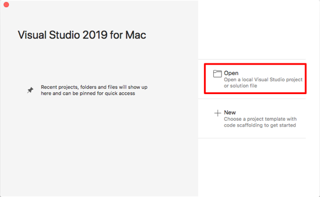
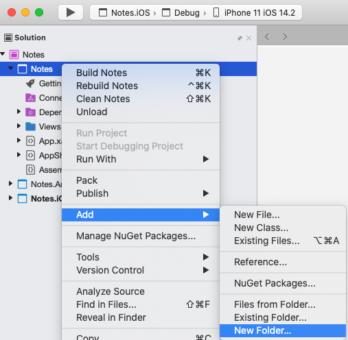
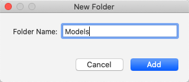
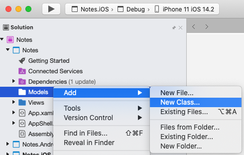
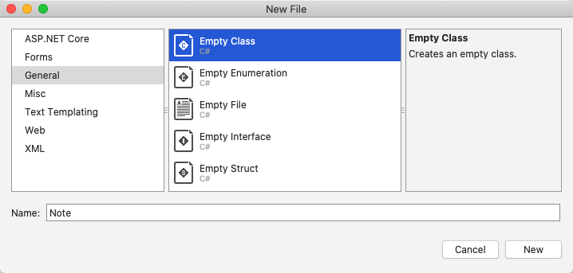
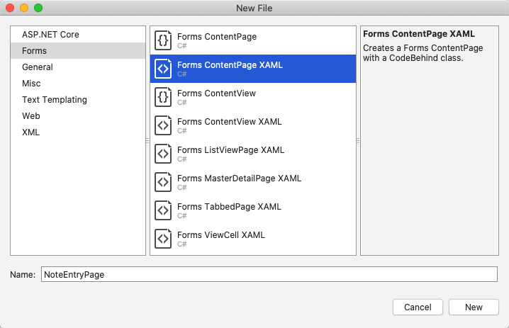

# Perform navigation in a Xamarin.Forms application

[ Download the sample](/samples/xamarin/xamarin-forms-samples/getstarted-notes-navigation/)

In this quickstart, you will learn how to:

- Add additional pages to a Xamarin.Forms Shell application.
- Perform navigation between pages.
- Use data binding to synchronize data between user interface elements and their data source.

The quickstart walks through how to turn a cross-platform Xamarin.Forms Shell application, capable of storing a single note, into an application capable of storing multiple notes. The final application is shown below:

[](navigation-images/screenshots1.png#lightbox "Notes Page")
[](navigation-images/screenshots2.png#lightbox "Note Entry Page")

### Prerequisites

You should successfully complete the [previous quickstart](app.md) before attempting this quickstart. Alternatively, download the [previous quickstart sample](/samples/xamarin/xamarin-forms-samples/getstarted-notes-app/) and use it as the starting point for this quickstart.

::: zone pivot="windows"

## Update the app with Visual Studio

1. Launch Visual Studio. In the start window, click the **Notes** solution in the recent projects/solutions list, or click **Open a project or solution**, and in the **Open Project/Solution** dialog select the solution file for the Notes project:

    

2. In **Solution Explorer**, right-click on the **Notes** project, and select **Add > New Folder**:

    

3. In **Solution Explorer**, name the new folder **Models**:

    

4. In **Solution Explorer**, select the **Models** folder, right-click, and select **Add > Class...**:

    

5. In the **Add New Item** dialog, select **Visual C# Items > Class**, name the new file **Note**, and click the **Add** button:

    

    This will add a class named **Note** to the **Models** folder of the **Notes** project.

6. In **Note.cs**, remove all of the template code and replace it with the following code:

    ```csharp
    using System;

    namespace Notes.Models
    {
        public class Note
        {
            public string Filename { get; set; }
            public string Text { get; set; }
            public DateTime Date { get; set; }
        }
    }
    ```

    This class defines a `Note` model that will store data about each note in the application.

    Save the changes to **Note.cs** by pressing **CTRL+S**.  

7. In **Solution Explorer**, in the **Notes** project, select the **Views** folder, right-click, and select **Add > New Item...**. In the **Add New Item** dialog, select **Visual C# Items > Xamarin.Forms > Content Page**, name the new file **NoteEntryPage**, and click the **Add** button:

    

    This will add a new page named **NoteEntryPage** to the **Views** folder of the project. This page will be used for note entry.

8. In **NoteEntryPage.xaml**, remove all of the template code and replace it with the following code:

      ```xaml
      <?xml version="1.0" encoding="UTF-8"?>
      <ContentPage xmlns="http://xamarin.com/schemas/2014/forms"
                   xmlns:x="http://schemas.microsoft.com/winfx/2009/xaml"
                   x:Class="Notes.Views.NoteEntryPage"
                   Title="Note Entry">
          <!-- Layout children vertically -->
          <StackLayout Margin="20">
              <Editor Placeholder="Enter your note"
                      Text="{Binding Text}"
                      HeightRequest="100" />
              <!-- Layout children in two columns -->
              <Grid ColumnDefinitions="*,*">
                  <Button Text="Save"
                          Clicked="OnSaveButtonClicked" />
                  <Button Grid.Column="1"
                          Text="Delete"
                          Clicked="OnDeleteButtonClicked"/>
              </Grid>
          </StackLayout>
      </ContentPage>
      ```

      This code declaratively defines the user interface for the page, which consists of an [`Editor`](xref:Xamarin.Forms.Editor) for text input, and two [`Button`](xref:Xamarin.Forms.Button) objects that direct the application to save or delete a file. The two `Button` instances are horizontally laid out in a [`Grid`](xref:Xamarin.Forms.Grid), with the `Editor` and `Grid` being vertically laid out in a [`StackLayout`](xref:Xamarin.Forms.StackLayout). In addition, the `Editor` uses data binding to bind to the `Text` property of the `Note` model. For more information about data binding, see [Data binding](deepdive.md#data-binding) in the [Xamarin.Forms Quickstart Deep Dive](deepdive.md).

      Save the changes to **NoteEntryPage.xaml** by pressing **CTRL+S**.

9. In **NoteEntryPage.xaml.cs**, remove all of the template code and replace it with the following code:

      ```csharp
      using System;
      using System.IO;
      using Notes.Models;
      using Xamarin.Forms;

      namespace Notes.Views
      {
          [QueryProperty(nameof(ItemId), nameof(ItemId))]
          public partial class NoteEntryPage : ContentPage
          {
              public string ItemId
              {
                  set
                  {
                      LoadNote(value);
                  }
              }

              public NoteEntryPage()
              {
                  InitializeComponent();

                  // Set the BindingContext of the page to a new Note.
                  BindingContext = new Note();
              }

              void LoadNote(string filename)
              {
                  try
                  {
                      // Retrieve the note and set it as the BindingContext of the page.
                      Note note = new Note
                      {
                          Filename = filename,
                          Text = File.ReadAllText(filename),
                          Date = File.GetCreationTime(filename)
                      };
                      BindingContext = note;
                  }
                  catch (Exception)
                  {
                      Console.WriteLine("Failed to load note.");
                  }
              }

              async void OnSaveButtonClicked(object sender, EventArgs e)
              {
                  var note = (Note)BindingContext;

                  if (string.IsNullOrWhiteSpace(note.Filename))
                  {
                      // Save the file.
                      var filename = Path.Combine(App.FolderPath, $"{Path.GetRandomFileName()}.notes.txt");
                      File.WriteAllText(filename, note.Text);
                  }
                  else
                  {
                      // Update the file.
                      File.WriteAllText(note.Filename, note.Text);
                  }

                  // Navigate backwards
                  await Shell.Current.GoToAsync("..");
              }

              async void OnDeleteButtonClicked(object sender, EventArgs e)
              {
                  var note = (Note)BindingContext;

                  // Delete the file.
                  if (File.Exists(note.Filename))
                  {
                      File.Delete(note.Filename);
                  }

                  // Navigate backwards
                  await Shell.Current.GoToAsync("..");
              }
          }
      }
      ```

      This code stores a `Note` instance, which represents a single note, in the [`BindingContext`](xref:Xamarin.Forms.BindableObject.BindingContext) of the page. The class is decorated with a `QueryPropertyAttribute` that enables data to be passed into the page, during navigation, via query parameters. The first argument for the `QueryPropertyAttribute` specifies the name of the property that will receive the data, with the second argument specifying the query parameter id. Therefore, the `QueryParameterAttribute` in the above code specifies that the `ItemId` property will receive the data passed in the `ItemId` query parameter from the URI specified in a `GoToAsync` method call. The `ItemId` property then calls the `LoadNote` method to create a `Note` object from the file on the device, and sets the `BindingContext` of the page to the `Note` object.

      When the **Save** [`Button`](xref:Xamarin.Forms.Button) is pressed the `OnSaveButtonClicked` event handler is executed, which either saves the content of the `Editor` to a new file with a randomly generated filename, or to an existing file if a note is being updated. In both cases, the file is stored in the local application data folder for the application. Then the method navigates back to the previous page. When the **Delete** `Button` is pressed the `OnDeleteButtonClicked` event handler is executed, which deletes the file, provided that it exists, and navigates back to the previous page. For more information about navigation, see [Navigation](deepdive.md#navigation) in the [Xamarin.Forms Shell Quickstart Deep Dive](deepdive.md).

      Save the changes to **NoteEntryPage.xaml.cs** by pressing **CTRL+S**.

      > [!WARNING]
      > The application will not currently build due to errors that will be fixed in subsequent steps.

10. In **Solution Explorer**, in the **Notes** project, open **NotesPage.xaml** in the **Views** folder.

11. In **NotesPage.xaml**, remove all of the template code and replace it with the following code:

    ```xaml
    <?xml version="1.0" encoding="UTF-8"?>
    <ContentPage xmlns="http://xamarin.com/schemas/2014/forms"
                 xmlns:x="http://schemas.microsoft.com/winfx/2009/xaml"
                 x:Class="Notes.Views.NotesPage"
                 Title="Notes">
        <!-- Add an item to the toolbar -->
        <ContentPage.ToolbarItems>
            <ToolbarItem Text="Add"
                         Clicked="OnAddClicked" />
        </ContentPage.ToolbarItems>

        <!-- Display notes in a list -->
        <CollectionView x:Name="collectionView"
                        Margin="20"
                        SelectionMode="Single"
                        SelectionChanged="OnSelectionChanged">
            <CollectionView.ItemsLayout>
                <LinearItemsLayout Orientation="Vertical"
                                   ItemSpacing="10" />
            </CollectionView.ItemsLayout>
            <!-- Define the appearance of each item in the list -->
            <CollectionView.ItemTemplate>
                <DataTemplate>
                    <StackLayout>
                        <Label Text="{Binding Text}"
                               FontSize="Medium"/>
                        <Label Text="{Binding Date}"
                               TextColor="Silver"
                               FontSize="Small" />
                    </StackLayout>
                </DataTemplate>
            </CollectionView.ItemTemplate>
        </CollectionView>
    </ContentPage>
    ```

    This code declaratively defines the user interface for the page, which consists of a [`CollectionView`](xref:Xamarin.Forms.CollectionView) and a [`ToolbarItem`](xref:Xamarin.Forms.ToolbarItem). The `CollectionView` uses data binding to display any notes that are retrieved by the application. Selecting a note will navigate to the `NoteEntryPage` where the note can be modified. Alternatively, a new note can be created by pressing the `ToolbarItem`. For more information about data binding, see [Data binding](deepdive.md#data-binding) in the [Xamarin.Forms Quickstart Deep Dive](deepdive.md).

    Save the changes to **NotesPage.xaml** by pressing **CTRL+S**.

12. In **Solution Explorer**, in the **Notes** project, expand **NotesPage.xaml** in the **Views** folder and open **NotesPage.xaml.cs**.

13. In **NotesPage.xaml.cs**, remove all of the template code and replace it with the following code:

    ```csharp
    using System;
    using System.Collections.Generic;
    using System.IO;
    using System.Linq;
    using Notes.Models;
    using Xamarin.Forms;

    namespace Notes.Views
    {
        public partial class NotesPage : ContentPage
        {
            public NotesPage()
            {
                InitializeComponent();
            }

            protected override void OnAppearing()
            {
                base.OnAppearing();

                var notes = new List<Note>();

                // Create a Note object from each file.
                var files = Directory.EnumerateFiles(App.FolderPath, "*.notes.txt");
                foreach (var filename in files)
                {
                    notes.Add(new Note
                    {
                        Filename = filename,
                        Text = File.ReadAllText(filename),
                        Date = File.GetCreationTime(filename)
                    });
                }

                // Set the data source for the CollectionView to a
                // sorted collection of notes.
                collectionView.ItemsSource = notes
                    .OrderBy(d => d.Date)
                    .ToList();
            }

            async void OnAddClicked(object sender, EventArgs e)
            {
                // Navigate to the NoteEntryPage, without passing any data.
                await Shell.Current.GoToAsync(nameof(NoteEntryPage));
            }

            async void OnSelectionChanged(object sender, SelectionChangedEventArgs e)
            {
                if (e.CurrentSelection != null)
                {
                    // Navigate to the NoteEntryPage, passing the filename as a query parameter.
                    Note note = (Note)e.CurrentSelection.FirstOrDefault();
                    await Shell.Current.GoToAsync($"{nameof(NoteEntryPage)}?{nameof(NoteEntryPage.ItemId)}={note.Filename}");
                }
            }
        }
    }
    ```

    This code defines the functionality for the `NotesPage`. When the page appears, the `OnAppearing` method is executed, which populates the [`CollectionView`](xref:Xamarin.Forms.CollectionView) with any notes that have been retrieved from the local application data folder. When the [`ToolbarItem`](xref:Xamarin.Forms.ToolbarItem) is pressed the `OnAddClicked` event handler is executed. This method navigates to the `NoteEntryPage`. When an item in the `CollectionView` is selected the `OnSelectionChanged` event handler is executed. This method navigates to the `NoteEntryPage`, provided that an item in the [`CollectionView`](xref:Xamarin.Forms.CollectionView) is selected, passing the `Filename` property of the selected `Note` as a query parameter to the page. For more information about navigation, see [Navigation](deepdive.md#navigation) in the [Xamarin.Forms Quickstart Deep Dive](deepdive.md).

    Save the changes to **NotesPage.xaml.cs** by pressing **CTRL+S**.

    > [!WARNING]
    > The application will not currently build due to errors that will be fixed in subsequent steps.

14. In **Solution Explorer**, in the **Notes** project, expand **AppShell.xaml** and open **AppShell.xaml.cs**. Then replace the existing code with the following code:

    ```csharp
    using Notes.Views;
    using Xamarin.Forms;

    namespace Notes
    {
        public partial class AppShell : Shell
        {
            public AppShell()
            {
                InitializeComponent();
                Routing.RegisterRoute(nameof(NoteEntryPage), typeof(NoteEntryPage));
            }
        }
    }
    ```

    This code registers a route for the `NoteEntryPage`, which isn't represented in the Shell visual hierarchy (**AppShell.xaml**). This page can then be navigated to using URI-based navigation, with the `GoToAsync` method.

    Save the changes to **AppShell.xaml.cs** by pressing **CTRL+S**.

15. In **Solution Explorer**, in the **Notes** project, expand **App.xaml** and open **App.xaml.cs**. Then replace the existing code with the following code:

    ```csharp
    using System;
    using System.IO;
    using Xamarin.Forms;

    namespace Notes
    {
        public partial class App : Application
        {
            public static string FolderPath { get; private set; }

            public App()
            {
                InitializeComponent();
                FolderPath = Path.Combine(Environment.GetFolderPath(Environment.SpecialFolder.LocalApplicationData));
                MainPage = new AppShell();
            }

            protected override void OnStart()
            {
            }

            protected override void OnSleep()
            {
            }

            protected override void OnResume()
            {
            }
        }
    }

    ```

    This code adds a namespace declaration for the `System.IO` namespace, and adds a declaration for a static `FolderPath` property of type `string`. The `FolderPath` property is used to store the path on the device where note data will be stored. In addition, the code initializes the `FolderPath` property in the `App` constructor, and initializes the [`MainPage`](xref:Xamarin.Forms.Application.MainPage) property to the subclassed `Shell` object.

    Save the changes to **App.xaml.cs** by pressing **CTRL+S**.

16. Build and run the project on each platform. For more information, see [Building the quickstart](app.md#building-the-quickstart).

    On the **NotesPage** press the **Add** button to navigate to the **NoteEntryPage** and enter a note. After saving the note the application will navigate back to the **NotesPage**.

    Enter several notes, of varying length, to observe the application behavior. Close the application and re-launch it to ensure that the notes you entered were saved to the device.

::: zone-end
::: zone pivot="macos"

## Update the app with Visual Studio for Mac

1. Launch Visual Studio for Mac. In the start window click **Open**, and in the dialog select the solution file for the Notes project:

    

2. In the **Solution Pad**, right-click on the **Notes** project, and select **Add > New Folder**:

    

3. In the **New Folder** dialog, name the new folder **Models**:

    

4. In the **Solution Pad**, select the **Models** folder, right-click, and select **Add > New Class...**:

    

5. In the **New File** dialog, select **General > Empty Class**, name the new file **Note**, and click the **New** button:

    

    This will add a class named **Note** to the **Models** folder of the **Notes** project.

6. In **Note.cs**, remove all of the template code and replace it with the following code:

    ```csharp
    using System;

    namespace Notes.Models
    {
        public class Note
        {
            public string Filename { get; set; }
            public string Text { get; set; }
            public DateTime Date { get; set; }
        }
    }
    ```

    This class defines a `Note` model that will store data about each note in the application.

    Save the changes to **Note.cs** by choosing **File > Save** (or by pressing **&#8984; + S**).

7. In the **Solution Pad**, select the **Notes** project, right-click, and select **Add > New File...**. In the **New File** dialog, select **Forms > Forms ContentPage XAML**, name the new file **NoteEntryPage**, and click the **New** button:

    

    This will add a new page named **NoteEntryPage** to the **Views** folder of the project. This page will be used for note entry.

8. In **NoteEntryPage.xaml**, remove all of the template code and replace it with the following code:

      ```xaml
      <?xml version="1.0" encoding="UTF-8"?>
      <ContentPage xmlns="http://xamarin.com/schemas/2014/forms"
                   xmlns:x="http://schemas.microsoft.com/winfx/2009/xaml"
                   x:Class="Notes.Views.NoteEntryPage"
                   Title="Note Entry">
          <!-- Layout children vertically -->
          <StackLayout Margin="20">
              <Editor Placeholder="Enter your note"
                      Text="{Binding Text}"
                      HeightRequest="100" />
              <!-- Layout children in two columns -->
              <Grid ColumnDefinitions="*,*">
                  <Button Text="Save"
                          Clicked="OnSaveButtonClicked" />
                  <Button Grid.Column="1"
                          Text="Delete"
                          Clicked="OnDeleteButtonClicked"/>
              </Grid>
          </StackLayout>
      </ContentPage>
      ```

      This code declaratively defines the user interface for the page, which consists of an [`Editor`](xref:Xamarin.Forms.Editor) for text input, and two [`Button`](xref:Xamarin.Forms.Button) objects that direct the application to save or delete a file. The two `Button` instances are horizontally laid out in a [`Grid`](xref:Xamarin.Forms.Grid), with the `Editor` and `Grid` being vertically laid out in a [`StackLayout`](xref:Xamarin.Forms.StackLayout). In addition, the `Editor` uses data binding to bind to the `Text` property of the `Note` model. For more information about data binding, see [Data binding](deepdive.md#data-binding) in the [Xamarin.Forms Quickstart Deep Dive](deepdive.md).

      Save the changes to **NoteEntryPage.xaml** by choosing **File > Save** (or by pressing **&#8984; + S**).

9. In **NoteEntryPage.xaml.cs**, remove all of the template code and replace it with the following code:

      ```csharp
      using System;
      using System.IO;
      using Notes.Models;
      using Xamarin.Forms;

      namespace Notes.Views
      {
          [QueryProperty(nameof(ItemId), nameof(ItemId))]
          public partial class NoteEntryPage : ContentPage
          {
              public string ItemId
              {
                  set
                  {
                      LoadNote(value);
                  }
              }

              public NoteEntryPage()
              {
                  InitializeComponent();

                  // Set the BindingContext of the page to a new Note.
                  BindingContext = new Note();
              }

              void LoadNote(string filename)
              {
                  try
                  {
                      // Retrieve the note and set it as the BindingContext of the page.
                      Note note = new Note
                      {
                          Filename = filename,
                          Text = File.ReadAllText(filename),
                          Date = File.GetCreationTime(filename)
                      };
                      BindingContext = note;
                  }
                  catch (Exception)
                  {
                      Console.WriteLine("Failed to load note.");
                  }
              }

              async void OnSaveButtonClicked(object sender, EventArgs e)
              {
                  var note = (Note)BindingContext;

                  if (string.IsNullOrWhiteSpace(note.Filename))
                  {
                      // Save the file.
                      var filename = Path.Combine(App.FolderPath, $"{Path.GetRandomFileName()}.notes.txt");
                      File.WriteAllText(filename, note.Text);
                  }
                  else
                  {
                      // Update the file.
                      File.WriteAllText(note.Filename, note.Text);
                  }

                  // Navigate backwards
                  await Shell.Current.GoToAsync("..");
              }

              async void OnDeleteButtonClicked(object sender, EventArgs e)
              {
                  var note = (Note)BindingContext;

                  // Delete the file.
                  if (File.Exists(note.Filename))
                  {
                      File.Delete(note.Filename);
                  }

                  // Navigate backwards
                  await Shell.Current.GoToAsync("..");
              }
          }
      }
      ```

      This code stores a `Note` instance, which represents a single note, in the [`BindingContext`](xref:Xamarin.Forms.BindableObject.BindingContext) of the page. The class is decorated with a `QueryPropertyAttribute` that enables data to be passed into the page, during navigation, via query parameters. The first argument for the `QueryPropertyAttribute` specifies the name of the property that will receive the data, with the second argument specifying the query parameter id. Therefore, the `QueryParameterAttribute` in the above code specifies that the `ItemId` property will receive the data passed in the `ItemId` query parameter from the URI specified in a `GoToAsync` method call. The `ItemId` property then calls the `LoadNote` method to create a `Note` object from the file on the device, and sets the `BindingContext` of the page to the `Note` object.

      When the **Save** [`Button`](xref:Xamarin.Forms.Button) is pressed the `OnSaveButtonClicked` event handler is executed, which either saves the content of the `Editor` to a new file with a randomly generated filename, or to an existing file if a note is being updated. In both cases, the file is stored in the local application data folder for the application. Then the method navigates back to the previous page. When the **Delete** `Button` is pressed the `OnDeleteButtonClicked` event handler is executed, which deletes the file, provided that it exists, and navigates back to the previous page. For more information about navigation, see [Navigation](deepdive.md#navigation) in the [Xamarin.Forms Shell Quickstart Deep Dive](deepdive.md).

      Save the changes to **NoteEntryPage.xaml.cs** by choosing **File > Save** (or by pressing **&#8984; + S**).

      > [!WARNING]
      > The application will not currently build due to errors that will be fixed in subsequent steps.

10. In the **Solution Pad**, in the **Notes** project, open **NotesPage.xaml** in the **Views** folder.

11. In **NotesPage.xaml**, remove all of the template code and replace it with the following code:

    ```xaml
    <?xml version="1.0" encoding="UTF-8"?>
    <ContentPage xmlns="http://xamarin.com/schemas/2014/forms"
                 xmlns:x="http://schemas.microsoft.com/winfx/2009/xaml"
                 x:Class="Notes.Views.NotesPage"
                 Title="Notes">
        <!-- Add an item to the toolbar -->
        <ContentPage.ToolbarItems>
            <ToolbarItem Text="Add"
                         Clicked="OnAddClicked" />
        </ContentPage.ToolbarItems>

        <!-- Display notes in a list -->
        <CollectionView x:Name="collectionView"
                        Margin="20"
                        SelectionMode="Single"
                        SelectionChanged="OnSelectionChanged">
            <CollectionView.ItemsLayout>
                <LinearItemsLayout Orientation="Vertical"
                                   ItemSpacing="10" />
            </CollectionView.ItemsLayout>
            <!-- Define the appearance of each item in the list -->
            <CollectionView.ItemTemplate>
                <DataTemplate>
                    <StackLayout>
                        <Label Text="{Binding Text}"
                               FontSize="Medium"/>
                        <Label Text="{Binding Date}"
                               TextColor="Silver"
                               FontSize="Small" />
                    </StackLayout>
                </DataTemplate>
            </CollectionView.ItemTemplate>
        </CollectionView>
    </ContentPage>
    ```

    This code declaratively defines the user interface for the page, which consists of a [`CollectionView`](xref:Xamarin.Forms.CollectionView) and a [`ToolbarItem`](xref:Xamarin.Forms.ToolbarItem). The `CollectionView` uses data binding to display any notes that are retrieved by the application. Selecting a note will navigate to the `NoteEntryPage` where the note can be modified. Alternatively, a new note can be created by pressing the `ToolbarItem`. For more information about data binding, see [Data binding](deepdive.md#data-binding) in the [Xamarin.Forms Quickstart Deep Dive](deepdive.md).

    Save the changes to **NotesPage.xaml** by choosing **File > Save** (or by pressing **&#8984; + S**).

12. In the **Solution Pad**, in the **Notes** project, expand **NotesPage.xaml** in the **Views** folder and open **NotesPage.xaml.cs**.

13. In **NotesPage.xaml.cs**, remove all of the template code and replace it with the following code:

    ```csharp
    using System;
    using System.Collections.Generic;
    using System.IO;
    using System.Linq;
    using Notes.Models;
    using Xamarin.Forms;

    namespace Notes.Views
    {
        public partial class NotesPage : ContentPage
        {
            public NotesPage()
            {
                InitializeComponent();
            }

            protected override void OnAppearing()
            {
                base.OnAppearing();

                var notes = new List<Note>();

                // Create a Note object from each file.
                var files = Directory.EnumerateFiles(App.FolderPath, "*.notes.txt");
                foreach (var filename in files)
                {
                    notes.Add(new Note
                    {
                        Filename = filename,
                        Text = File.ReadAllText(filename),
                        Date = File.GetCreationTime(filename)
                    });
                }

                // Set the data source for the CollectionView to a
                // sorted collection of notes.
                collectionView.ItemsSource = notes
                    .OrderBy(d => d.Date)
                    .ToList();
            }

            async void OnAddClicked(object sender, EventArgs e)
            {
                // Navigate to the NoteEntryPage, without passing any data.
                await Shell.Current.GoToAsync(nameof(NoteEntryPage));
            }

            async void OnSelectionChanged(object sender, SelectionChangedEventArgs e)
            {
                if (e.CurrentSelection != null)
                {
                    // Navigate to the NoteEntryPage, passing the filename as a query parameter.
                    Note note = (Note)e.CurrentSelection.FirstOrDefault();
                    await Shell.Current.GoToAsync($"{nameof(NoteEntryPage)}?{nameof(NoteEntryPage.ItemId)}={note.Filename}");
                }
            }
        }
    }
    ```

    This code defines the functionality for the `NotesPage`. When the page appears, the `OnAppearing` method is executed, which populates the [`CollectionView`](xref:Xamarin.Forms.CollectionView) with any notes that have been retrieved from the local application data folder. When the [`ToolbarItem`](xref:Xamarin.Forms.ToolbarItem) is pressed the `OnAddClicked` event handler is executed. This method navigates to the `NoteEntryPage`. When an item in the `CollectionView` is selected the `OnSelectionChanged` event handler is executed. This method navigates to the `NoteEntryPage`, provided that an item in the [`CollectionView`](xref:Xamarin.Forms.CollectionView) is selected, passing the `Filename` property of the selected `Note` as a query parameter to the page. For more information about navigation, see [Navigation](deepdive.md#navigation) in the [Xamarin.Forms Quickstart Deep Dive](deepdive.md).

    Save the changes to **NotesPage.xaml.cs** by choosing **File > Save** (or by pressing **&#8984; + S**).

    > [!WARNING]
    > The application will not currently build due to errors that will be fixed in subsequent steps.

14. In the **Solution Pad**, in the **Notes** project, expand **AppShell.xaml** and open **AppShell.xaml.cs**. Then replace the existing code with the following code:

    ```csharp
    using Notes.Views;
    using Xamarin.Forms;

    namespace Notes
    {
        public partial class AppShell : Shell
        {
            public AppShell()
            {
                InitializeComponent();
                Routing.RegisterRoute(nameof(NoteEntryPage), typeof(NoteEntryPage));
            }
        }
    }
    ```

    This code registers a route for the `NoteEntryPage`, which isn't represented in the Shell visual hierarchy. This page can then be navigated to using URI-based navigation, with the `GoToAsync` method.

    Save the changes to **AppShell.xaml.cs** by choosing **File > Save** (or by pressing **&#8984; + S**).

15. In the **Solution Pad**, in the **Notes** project, expand **App.xaml** and open **App.xaml.cs**. Then replace the existing code with the following code:

    ```csharp
    using System;
    using System.IO;
    using Xamarin.Forms;

    namespace Notes
    {
        public partial class App : Application
        {
            public static string FolderPath { get; private set; }

            public App()
            {
                InitializeComponent();
                FolderPath = Path.Combine(Environment.GetFolderPath(Environment.SpecialFolder.LocalApplicationData));
                MainPage = new AppShell();
            }

            protected override void OnStart()
            {
            }

            protected override void OnSleep()
            {
            }

            protected override void OnResume()
            {
            }
        }
    }

    ```

    This code adds a namespace declaration for the `System.IO` namespace, and adds a declaration for a static `FolderPath` property of type `string`. The `FolderPath` property is used to store the path on the device where note data will be stored. In addition, the code initializes the `FolderPath` property in the `App` constructor, and initializes the [`MainPage`](xref:Xamarin.Forms.Application.MainPage) property to the subclassed `Shell` object.

    Save the changes to **App.xaml.cs** by choosing **File > Save** (or by pressing **&#8984; + S**).

16. Build and run the project on each platform. For more information, see [Building the quickstart](app.md#building-the-quickstart).

    On the **NotesPage** press the **Add** button to navigate to the **NoteEntryPage** and enter a note. After saving the note the application will navigate back to the **NotesPage**.

    Enter several notes, of varying length, to observe the application behavior. Close the application and re-launch it to ensure that the notes you entered were saved to the device.

::: zone-end

## Next steps

In this quickstart, you learned how to:

- Add additional pages to a Xamarin.Forms Shell application.
- Perform navigation between pages.
- Use data binding to synchronize data between user interface elements and their data source.

Continue to the next quickstart to modify the application so that it stores its data in a local SQLite.NET database.

> [!div class="nextstepaction"]
> [Next](database.md)

## Related links

- [Notes (sample)](/samples/xamarin/xamarin-forms-samples/getstarted-notes-navigation/)
- [Xamarin.Forms Shell quickstart deep dive](deepdive.md)
