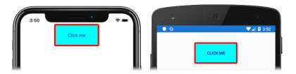

# [Visual Studio](#tab/vswin)

1. In **MainPage.xaml**, modify the [`Button`](xref:Xamarin.Forms.Button) declaration to change its visual appearance:

    ```xaml
    <Button Text="Click me"
            Clicked="OnButtonClicked"
            TextColor="Blue"
            BackgroundColor="Aqua"
            BorderColor="Red"
            BorderWidth="5"
            CornerRadius="5"
            WidthRequest="150"
            HeightRequest="75" />
    ```

    This code sets properties that change the visual appearance of the [`Button`](xref:Xamarin.Forms.Button). The [`TextColor`](xref:Xamarin.Forms.Button.TextColor) property sets the color of the `Button` text, and the [`BackgroundColor`](xref:Xamarin.Forms.VisualElement.BackgroundColor) property sets the color of the background to the text. The [`BorderColor`](xref:Xamarin.Forms.Button.BorderColor) property sets the color of an area surrounding the `Button`, and the [`BorderWidth`](xref:Xamarin.Forms.Button.BorderWidth) property sets the width of the border. By default, the `Button` is rectangular, but it can be given rounded corners by setting the [`CornerRadius`](xref:Xamarin.Forms.Button.CornerRadius) property to a suitable value. In addition, the size of the `Button` is changed by setting its [`WidthRequest`](xref:Xamarin.Forms.VisualElement.WidthRequest) and [`HeightRequest`](xref:Xamarin.Forms.VisualElement.HeightRequest) properties.

1. If the application is still running, save the changes to the file and the application user interface will automatically be updated in your simulator or emulator. Otherwise, in the Visual Studio toolbar, press the **Start** button (the triangular button that resembles a Play button) to launch the application inside your chosen remote iOS simulator or Android emulator. Observe that the [`Button`](xref:Xamarin.Forms.Button) appearance has changed:

    [](../images/change-button-appearance-large.png#lightbox "Button with changed appearance")

    In Visual Studio, stop the application.

    For more information about setting [`Button`](xref:Xamarin.Forms.Button) appearance, see [Button appearance](~/xamarin-forms/user-interface/button.md#button-appearance) in the [Xamarin.Forms Button](~/xamarin-forms/user-interface/button.md) guide.

# [Visual Studio for Mac](#tab/vsmac)

1. In **MainPage.xaml**, modify the [`Button`](xref:Xamarin.Forms.Button) declaration to change its visual appearance:

    ```xaml
    <Button Text="Click me"
            Clicked="OnButtonClicked"
            TextColor="Blue"
            BackgroundColor="Aqua"
            BorderColor="Red"
            BorderWidth="5"
            CornerRadius="5"
            WidthRequest="150"
            HeightRequest="75" />
    ```

    This code sets properties that change the visual appearance of the [`Button`](xref:Xamarin.Forms.Button). The [`TextColor`](xref:Xamarin.Forms.Button.TextColor) property sets the color of the `Button` text, and the [`BackgroundColor`](xref:Xamarin.Forms.VisualElement.BackgroundColor) property sets the color of the background to the text. The [`BorderColor`](xref:Xamarin.Forms.Button.BorderColor) property sets the color of an area surrounding the `Button`, and the [`BorderWidth`](xref:Xamarin.Forms.Button.BorderWidth) property sets the width of the border. By default, the `Button` is rectangular, but it can be given rounded corners by setting the [`CornerRadius`](xref:Xamarin.Forms.Button.CornerRadius) property to a suitable value. In addition, the size of the `Button` is changed by setting its [`WidthRequest`](xref:Xamarin.Forms.VisualElement.WidthRequest) and [`HeightRequest`](xref:Xamarin.Forms.VisualElement.HeightRequest) properties.

1. If the application is still running, save the changes to the file and the application user interface will automatically be updated in your simulator or emulator. Otherwise, in the Visual Studio for Mac toolbar, press the **Start** button (the triangular button that resembles a Play button) to launch the application inside your chosen iOS simulator or Android emulator. Observe that the [`Button`](xref:Xamarin.Forms.Button) appearance has changed:

    [](../images/change-button-appearance-large.png#lightbox "Button with changed appearance")

    In Visual Studio for Mac, stop the application.

    For more information about setting [`Button`](xref:Xamarin.Forms.Button) appearance, see [Button appearance](~/xamarin-forms/user-interface/button.md#button-appearance) in the [Xamarin.Forms Button](~/xamarin-forms/user-interface/button.md) guide.
