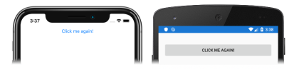

# [Visual Studio](#tab/vswin)

1. In **MainPage.xaml**, modify the [`Button`](xref:Xamarin.Forms.Button) declaration so that it sets a handler for the [`Clicked`](xref:Xamarin.Forms.Button.Clicked) event:

    ```xaml
    <Button Text="Click me"
            Clicked="OnButtonClicked" />
    ```

    This code sets the [`Clicked`](xref:Xamarin.Forms.Button.Clicked) event to an event handler named `OnButtonClicked` that will be created in the next step.

1. In **Solution Explorer**, in the **ButtonTutorial** project, expand **MainPage.xaml** and double-click **MainPage.xaml.cs** to open it. Then, in **MainPage.xaml.cs**, add the `OnButtonClicked` event handler to the class:

    ```csharp
    void OnButtonClicked(object sender, EventArgs e)
    {
        (sender as Button).Text = "Click me again!";
    }
    ```

    When the [`Button`](xref:Xamarin.Forms.Button) is tapped, the `OnButtonClicked` method executes. The `sender` argument is the `Button` object responsible for firing the `Clicked` event, and can be used to access the `Button` object. This event handler updates the text displayed by the `Button`.

    > [!NOTE]
    > Besides the `Clicked` event, `Button` also defines [`Pressed`](xref:Xamarin.Forms.Button.Pressed) and [`Released`](xref:Xamarin.Forms.Button.Released) events. For more information, see [Pressing and releasing the button](~/xamarin-forms/user-interface/button.md#pressing-and-releasing-the-button) in the [Xamarin.Forms Button](~/xamarin-forms/user-interface/button.md) guide.

1. In the Visual Studio toolbar, press the **Start** button (the triangular button that resembles a Play button) to launch the application inside your chosen remote iOS simulator or Android emulator. Click the [`Button`](xref:Xamarin.Forms.Button) and observe that the text it displays changes:

    [](../images/handle-button-click-large.png#lightbox "Handle a button click")

    For more information about handling button clicks, see [Handling button clicks](~/xamarin-forms/user-interface/button.md#handling-button-clicks) in the [Xamarin.Forms Button](~/xamarin-forms/user-interface/button.md) guide.

# [Visual Studio for Mac](#tab/vsmac)

1. In **MainPage.xaml**, modify the [`Button`](xref:Xamarin.Forms.Button) declaration so that it sets a handler for the [`Clicked`](xref:Xamarin.Forms.Button.Clicked) event:

    ```xaml
    <Button Text="Click me"
            Clicked="OnButtonClicked" />
    ```

    This code sets the [`Clicked`](xref:Xamarin.Forms.Button.Clicked) event to an event handler named `OnButtonClicked` that will be created in the next step.

1. In **Solution Pad**, in the **ButtonTutorial** project, expand **MainPage.xaml** and double-click **MainPage.xaml.cs** to open it. Then, in **MainPage.xaml.cs**, add the `OnButtonClicked` event handler to the class:

    ```csharp
    void OnButtonClicked(object sender, EventArgs e)
    {
        (sender as Button).Text = "Click me again!";
    }
    ```

    When the [`Button`](xref:Xamarin.Forms.Button) is tapped, the `OnButtonClicked` method executes. The `sender` argument is the `Button` object responsible for firing the `Clicked` event, and can be used to access the `Button` object. This event handler updates the text displayed by the `Button`.

    > [!NOTE]
    > Besides the `Clicked` event, `Button` also defines [`Pressed`](xref:Xamarin.Forms.Button.Pressed) and [`Released`](xref:Xamarin.Forms.Button.Released) events. For more information, see [Pressing and releasing the button](~/xamarin-forms/user-interface/button.md#pressing-and-releasing-the-button) in the [Xamarin.Forms Button](~/xamarin-forms/user-interface/button.md) guide.

1. In the Visual Studio for Mac toolbar, press the **Start** button (the triangular button that resembles a Play button) to launch the application inside your chosen iOS simulator or Android emulator. Click the [`Button`](xref:Xamarin.Forms.Button) and observe that the text it displays changes:

    [](../images/handle-button-click-large.png#lightbox "Handle a button click")

    For more information about handling button clicks, see [Handling button clicks](~/xamarin-forms/user-interface/button.md#handling-button-clicks) in the [Xamarin.Forms Button](~/xamarin-forms/user-interface/button.md) guide.
