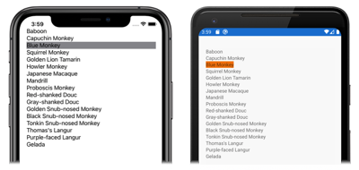

# [Visual Studio](#tab/vswin)

1. In **MainPage.xaml**, modify the [`CollectionView`](xref:Xamarin.Forms.CollectionView) declaration so that it sets the [`SelectionMode`](xref:Xamarin.Forms.SelectableItemsView.SelectionMode) property to `Single`, and sets a handler for the [`SelectionChanged`](xref:Xamarin.Forms.SelectableItemsView.SelectionChanged) event:

    ```xaml
    <CollectionView ItemsSource="{Binding Monkeys}"
                    SelectionMode="Single"
                    SelectionChanged="OnSelectionChanged" />
    ```

    This code sets enables single item selection in the [`CollectionView`](xref:Xamarin.Forms.CollectionView), and sets the [`SelectionChanged`](xref:Xamarin.Forms.SelectableItemsView.SelectionChanged) event to an event handler named `OnSelectionChanged`. The event handler will be created in the next step.

1. In **Solution Explorer**, in the **CollectionViewTutorial** project, expand **MainPage.xaml** and double-click **MainPage.xaml.cs** to open it. Then, in **MainPage.xaml.cs**, add the `OnSelectionChanged` event handler to the class:

    ```csharp
    void OnSelectionChanged(object sender, SelectionChangedEventArgs e)
    {
        Monkey selectedItem = e.CurrentSelection[0] as Monkey;
    }
    ```

    When an item in the [`CollectionView`](xref:Xamarin.Forms.CollectionView) is selected, the [`SelectionChanged`](xref:Xamarin.Forms.SelectableItemsView.SelectionChanged) event is fired, which executes the `OnSelectionChanged` method. The `sender` argument to the method is the `CollectionView` object responsible for firing the event, which can be used to access the `CollectionView` object. The [`SelectionChangedEventArgs`](xref:Xamarin.Forms.SelectionChangedEventArgs) argument to the `OnSelectionChanged` method provides the selected item.

1. In the Visual Studio toolbar, press the **Start** button (the triangular button that resembles a Play button) to launch the application inside your chosen remote iOS simulator or Android emulator:

    [](../images/item-selection-large.png#lightbox "CollectionView item selection")

    Set a breakpoint in the `OnSelectionChanged` event handler and select an item in the [`CollectionView`](xref:Xamarin.Forms.CollectionView). Examine the value of the `selectedItem` variable, to ensure it contains the data for your selected item.

    In Visual Studio, stop the application.

    For more information about item selection, see [Xamarin.Forms CollectionView selection](~/xamarin-forms/user-interface/collectionview/selection.md).

# [Visual Studio for Mac](#tab/vsmac)

1. In **MainPage.xaml**, modify the [`CollectionView`](xref:Xamarin.Forms.CollectionView) declaration so that it sets the [`SelectionMode`](xref:Xamarin.Forms.SelectableItemsView.SelectionMode) property to `Single`, and sets a handler for the [`SelectionChanged`](xref:Xamarin.Forms.SelectableItemsView.SelectionChanged) event:

    ```xaml
    <CollectionView ItemsSource="{Binding Monkeys}"
                    SelectionMode="Single"
                    SelectionChanged="OnSelectionChanged" />
    ```

    This code sets enables single item selection in the [`CollectionView`](xref:Xamarin.Forms.CollectionView), and sets the [`SelectionChanged`](xref:Xamarin.Forms.SelectableItemsView.SelectionChanged) event to an event handler named `OnSelectionChanged`. The event handler will be created in the next step.

1. In **Solution Pad**, in the **CollectionViewTutorial** project, expand **MainPage.xaml** and double-click **MainPage.xaml.cs** to open it. Then, in **MainPage.xaml.cs**, add the `OnSelectionChanged` event handler to the class:

    ```csharp
    void OnSelectionChanged(object sender, SelectionChangedEventArgs e)
    {
        Monkey selectedItem = e.CurrentSelection[0] as Monkey;
    }
    ```

    When an item in the [`CollectionView`](xref:Xamarin.Forms.CollectionView) is selected, the [`SelectionChanged`](xref:Xamarin.Forms.SelectableItemsView.SelectionChanged) event is fired, which executes the `OnSelectionChanged` method. The `sender` argument to the method is the `CollectionView` object responsible for firing the event, which can be used to access the `CollectionView` object. The [`SelectionChangedEventArgs`](xref:Xamarin.Forms.SelectionChangedEventArgs) argument to the `OnSelectionChanged` method provides the selected item.

1. In the Visual Studio for Mac toolbar, press the **Start** button (the triangular button that resembles a Play button) to launch the application inside your chosen iOS simulator or Android emulator:

    [](../images/item-selection-large.png#lightbox "CollectionView item selection")

    Set a breakpoint in the `OnSelectionChanged` event handler and select an item in the [`CollectionView`](xref:Xamarin.Forms.CollectionView). Examine the value of the `selectedItem` variable, to ensure it contains the data for your selected item.

    In Visual Studio for Mac, stop the application.

    For more information about item selection, see [Xamarin.Forms CollectionView selection](~/xamarin-forms/user-interface/collectionview/selection.md).
