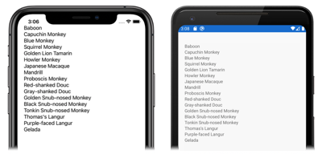

A [`CollectionView`](xref:Xamarin.Forms.CollectionView) is populated with data using the [`ItemsSource`](xref:Xamarin.Forms.ItemsView`1.ItemsSource) property, which is of type `IEnumerable`. The previous step populated the `CollectionView` in XAML with an array of strings. However, typically a `CollectionView` will be populated with data from a collection, defined in code, that implements `IEnumerable`.

In this exercise, you will modify the **CollectionViewTutorial** project to populate the [`CollectionView`](xref:Xamarin.Forms.CollectionView) with data from a collection of objects stored in a `List`.

# [Visual Studio](#tab/vswin)

1. In **Solution Explorer**, in the **CollectionViewTutorial** project, add a class named `Monkey` that contains the following code:

    ```csharp
    public class Monkey
    {
        public string Name { get; set; }
        public string Location { get; set; }
        public string ImageUrl { get; set; }

        public override string ToString()
        {
            return Name;
        }        
    }
    ```

    This code defines a `Monkey` object that stores a name, location, and url of an image that represents the monkey. In addition, the class overrides the `ToString` method to return the `Name` property.

1. In **Solution Explorer**, in the **CollectionViewTutorial** project, expand **MainPage.xaml** and double-click **MainPage.xaml.cs** to open it. Then, in **MainPage.xaml.cs**, remove all of the template code and replace it with the following code:

    ```csharp
    using System.Collections.Generic;
    using Xamarin.Forms;

    namespace CollectionViewTutorial
    {
        public partial class MainPage : ContentPage
        {
            public IList<Monkey> Monkeys { get; private set; }

            public MainPage()
            {
                InitializeComponent();

                Monkeys = new List<Monkey>();
                Monkeys.Add(new Monkey
                {
                    Name = "Baboon",
                    Location = "Africa & Asia",
                    ImageUrl = "https://upload.wikimedia.org/wikipedia/commons/thumb/f/fc/Papio_anubis_%28Serengeti%2C_2009%29.jpg/200px-Papio_anubis_%28Serengeti%2C_2009%29.jpg"
                });

                Monkeys.Add(new Monkey
                {
                    Name = "Capuchin Monkey",
                    Location = "Central & South America",
                    ImageUrl = "https://upload.wikimedia.org/wikipedia/commons/thumb/4/40/Capuchin_Costa_Rica.jpg/200px-Capuchin_Costa_Rica.jpg"
                });

                Monkeys.Add(new Monkey
                {
                    Name = "Blue Monkey",
                    Location = "Central and East Africa",
                    ImageUrl = "https://upload.wikimedia.org/wikipedia/commons/thumb/8/83/BlueMonkey.jpg/220px-BlueMonkey.jpg"
                });

                Monkeys.Add(new Monkey
                {
                    Name = "Squirrel Monkey",
                    Location = "Central & South America",
                    ImageUrl = "https://upload.wikimedia.org/wikipedia/commons/thumb/2/20/Saimiri_sciureus-1_Luc_Viatour.jpg/220px-Saimiri_sciureus-1_Luc_Viatour.jpg"
                });

                Monkeys.Add(new Monkey
                {
                    Name = "Golden Lion Tamarin",
                    Location = "Brazil",
                    ImageUrl = "https://upload.wikimedia.org/wikipedia/commons/thumb/8/87/Golden_lion_tamarin_portrait3.jpg/220px-Golden_lion_tamarin_portrait3.jpg"
                });

                Monkeys.Add(new Monkey
                {
                    Name = "Howler Monkey",
                    Location = "South America",
                    ImageUrl = "https://upload.wikimedia.org/wikipedia/commons/thumb/0/0d/Alouatta_guariba.jpg/200px-Alouatta_guariba.jpg"
                });

                Monkeys.Add(new Monkey
                {
                    Name = "Japanese Macaque",
                    Location = "Japan",
                    ImageUrl = "https://upload.wikimedia.org/wikipedia/commons/thumb/c/c1/Macaca_fuscata_fuscata1.jpg/220px-Macaca_fuscata_fuscata1.jpg"
                });

                Monkeys.Add(new Monkey
                {
                    Name = "Mandrill",
                    Location = "Southern Cameroon, Gabon, Equatorial Guinea, and Congo",
                    ImageUrl = "https://upload.wikimedia.org/wikipedia/commons/thumb/7/75/Mandrill_at_san_francisco_zoo.jpg/220px-Mandrill_at_san_francisco_zoo.jpg"
                });

                Monkeys.Add(new Monkey
                {
                    Name = "Proboscis Monkey",
                    Location = "Borneo",
                    ImageUrl = "https://upload.wikimedia.org/wikipedia/commons/thumb/e/e5/Proboscis_Monkey_in_Borneo.jpg/250px-Proboscis_Monkey_in_Borneo.jpg"
                });

                Monkeys.Add(new Monkey
                {
                    Name = "Red-shanked Douc",
                    Location = "Vietnam, Laos",
                    ImageUrl = "https://upload.wikimedia.org/wikipedia/commons/thumb/9/9f/Portrait_of_a_Douc.jpg/159px-Portrait_of_a_Douc.jpg"
                });

                Monkeys.Add(new Monkey
                {
                    Name = "Gray-shanked Douc",
                    Location = "Vietnam",
                    ImageUrl = "https://upload.wikimedia.org/wikipedia/commons/thumb/0/0b/Cuc.Phuong.Primate.Rehab.center.jpg/320px-Cuc.Phuong.Primate.Rehab.center.jpg"
                });

                Monkeys.Add(new Monkey
                {
                    Name = "Golden Snub-nosed Monkey",
                    Location = "China",
                    ImageUrl = "https://upload.wikimedia.org/wikipedia/commons/thumb/c/c8/Golden_Snub-nosed_Monkeys%2C_Qinling_Mountains_-_China.jpg/165px-Golden_Snub-nosed_Monkeys%2C_Qinling_Mountains_-_China.jpg"
                });

                Monkeys.Add(new Monkey
                {
                    Name = "Black Snub-nosed Monkey",
                    Location = "China",
                    ImageUrl = "https://upload.wikimedia.org/wikipedia/commons/thumb/5/59/RhinopitecusBieti.jpg/320px-RhinopitecusBieti.jpg"
                });

                Monkeys.Add(new Monkey
                {
                    Name = "Tonkin Snub-nosed Monkey",
                    Location = "Vietnam",
                    ImageUrl = "https://upload.wikimedia.org/wikipedia/commons/thumb/9/9c/Tonkin_snub-nosed_monkeys_%28Rhinopithecus_avunculus%29.jpg/320px-Tonkin_snub-nosed_monkeys_%28Rhinopithecus_avunculus%29.jpg"
                });

                Monkeys.Add(new Monkey
                {
                    Name = "Thomas's Langur",
                    Location = "Indonesia",
                    ImageUrl = "https://upload.wikimedia.org/wikipedia/commons/thumb/3/31/Thomas%27s_langur_Presbytis_thomasi.jpg/142px-Thomas%27s_langur_Presbytis_thomasi.jpg"
                });

                Monkeys.Add(new Monkey
                {
                    Name = "Purple-faced Langur",
                    Location = "Sri Lanka",
                    ImageUrl = "https://upload.wikimedia.org/wikipedia/commons/thumb/0/02/Semnopithèque_blanchâtre_mâle.JPG/192px-Semnopithèque_blanchâtre_mâle.JPG"
                });

                Monkeys.Add(new Monkey
                {
                    Name = "Gelada",
                    Location = "Ethiopia",
                    ImageUrl = "https://upload.wikimedia.org/wikipedia/commons/thumb/1/13/Gelada-Pavian.jpg/320px-Gelada-Pavian.jpg"
                });

                BindingContext = this;
            }
        }
    }
    ```

    This code defines a `Monkeys` property of type `IList<Monkey>` and initializes it to an empty list in the class constructor. `Monkey` objects are then added to the `Monkeys` collection, and the [`BindingContext`](xref:Xamarin.Forms.BindableObject.BindingContext) of the page is set to the `MainPage` object. For more information about the `BindingContext` property, see [Bindings with a Binding Context](~/xamarin-forms/app-fundamentals/data-binding/basic-bindings.md#bindings-with-a-binding-context) in the [Xamarin.Forms Data Binding](~/xamarin-forms/app-fundamentals/data-binding/index.md) guide.

    > [!IMPORTANT]
    > The [`BindingContext`](xref:Xamarin.Forms.BindableObject.BindingContext) property is inherited through the visual tree. Therefore, because it's been set on the [`ContentPage`](xref:Xamarin.Forms.ContentPage) object, child objects of the `ContentPage` inherit its value, including the [`CollectionView`](xref:Xamarin.Forms.CollectionView).

1. In **MainPage.xaml**, modify the [`CollectionView`](xref:Xamarin.Forms.CollectionView) declaration to set the [`ItemsSource`](xref:Xamarin.Forms.ItemsView`1.ItemsSource) property to the `Monkeys` collection:

    ```xaml
    <CollectionView ItemsSource="{Binding Monkeys}" />
    ```

    This code data binds the [`ItemsSource`](xref:Xamarin.Forms.ItemsView`1.ItemsSource) property to the `Monkeys` collection. At runtime, the [`CollectionView`](xref:Xamarin.Forms.CollectionView) will look at its [`BindingContext`](xref:Xamarin.Forms.BindableObject.BindingContext) for the `Monkeys` collection, and it will be populated with data from this collection. For more information about data binding, see [Xamarin.Forms Data Binding](~/xamarin-forms/app-fundamentals/data-binding/index.md).

1. In the Visual Studio toolbar, press the **Start** button (the triangular button that resembles a Play button) to launch the application inside your chosen remote OS simulator or Android emulator:

    [](../images/populate-data-large.png#lightbox "CollectionView displaying data from a collection")

    The [`CollectionView`](xref:Xamarin.Forms.CollectionView) is displaying the `Name` property for each `Monkey` in the `Monkeys` collection. This is because, by default, the `CollectionView` calls the `ToString` method when displaying the objects from a collection (which has been overridden in the `Monkey` class to return the `Name` property value).

    In Visual Studio, stop the application.

# [Visual Studio for Mac](#tab/vsmac)

1. In **Solution Pad**, in the **CollectionViewTutorial** project, add a class named `Monkey` that contains the following code:

    ```csharp
    public class Monkey
    {
        public string Name { get; set; }
        public string Location { get; set; }
        public string ImageUrl { get; set; }

        public override string ToString()
        {
            return Name;
        }
    }
    ```

    This code defines a `Monkey` object that stores a name, location, and url of an image that represents the monkey. In addition, the class overrides the `ToString` method to return the `Name` property.

1. In **Solution Pad**, in the **CollectionViewTutorial** project, expand **MainPage.xaml** and double-click **MainPage.xaml.cs** to open it. Then, in **MainPage.xaml.cs**, remove all of the template code and replace it with the following code:

    ```csharp
    using System.Collections.Generic;
    using Xamarin.Forms;

    namespace CollectionViewTutorial
    {
        public partial class MainPage : ContentPage
        {
            public IList<Monkey> Monkeys { get; private set; }

            public MainPage()
            {
                InitializeComponent();

                Monkeys = new List<Monkey>();
                Monkeys.Add(new Monkey
                {
                    Name = "Baboon",
                    Location = "Africa & Asia",
                    ImageUrl = "https://upload.wikimedia.org/wikipedia/commons/thumb/f/fc/Papio_anubis_%28Serengeti%2C_2009%29.jpg/200px-Papio_anubis_%28Serengeti%2C_2009%29.jpg"
                });

                Monkeys.Add(new Monkey
                {
                    Name = "Capuchin Monkey",
                    Location = "Central & South America",
                    ImageUrl = "https://upload.wikimedia.org/wikipedia/commons/thumb/4/40/Capuchin_Costa_Rica.jpg/200px-Capuchin_Costa_Rica.jpg"
                });

                Monkeys.Add(new Monkey
                {
                    Name = "Blue Monkey",
                    Location = "Central and East Africa",
                    ImageUrl = "https://upload.wikimedia.org/wikipedia/commons/thumb/8/83/BlueMonkey.jpg/220px-BlueMonkey.jpg"
                });

                Monkeys.Add(new Monkey
                {
                    Name = "Squirrel Monkey",
                    Location = "Central & South America",
                    ImageUrl = "https://upload.wikimedia.org/wikipedia/commons/thumb/2/20/Saimiri_sciureus-1_Luc_Viatour.jpg/220px-Saimiri_sciureus-1_Luc_Viatour.jpg"
                });

                Monkeys.Add(new Monkey
                {
                    Name = "Golden Lion Tamarin",
                    Location = "Brazil",
                    ImageUrl = "https://upload.wikimedia.org/wikipedia/commons/thumb/8/87/Golden_lion_tamarin_portrait3.jpg/220px-Golden_lion_tamarin_portrait3.jpg"
                });

                Monkeys.Add(new Monkey
                {
                    Name = "Howler Monkey",
                    Location = "South America",
                    ImageUrl = "https://upload.wikimedia.org/wikipedia/commons/thumb/0/0d/Alouatta_guariba.jpg/200px-Alouatta_guariba.jpg"
                });

                Monkeys.Add(new Monkey
                {
                    Name = "Japanese Macaque",
                    Location = "Japan",
                    ImageUrl = "https://upload.wikimedia.org/wikipedia/commons/thumb/c/c1/Macaca_fuscata_fuscata1.jpg/220px-Macaca_fuscata_fuscata1.jpg"
                });

                Monkeys.Add(new Monkey
                {
                    Name = "Mandrill",
                    Location = "Southern Cameroon, Gabon, Equatorial Guinea, and Congo",
                    ImageUrl = "https://upload.wikimedia.org/wikipedia/commons/thumb/7/75/Mandrill_at_san_francisco_zoo.jpg/220px-Mandrill_at_san_francisco_zoo.jpg"
                });

                Monkeys.Add(new Monkey
                {
                    Name = "Proboscis Monkey",
                    Location = "Borneo",
                    ImageUrl = "https://upload.wikimedia.org/wikipedia/commons/thumb/e/e5/Proboscis_Monkey_in_Borneo.jpg/250px-Proboscis_Monkey_in_Borneo.jpg"
                });

                Monkeys.Add(new Monkey
                {
                    Name = "Red-shanked Douc",
                    Location = "Vietnam, Laos",
                    ImageUrl = "https://upload.wikimedia.org/wikipedia/commons/thumb/9/9f/Portrait_of_a_Douc.jpg/159px-Portrait_of_a_Douc.jpg"
                });

                Monkeys.Add(new Monkey
                {
                    Name = "Gray-shanked Douc",
                    Location = "Vietnam",
                    ImageUrl = "https://upload.wikimedia.org/wikipedia/commons/thumb/0/0b/Cuc.Phuong.Primate.Rehab.center.jpg/320px-Cuc.Phuong.Primate.Rehab.center.jpg"
                });

                Monkeys.Add(new Monkey
                {
                    Name = "Golden Snub-nosed Monkey",
                    Location = "China",
                    ImageUrl = "https://upload.wikimedia.org/wikipedia/commons/thumb/c/c8/Golden_Snub-nosed_Monkeys%2C_Qinling_Mountains_-_China.jpg/165px-Golden_Snub-nosed_Monkeys%2C_Qinling_Mountains_-_China.jpg"
                });

                Monkeys.Add(new Monkey
                {
                    Name = "Black Snub-nosed Monkey",
                    Location = "China",
                    ImageUrl = "https://upload.wikimedia.org/wikipedia/commons/thumb/5/59/RhinopitecusBieti.jpg/320px-RhinopitecusBieti.jpg"
                });

                Monkeys.Add(new Monkey
                {
                    Name = "Tonkin Snub-nosed Monkey",
                    Location = "Vietnam",
                    ImageUrl = "https://upload.wikimedia.org/wikipedia/commons/thumb/9/9c/Tonkin_snub-nosed_monkeys_%28Rhinopithecus_avunculus%29.jpg/320px-Tonkin_snub-nosed_monkeys_%28Rhinopithecus_avunculus%29.jpg"
                });

                Monkeys.Add(new Monkey
                {
                    Name = "Thomas's Langur",
                    Location = "Indonesia",
                    ImageUrl = "https://upload.wikimedia.org/wikipedia/commons/thumb/3/31/Thomas%27s_langur_Presbytis_thomasi.jpg/142px-Thomas%27s_langur_Presbytis_thomasi.jpg"
                });

                Monkeys.Add(new Monkey
                {
                    Name = "Purple-faced Langur",
                    Location = "Sri Lanka",
                    ImageUrl = "https://upload.wikimedia.org/wikipedia/commons/thumb/0/02/Semnopithèque_blanchâtre_mâle.JPG/192px-Semnopithèque_blanchâtre_mâle.JPG"
                });

                Monkeys.Add(new Monkey
                {
                    Name = "Gelada",
                    Location = "Ethiopia",
                    ImageUrl = "https://upload.wikimedia.org/wikipedia/commons/thumb/1/13/Gelada-Pavian.jpg/320px-Gelada-Pavian.jpg"
                });

                BindingContext = this;
            }
        }
    }
    ```

    This code defines a `Monkeys` property of type `IList<Monkey>` and initializes it to an empty list in the class constructor. `Monkey` objects are then added to the `Monkeys` collection, and the [`BindingContext`](xref:Xamarin.Forms.BindableObject.BindingContext) of the page is set to the `MainPage` object. For more information about the `BindingContext` property, see [Bindings with a Binding Context](~/xamarin-forms/app-fundamentals/data-binding/basic-bindings.md#bindings-with-a-binding-context) in the [Xamarin.Forms Data Binding](~/xamarin-forms/app-fundamentals/data-binding/index.md) guide.

    > [!IMPORTANT]
    > The [`BindingContext`](xref:Xamarin.Forms.BindableObject.BindingContext) property is inherited through the visual tree. Therefore, because it's been set on the [`ContentPage`](xref:Xamarin.Forms.ContentPage) object, child objects of the `ContentPage` inherit its value, including the [`CollectionView`](xref:Xamarin.Forms.CollectionView).

1. In **MainPage.xaml**, modify the [`CollectionView`](xref:Xamarin.Forms.CollectionView) declaration to set the [`ItemsSource`](xref:Xamarin.Forms.ItemsView`1.ItemsSource) property to the `Monkeys` collection:

    ```xaml
    <CollectionView ItemsSource="{Binding Monkeys}" />
    ```

    This code data binds the [`ItemsSource`](xref:Xamarin.Forms.ItemsView`1.ItemsSource) property to the `Monkeys` collection. At runtime, the [`CollectionView`](xref:Xamarin.Forms.CollectionView) will look at its [`BindingContext`](xref:Xamarin.Forms.BindableObject.BindingContext) for the `Monkeys` collection, and it will be populated with data from this collection. For more information about data binding, see [Xamarin.Forms Data Binding](~/xamarin-forms/app-fundamentals/data-binding/index.md).

1. In the Visual Studio for Mac toolbar, press the **Start** button (the triangular button that resembles a Play button) to launch the application inside your chosen iOS simulator or Android emulator:

    [](../images/populate-data-large.png#lightbox "CollectionView displaying data from a collection")

    The [`CollectionView`](xref:Xamarin.Forms.CollectionView) is displaying the `Name` property for each `Monkey` in the `Monkeys` collection. This is because, by default, the `CollectionView` calls the `ToString` method when displaying the objects from a collection (which has been overridden in the `Monkey` class to return the `Name` property value).

    In Visual Studio for Mac, stop the application.
