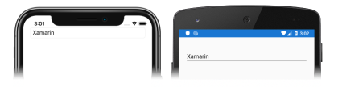

# [Visual Studio](#tab/vswin)

1. In **MainPage.xaml**, modify the [`Entry`](xref:Xamarin.Forms.Entry) declaration so that it sets a handler for the [`TextChanged`](xref:Xamarin.Forms.InputView.TextChanged) and [`Completed`](xref:Xamarin.Forms.Entry.Completed) events:

    ```xaml
    <Entry Placeholder="Enter text"
           TextChanged="OnEntryTextChanged"
           Completed="OnEntryCompleted" />
    ```

    This code sets the [`TextChanged`](xref:Xamarin.Forms.InputView.TextChanged) event to an event handler named `OnEntryTextChanged`, and the [`Completed`](xref:Xamarin.Forms.Entry.Completed) event to an event handler named `OnEntryCompleted`. Both event handlers will be created in the next step.

1. In **Solution Explorer**, in the **EntryTutorial** project, expand **MainPage.xaml** and double-click **MainPage.xaml.cs** to open it. Then, in **MainPage.xaml.cs**, add the `OnEntryTextChanged` and `OnEntryCompleted` event handlers to the class:

    ```csharp
    void OnEntryTextChanged(object sender, TextChangedEventArgs e)
    {
        string oldText = e.OldTextValue;
        string newText = e.NewTextValue;
    }

    void OnEntryCompleted(object sender, EventArgs e)
    {
        string text = ((Entry)sender).Text;
    }
    ```

    When the text in the [`Entry`](xref:Xamarin.Forms.Entry) changes, the `OnEntryTextChanged` method executes. The `sender` argument is the `Entry` object responsible for firing the `TextChanged` event, and can be used to access the `Entry` object. The [`TextChangedEventArgs`](xref:Xamarin.Forms.TextChangedEventArgs) argument provides the old and new text values, from before and after the text change.

    When you finalize the text in the [`Entry`](xref:Xamarin.Forms.Entry) with the return key, the `OnEntryCompleted` method executes. The `sender` argument is the `Entry` object responsible for firing the `TextChanged` event, and can be used to access the `Entry` object.

    > [!IMPORTANT]
    > Any text entered into an [`Entry`](xref:Xamarin.Forms.Entry) is stored in the [`Text`](xref:Xamarin.Forms.InputView.Text) property.

1. In the Visual Studio toolbar, press the **Start** button (the triangular button that resembles a Play button) to launch the application inside your chosen remote iOS simulator or Android emulator:

    [](../images/text-changes-large.png#lightbox "Entry with text")

    Set breakpoints in the two event handlers and enter text into the [`Entry`](xref:Xamarin.Forms.Entry) and observe the [`TextChanged`](xref:Xamarin.Forms.InputView.TextChanged) and [`Completed`](xref:Xamarin.Forms.Entry.Completed) events firing.

    For more information about [`Entry`](xref:Xamarin.Forms.Entry) events, see [Events and interactivity](~/xamarin-forms/user-interface/text/entry.md#events-and-interactivity) in the [Xamarin.Forms Entry](~/xamarin-forms/user-interface/text/entry.md) guide.

# [Visual Studio for Mac](#tab/vsmac)

1. In **MainPage.xaml**, modify the [`Entry`](xref:Xamarin.Forms.Entry) declaration so that it sets a handler for the [`TextChanged`](xref:Xamarin.Forms.InputView.TextChanged) and [`Completed`](xref:Xamarin.Forms.Entry.Completed) events:

    ```xaml
    <Entry Placeholder="Enter text"
           TextChanged="OnEntryTextChanged"
           Completed="OnEntryCompleted" />
    ```

    This code sets the [`TextChanged`](xref:Xamarin.Forms.InputView.TextChanged) event to an event handler named `OnEntryTextChanged`, and the [`Completed`](xref:Xamarin.Forms.Entry.Completed) event to an event handler named `OnEntryCompleted`. Both event handlers will be created in the next step.

1. In **Solution Pad**, in the **EntryTutorial** project, expand **MainPage.xaml** and double-click **MainPage.xaml.cs** to open it. Then, in **MainPage.xaml.cs**, add the `OnEntryTextChanged` and `OnEntryCompleted` event handlers to the class:

    ```csharp
    void OnEntryTextChanged(object sender, TextChangedEventArgs e)
    {
        string oldText = e.OldTextValue;
        string newText = e.NewTextValue;
    }

    void OnEntryCompleted(object sender, EventArgs e)
    {
        string text = ((Entry)sender).Text;
    }
    ```

    When the text in the [`Entry`](xref:Xamarin.Forms.Entry) changes, the `OnEntryTextChanged` method executes. The `sender` argument is the `Entry` object responsible for firing the `TextChanged` event, and can be used to access the `Entry` object. The [`TextChangedEventArgs`](xref:Xamarin.Forms.TextChangedEventArgs) argument provides the old and new text values, from before and after the text change.

    When you finalize the text in the [`Entry`](xref:Xamarin.Forms.Entry) with the return key, the `OnEntryCompleted` method executes. The `sender` argument is the `Entry` object responsible for firing the `TextChanged` event, and can be used to access the `Entry` object.

    > [!IMPORTANT]
    > Any text entered into an [`Entry`](xref:Xamarin.Forms.Entry) is stored in the [`Text`](xref:Xamarin.Forms.InputView.Text) property.

1. In the Visual Studio for Mac toolbar, press the **Start** button (the triangular button that resembles a Play button) to launch the application inside your chosen iOS simulator or Android emulator:

    [](../images/text-changes-large.png#lightbox "Entry with text")

    Set breakpoints in the two event handlers and enter text into the [`Entry`](xref:Xamarin.Forms.Entry) and observe the [`TextChanged`](xref:Xamarin.Forms.InputView.TextChanged) and [`Completed`](xref:Xamarin.Forms.Entry.Completed) events firing.

    For more information about [`Entry`](xref:Xamarin.Forms.Entry) events, see [Events and Interactivity](~/xamarin-forms/user-interface/text/entry.md#events-and-interactivity) in the [Xamarin.Forms Entry](~/xamarin-forms/user-interface/text/entry.md) guide.
