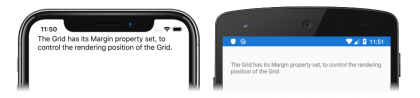

A [`Grid`](xref:Xamarin.Forms.Grid) is a layout that organizes its children into rows and columns, which can have proportional or absolute sizes. By default, a `Grid` contains one row and one column.

# [Visual Studio](#tab/vswin)

To complete this tutorial you should have Visual Studio 2019 (latest release), with the **Mobile development with .NET** workload installed. In addition, you will require a paired Mac to build the tutorial application on iOS. For information about installing the Xamarin platform, see [Installing Xamarin](~/get-started/installation/index.md). For information about connecting Visual Studio 2019 to a Mac build host, see [Pair to Mac for Xamarin.iOS development](~/ios/get-started/installation/windows/connecting-to-mac/index.md).

1. Launch Visual Studio, and create a new blank Xamarin.Forms app named **GridTutorial**.

    > [!IMPORTANT]
    > The C# and XAML snippets in this tutorial requires that the solution is named **GridTutorial**. Using a different name will result in build errors when you copy code from this tutorial into the solution.

    For more information about the .NET Standard library that gets created, see [Anatomy of a Xamarin.Forms application](~/get-started/first-app/index.md) in the [Xamarin.Forms Quickstart Deep Dive](~/get-started/first-app/index.md).

1. In **Solution Explorer**, in the **GridTutorial** project, double-click **MainPage.xaml** to open it. Then, in **MainPage.xaml**, remove all of the template code and replace it with the following code:

    ```xaml
    <?xml version="1.0" encoding="utf-8"?>
    <ContentPage xmlns="http://xamarin.com/schemas/2014/forms"
                 xmlns:x="http://schemas.microsoft.com/winfx/2009/xaml"
                 x:Class="GridTutorial.MainPage">
        <Grid Margin="20,35,20,20">
            <Label Text="The Grid has its Margin property set, to control the rendering position of the Grid." />
        </Grid>
    </ContentPage>
    ```

    This code declaratively defines the user interface for the page, which consists of a [`Label`](xref:Xamarin.Forms.Label) in a [`Grid`](xref:Xamarin.Forms.Grid). By default, the `Grid` positions its child views in a single location. Therefore, a `Grid` that contains multiple children should specify columns and rows, which will be covered in the next exercise. In addition, the [`Margin`](xref:Xamarin.Forms.View.Margin) property indicates the rendering position of the `Grid` within the [`ContentPage`](xref:Xamarin.Forms.ContentPage).

    > [!NOTE]
    > In addition to the [`Margin`](xref:Xamarin.Forms.View.Margin) property, the [`Padding`](xref:Xamarin.Forms.Layout.Padding) property can also be set on a [`Grid`](xref:Xamarin.Forms.Grid). The [`Padding`](xref:Xamarin.Forms.Layout.Padding) property value specifies the distance between the bounds of the `Grid` and its children. For more information, see [Margin and Padding](~/xamarin-forms/user-interface/layouts/margin-and-padding.md).

1. In the Visual Studio toolbar, press the **Start** button (the triangular button that resembles a Play button) to launch the application inside your chosen iOS remote simulator or Android emulator:

    [](../images/create-grid-large.png#lightbox "Grid containing a Labels")

    For more information about the [`Grid`](xref:Xamarin.Forms.Grid), see [Xamarin.Forms Grid](~/xamarin-forms/user-interface/layouts/grid.md).

# [Visual Studio for Mac](#tab/vsmac)

To complete this tutorial you should have Visual Studio for Mac (latest release), with iOS and Android platform support installed. In addition, you will also require Xcode (latest release). For more information about installing the Xamarin platform, see [Installing Xamarin](~/get-started/installation/index.md).

1. Launch Visual Studio for Mac, and create a new blank Xamarin.Forms app named **GridTutorial**.

    > [!IMPORTANT]
    > The C# and XAML snippets in this tutorial requires that the solution is named **GridTutorial**. Using a different name will result in build errors when you copy code from this tutorial into the solution.

    For more information about the .NET Standard library that gets created, see [Anatomy of a Xamarin.Forms application](~/get-started/first-app/index.md) in the [Xamarin.Forms Quickstart Deep Dive](~/get-started/first-app/index.md).

1. In **Solution Pad**, in the **GridTutorial** project, double-click **MainPage.xaml** to open it. Then, in **MainPage.xaml**, remove all of the template code and replace it with the following code:

    ```xaml
    <?xml version="1.0" encoding="utf-8"?>
    <ContentPage xmlns="http://xamarin.com/schemas/2014/forms"
                 xmlns:x="http://schemas.microsoft.com/winfx/2009/xaml"
                 x:Class="GridTutorial.MainPage">
        <Grid Margin="20,35,20,20">
            <Label Text="The Grid has its Margin property set, to control the rendering position of the Grid." />
        </Grid>
    </ContentPage>
    ```

    This code declaratively defines the user interface for the page, which consists of a [`Label`](xref:Xamarin.Forms.Label) in a [`Grid`](xref:Xamarin.Forms.Grid). By default, the `Grid` positions its child views in a single location. Therefore, a `Grid` that contains multiple children should specify columns and rows, which will be covered in the next exercise. In addition, the [`Margin`](xref:Xamarin.Forms.View.Margin) property indicates the rendering position of the `Grid` within the [`ContentPage`](xref:Xamarin.Forms.ContentPage).

    > [!NOTE]
    > In addition to the [`Margin`](xref:Xamarin.Forms.View.Margin) property, the [`Padding`](xref:Xamarin.Forms.Layout.Padding) property can also be set on a [`Grid`](xref:Xamarin.Forms.Grid). The [`Padding`](xref:Xamarin.Forms.Layout.Padding) property value specifies the distance between views in the `Grid`. For more information, see [Margin and Padding](~/xamarin-forms/user-interface/layouts/margin-and-padding.md).

1. In the Visual Studio for Mac toolbar, press the **Start** button (the triangular button that resembles a Play button) to launch the application inside your chosen iOS simulator or Android emulator:

    [](../images/create-grid-large.png#lightbox "Grid containing a Labels")

    For more information about the [`Grid`](xref:Xamarin.Forms.Grid), see [Xamarin.Forms Grid](~/xamarin-forms/user-interface/layouts/grid.md).
