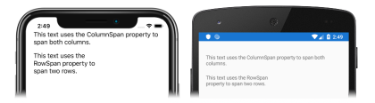

# [Visual Studio](#tab/vswin)

1. In **MainPage.xaml**, modify the [`Grid`](xref:Xamarin.Forms.Grid) declaration to define columns and rows, and place content that spans the columns and rows:

    ```xaml
    <Grid Margin="20,35,20,20">
        <Grid.ColumnDefinitions>
            <ColumnDefinition Width="0.5*" />
            <ColumnDefinition Width="0.5*" />
        </Grid.ColumnDefinitions>
        <Grid.RowDefinitions>
            <RowDefinition Height="50" />
            <RowDefinition Height="30" />
            <RowDefinition Height="30" />
        </Grid.RowDefinitions>
        <Label Grid.ColumnSpan="2"
               Text="This text uses the ColumnSpan property to span both columns." />
        <Label Grid.Row="1"
               Grid.RowSpan="2"
               Text="This text uses the RowSpan property to span two rows." />
    </Grid>
    ```

    This code defines columns and rows for the [`Grid`](xref:Xamarin.Forms.Grid), and positions [`Label`](xref:Xamarin.Forms.Label) instances in specific columns and rows. The first `Label` sets the [`ColumnSpan`](xref:Xamarin.Forms.Grid.ColumnSpanProperty) attached property so that its text spans multiple columns. The `ColumnSpan` property is set to 2, which represents the number of columns the `Label` will span. The second `Label` sets the [`RowSpan`](xref:Xamarin.Forms.Grid.RowSpanProperty) attached property so that its text spans multiple rows. The `RowSpan` property is set to 2, which represents the number of rows that the `Label` will span.

1. If the application is still running, save the changes to the file and the application user interface will automatically be updated in your simulator or emulator. Otherwise, in the Visual Studio toolbar, press the **Start** button (the triangular button that resembles a Play button) to launch the application inside your chosen iOS remote simulator or Android emulator:

    [](../images/span-columns-rows-large.png#lightbox "Grid with content spanning columns and rows")

    In Visual Studio, stop the application.

    For more information about spanning columns and rows, see [Rows and columns](~/xamarin-forms/user-interface/layouts/grid.md#rows-and-columns) in the [Xamarin.Forms Grid](~/xamarin-forms/user-interface/layouts/grid.md) guide.

# [Visual Studio for Mac](#tab/vsmac)

1. In **MainPage.xaml**, modify the [`Grid`](xref:Xamarin.Forms.Grid) declaration to define columns and rows, and place content that spans the columns and rows:

    ```xaml
    <Grid Margin="20,35,20,20">
        <Grid.ColumnDefinitions>
            <ColumnDefinition Width="0.5*" />
            <ColumnDefinition Width="0.5*" />
        </Grid.ColumnDefinitions>
        <Grid.RowDefinitions>
            <RowDefinition Height="50" />
            <RowDefinition Height="30" />
            <RowDefinition Height="30" />
        </Grid.RowDefinitions>
        <Label Grid.ColumnSpan="2"
               Text="This text uses the ColumnSpan property to span both columns." />
        <Label Grid.Row="1"
               Grid.RowSpan="2"
               Text="This text uses the RowSpan property to span two rows." />
    </Grid>
    ```

    This code defines columns and rows for the [`Grid`](xref:Xamarin.Forms.Grid), and positions [`Label`](xref:Xamarin.Forms.Label) instances in specific columns and rows. The first `Label` sets the [`ColumnSpan`](xref:Xamarin.Forms.Grid.ColumnSpanProperty) attached property so that its text spans multiple columns. The `ColumnSpan` property is set to 2, which represents the number of columns the `Label` will span. The second `Label` sets the [`RowSpan`](xref:Xamarin.Forms.Grid.RowSpanProperty) attached property so that its text spans multiple rows. The `RowSpan` property is set to 2, which represents the number of rows that the `Label` will span.

1. If the application is still running, save the changes to the file and the application user interface will automatically be updated in your simulator or emulator. Otherwise, in the Visual Studio for Mac toolbar, press the **Start** button (the triangular button that resembles a Play button) to launch the application inside your chosen iOS simulator or Android emulator:

    [](../images/span-columns-rows-large.png#lightbox "Grid with content spanning columns and rows")

    In Visual Studio for Mac, stop the application.

    For more information about spanning columns and rows, see [Rows and columns](~/xamarin-forms/user-interface/layouts/grid.md#rows-and-columns) in the [Xamarin.Forms Grid](~/xamarin-forms/user-interface/layouts/grid.md) guide.
