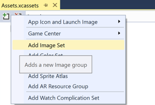
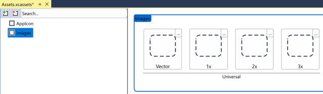
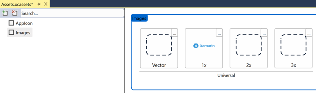
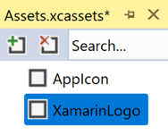
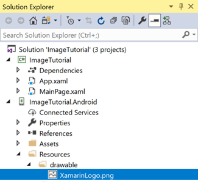
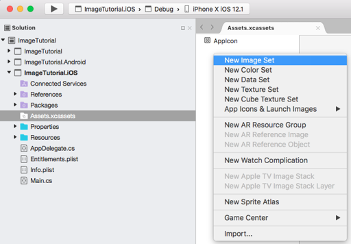
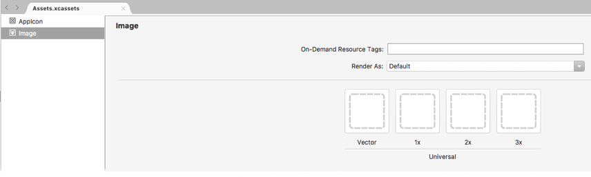
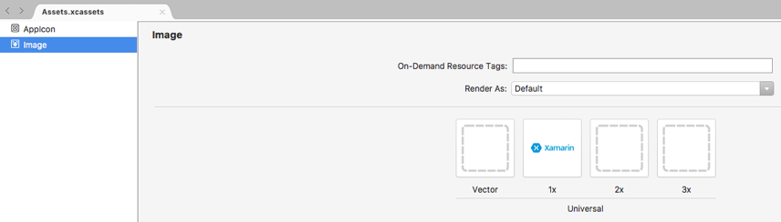
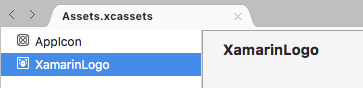
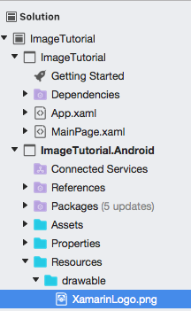

Image files can be added to platform projects and referenced from Xamarin.Forms shared code. This method of distributing images is required when images are platform-specific, such as when using different resolutions on different platforms, or slightly different designs.

In this exercise, you will modify the **ImageTutorial** solution to display a local image, rather than an image downloaded from a URI. The local image is the Xamarin logo, which should be downloaded by clicking the button below.

> [!div class="nextstepaction"]
> [Download XamarinLogo.png](https://raw.githubusercontent.com/xamarin/xamarin-forms-samples/master/UserInterface/PlatformSpecifics/Droid/Resources/drawable/XamarinLogo.png)

> [!IMPORTANT]
> To use a single image across all platforms, *the same filename must be used on every platform*, and it should be a valid Android resource name (i.e. only lowercase letters, numerals, the underscore, and the period are allowed).

# [Visual Studio](#tab/vswin)

1. In **Solution Explorer**, in the **ImageTutorial.iOS** project, expand **Asset Catalogs**, and double-click **Assets** to open it. Then, in the **Assets.xcassets** tab, click the **Plus** button and select **Add Image Set**:

    

1. In the **Assets.xcassets** tab, select the new image set and the editor will be displayed:

    

1. Drag **XamarinLogo.png** from your file system to the **1x** box for the **Universal** category:

    

1. In the **Assets.xcassets** tab, right-click the new image set's name and rename it to **XamarinLogo**:

    

    Save and close and **Assets.xcassets** tab.

1. In **Solution Explorer**, in the **ImageTutorial.Android** project, expand the **Resources** folder. Then, drag **XamarinLogo.png** from your file system to the **drawable** folder:

    

    > [!NOTE]
    > Visual Studio will automatically set the build action for the image to **AndroidResource**.

1. In the **ImageTutorial** project, in **MainPage.xaml**, modify the [`Image`](xref:Xamarin.Forms.Editor) declaration to display the local **XamarinLogo** file:

    ```xaml
    <Image Source="XamarinLogo"
           WidthRequest="{OnPlatform iOS=300, Android=250}"
           HorizontalOptions="Center" />
    ```

    This code sets the [`Source`](xref:Xamarin.Forms.Image.Source) property to the local file to display. The [`WidthRequest`](xref:Xamarin.Forms.VisualElement.WidthRequest) property is set to 300 device-independent units on iOS, and 250 device-independent units on Android. In addition, the [`HorizontalOptions`](xref:Xamarin.Forms.View.HorizontalOptions) property specifies that the image will be horizontally centered.

    > [!NOTE]
    > For PNG images on iOS, the **.png** extension can be omitted from the filename specified in the [`Source`](xref:Xamarin.Forms.Image.Source) property. For other image formats, the extension is required.

1. In the Visual Studio toolbar, press the **Start** button (the triangular button that resembles a Play button) to launch the application inside your chosen iOS simulator or Android emulator:

    [](../images/local-file-large.png#lightbox "Image view displaying a local image")

    In Visual Studio, stop the application.

    For more information about local images, see [Local images](~/xamarin-forms/user-interface/images.md#local-images) in the [Images in Xamarin.Forms](~/xamarin-forms/user-interface/images.md) guide.

# [Visual Studio for Mac](#tab/vsmac)

1. In **Solution Pad**, in the **ImageTutorial.iOS** project, double-click **Assets.xcassets** to open it. Then, in the **Assets List**, right-click and select **New Image Set**:

    

1. In the **Assets List**, select the new image set and the editor will be displayed:

    

1. Drag **XamarinLogo.png** from your file system to the **1x** box for the **Universal** category:

    

1. In the **Assets List**, double-click the new image set's name and rename it to **XamarinLogo**:

    

1. In **Solution Pad**, in the **ImageTutorial.Android** project, expand the **Resources** folder. Then, drag **XamarinLogo.png** from your file system to the **drawable** folder.

1. In the **Add File to Folder** dialog, select **OK**.

    

    > [!NOTE]
    > Visual Studio for Mac will automatically set the build action for the image to **AndroidResource**.

1. In the **ImageTutorial** project, in **MainPage.xaml**, modify the [`Image`](xref:Xamarin.Forms.Editor) declaration to display the local **XamarinLogo** file:

    ```xaml
    <Image Source="XamarinLogo"
           WidthRequest="{OnPlatform iOS=300, Android=250}"
           HorizontalOptions="Center" />
    ```

    This code sets the [`Source`](xref:Xamarin.Forms.Image.Source) property to the local file to display. The [`WidthRequest`](xref:Xamarin.Forms.VisualElement.WidthRequest) property is set to 300 device-independent units on iOS, and 250 device-independent units on Android. In addition, the [`HorizontalOptions`](xref:Xamarin.Forms.View.HorizontalOptions) property specifies that the image will be horizontally centered.

    > [!NOTE]
    > For PNG images on iOS, the **.png** extension can be omitted from the filename specified in the [`Source`](xref:Xamarin.Forms.Image.Source) property. For other image formats, the extension is required.

1. In the Visual Studio for Mac toolbar, press the **Start** button (the triangular button that resembles a Play button) to launch the application inside your chosen iOS simulator or Android emulator:

    [](../images/local-file-large.png#lightbox "Image view displaying a local image")

    In Visual Studio for Mac, stop the application.

    For more information about local images, see [Local images](~/xamarin-forms/user-interface/images.md#local-images) in the [Images in Xamarin.Forms](~/xamarin-forms/user-interface/images.md) guide.
