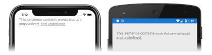

Before attempting this tutorial, you should have successfully completed the:

- [Build your first Xamarin.Forms app](~/get-started/first-app/index.md) quickstart.
- [StackLayout](~/get-started/tutorials/stacklayout/index.yml) tutorial.

In this tutorial, you learn how to:

> [!div class="checklist"]
>
> - Create a Xamarin.Forms [`Label`](xref:Xamarin.Forms.Label) in XAML.
> - Change the appearance of the `Label`.
> - Present text, in a single `Label`, that has multiple formats.

You will use Visual Studio 2019, or Visual Studio for Mac, to create a simple application that demonstrates how to display text in a [`Label`](xref:Xamarin.Forms.Label). The following screenshots show the final application:

You'll also use [XAML Hot Reload for Xamarin.Forms](~/xamarin-forms/xaml/hot-reload.md) to see UI changes without rebuilding your application.
