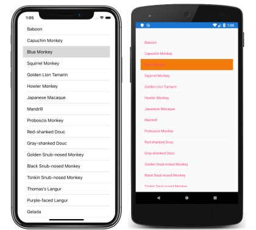

# [Visual Studio](#tab/vswin)

1. In **MainPage.xaml**, modify the [`ListView`](xref:Xamarin.Forms.ListView) declaration so that it sets handlers for the [`ItemSelected`](xref:Xamarin.Forms.ListView.ItemSelected) and [`ItemTapped`](xref:Xamarin.Forms.ListView.ItemTapped) events:

    ```xaml
    <ListView ItemsSource="{Binding Monkeys}"
              ItemSelected="OnListViewItemSelected"
              ItemTapped="OnListViewItemTapped" />
    ```

    This code sets the [`ItemSelected`](xref:Xamarin.Forms.ListView.ItemSelected) event to an event handler named `OnListViewItemSelected`, and the [`ItemTapped`](xref:Xamarin.Forms.ListView.ItemTapped) event to an event handler named `OnListViewItemTapped`. Both event handlers will be created in the next step.

1. In **Solution Explorer**, in the **ListViewTutorial** project, expand **MainPage.xaml** and double-click **MainPage.xaml.cs** to open it. Then, in **MainPage.xaml.cs**, add the `OnListViewItemSelected` and `OnListViewItemTapped` event handlers to the class:

    ```csharp
    void OnListViewItemSelected(object sender, SelectedItemChangedEventArgs e)
    {
        Monkey selectedItem = e.SelectedItem as Monkey;
    }

    void OnListViewItemTapped(object sender, ItemTappedEventArgs e)
    {
        Monkey tappedItem = e.Item as Monkey;
    }
    ```

    When a item in the [`ListView`](xref:Xamarin.Forms.ListView) is tapped, the [`ItemSelected`](xref:Xamarin.Forms.ListView.ItemSelected) and [`ItemTapped`](xref:Xamarin.Forms.ListView.ItemTapped) events are fired, which execute the `OnListViewItemSelected` and `OnListItemTapped` methods, respectively. The `sender` argument to both methods is the `ListView` object responsible for firing the event, and can be used to access the `ListView` object. The [`SelectedItemChangedEventArgs`](xref:Xamarin.Forms.SelectedItemChangedEventArgs) argument in the `OnListViewItemSelected` method provides the selected item, and the [`ItemTappedEventArgs`](xref:Xamarin.Forms.ItemTappedEventArgs) argument in the `OnListViewItemTapped` method provides the tapped item.

    > [!IMPORTANT]
    > The [`ItemSelected`](xref:Xamarin.Forms.ListView.ItemSelected) event is only fired when a new item is selected in the [`ListView`](xref:Xamarin.Forms.ListView). Therefore, tapping the same item twice will fire two [`ItemTapped`](xref:Xamarin.Forms.ListView.ItemTapped) events, but only a single `ItemSelected` event will be fired.

1. In the Visual Studio toolbar, press the **Start** button (the triangular button that resembles a Play button) to launch the application inside your chosen remote iOS simulator or Android emulator:

    [](../images/item-selection-large.png#lightbox "ListView item selection")

    Set breakpoints in the two event handlers and tap on items in the [`ListView`](xref:Xamarin.Forms.ListView). Note that the [`ItemSelected`](xref:Xamarin.Forms.ListView.ItemSelected) event is only fired when a new item is selected in the [`ListView`](xref:Xamarin.Forms.ListView), whereas the [`ItemTapped`](xref:Xamarin.Forms.ListView.ItemTapped) event is fired each time an item is tapped.

    For more information about item selection and taps, see [Selection & Taps](~/xamarin-forms/user-interface/listview/interactivity.md#selection-and-taps) in the [ListView Interactivity](~/xamarin-forms/user-interface/listview/interactivity.md) guide.

# [Visual Studio for Mac](#tab/vsmac)

1. In **MainPage.xaml**, modify the [`ListView`](xref:Xamarin.Forms.ListView) declaration so that it sets handlers for the [`ItemSelected`](xref:Xamarin.Forms.ListView.ItemSelected) and [`ItemTapped`](xref:Xamarin.Forms.ListView.ItemTapped) events:

    ```xaml
    <ListView ItemsSource="{Binding Monkeys}"
              ItemSelected="OnListViewItemSelected"
              ItemTapped="OnListViewItemTapped" />
    ```

    This code sets the [`ItemSelected`](xref:Xamarin.Forms.ListView.ItemSelected) event to an event handler named `OnListViewItemSelected`, and the [`ItemTapped`](xref:Xamarin.Forms.ListView.ItemTapped) event to an event handler named `OnListViewItemTapped`. Both event handlers will be created in the next step.

1. In **Solution Pad**, in the **ListViewTutorial** project, expand **MainPage.xaml** and double-click **MainPage.xaml.cs** to open it. Then, in **MainPage.xaml.cs**, add the `OnListViewItemSelected` and `OnListViewItemTapped` event handlers to the class:

    ```csharp
    void OnListViewItemSelected(object sender, SelectedItemChangedEventArgs e)
    {
        Monkey selectedItem = e.SelectedItem as Monkey;
    }

    void OnListViewItemTapped(object sender, ItemTappedEventArgs e)
    {
        Monkey tappedItem = e.Item as Monkey;
    }
    ```

    When a item in the [`ListView`](xref:Xamarin.Forms.ListView) is tapped, the [`ItemSelected`](xref:Xamarin.Forms.ListView.ItemSelected) and [`ItemTapped`](xref:Xamarin.Forms.ListView.ItemTapped) events are fired, which execute the `OnListViewItemSelected` and `OnListItemTapped` methods, respectively. The `sender` argument to both methods is the `ListView` object responsible for firing the event, and can be used to access the `ListView` object. The [`SelectedItemChangedEventArgs`](xref:Xamarin.Forms.SelectedItemChangedEventArgs) argument in the `OnListViewItemSelected` method provides the selected item, and the [`ItemTappedEventArgs`](xref:Xamarin.Forms.ItemTappedEventArgs) argument in the `OnListViewItemTapped` method provides the tapped item.

    > [!IMPORTANT]
    > The [`ItemSelected`](xref:Xamarin.Forms.ListView.ItemSelected) event is only fired when a new item is selected in the [`ListView`](xref:Xamarin.Forms.ListView). Therefore, tapping the same item twice will fire two [`ItemTapped`](xref:Xamarin.Forms.ListView.ItemTapped) events, but only a single `ItemSelected` event will be fired.

1. In the Visual Studio for Mac toolbar, press the **Start** button (the triangular button that resembles a Play button) to launch the application inside your chosen iOS simulator or Android emulator:

    [](../images/item-selection-large.png#lightbox "ListView item selection")

    Set breakpoints in the two event handlers and tap on items in the [`ListView`](xref:Xamarin.Forms.ListView). Note that the [`ItemSelected`](xref:Xamarin.Forms.ListView.ItemSelected) event is only fired when a new item is selected in the [`ListView`](xref:Xamarin.Forms.ListView), whereas the [`ItemTapped`](xref:Xamarin.Forms.ListView.ItemTapped) event is fired each time an item is tapped.

    For more information about item selection and taps, see [Selection & Taps](~/xamarin-forms/user-interface/listview/interactivity.md#selection-and-taps)
