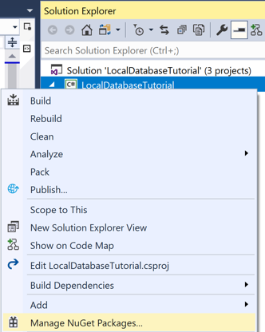
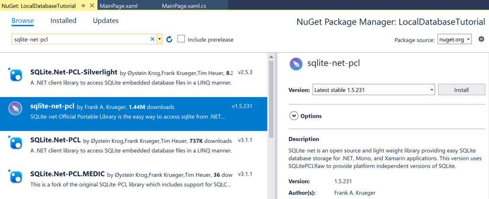
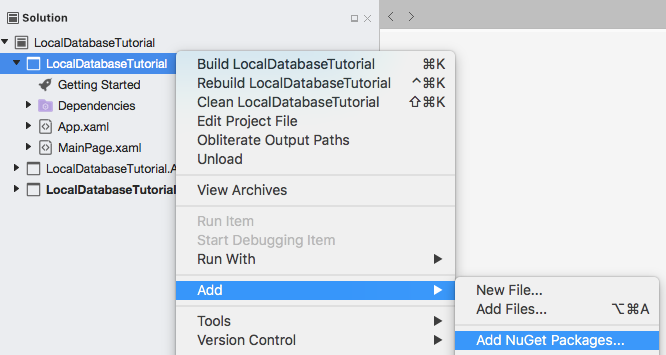
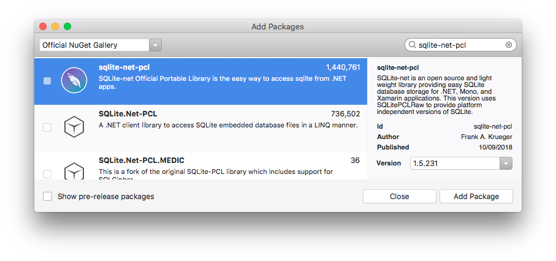

# [Visual Studio](#tab/vswin)

1. Launch Visual Studio, and create a new blank Xamarin.Forms app named **LocalDatabaseTutorial**. Ensure that the app uses .NET Standard as the shared code mechanism.

    > [!IMPORTANT]
    > The C# and XAML snippets in this tutorial requires that the solution is named **LocalDatabaseTutorial**. Using a different name will result in build errors when you copy code from this tutorial into the solution.

    For more information about the .NET Standard library that gets created, see [Anatomy of a Xamarin.Forms application](~/get-started/first-app/index.md) in the [Xamarin.Forms Quickstart Deep Dive](~/get-started/first-app/index.md).

1. In **Solution Explorer**, select the **LocalDatabaseTutorial** project, right-click and select **Manage NuGet Packages...**:

    

1. In the **NuGet Package Manager**, select the **Browse** tab, search for the **sqlite-net-pcl** NuGet package, select it, and click the **Install** button to add it to the project:

    

    > [!NOTE]
    > There are a number of NuGet packages with similar names. The correct package has these attributes:
    > - **Author(s):** Frank A. Krueger
    > - **Id:** sqlite-net-pcl
    > - **NuGet link:** [sqlite-net-pcl](https://www.nuget.org/packages/sqlite-net-pcl/)  
    >
    > Despite the package name, this NuGet package can be used in .NET Standard projects.

    This package will be used to incorporate database operations into the application.

1. Build the solution to ensure there are no errors.

# [Visual Studio for Mac](#tab/vsmac)

1. Launch Visual Studio for Mac, and create a new blank Xamarin.Forms app named **LocalDatabaseTutorial**. Ensure that the app uses .NET Standard as the shared code mechanism.

    > [!IMPORTANT]
    > The C# and XAML snippets in this tutorial requires that the solution is named **LocalDatabaseTutorial**. Using a different name will result in build errors when you copy code from this tutorial into the solution.
    
    For more information about the .NET Standard library that gets created, see [Anatomy of a Xamarin.Forms application](~/get-started/first-app/index.md) in the [Xamarin.Forms Quickstart Deep Dive](~/get-started/first-app/index.md).

1. In **Solution Pad**, select the **LocalDatabaseTutorial** project, right-click and select **Add > Add NuGet Packages...**:

    

1. In the **Add Packages** window, search for the **sqlite-net-pcl** NuGet package, select it, and click the **Add Package** button to add it to the project:

    

    > [!NOTE]
    > There are a number of NuGet packages with similar names. The correct package has these attributes:
    > - **Author:** Frank A. Krueger
    > - **Id:** sqlite-net-pcl
    > - **NuGet link:** [sqlite-net-pcl](https://www.nuget.org/packages/sqlite-net-pcl/)  
    >
    > Despite the package name, this NuGet package can be used in .NET Standard projects.

    This package will be used to incorporate database operations into the application.

1. Build the solution to ensure there are no errors.
