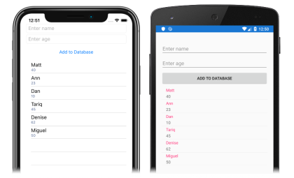

In this exercise you will create a user interface to consume the previously created data access classes.

# [Visual Studio](#tab/vswin)

1. In **Solution Explorer**, in the **LocalDatabaseTutorial** project, double-click **MainPage.xaml** to open it. Then, in **MainPage.xaml**, remove all of the template code and replace it with the following code:

    ```xaml
    <?xml version="1.0" encoding="utf-8"?>
    <ContentPage xmlns="http://xamarin.com/schemas/2014/forms"
                 xmlns:x="http://schemas.microsoft.com/winfx/2009/xaml"
                 x:Class="LocalDatabaseTutorial.MainPage">
        <StackLayout Margin="20,35,20,20">
            <Entry x:Name="nameEntry"
                   Placeholder="Enter name" />
            <Entry x:Name="ageEntry"
                   Placeholder="Enter age" />
            <Button Text="Add to Database"
                    Clicked="OnButtonClicked" />
            <CollectionView x:Name="collectionView">
                <CollectionView.ItemTemplate>
                    <DataTemplate>
                        <StackLayout>
                            <Label Text="{Binding Name}"
                                   FontSize="Medium" />
                            <Label Text="{Binding Age}"
                                   TextColor="Silver"
                                   FontSize="Small" />
                        </StackLayout>
                    </DataTemplate>
                </CollectionView.ItemTemplate>
            </CollectionView>
        </StackLayout>
    </ContentPage>
    ```

    This code declaratively defines the user interface for the page, which consists of two [`Entry`](xref:Xamarin.Forms.Entry) instances, a [`Button`](xref:Xamarin.Forms.Button), and a [`CollectionView`](xref:Xamarin.Forms.CollectionView) in a [`StackLayout`](xref:Xamarin.Forms.StackLayout). Each `Entry` has its [`Placeholder`](xref:Xamarin.Forms.InputView.Placeholder) property set, which specifies the placeholder text that's shown prior to user input. The `Button` sets its [`Clicked`](xref:Xamarin.Forms.Button.Clicked) event to an event handler named `OnButtonClicked` that will be created in the next step. The `CollectionView` sets its [`ItemTemplate`](xref:Xamarin.Forms.ItemsView`1.ItemTemplate) property to a [`DataTemplate`](xref:Xamarin.Forms.DataTemplate), which uses a `StackLayout` and two [`Label`](xref:Xamarin.Forms.Label) objects to define the appearance of each row in the `CollectionView`. The `Label` objects bind their `Text` properties to the `Name` and `Age` properties of each `Person` object, respectively.

    In addition, the [`Entry`](xref:Xamarin.Forms.Entry) instances and [`CollectionView`](xref:Xamarin.Forms.CollectionView) have names specified with the `x:Name` attribute. This enables the code-behind file to access these objects using the assigned names.

1. In **Solution Explorer**, in the **LocalDatabaseTutorial** project, expand **MainPage.xaml** and double-click **MainPage.xaml.cs** to open it. Then, in **MainPage.xaml.cs**, add the `OnAppearing` override and `OnButtonClicked` event handler to the class:

    ```csharp
    protected override async void OnAppearing()
    {
        base.OnAppearing();
        collectionView.ItemsSource = await App.Database.GetPeopleAsync();
    }

    async void OnButtonClicked(object sender, EventArgs e)
    {
        if (!string.IsNullOrWhiteSpace(nameEntry.Text) && !string.IsNullOrWhiteSpace(ageEntry.Text))
        {
            await App.Database.SavePersonAsync(new Person
            {
                Name = nameEntry.Text,
                Age = int.Parse(ageEntry.Text)
            });

            nameEntry.Text = ageEntry.Text = string.Empty;
            collectionView.ItemsSource = await App.Database.GetPeopleAsync();
        }
    }
    ```

    The `OnAppearing` method populates the [`CollectionView`](xref:Xamarin.Forms.CollectionView) with any data stored in the database. The `OnButtonClicked` method, which is executed when the [`Button`](xref:Xamarin.Forms.Button) is tapped, saves the entered data into the database before clearing both [`Entry`](xref:Xamarin.Forms.Entry) instances, and refreshing the data in the `CollectionView`.

    > [!NOTE]
    > The `OnAppearing` method override is executed after the [`ContentPage`](xref:Xamarin.Forms.ContentPage) is laid out, but just before it becomes visible. Therefore, this is a good place to set the content of Xamarin.Forms views.

1. In the Visual Studio toolbar, press the **Start** button (the triangular button that resembles a Play button) to launch the application inside your chosen remote iOS simulator or Android emulator.

    Enter several items of data, tapping the [`Button`](xref:Xamarin.Forms.Button) for each item of data. This will save the data to the database, and repopulate the [`CollectionView`](xref:Xamarin.Forms.CollectionView) with all of the database data:

    [](../images/consume-data-access-classes-large.png#lightbox "Local database data persistence")

    In Visual Studio, stop the application.

    For more information local databases in Xamarin.Forms, see [Xamarin.Forms Local Databases (guide)](~/xamarin-forms/data-cloud/data/databases.md)

# [Visual Studio for Mac](#tab/vsmac)

1. In **Solution Pad**, in the **LocalDatabaseTutorial** project, double-click **MainPage.xaml** to open it. Then, in **MainPage.xaml**, remove all of the template code and replace it with the following code:

    ```xaml
    <?xml version="1.0" encoding="utf-8"?>
    <ContentPage xmlns="http://xamarin.com/schemas/2014/forms"
                 xmlns:x="http://schemas.microsoft.com/winfx/2009/xaml"
                 x:Class="LocalDatabaseTutorial.MainPage">
        <StackLayout Margin="20,35,20,20">
            <Entry x:Name="nameEntry"
                   Placeholder="Enter name" />
            <Entry x:Name="ageEntry"
                   Placeholder="Enter age" />
            <Button Text="Add to Database"
                    Clicked="OnButtonClicked" />
            <CollectionView x:Name="collectionView">
                <CollectionView.ItemTemplate>
                    <DataTemplate>
                        <StackLayout>
                            <Label Text="{Binding Name}"
                                   FontSize="Medium" />
                            <Label Text="{Binding Age}"
                                   TextColor="Silver"
                                   FontSize="Small" />
                        </StackLayout>
                    </DataTemplate>
                </CollectionView.ItemTemplate>
            </CollectionView>
        </StackLayout>
    </ContentPage>
    ```

    This code declaratively defines the user interface for the page, which consists of two [`Entry`](xref:Xamarin.Forms.Entry) instances, a [`Button`](xref:Xamarin.Forms.Button), and a [`CollectionView`](xref:Xamarin.Forms.CollectionView) in a [`StackLayout`](xref:Xamarin.Forms.StackLayout). Each `Entry` has its [`Placeholder`](xref:Xamarin.Forms.InputView.Placeholder) property set, which specifies the placeholder text that's shown prior to user input. The `Button` sets its [`Clicked`](xref:Xamarin.Forms.Button.Clicked) event to an event handler named `OnButtonClicked` that will be created in the next step. The `CollectionView` sets its [`ItemTemplate`](xref:Xamarin.Forms.ItemsView`1.ItemTemplate) property to a [`DataTemplate`](xref:Xamarin.Forms.DataTemplate), which uses a `StackLayout` and two [`Label`](xref:Xamarin.Forms.Label) objects to define the appearance of each row in the `CollectionView`. The `Label` objects bind their `Text` properties to the `Name` and `Age` properties of each `Person` object, respectively.

    In addition, the [`Entry`](xref:Xamarin.Forms.Entry) instances and [`ListView`](xref:Xamarin.Forms.ListView) have names specified with the `x:Name` attribute. This enables the code-behind file to access these objects using the assigned names.

1. In **Solution Pad**, in the **LocalDatabaseTutorial** project, expand **MainPage.xaml** and double-click **MainPage.xaml.cs** to open it. Then, in **MainPage.xaml.cs**, add the `OnAppearing` override and `OnButtonClicked` event handler to the class:

    ```csharp
    protected override async void OnAppearing()
    {
        base.OnAppearing();
        collectionView.ItemsSource = await App.Database.GetPeopleAsync();
    }

    async void OnButtonClicked(object sender, EventArgs e)
    {
        if (!string.IsNullOrWhiteSpace(nameEntry.Text) && !string.IsNullOrWhiteSpace(ageEntry.Text))
        {
            await App.Database.SavePersonAsync(new Person
            {
                Name = nameEntry.Text,
                Age = int.Parse(ageEntry.Text)
            });

            nameEntry.Text = ageEntry.Text = string.Empty;
            collectionView.ItemsSource = await App.Database.GetPeopleAsync();
        }
    }
    ```

    The `OnAppearing` method populates the [`CollectionView`](xref:Xamarin.Forms.CollectionView) with any data stored in the database. The `OnButtonClicked` method, which is executed when the [`Button`](xref:Xamarin.Forms.Button) is tapped, saves the entered data into the database before clearing both [`Entry`](xref:Xamarin.Forms.Entry) instances, and refreshing the data in the `CollectionView`.

    > [!NOTE]
    > The `OnAppearing` method override is executed after the [`ContentPage`](xref:Xamarin.Forms.ContentPage) is laid out, but just before it becomes visible. Therefore, this is a good place to set the content of Xamarin.Forms views.

1. In the Visual Studio for Mac toolbar, press the **Start** button (the triangular button that resembles a Play button) to launch the application inside your chosen iOS simulator or Android emulator.

    Enter several items of data, tapping the [`Button`](xref:Xamarin.Forms.Button) for each item of data. This will save the data to the database, and repopulate the [`CollectionView`](xref:Xamarin.Forms.CollectionView) with all of the database data:

    [](../images/consume-data-access-classes-large.png#lightbox "Local database data persistence")

    In Visual Studio for Mac, stop the application.

    For more information local databases in Xamarin.Forms, see [Xamarin.Forms Local Databases (guide)](~/xamarin-forms/data-cloud/data/databases.md)
