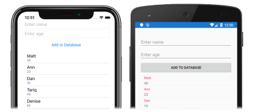

Before attempting this tutorial, you should have successfully completed the:

- [Build your first Xamarin.Forms app](~/get-started/first-app/index.md) quickstart.
- [StackLayout](~/get-started/tutorials/stacklayout/index.yml) tutorial.
- [Button](~/get-started/tutorials/button/index.yml) tutorial.
- [Entry](~/get-started/tutorials/entry/index.yml) tutorial.
- [CollectionView](~/get-started/tutorials/collectionview/index.yml) tutorial.

In this tutorial, you learn how to:

> [!div class="checklist"]
>
> - Use the NuGet Package Manager to add SQLite.NET to a Xamarin.Forms project.
> - Create the data access classes.
> - Consume the data access classes.

You will use Visual Studio 2019, or Visual Studio for Mac, to create a simple application that demonstrates how to store data in a local SQLite.NET database. The following screenshots show the final application:

