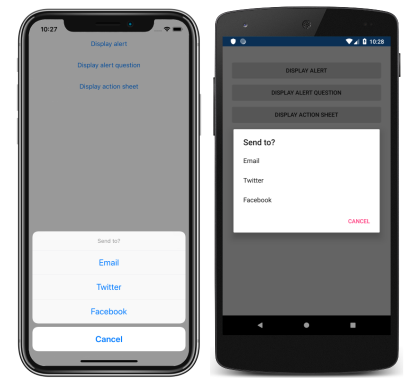

Xamarin.Forms has a modal pop-up, known as an action sheet, that can be used to guide users through a task. In this exercise, you will use the [`DisplayActionSheet`](xref:Xamarin.Forms.Page.DisplayActionSheet*) method, from the [`Page`](xref:Xamarin.Forms.Page) class, to display an action sheet that guides users through a task.

# [Visual Studio](#tab/vswin)

1. In **MainPage.xaml**, add a new [`Button`](xref:Xamarin.Forms.Button) declaration that will display an action sheet:

    ```xaml
    <Button Text="Display action sheet"
            Clicked="OnDisplayActionSheetButtonClicked" />
    ```

     The [`Button.Text`](xref:Xamarin.Forms.Button.Text) property specifies the text that appears in the `Button`. In addition, the [`Clicked`](xref:Xamarin.Forms.Button.Clicked) event is set to an event handler named `OnDisplayActionSheetButtonClicked`, that will be created in the next step.

1. In **Solution Explorer**, in the **PopupsTutorial** project, expand **MainPage.xaml** and double-click **MainPage.xaml.cs** to open it. Then, in **MainPage.xaml.cs**, add the `OnDisplayActionSheetButtonClicked` event handler to the class:

    ```csharp
    async void OnDisplayActionSheetButtonClicked(object sender, EventArgs e)
    {
        string action = await DisplayActionSheet("Send to?", "Cancel", null, "Email", "Twitter", "Facebook");
        Console.WriteLine("Action: " + action);
    }
    ```

    When the [`Button`](xref:Xamarin.Forms.Button) is tapped, the `OnDisplayActionSheetButtonClicked` method executes. This method calls the [`DisplayActionSheet`](xref:Xamarin.Forms.Page.DisplayActionSheet*) method, to present the user with a set of alternatives for how to proceed through a task. After the user selects one of the alternatives, the selection is returned as a `string`.

    > [!IMPORTANT]
    > The [`DisplayActionSheet`](xref:Xamarin.Forms.Page.DisplayActionSheet*) method is asynchronous, and should always be awaited with the `await` keyword.

1. In the Visual Studio toolbar, press the **Start** button (the triangular button that resembles a Play button) to launch the application inside your chosen remote iOS simulator or Android emulator. Then, tap the [`Button`](xref:Xamarin.Forms.Button) that you added to the [`ContentPage`](xref:Xamarin.Forms.ContentPage):

    [](../images/actionsheet-large.png#lightbox "Actionsheet that guides users through a task")

    Observe that, after selecting an alternative in the action sheet dialog, the selection is output to the Visual Studio **Output** window. If this window is not visible, it can be made visible by selecting the **View > Output** menu option.

    In Visual Studio, stop the application.

    For more information about displaying action sheets, see [Guide users through tasks](~/xamarin-forms/user-interface/pop-ups.md#guide-users-through-tasks) in the [Display Pop-ups](~/xamarin-forms/user-interface/pop-ups.md) guide.

# [Visual Studio for Mac](#tab/vsmac)

1. In **MainPage.xaml**, add a new [`Button`](xref:Xamarin.Forms.Button) declaration that will display an action sheet:

    ```xaml
    <Button Text="Display action sheet"
            Clicked="OnDisplayActionSheetButtonClicked" />
    ```

    The [`Button.Text`](xref:Xamarin.Forms.Button.Text) property specifies the text that appears in the `Button`. In addition, the [`Clicked`](xref:Xamarin.Forms.Button.Clicked) event is set to an event handler named `OnDisplayActionSheetButtonClicked`, that will be created in the next step.

1. In **Solution Pad**, in the **PopupsTutorial** project, expand **MainPage.xaml** and double-click **MainPage.xaml.cs** to open it. Then, in **MainPage.xaml.cs**, add the `OnDisplayActionSheetButtonClicked` event handler to the class:

    ```csharp
    async void OnDisplayActionSheetButtonClicked(object sender, EventArgs e)
    {
        string action = await DisplayActionSheet("Send to?", "Cancel", null, "Email", "Twitter", "Facebook");
        Console.WriteLine("Action: " + action);
    }
    ```

    When the [`Button`](xref:Xamarin.Forms.Button) is tapped, the `OnDisplayActionSheetButtonClicked` method executes. This method calls the [`DisplayActionSheet`](xref:Xamarin.Forms.Page.DisplayActionSheet*) method, to present the user with a set of alternatives for how to proceed through a task. After the user selects one of the alternatives, the selection is returned as a `string`.

    > [!IMPORTANT]
    > The [`DisplayActionSheet`](xref:Xamarin.Forms.Page.DisplayActionSheet*) method is asynchronous, and should always be awaited with the `await` keyword.

1. In the Visual Studio for Mac toolbar, press the **Start** button (the triangular button that resembles a Play button) to launch the application inside your chosen iOS simulator or Android emulator. Then, tap the [`Button`](xref:Xamarin.Forms.Button) that you added to the [`ContentPage`](xref:Xamarin.Forms.ContentPage):

    [](../images/actionsheet-large.png#lightbox "Actionsheet that guides users through a task")

    Observe that, after selecting an alternative in the action sheet dialog, the selection is output to the Visual Studio for Mac **Application Output** window. If this window is not visible, it can be made visible by selecting the **View > Other Windows > Application Output** menu option.

    In Visual Studio for Mac, stop the application.

    For more information about displaying action sheets, see [Guide users through tasks](~/xamarin-forms/user-interface/pop-ups.md#guide-users-through-tasks) in the [Display Pop-ups](~/xamarin-forms/user-interface/pop-ups.md) guide.
