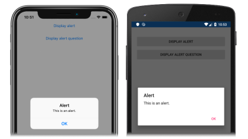
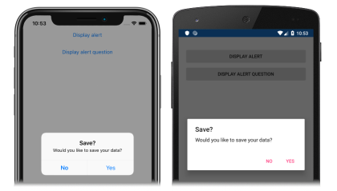

Xamarin.Forms has a modal pop-up, known as an alert, to alert the user, or to ask simple questions of them. In this exercise, you will use the [`DisplayAlert`](xref:Xamarin.Forms.Page.DisplayAlert*) method, from the [`Page`](xref:Xamarin.Forms.Page) class, to display an alert to the user, and to ask a simple question.

# [Visual Studio](#tab/vswin)

To complete this tutorial you should have Visual Studio 2019 (latest release), with the **Mobile development with .NET** workload installed. In addition, you will require a paired Mac to build the tutorial application on iOS. For information about installing the Xamarin platform, see [Installing Xamarin](~/get-started/installation/index.md). For information about connecting Visual Studio 2019 to a Mac build host, see [Pair to Mac for Xamarin.iOS development](~/ios/get-started/installation/windows/connecting-to-mac/index.md).

1. Launch Visual Studio, and create a new blank Xamarin.Forms app named **PopupsTutorial**.

    > [!IMPORTANT]
    > The C# and XAML snippets in this tutorial requires that the solution is named **PopupsTutorial**. Using a different name will result in build errors when you copy code from this tutorial into the solution.

    For more information about the .NET Standard library that gets created, see [Anatomy of a Xamarin.Forms application](~/get-started/first-app/index.md) in the [Xamarin.Forms Quickstart Deep Dive](~/get-started/first-app/index.md).

1. In **Solution Explorer**, in the **PopupsTutorial** project, double-click **MainPage.xaml** to open it. Then, in **MainPage.xaml**, remove all of the template code and replace it with the following code:

    ```xaml
    <?xml version="1.0" encoding="utf-8"?>
    <ContentPage xmlns="http://xamarin.com/schemas/2014/forms"
                 xmlns:x="http://schemas.microsoft.com/winfx/2009/xaml"
                 x:Class="PopupsTutorial.MainPage">
        <StackLayout Margin="20,35,20,20">
            <Button Text="Display alert"
                    Clicked="OnDisplayAlertButtonClicked" />
            <Button Text="Display alert question"
                    Clicked="OnDisplayAlertQuestionButtonClicked" />
        </StackLayout>
    </ContentPage>
    ```

    This code declaratively defines the user interface for the page, which consists of two [`Button`](xref:Xamarin.Forms.Button) objects in a [`StackLayout`](xref:Xamarin.Forms.StackLayout). The [`Button.Text`](xref:Xamarin.Forms.Button.Text) properties specify the text that appears in each `Button`, and the [`Clicked`](xref:Xamarin.Forms.Button.Clicked) events are set to event handlers that will be created in the next step.

1. In **Solution Explorer**, in the **PopupsTutorial** project, expand **MainPage.xaml** and double-click **MainPage.xaml.cs** to open it. Then, in **MainPage.xaml.cs**, add the `OnDisplayAlertButtonClicked` and `OnDisplayAlertQuestionButtonClicked` event handlers to the class:

    ```csharp
    async void OnDisplayAlertButtonClicked(object sender, EventArgs e)
    {
        await DisplayAlert("Alert", "This is an alert.", "OK");
    }

    async void OnDisplayAlertQuestionButtonClicked(object sender, EventArgs e)
    {
        bool response = await DisplayAlert("Save?", "Would you like to save your data?", "Yes", "No");
        Console.WriteLine("Save data: " + response);
    }
    ```

    When a [`Button`](xref:Xamarin.Forms.Button) is tapped, the respective event handler method is executed. The `OnDisplayAlertButtonClicked` method calls the [`DisplayAlert`](xref:Xamarin.Forms.Page.DisplayAlert*) method, to display a modal alert with a single cancel button. Once the alert is dismissed the user can continue interacting with the application.

    The `OnDisplayAlertQuestionButtonClicked` method calls an overload of the [`DisplayAlert`](xref:Xamarin.Forms.Page.DisplayAlert*) method, to display a modal alert with an accept button and a cancel button. After the user selects one of the buttons, the selection is returned as a `boolean`.

    > [!IMPORTANT]
    > The [`DisplayAlert`](xref:Xamarin.Forms.Page.DisplayAlert*) method is asynchronous, and should always be awaited with the `await` keyword.

1. In the Visual Studio toolbar, press the **Start** button (the triangular button that resembles a Play button) to launch the application inside your chosen remote iOS simulator or Android emulator. Then, tap the first [`Button`](xref:Xamarin.Forms.Button):

    [](../images/alert-large.png#lightbox "Alert")

    After dismissing the alert, tap the second [`Button`](xref:Xamarin.Forms.Button):

    [](../images/alert-question-large.png#lightbox "Alert that asks a question")

    Observe that, after selecting a response to the question, the response is output to the Visual Studio **Output** window. If this window is not visible, it can be made visible by selecting the **View > Output** menu option.

    In Visual Studio, stop the application.

    For more information about displaying alerts, see [Display an alert](~/xamarin-forms/user-interface/pop-ups.md#display-an-alert) in the [Display Pop-ups](~/xamarin-forms/user-interface/pop-ups.md) guide.

# [Visual Studio for Mac](#tab/vsmac)

To complete this tutorial you should have Visual Studio for Mac (latest release), with iOS and Android platform support installed. In addition, you will also require Xcode (latest release). For more information about installing the Xamarin platform, see [Installing Xamarin](~/get-started/installation/index.md).

1. Launch Visual Studio for Mac, and create a new blank Xamarin.Forms app named **PopupsTutorial**.

    > [!IMPORTANT]
    > The C# and XAML snippets in this tutorial requires that the solution is named **PopupsTutorial**. Using a different name will result in build errors when you copy code from this tutorial into the solution.

    For more information about the .NET Standard library that gets created, see [Anatomy of a Xamarin.Forms application](~/get-started/first-app/index.md) in the [Xamarin.Forms Quickstart Deep Dive](~/get-started/first-app/index.md).

1. In **Solution Pad**, in the **PopupsTutorial** project, double-click **MainPage.xaml** to open it. Then, in **MainPage.xaml**, remove all of the template code and replace it with the following code:

    ```xaml
    <?xml version="1.0" encoding="utf-8"?>
    <ContentPage xmlns="http://xamarin.com/schemas/2014/forms"
                 xmlns:x="http://schemas.microsoft.com/winfx/2009/xaml"
                 x:Class="PopupsTutorial.MainPage">
        <StackLayout Margin="20,35,20,20">
            <Button Text="Display alert"
                    Clicked="OnDisplayAlertButtonClicked" />
            <Button Text="Display alert question"
                    Clicked="OnDisplayAlertQuestionButtonClicked" />
        </StackLayout>
    </ContentPage>
    ```

    This code declaratively defines the user interface for the page, which consists of two [`Button`](xref:Xamarin.Forms.Button) objects in a [`StackLayout`](xref:Xamarin.Forms.StackLayout). The [`Button.Text`](xref:Xamarin.Forms.Button.Text) properties specify the text that appears in each `Button`, and the [`Clicked`](xref:Xamarin.Forms.Button.Clicked) events are set to event handlers that will be created in the next step.

1. In **Solution Pad**, in the **PopupsTutorial** project, expand **MainPage.xaml** and double-click **MainPage.xaml.cs** to open it. Then, in **MainPage.xaml.cs**, add the `OnDisplayAlertButtonClicked` and `OnDisplayAlertQuestionButtonClicked` event handlers to the class:

    ```csharp
    async void OnDisplayAlertButtonClicked(object sender, EventArgs e)
    {
        await DisplayAlert("Alert", "This is an alert.", "OK");
    }

    async void OnDisplayAlertQuestionButtonClicked(object sender, EventArgs e)
    {
        bool response = await DisplayAlert("Save?", "Would you like to save your data?", "Yes", "No");
        Console.WriteLine("Save data: " + response);
    }
    ```

    When a [`Button`](xref:Xamarin.Forms.Button) is tapped, the respective event handler method is executed. The `OnDisplayAlertButtonClicked` method calls the [`DisplayAlert`](xref:Xamarin.Forms.Page.DisplayAlert*) method, to display a modal alert with a single cancel button. Once the alert is dismissed the user can continue interacting with the application.

    The `OnDisplayAlertQuestionButtonClicked` method calls an overload of the [`DisplayAlert`](xref:Xamarin.Forms.Page.DisplayAlert*) method, to display a modal alert with an accept button and a cancel button. After the user selects one of the buttons, the selection is returned as a `boolean`.

    > [!IMPORTANT]
    > The [`DisplayAlert`](xref:Xamarin.Forms.Page.DisplayAlert*) method is asynchronous, and should always be awaited with the `await` keyword.

1. In the Visual Studio for Mac toolbar, press the **Start** button (the triangular button that resembles a Play button) to launch the application inside your chosen iOS simulator or Android emulator. Then, tap the first [`Button`](xref:Xamarin.Forms.Button):

    [](../images/alert-large.png#lightbox "Alert")

    After dismissing the alert, tap the second [`Button`](xref:Xamarin.Forms.Button):

    [](../images/alert-question-large.png#lightbox "Alert that asks a question")

    Observe that, after selecting a response to the question, the response is output to the Visual Studio for Mac **Application Output** window. If this window is not visible, it can be made visible by selecting the **View > Other Windows > Application Output** menu option.

    In Visual Studio for Mac, stop the application.

    For more information about displaying alerts, see [Display an alert](~/xamarin-forms/user-interface/pop-ups.md#display-an-alert) in the [Display Pop-ups](~/xamarin-forms/user-interface/pop-ups.md) guide.
