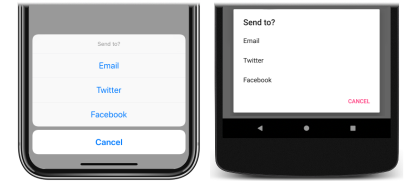

Before attempting this tutorial, you should have successfully completed the:

- [Build your first Xamarin.Forms app](~/get-started/first-app/index.md) quickstart.
- [StackLayout](~/get-started/tutorials/stacklayout/index.yml) tutorial.
- [Button](~/get-started/tutorials/button/index.yml) tutorial.

In this tutorial, you learn how to:

> [!div class="checklist"]
>
> - Display an alert, to ask the user to make a choice.
> - Display an action sheet, to guide the user through a task.

You will use Visual Studio 2019, or Visual Studio for Mac, to create a simple application that demonstrates how to display popups in Xamarin.Forms. The following screenshots show the final application:

