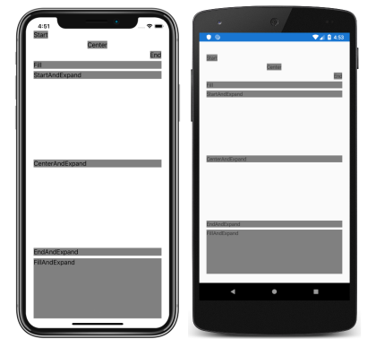

The size and position of child views within a [`StackLayout`](xref:Xamarin.Forms.StackLayout) depend upon the values of the child views'  [`HeightRequest`](xref:Xamarin.Forms.VisualElement.HeightRequest) and [`WidthRequest`](xref:Xamarin.Forms.VisualElement.WidthRequest) properties, and the values of the [`HorizontalOptions`](xref:Xamarin.Forms.View.HorizontalOptions) and [`VerticalOptions`](xref:Xamarin.Forms.View.VerticalOptions) properties.

The [`HorizontalOptions`](xref:Xamarin.Forms.View.HorizontalOptions) and [`VerticalOptions`](xref:Xamarin.Forms.View.VerticalOptions) properties can be set to fields from the [`LayoutOptions`](xref:Xamarin.Forms.LayoutOptions) struct, which encapsulates two layout preferences:

- **Alignment** – the child view's preferred alignment, which determines its position and size within its parent layout.
- **Expansion** – indicates if the child view should use extra space, if it's available (used only by a [`StackLayout`](xref:Xamarin.Forms.StackLayout)).

# [Visual Studio](#tab/vswin)

1. In **MainPage.xaml**, modify the [`StackLayout`](xref:Xamarin.Forms.StackLayout) declaration to set alignment and expansion options for each [`Label`](xref:Xamarin.Forms.Label):

    ```xaml
    <StackLayout Margin="20,35,20,25">
        <Label Text="Start"
               HorizontalOptions="Start"
               BackgroundColor="Gray" />
        <Label Text="Center"
               HorizontalOptions="Center"
               BackgroundColor="Gray" />
        <Label Text="End"
               HorizontalOptions="End"
               BackgroundColor="Gray" />
        <Label Text="Fill"
               HorizontalOptions="Fill"
               BackgroundColor="Gray" />
        <Label Text="StartAndExpand"
               VerticalOptions="StartAndExpand"
               BackgroundColor="Gray" />
        <Label Text="CenterAndExpand"
               VerticalOptions="CenterAndExpand"
               BackgroundColor="Gray" />
        <Label Text="EndAndExpand"
               VerticalOptions="EndAndExpand"
               BackgroundColor="Gray" />
        <Label Text="FillAndExpand"
               VerticalOptions="FillAndExpand"
               BackgroundColor="Gray" />
    </StackLayout>
    ```

    This code sets alignment preferences on the first four [`Label`](xref:Xamarin.Forms.Label) instances, and expansion preferences on the final four `Label` instances. The [`Start`](xref:Xamarin.Forms.LayoutOptions.Start), [`Center`](xref:Xamarin.Forms.LayoutOptions.Center), [`End`](xref:Xamarin.Forms.LayoutOptions.End), and [`Fill`](xref:Xamarin.Forms.LayoutOptions.Fill) fields are used to define the alignment of the [`Label`](xref:Xamarin.Forms.Label) instances within the parent [`StackLayout`](xref:Xamarin.Forms.StackLayout). The [`StartAndExpand`](xref:Xamarin.Forms.LayoutOptions.StartAndExpand), [`CenterAndExpand`](xref:Xamarin.Forms.LayoutOptions.CenterAndExpand), [`EndAndExpand`](xref:Xamarin.Forms.LayoutOptions.EndAndExpand), and [`FillAndExpand`](xref:Xamarin.Forms.LayoutOptions.FillAndExpand) fields are used to define the alignment preference, and whether the view will occupy more space if available within the parent `StackLayout`.

    > [!NOTE]
    > The default value of a view's [`HorizontalOptions`](xref:Xamarin.Forms.View.HorizontalOptions) and [`VerticalOptions`](xref:Xamarin.Forms.View.VerticalOptions) properties is [`Fill`](xref:Xamarin.Forms.LayoutOptions.Fill).

1. If the application is still running, save the changes to the file and the application user interface will automatically be updated in your simulator or emulator. Otherwise, in the Visual Studio toolbar, press the **Start** button (the triangular button that resembles a Play button) to launch the application inside your chosen remote iOS simulator or Android emulator:

    [](../images/alignment-expansion-large.png#lightbox "StackLayout containing Label instances, with alignment and expansion set")

    A [`StackLayout`](xref:Xamarin.Forms.StackLayout) only respects the alignment preferences on child views that are in the opposite direction to the `StackLayout` orientation. Therefore, the [`Label`](xref:Xamarin.Forms.Label) child views within the vertically oriented `StackLayout` set their [`HorizontalOptions`](xref:Xamarin.Forms.View.HorizontalOptions) properties to one of the alignment fields:

    - [`Start`](xref:Xamarin.Forms.LayoutOptions.Start), which positions the [`Label`](xref:Xamarin.Forms.Label) on the left hand side of the [`StackLayout`](xref:Xamarin.Forms.StackLayout).
    - [`Center`](xref:Xamarin.Forms.LayoutOptions.Center), which centers the [`Label`](xref:Xamarin.Forms.Label) in the [`StackLayout`](xref:Xamarin.Forms.StackLayout).
    - [`End`](xref:Xamarin.Forms.LayoutOptions.End), which positions the [`Label`](xref:Xamarin.Forms.Label) on the right hand side of the [`StackLayout`](xref:Xamarin.Forms.StackLayout).
    - [`Fill`](xref:Xamarin.Forms.LayoutOptions.Fill), which ensures that the [`Label`](xref:Xamarin.Forms.Label) fills the width of the [`StackLayout`](xref:Xamarin.Forms.StackLayout).

    A [`StackLayout`](xref:Xamarin.Forms.StackLayout) can only expand child views in the direction of its orientation. Therefore, the vertically oriented `StackLayout` can expand [`Label`](xref:Xamarin.Forms.Label) child views that set their [`VerticalOptions`](xref:Xamarin.Forms.View.VerticalOptions) properties to one of the expansion fields. This means that, for vertical alignment, each `Label` occupies the same amount of space within the `StackLayout`. However, only the final `Label`, which sets its [`VerticalOptions`](xref:Xamarin.Forms.View.VerticalOptions) property to [`FillAndExpand`](xref:Xamarin.Forms.LayoutOptions.FillAndExpand) has a different size.

    > [!IMPORTANT]
    > When all the space in a [`StackLayout`](xref:Xamarin.Forms.StackLayout) is used, expansion preferences have no effect.

    In Visual Studio, stop the application.

    For more information about alignment and expansion, see [Layout Options in Xamarin.Forms](~/xamarin-forms/user-interface/layouts/layout-options.md).

# [Visual Studio for Mac](#tab/vsmac)

1. In **MainPage.xaml**, modify the [`StackLayout`](xref:Xamarin.Forms.StackLayout) declaration to set alignment and expansion options for each [`Label`](xref:Xamarin.Forms.Label):

    ```xaml
    <StackLayout Margin="20,35,20,25">
        <Label Text="Start"
               HorizontalOptions="Start"
               BackgroundColor="Gray" />
        <Label Text="Center"
               HorizontalOptions="Center"
               BackgroundColor="Gray" />
        <Label Text="End"
               HorizontalOptions="End"
               BackgroundColor="Gray" />
        <Label Text="Fill"
               HorizontalOptions="Fill"
               BackgroundColor="Gray" />
        <Label Text="StartAndExpand"
               VerticalOptions="StartAndExpand"
               BackgroundColor="Gray" />
        <Label Text="CenterAndExpand"
               VerticalOptions="CenterAndExpand"
               BackgroundColor="Gray" />
        <Label Text="EndAndExpand"
               VerticalOptions="EndAndExpand"
               BackgroundColor="Gray" />
        <Label Text="FillAndExpand"
               VerticalOptions="FillAndExpand"
               BackgroundColor="Gray" />
    </StackLayout>
    ```

    This code sets alignment preferences on the first four [`Label`](xref:Xamarin.Forms.Label) instances, and expansion preferences on the final four `Label` instances. The [`Start`](xref:Xamarin.Forms.LayoutOptions.Start), [`Center`](xref:Xamarin.Forms.LayoutOptions.Center), [`End`](xref:Xamarin.Forms.LayoutOptions.End), and [`Fill`](xref:Xamarin.Forms.LayoutOptions.Fill) fields are used to define the alignment of the [`Label`](xref:Xamarin.Forms.Label) instances within the parent [`StackLayout`](xref:Xamarin.Forms.StackLayout). The [`StartAndExpand`](xref:Xamarin.Forms.LayoutOptions.StartAndExpand), [`CenterAndExpand`](xref:Xamarin.Forms.LayoutOptions.CenterAndExpand), [`EndAndExpand`](xref:Xamarin.Forms.LayoutOptions.EndAndExpand), and [`FillAndExpand`](xref:Xamarin.Forms.LayoutOptions.FillAndExpand) fields are used to define the alignment preference, and whether the view will occupy more space if available within the parent `StackLayout`.

    > [!NOTE]
    > The default value of a view's [`HorizontalOptions`](xref:Xamarin.Forms.View.HorizontalOptions) and [`VerticalOptions`](xref:Xamarin.Forms.View.VerticalOptions) properties is [`Fill`](xref:Xamarin.Forms.LayoutOptions.Fill).

1. If the application is still running, save the changes to the file and the application user interface will automatically be updated in your simulator or emulator. Otherwise, in the Visual Studio for Mac toolbar, press the **Start** button (the triangular button that resembles a Play button) to launch the application inside your chosen iOS simulator or Android emulator:

    [](../images/alignment-expansion-large.png#lightbox "StackLayout containing Label instances, with alignment and expansion set")

    A [`StackLayout`](xref:Xamarin.Forms.StackLayout) only respects the alignment preferences on child views that are in the opposite direction to the `StackLayout` orientation. Therefore, the [`Label`](xref:Xamarin.Forms.Label) child views within the vertically oriented `StackLayout` set their [`HorizontalOptions`](xref:Xamarin.Forms.View.HorizontalOptions) properties to one of the alignment fields:

    - [`Start`](xref:Xamarin.Forms.LayoutOptions.Start), which positions the [`Label`](xref:Xamarin.Forms.Label) on the left hand side of the [`StackLayout`](xref:Xamarin.Forms.StackLayout).
    - [`Center`](xref:Xamarin.Forms.LayoutOptions.Center), which centers the [`Label`](xref:Xamarin.Forms.Label) in the [`StackLayout`](xref:Xamarin.Forms.StackLayout).
    - [`End`](xref:Xamarin.Forms.LayoutOptions.End), which positions the [`Label`](xref:Xamarin.Forms.Label) on the right hand side of the [`StackLayout`](xref:Xamarin.Forms.StackLayout).
    - [`Fill`](xref:Xamarin.Forms.LayoutOptions.Fill), which ensures that the [`Label`](xref:Xamarin.Forms.Label) fills the width of the [`StackLayout`](xref:Xamarin.Forms.StackLayout).

    A [`StackLayout`](xref:Xamarin.Forms.StackLayout) can only expand child views in the direction of its orientation. Therefore, the vertically oriented `StackLayout` can expand [`Label`](xref:Xamarin.Forms.Label) child views that set their [`VerticalOptions`](xref:Xamarin.Forms.View.VerticalOptions) properties to one of the expansion fields. This means that, for vertical alignment, each `Label` occupies the same amount of space within the `StackLayout`. However, only the final `Label`, which sets its [`VerticalOptions`](xref:Xamarin.Forms.View.VerticalOptions) property to [`FillAndExpand`](xref:Xamarin.Forms.LayoutOptions.FillAndExpand) has a different size.

    > [!IMPORTANT]
    > When all the space in a [`StackLayout`](xref:Xamarin.Forms.StackLayout) is used, expansion preferences have no effect.

    In Visual Studio for Mac, stop the application.

    For more information about alignment and expansion, see [Layout Options in Xamarin.Forms](~/xamarin-forms/user-interface/layouts/layout-options.md).
