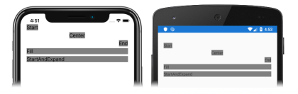

Before attempting this tutorial, you should have successfully completed the:

- [Build your first Xamarin.Forms app](~/get-started/first-app/index.md) quickstart.

In this tutorial, you learn how to:

> [!div class="checklist"]
>
> - Create a Xamarin.Forms [`StackLayout`](xref:Xamarin.Forms.StackLayout) in XAML.
> - Specify the orientation of the `StackLayout`.
> - Control child view alignment and expansion within the `StackLayout`.

You will use Visual Studio 2019, or Visual Studio for Mac, to create a simple application that demonstrates how to align controls within a [`StackLayout`](xref:Xamarin.Forms.StackLayout). The following screenshots show the final application:

You'll also use [XAML Hot Reload for Xamarin.Forms](~/xamarin-forms/xaml/hot-reload.md) to see UI changes without rebuilding your application.
