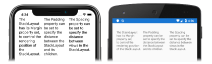

# [Visual Studio](#tab/vswin)

1. In **MainPage.xaml**, modify the [`StackLayout`](xref:Xamarin.Forms.StackLayout) declaration so it aligns its children horizontally, instead of vertically:

    ```xaml
    <StackLayout Margin="20,35,20,25"
                 Orientation="Horizontal">
        <Label Text="The StackLayout has its Margin property set, to control the rendering position of the StackLayout." />
        <Label Text="The Padding property can be set to specify the distance between the StackLayout and its children." />
        <Label Text="The Spacing property can be set to specify the distance between views in the StackLayout." />
    </StackLayout>
    ```

    This code sets the [`Orientation`](xref:Xamarin.Forms.StackLayout.Orientation) property to [`Horizontal`](xref:Xamarin.Forms.StackOrientation.Horizontal).

1. If the application is still running, save the changes to the file and the application user interface will automatically be updated in your simulator or emulator. Otherwise, in the Visual Studio toolbar, press the **Start** button (the triangular button that resembles a Play button) to launch the application inside your chosen remote iOS simulator or Android emulator:

    [](../images/orientation-large.png#lightbox "StackLayout containing horizontally oriented Label instances")

    Note that the [`Label`](xref:Xamarin.Forms.Label) instances within the [`StackLayout`](xref:Xamarin.Forms.StackLayout) are now aligned horizontally, instead of vertically.

# [Visual Studio for Mac](#tab/vsmac)

1. In **MainPage.xaml**, modify the [`StackLayout`](xref:Xamarin.Forms.StackLayout) declaration so it aligns its children horizontally, instead of vertically:

    ```xaml
    <StackLayout Margin="20,35,20,25"
                 Orientation="Horizontal">
        <Label Text="The StackLayout has its Margin property set, to control the rendering position of the StackLayout." />
        <Label Text="The Padding property can be set to specify the distance between the StackLayout and its children." />
        <Label Text="The Spacing property can be set to specify the distance between views in the StackLayout." />
    </StackLayout>
    ```

    This code sets the [`Orientation`](xref:Xamarin.Forms.StackLayout.Orientation) property to [`Horizontal`](xref:Xamarin.Forms.StackOrientation.Horizontal).

1. If the application is still running, save the changes to the file and the application user interface will automatically be updated in your simulator or emulator. Otherwise, in the Visual Studio for Mac toolbar, press the **Start** button (the triangular button that resembles a Play button) to launch the application inside your chosen iOS simulator or Android emulator:

    [](../images/orientation-large.png#lightbox "StackLayout containing horizontally oriented Label instances")

    Note that the [`Label`](xref:Xamarin.Forms.Label) instances within the [`StackLayout`](xref:Xamarin.Forms.StackLayout) are now aligned horizontally, instead of vertically.
