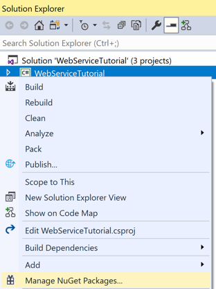
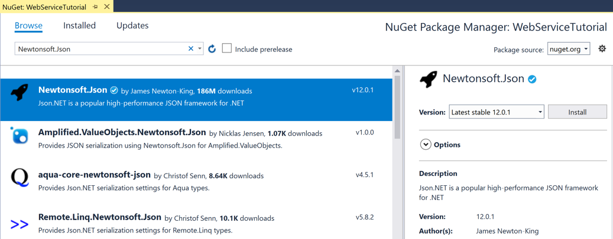
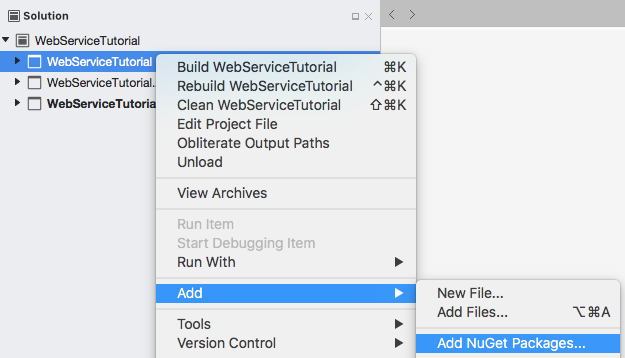

# [Visual Studio](#tab/vswin)

To complete this tutorial you should have Visual Studio 2019 (latest release), with the **Mobile development with .NET** workload installed. In addition, you will require a paired Mac to build the tutorial application on iOS. For information about installing the Xamarin platform, see [Installing Xamarin](~/get-started/installation/index.md). For information about connecting Visual Studio 2019 to a Mac build host, see [Pair to Mac for Xamarin.iOS development](~/ios/get-started/installation/windows/connecting-to-mac/index.md).

1. Launch Visual Studio, and create a new blank Xamarin.Forms app named **WebServiceTutorial**.

    > [!IMPORTANT]
    > The C# and XAML snippets in this tutorial requires that the solution is named **WebServiceTutorial**. Using a different name will result in build errors when you copy code from this tutorial into the solution.

    For more information about the .NET Standard library that gets created, see [Anatomy of a Xamarin.Forms application](~/get-started/first-app/index.md) in the [Xamarin.Forms Quickstart Deep Dive](~/get-started/first-app/index.md).

1. In **Solution Explorer**, select the **WebServiceTutorial** project, right-click and select **Manage NuGet Packages...**:

    

1. In the **NuGet Package Manager**, select the **Browse** tab, search for the **Newtonsoft.Json** NuGet package, select it, and click the **Install** button to add it to the project:

    

    This package will be used to incorporate JSON deserialization into the application.

1. Build the solution to ensure there are no errors.

# [Visual Studio for Mac](#tab/vsmac)

To complete this tutorial you should have Visual Studio for Mac (latest release), with iOS and Android platform support installed. In addition, you will also require Xcode (latest release). For more information about installing the Xamarin platform, see [Installing Xamarin](~/get-started/installation/index.md).

1. Launch Visual Studio for Mac, and create a new blank Xamarin.Forms app named **WebServiceTutorial**.

    > [!IMPORTANT]
    > The C# and XAML snippets in this tutorial requires that the solution is named **WebServiceTutorial**. Using a different name will result in build errors when you copy code from this tutorial into the solution.

    For more information about the .NET Standard library that gets created, see [Anatomy of a Xamarin.Forms application](~/get-started/first-app/index.md) in the [Xamarin.Forms Quickstart Deep Dive](~/get-started/first-app/index.md).

1. In **Solution Pad**, select the **WebServiceTutorial** project, right-click and select **Manage NuGet Packages...**:

    

1. In the **Manage NuGet Packages** window, search for the **Newtonsoft.Json** NuGet package, select it, and click the **Add Package** button to add it to the project:

    

    This package will be used to incorporate JSON deserialization into the application.

1. Build the solution to ensure there are no errors.
