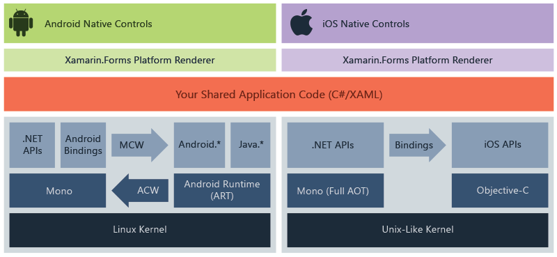

# What is Xamarin.Forms?

Xamarin.Forms is an open-source UI framework. Xamarin.Forms allows developers to build Xamarin.Android, Xamarin.iOS, and Windows applications from a single shared codebase.

Xamarin.Forms allows developers to create user interfaces in XAML with code-behind in C#. These interfaces are rendered as performant native controls on each platform.

## Who Xamarin.Forms is for

Xamarin.Forms is for developers with the following goals:

- Share UI layout and design across platforms.
- Share code, test and business logic across platforms.
- Write cross-platform apps in C# with Visual Studio.

## How Xamarin.Forms works

Xamarin.Forms provides a consistent API for creating UI elements across platforms. This API can be implemented in either XAML or C# and supports databinding for patterns such as Model-View-ViewModel (MVVM).

At runtime, Xamarin.Forms utilizes platform renderers to convert the cross-platform UI elements into native controls on Xamarin.Android, Xamarin.iOS and UWP. This allows developers to get the native look, feel and performance while realizing the benefits of code sharing across platforms.

Xamarin.Forms applications typically consist of a shared .NET Standard library and individual platform projects. The shared library contains the XAML or C# views and any business logic such as services, models or other code. The platform projects contain any platform-specific logic or packages the application requires.

Xamarin.Forms uses the Xamarin platform to run .NET applications natively across platforms. For more information about the Xamarin platform, see [What is Xamarin?](~/get-started/what-is-xamarin.md).

## Additional functionality

Xamarin.Forms has a large ecosystem of libraries that add diverse functionality to applications. This section describes some of this additional functionality.

### Xamarin.Essentials

Xamarin.Essentials is a library that provides cross-platform APIs for native device features. Like Xamarin itself, Xamarin.Essentials is an abstraction that simplifies the process of accessing native utilities. Some examples of utilities provided by Xamarin.Essentials include:

- Device info
- File system
- Accelerometer
- Phone dialer
- Text-to-speech
- Screen lock

For more information, see [Xamarin.Essentials](~/essentials/index.md).

### Shell

Xamarin.Forms Shell reduces the complexity of mobile application development by providing the fundamental features that most applications require. Some examples of features provided by Shell include:

- Common navigation experience
- URI-based navigation scheme
- Integrated search handler

For more information, see [Xamarin.Forms Shell](~/xamarin-forms/app-fundamentals/shell/index.md)

### Platform-specifics

Xamarin.Forms provides a common API that renders native controls across platforms, but a specific platform may have functionality that doesn't exist on other platforms. For example, the Android platform has native functionality for Fast Scrolling in a `ListView` but iOS does not. Xamarin.Forms platform-specifics allow you to utilize functionality that is only available on a specific platform without creating custom renderers or effects.

Xamarin.Forms includes pre-built solutions for a variety of platform-specific functionality. For more information, see:

- [Xamarin.Forms platform-specifics](~/xamarin-forms/platform/platform-specifics/index.md)
- [Android platform-specifics](~/xamarin-forms/platform/android/index.md)
- [iOS platform-specifics](~/xamarin-forms/platform/ios/index.md)
- [Windows platform-specifics](~/xamarin-forms/platform/windows/index.md)

### Material Visual

Xamarin.Forms Material Visual is used to apply Material Design rules to Xamarin.Forms applications. Xamarin.Forms Material Visual utilizes the Visual property to selectively apply custom renderers to the UI, resulting in an application with a consistent look and feel across iOS and Android.

For more information, see [Xamarin.Forms Material Visual](~/xamarin-forms/user-interface/visual/material-visual.md)

## Related links

- [Get started with Xamarin.Forms](~/xamarin-forms/index.yml)
- [Xamarin.Essentials](~/essentials/index.md)
- [Xamarin.Forms Shell](~/xamarin-forms/app-fundamentals/shell/index.md)
- [Xamarin.Forms Material Visual](~/xamarin-forms/user-interface/visual/material-visual.md)
