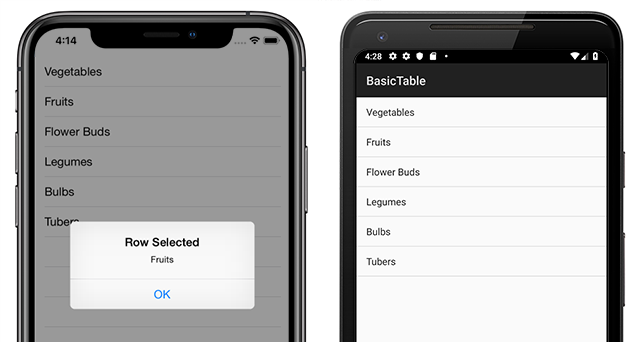
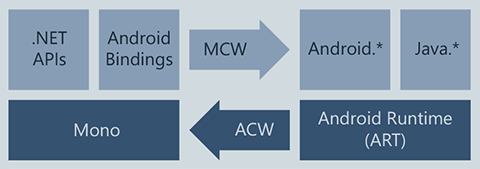
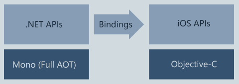

# What is Xamarin?

Xamarin is an open-source platform for building modern and performant applications for iOS, Android, and Windows with .NET. Xamarin is an abstraction layer that manages communication of shared code with underlying platform code. Xamarin runs in a managed environment that provides conveniences such as memory allocation and garbage collection.

Xamarin enables developers to share an average of 90% of their application across platforms. This pattern allows developers to write all of their business logic in a single language (or reuse existing application code) but achieve native performance, look, and feel on each platform.

Xamarin applications can be written on PC or Mac and compile into native application packages, such as an **.apk** file on Android, or an **.ipa** file on iOS.

> [!NOTE]
> Compiling and deploying applications for iOS currently requires a MacOS machine. For more information about development requirements, see [system requirements](~/cross-platform/get-started/requirements.md#macos-requirements).

## Who Xamarin is for

Xamarin is for developers with the following goals:

- Share code, test and business logic across platforms.
- Write cross-platform applications in C# with Visual Studio.

## How Xamarin works

The diagram shows the overall architecture of a cross-platform Xamarin application. Xamarin allows you to create native UI on each platform and write business logic in C# that is shared across platforms. In most cases, 80% of application code is sharable using Xamarin.

Xamarin is built on top of .NET, which automatically handles tasks such as memory allocation, garbage collection and interoperability with underlying platforms.

For more information about platform-specific architecture, see [Xamarin.Android](#xamarinandroid) and [Xamarin.iOS](#xamarinios).

### Added features

Xamarin combines the abilities of native platforms and adds a number of features, including:

1. **Complete binding for the underlying SDKs** – Xamarin contains bindings for nearly the entire underlying platform SDKs in both iOS and Android. Additionally, these bindings are strongly-typed, which means that they’re easy to navigate and use, and provide robust compile-time type checking and during development. Strongly-typed bindings lead to fewer runtime errors and higher-quality applications.
1. **Objective-C, Java, C, and C++ Interop** – Xamarin provides facilities for directly invoking Objective-C, Java, C, and C++ libraries, giving you the power to use a wide array of third party code. This functionality lets you use existing iOS and Android libraries written in Objective-C, Java, or C/C++. Additionally, Xamarin offers binding projects that allow you to bind native Objective-C and Java libraries using a declarative syntax.
1. **Modern language constructs** – Xamarin applications are written in C#, a modern language that includes significant improvements over Objective-C and Java such as dynamic language features, functional constructs such as lambdas, LINQ, parallel programming, generics, and more.
1. **Robust Base Class Library (BCL)** – Xamarin applications use the .NET BCL, a large collection of classes that have comprehensive and streamlined features such as powerful XML, Database, Serialization, IO, String, and Networking support, and more. Existing C# code can be compiled for use in an app, which provides access to thousands of libraries that add functionality beyond the BCL.
1. **Modern Integrated Development Environment (IDE)** – Xamarin uses Visual Studio, a modern IDE that includes features such as code auto completion, a sophisticated project and solution management system, a comprehensive project template library, integrated source control, and more.
1. **Mobile cross-platform support** – Xamarin offers sophisticated cross-platform support for the three major platforms of iOS, Android, and Windows. Applications can be written to share up to 90% of their code, and Xamarin.Essentials offers a unified API to access common resources across all three platforms. Shared code can significantly reduce both development costs and time to market for mobile developers.

### Xamarin.Android

Xamarin.Android applications compile from C# into **Intermediate Language (IL)** which is then **Just-in-Time (JIT)** compiled to a native assembly when the application launches. Xamarin.Android applications run within the Mono execution environment, side by side with the Android Runtime (ART) virtual machine. Xamarin provides .NET bindings to the Android.* and Java.* namespaces. The Mono execution environment calls into these namespaces via **Managed Callable Wrappers (MCW)** and provides **Android Callable Wrappers (ACW)** to the ART, allowing both environments to invoke code in each other.

For more information, see [Xamarin.Android architecture](~/android/internals/architecture.md).

### Xamarin.iOS

Xamarin.iOS applications are fully **Ahead-of-Time (AOT)** compiled from C# into native ARM assembly code. Xamarin uses **Selectors** to expose Objective-C to managed C# and **Registrars** to expose managed C# code to Objective-C. Selectors and Registrars collectively are called "bindings" and allow Objective-C and C# to communicate.

For more information, see [Xamarin.iOS architecture](~/ios/internals/architecture.md).

### Xamarin.Essentials

Xamarin.Essentials is a library that provides cross-platform APIs for native device features. Like Xamarin itself, Xamarin.Essentials is an abstraction that simplifies the process of accessing native functionality. Some examples of functionality provided by Xamarin.Essentials include:

- Device info
- File system
- Accelerometer
- Phone dialer
- Text-to-speech
- Screen lock

For more information, see [Xamarin.Essentials](~/essentials/index.md).

### Xamarin.Forms

Xamarin.Forms is an open-source UI framework. Xamarin.Forms allows developers to build Xamarin.iOS, Xamarin.Android, and Windows applications from a single shared codebase. Xamarin.Forms allows developers to create user interfaces in XAML with code-behind in C#. These user interfaces are rendered as performant native controls on each platform. Some examples of features provided by Xamarin.Forms include:

- XAML user-interface language
- Databinding
- Gestures
- Effects
- Styling

For more information, see [Xamarin.Forms](~/xamarin-forms/index.yml).

## Get started

The following guides will help you build your first app using Xamarin:

- [Get started with Xamarin.Forms](~/xamarin-forms/index.yml)
- [Get started with Xamarin.Android](~/android/index.yml)
- [Get started with Xamarin.iOS](~/ios/index.yml)
- [Get started with Xamarin.Mac](~/mac/index.yml)

## Related video

> [!Video https://channel9.msdn.com/Series/Xamarin-101/What-is-Xamarin-1-of-11/player]

[!include]
