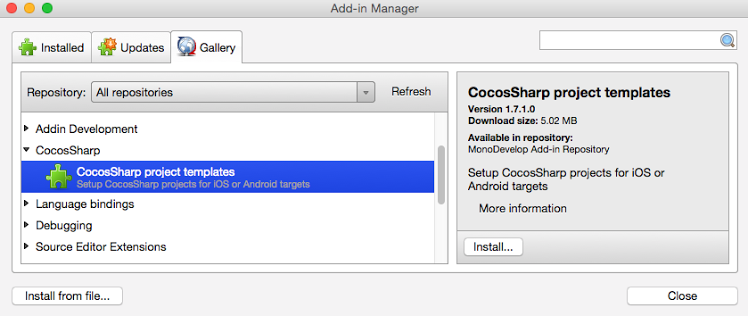
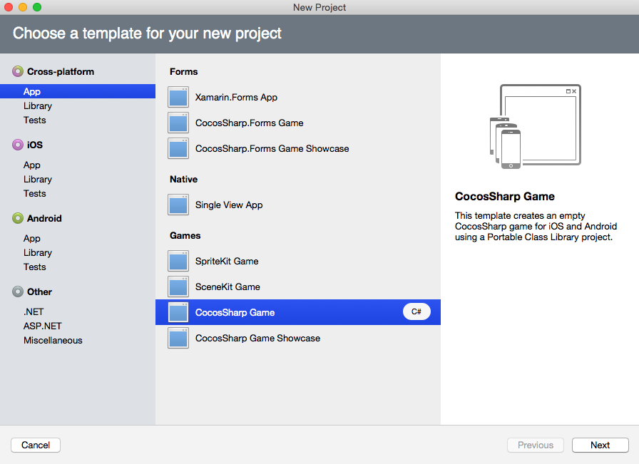
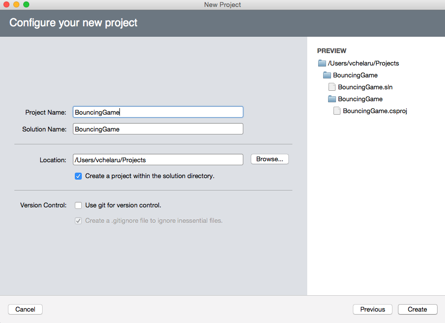

# Creating a Multi-Platform CocosSharp Project

_This walkthrough shows how to create a new multi-platform CocosSharp solution. The result of this walkthrough is a Visual Studio for Mac solution which includes three projects: one portable class library project, one Android-specific project, and one iOS-specific project. The resulting project will display an empty black screen when executed._

The CocosSharp 2D game engine allows code and content to be shared across multiple platforms. This walkthrough shows how to create a project which can support both iOS and Android development. Specifically, this walkthrough will cover the following topics:

 - Installing CocosSharp
 - Creating a new solution
 - `LoadGame` method

# Installing CocosSharp

First, we'll add CocosSharp to Visual Studio for Mac. If running on a Mac, select **Visual Studio for Mac** > **Add-in Manager...** . If running on Windows, select **Tools** > **Add-in Manager...** . Click the **Gallery** tab, expand the **CocosSharp item**, select **CocosSharp project templates**, and finally click **Install...** .

# Creating a New Solution

Now that CocosSharp is installed, we’ll create a solution. In Visual Studio for Mac, select **File** > **New** > **Solution...**. Select the **App** option under the **Cross-platform** section, select **CocosSharp empty project**, and then click **Next**:

Enter the name **BouncingGame** for the **Project Name**, then click **Create**:

Once the project has been created and Visual Studio for Mac, we can compile and run it to view an gray background: 

# LoadGame Method

The default CocosSharp project includes classes specific to iOS and Android for setting up a `CCGameView`, which is used to start CocosSharp. The `CCGameView` instance is created in a platform-specific way: the iOS project creates the `CCGameView` in the `Main.storyboard` file, while Android creates the `CCGameView` in the `Main.axml` file. Each platform uses the CCGameView instance in a `LoadGame` method which performs some basic setup. Even though we won't be modifying this code, let's take a look at some important details:

 - The code sets the `gameView.DesignResolution` to 1024 by 768. This standardizes positioning across devices regardless of the current device's aspect ratio, physical resolution, or orientation. 
 - The code adds a few search paths. Search paths also allow content to be loaded without directory prefixes. For example, since the `"Sounds"` path is added as a search path, then a file in the directory `"Content/Sounds/mysound.xnb"` could simply be loaded as `"mysound.xnb"`. Search paths are similar to `using` statements in code – they can reduce code, but they can also introduce ambiguity.
 - The code constructs a `GameLayer` instance. `GameLayer` is a `CCLayer`-inheriting class where we will be adding all of our game logic. Larger games may require multiple `CCLayer` instances, or even multiple `CCScene` instances (which can contain multiple `CCLayer` instances), but we’ll stick to a single `CCLayer` for this game.

#  Summary

This walkthrough covered how to create a cross-platform CocosSharp project using Visual Studio for Mac. The result is an empty screen which can be used as the starting point for any game project.