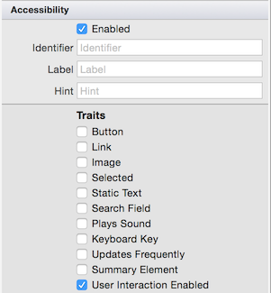
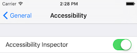
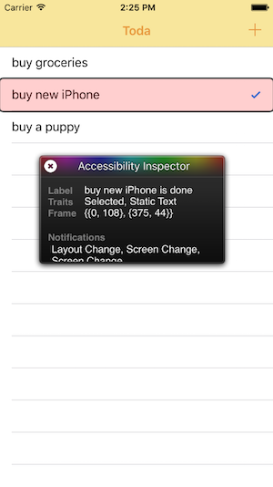

# Accessibility on iOS

This page describes how to use the iOS Accessibility APIs
to build apps according to the
[accessibility checklist](~/cross-platform/app-fundamentals/accessibility.md).
Refer to the [Android accessibility](~/android/app-fundamentals/accessibility.md)
and [OS X accessibility](~/mac/app-fundamentals/accessibility.md) pages
for other platform APIs.

## Describing UI Elements

iOS provides the `AccessibilityLabel` and `AccessibilityHint` properties
for developers to add descriptive text which can be used by the VoiceOver
screen reader to make the controls more accessible. Controls can also be
tagged with one or more traits that provide additional context in
accessible modes.

Some controls may not need to be accessible (for example, a label on a
text input or an image that is purely decorative) – the
`IsAccessibilityElement` is provided to disable accessibility in those cases.

**UI Designer**

The **Properties Pad** contains an accessibility section that allows these
settings to be edited when a control is selected in the iOS UI Designer:



**C#**

These properties can also be set directly in code:

```csharp
usernameInput.AccessibilityLabel = "Search";
usernameInput.Hint = "Press Enter after typing to search employee list";
someLabel.IsAccessibilityElement = false;
displayOnlyText.AccessibilityTraits = UIAccessibilityTrait.Header | UIAccessibilityTrait.Selected;
```

### What is AccessibilityIdentifier?

The `AccessibilityIdentifier` is used to set a unique key that can
be used to refer to user interface elements via the UIAutomation API.

The value of `AccessibilityIdentifier` is never spoken or displayed
to the user.

<a name="postnotification"></a>

## PostNotification

The `UIAccessibility.PostNotification` method allows events to be raised
to the user outside of direct interaction (for example, when they interact
with a specific control).

### Announcement

An announcement can be sent from code to inform the user that some state
has changed (such as a background operation has completed). This could be
accompanied by a visual indication in the user interface:

```csharp
UIAccessibility.PostNotification (
  UIAccessibilityPostNotification.Announcement,
    new NSString(@"Item was saved"));
```

### LayoutChanged

The `LayoutChanged` announcement is used when the screen layout:

```csharp
UIAccessibility.PostNotification (
  UIAccessibilityPostNotification.LayoutChanged,
    someControl);  // someControl gets focus
```

## Accessibility and Localization

Accessibility properties like the label and hint can be
localized just like other text in the user interface.

**MainStoryboard.strings**

If the user interface is laid out in a storyboard, you can
provide translations for accessibility properties in the same
way as other properties. In the example below, a `UITextField`
has a **Localization ID** of `Pqa-aa-ury` and two accessibility
properties being set in Spanish:

```csharp
/* Accessibility */
"Pqa-aa-ury.accessibilityLabel" = "Notas input";
"Pqa-aa-ury.accessibilityHint" = "escriba más información";
```

This file would be placed in the **es.lproj** directory for
Spanish content.

**Localizable.strings**

Alternatively, the translations can be added to the **Localizable.strings**
file in the localized content directory (eg. **es.lproj** for Spanish):

```csharp
/* Accessibility */
"Notes" = "Notas input";
"Provide more information" = "escriba más información";
```

These translations can be used in C# via the `LocalizedString` method:

```csharp
notesText.AccessibilityLabel = NSBundle.MainBundle.LocalizedString ("Notes", "");
notesText.AccessibilityHint = NSBundle.MainBundle.LocalizedString ("Provide more information", "");
```

Refer to the [iOS localization guide](~/ios/app-fundamentals/localization/index.md)
for more details on localizing content.

<a name="testing"></a>

## Testing Accessibility

VoiceOver is enabled in the **Settings** app by navigating to
**General > Accessibility > VoiceOver**:


The **Accessibility** screen also provides settings for zoom,
text size, color & contrast options, speech settings, and
other configuration options.

Follow these [VoiceOver instructions](https://developer.apple.com/library/ios/technotes/TestingAccessibilityOfiOSApps/TestAccessibilityonYourDevicewithVoiceOver/TestAccessibilityonYourDevicewithVoiceOver.html)
to test accessibility on iOS devices.

## Simulator Testing

When testing in the simulator, the **Accessibility Inspector**
is available to help verify accessibility properties and events are
correctly configured. Turn on the inspector
in the **Settings** app by navigating to **General > Accessibility > Accessibility Inspector**:



Once enabled, the inspector window hovers over the iOS screen at all times.
Here is an example of the output when a table view row is selected – notice
the **Label** contains a sentence that gives the content of the row and
also that it is "done" (ie. the tick is visible):



While the inspector is visible, use the "X" icon at the top-left
to temporarily show and hide the overlay and enable/disable
accessibility settings.

## Related Links

- [Cross-platform Accessibility](~/cross-platform/app-fundamentals/accessibility.md)
- [iOS Accessibility (Apple)](https://developer.apple.com/library/ios/documentation/UserExperience/Conceptual/iPhoneAccessibility/Accessibility_on_iPhone/Accessibility_on_iPhone.html)
- [iOS VoiceOver](https://www.apple.com/accessibility/ios/voiceover/)
