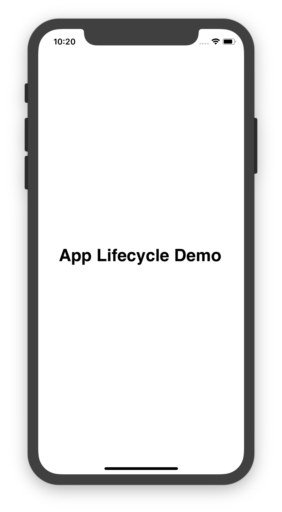
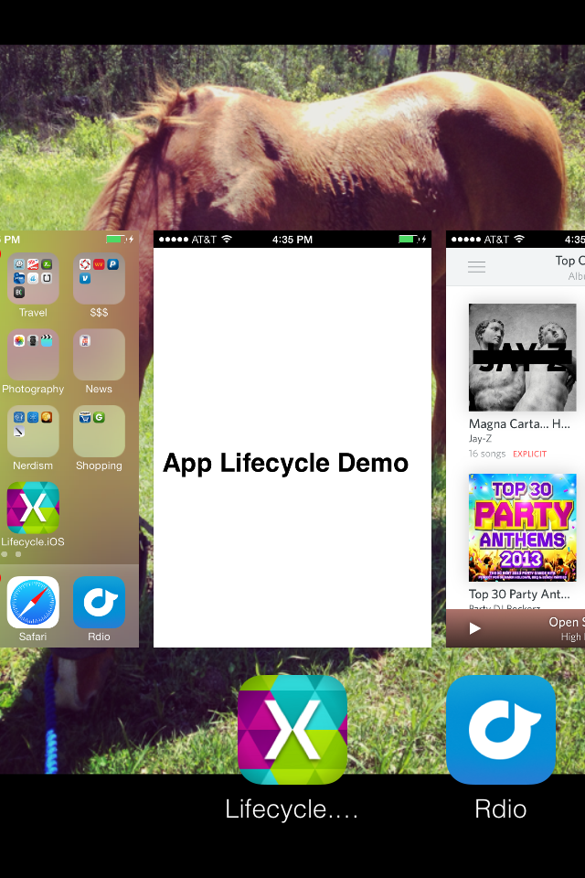
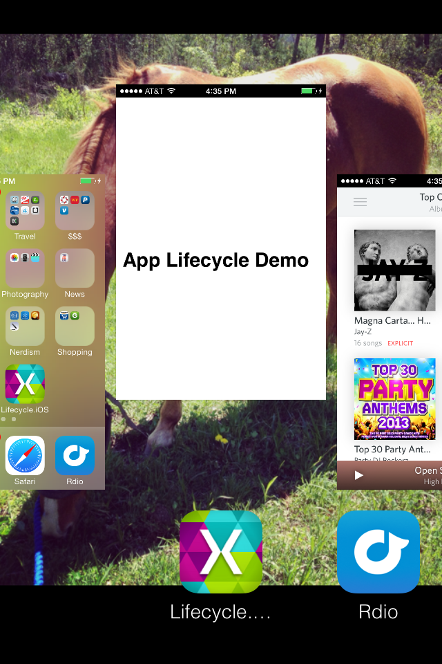

# Application Lifecycle Demo

In this section, we are going to examine an application that demonstrates the four Application States, and the role of the `AppDelegate` methods in notifying the application of when states get changed. The application will print updates to the console whenever the app changes state:

 [](application-lifecycle-demo-images/image3.png#lightbox)

 [](application-lifecycle-demo-images/image4.png#lightbox)

## Walkthrough


  1. Open the _Lifecycle_ project in the _LifecycleDemo_ solution.
  1. Open up the `AppDelegate` class. Note that we have added logging to the lifecycle methods to let us know when the application has changed state:

			```chsarp
				public override void OnActivated(UIApplication application)
				{
					Console.WriteLine("OnActivated called, App is active.");
				}
				public override void WillEnterForeground(UIApplication application)
				{
					Console.WriteLine("App will enter foreground");
				}
				public override void OnResignActivation(UIApplication application)
				{
					Console.WriteLine("OnResignActivation called, App moving to inactive state.");
				}
				public override void DidEnterBackground(UIApplication application)
				{
					Console.WriteLine("App entering background state.");
				}
				// not guaranteed that this will run
				public override void WillTerminate(UIApplication application)
				{
					Console.WriteLine("App is terminating.");
				}
			```

  1. Launch the application in the simulator or on the device. `OnActivated` will be called when the app launches. The application is now in the _Active_ state.
  1. Hit the Home button on the simulator or device to bring the application to the background. `OnResignActivation` and `DidEnterBackground` will be called as the app transitions from `Active` to `Inactive` and into the `Backgrounded` state. Since we have not given our application any code to execute in the background, the application is considered _Suspended_ in memory.
  1. Navigate back to the app to bring it back into the foreground. `WillEnterForeground` and `OnActivated` will both be called:

		

    Note that we added the following line of code to our view controller notifying us that the application has entered the foreground from the background:

		```csharp
			UIApplication.Notifications.ObserveWillEnterForeground ((sender, args) => {
					label.Text = "Welcome back!";
				});
		```

1. Press the **Home** button to put the application into the background. Then, double-tap the **Home** button to bring up the application switcher:
	
	
  
1. Locate the application in the App Switcher, and swipe up to remove it:
	
	 
    
iOS will terminate the application. Keep in mind that `WillTerminate` is not called because we are terminating an application that is _Suspended_ in the background.

Now that we understand iOS application states and transitions, we'll take a look at the different options available for backgrounding in iOS.


## Related Links

- [LifecycleDemo(Part2) (sample)](https://developer.xamarin.com/samples/monotouch/LifecycleDemo/)
