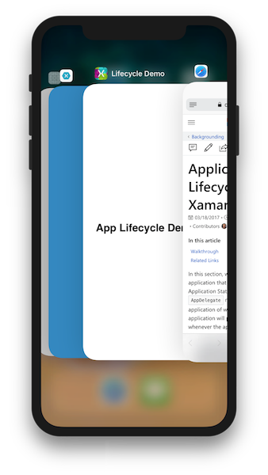
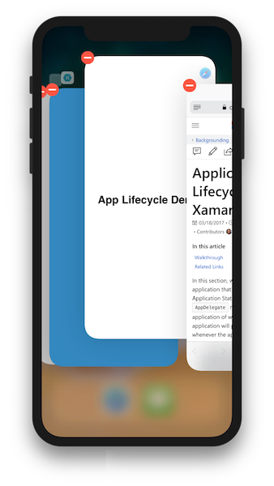

# Application lifecycle demo for Xamarin.iOS

This article and [sample code](/samples/xamarin/ios-samples/lifecycledemo) demonstrates the four application states in iOS, and the role of the `AppDelegate` methods in notifying the application of when states get changed. The application will print updates to the console whenever the app changes state:

[](application-lifecycle-demo-images/image3.png#lightbox)

[](application-lifecycle-demo-images/image4.png#lightbox)

## Walkthrough

1. Open the **Lifecycle** project in the **LifecycleDemo** solution.
1. Open up the `AppDelegate` class. Logging has been added to the lifecycle methods to indicate when the application has changed state:

    ```csharp
    public override void OnActivated(UIApplication application)
    {
        Console.WriteLine("OnActivated called, App is active.");
    }
    public override void WillEnterForeground(UIApplication application)
    {
        Console.WriteLine("App will enter foreground");
    }
    public override void OnResignActivation(UIApplication application)
    {
        Console.WriteLine("OnResignActivation called, App moving to inactive state.");
    }
    public override void DidEnterBackground(UIApplication application)
    {
        Console.WriteLine("App entering background state.");
    }
    // not guaranteed that this will run
    public override void WillTerminate(UIApplication application)
    {
        Console.WriteLine("App is terminating.");
    }
    ```

1. Launch the application in the simulator or on the device. `OnActivated` will be called when the app launches. The application is now in the _Active_ state.
1. Hit the Home button on the simulator or device to bring the application to the background. `OnResignActivation` and `DidEnterBackground` will be called as the app transitions from `Active` to `Inactive` and into the `Backgrounded` state. Since there is no application code set to execute in the background, the application is considered _suspended_ in memory.
1. Navigate back to the app to bring it back into the foreground. `WillEnterForeground` and `OnActivated` will both be called:

    

    The following line of code in the view controller is executed when the application has entered the foreground from the background, and changes the text displayed on the screen:

    ```csharp
    UIApplication.Notifications.ObserveWillEnterForeground ((sender, args) => {
        label.Text = "Welcome back!";
    });
    ```

1. Press the **Home** button to put the application into the background. Then, double-tap the **Home** button to bring up the application switcher. On the iPhone X, swipe up from the bottom of the screen:

    [](application-lifecycle-demo-images/app-switcher.png#lightbox)
  
1. Locate the application in the App Switcher, and swipe up to remove it (on iOS 11, long press until the red icons appear in the corner):

    [](application-lifecycle-demo-images/app-switcher-swipe.png#lightbox)

iOS will terminate the application. Note that `WillTerminate` is not called because application is already _suspended_ in the background.

## Related links

- [LifecycleDemo (sample)](/samples/xamarin/ios-samples/lifecycledemo)