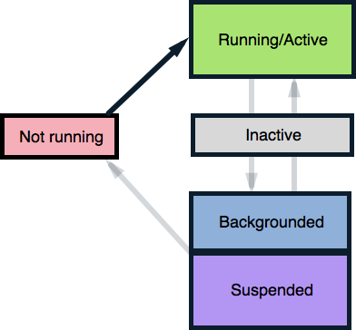
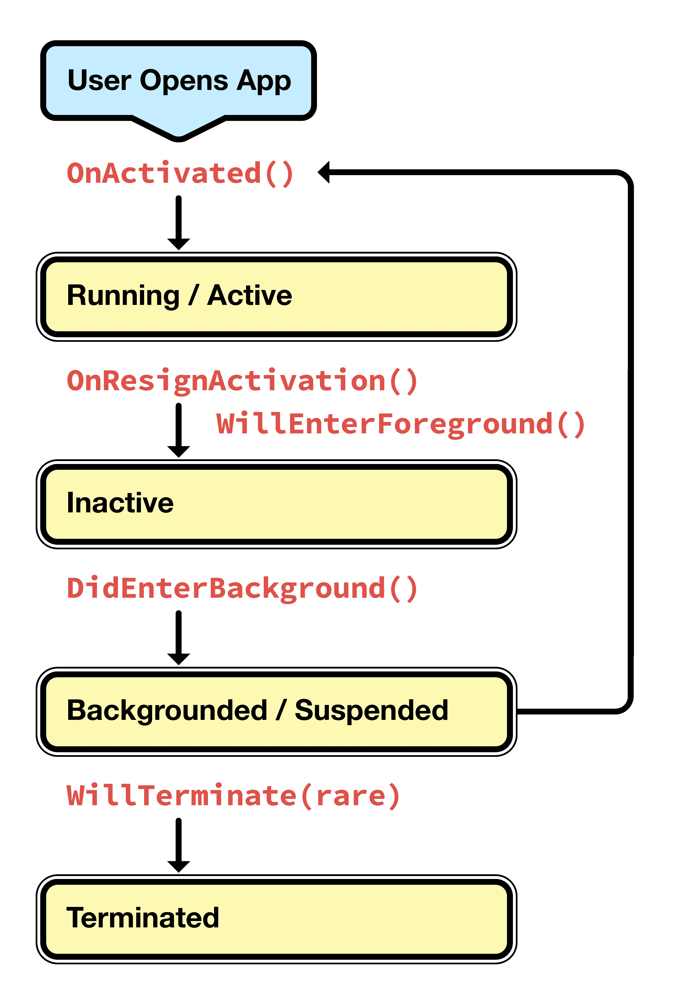
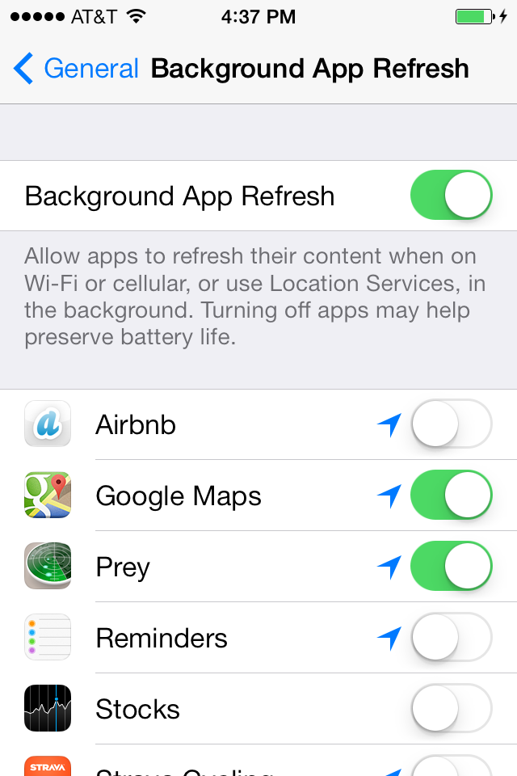

# Introduction to Backgrounding in iOS

iOS regulates background processing very tightly, and offers three approaches to implement it:

- **Register a Background Task** - If an application needs to complete an important task, it can ask iOS not to interrupt the task when the application moves into the background. For example, an application might need to finish logging in a user, or finish downloading a large file.
- **Register as a Background-Necessary Application** - An app can register as a specific type of application that has known, specific backgrounding requirements, such as  *Audio* ,  *VoIP* ,  *External Accessory* ,  *Newsstand* , and  *Location* . These applications are allowed continuous background processing privileges as long as they are performing tasks that are within the parameters of the registered application type.
- **Enable Background Updates** - Applications can trigger background updates with  *Region Monitoring* or by listening for  *Significant Location Changes* . As of iOS 7, applications can also register to update content in the background using  *Background Fetch* or  *Remote Notifications* .

## Application States and Application Delegate Methods

Before we dive into the code for background processing in iOS, we need to understand how backgrounding affects the lifecycle of an iOS application.

The iOS application lifecycle is a collection of application states and methods for moving between them. An application transitions between states based on the behavior of the user and the backgrounding requirements of the application. The movement is illustrated by the following diagram:

 

- **Not Running** - The application has not yet been launched on the device.
- **Running/Active** - The application is on the screen, and is executing code in the foreground.
- **Inactive** - The application is interrupted by an incoming phone call, text, or other interruption.
- **Backgrounded** - The application moves into the background and continues executing background code.
- **Suspended** - If the application does not have any code to run in the background, or if all code has completed, the app will be  *Suspended* by the OS. A suspended application's process is kept alive, but the application is unable to execute any code in this state.
- **Return to Not Running/Termination (Rare)** - Occasionally, the application's process is destroyed, and the application returns to the  *Not Running* state. This happens in low-memory situations, or if the user manually terminates the application.

Since the introduction of multitasking support, iOS rarely terminates idle applications, and instead keeps their processes *Suspended* in memory. Keeping an application's process alive ensures that the application launches quickly the next time the user opens it. It also means applications can move freely from the *Suspended* state back into the *Backgrounded* state without drawing on system resources. iOS 7 exploits this feature with new APIs that enable applications to pause background tasks when the device goes to sleep, update content directly from the background without user interaction, and more. We will cover the new APIs in [iOS Backgrounding Techniques](~/ios/app-fundamentals/backgrounding/ios-backgrounding-techniques/index.md).

## Application Lifecycle Methods

When an app changes state, iOS notifies the application through event methods in the `AppDelegate` class:

- `OnActivated` - This is called the first time the application is launched, and every time the app comes back into the foreground. This is the place to put code that needs to run every time the app is opened.
- `OnResignActivation` - If the user receives an interruption such as a text or phone call, this method gets called and the app is temporarily inactivated. Should the user accept the phone call, the app will be sent to the background.
- `DidEnterBackground` - Called when the app enters the backgrounded state, this method gives an application about five seconds to prepare for possible termination. Use this time to save user data and tasks, and remove sensitive information from the screen.
- `WillEnterForeground` - When a user returns to a backgrounded or suspended application, and launches it into the foreground,  `WillEnterForeground` gets called. This is the time to prepare the app to take the foreground by rehydrating any state saved during  `DidEnterBackground` .  `OnActivated` will be called immediately after this method completes.
- `WillTerminate` - The application is shut down, and its process is destroyed. This method only gets called if multitasking is not available on the device or the OS version, if memory is low, or if the user manually terminates a backgrounded application. Note that suspended applications that get terminated will not call  `WillTerminate` .

The following diagram illustrates how the application states and lifecycle methods fit together:

 

## User Controls for Backgrounding in iOS

iOS 7 introduced several features to give users more control over an application's backgrounded state. Both the App Switcher and the Background App Refresh setting affect the Application Lifecycle.

### App Switcher

The App Switcher is an important control feature introduced in iOS 7. It is launched by double-tapping the **Home** button, and shows the applications whose processes are alive:

 

Using the App Switcher, users can scroll through snapshots of all backgrounded and suspended applications. Tapping an application launches it into the foreground. Swiping up removes the application from the background, terminating its process. We will take a closer look at the App Switcher in the [iOS Application Lifecycle Demo](~/ios/app-fundamentals/backgrounding/application-lifecycle-demo.md) in the next section.

> [!IMPORTANT]
> The App Switcher does not show a difference between backgrounded and suspended applications.

### Background App Refresh Settings

iOS 7 increases user control over the Application Lifecycle by allowing users to opt out of backgrounding for applications [registered for background processing](~/ios/app-fundamentals/backgrounding/ios-backgrounding-techniques/registering-applications-to-run-in-background.md). *This does not prevent applications from running background tasks*.

Users can change this setting by navigating to **Settings > General > Background App Refresh** and editing the backgrounding privileges for a selected application. If Background App Refresh is set to off, the application will be suspended immediately upon entering the background, and prevented from doing any background processing:

 

Developers can check the Background Refresh Application status with the `BackgroundRefreshStatus` API. For an example, refer to the [Check Background Refresh Setting recipe](https://github.com/xamarin/recipes/tree/master/Recipes/ios/multitasking/check_background_refresh_setting).

We've covered the basics of the iOS Application Lifecycle, and features for controlling the Application Lifecycle. Next, let's see the iOS Application Lifecycle in action.
