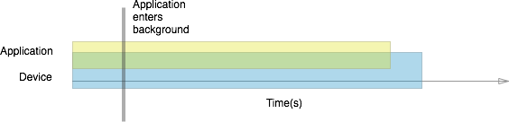
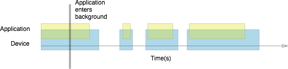

# iOS Backgrounding with Tasks

The simplest way to perform backgrounding on iOS is to break your backgrounding requirements into tasks, and run the tasks in the background. Tasks are under a strict time limit, and typically get about 600 seconds (10 minutes) of processing time after an application has moved to the background on iOS 6, and less than 10 minutes on iOS 7+.

Background tasks can be broken up into three categories:

1. **Background-Safe Tasks** - Called anywhere in the application where you have a task you don't want interrupted should the application enter the background.
1. **DidEnterBackground Tasks** - Called during the  `DidEnterBackground` application lifecycle method to assist in cleanup and state saving.
1. **Background Transfers (iOS 7+)** - A special type of background task used to perform network transfers on iOS 7. Unlike regular tasks, background transfers do not have a pre-determined time limit.

Background-safe and `DidEnterBackground` tasks are safe to use on both iOS 6 and iOS 7, with some minor differences. Let's investigate these two types of tasks in greater detail.

## Creating Background-Safe Tasks

Some applications contain tasks that shouldn't be interrupted by iOS should the application change state. One way to protect these tasks from being interrupted is to register them with iOS as long-running tasks. You can use this pattern anywhere in your application where you don't want a task being interrupted should the user put the app into the background. A great candidate for this pattern would be tasks such as sending a new user's registration information to your server, or verifying login information.

The following code snippet demonstrates registering a task to run in the background:

```csharp
nint taskID = UIApplication.SharedApplication.BeginBackgroundTask( () => {});

//runs on main or background thread
FinishLongRunningTask(taskID);

UIApplication.SharedApplication.EndBackgroundTask(taskID);
```

The registration process pairs a task with a unique identifier, `taskID`, and then wraps it in matching `BeginBackgroundTask` and `EndBackgroundTask` calls. To generate the identifier, we make a call to the `BeginBackgroundTask` method on the `UIApplication` object, and then start the long-running task, usually on a new thread. When the task is complete, we call `EndBackgroundTask` and pass in the same identifier. This is important because iOS will terminate the application if a `BeginBackgroundTask` call does not have a matching `EndBackgroundTask`.

> [!IMPORTANT]
> Background-safe tasks can run on either the main thread or a background thread, depending on the application's needs.

## Performing Tasks During DidEnterBackground

In addition to making a long-running task background-safe, registration can be used to kick off tasks as an application is being put in the background. iOS provides an event method in the *AppDelegate* class called `DidEnterBackground` that can be used to save application state, save user data, and encrypt sensitive content before an application enters the background. An application has approximately five seconds to return from this method or it will get terminated. Therefore, cleanup tasks that might take more than five seconds to complete can be called from inside the `DidEnterBackground` method. These tasks must be invoked on a separate thread.

The process is nearly identical to that of registering a long-running task. The following code snippet illustrates this in action:

```csharp
public override void DidEnterBackground (UIApplication application) {
  nint taskID = UIApplication.SharedApplication.BeginBackgroundTask( () => {});
  new Task ( () => {
    DoWork();
    UIApplication.SharedApplication.EndBackgroundTask(taskID);
  }).Start();
}
```

We begin by overriding the `DidEnterBackground` method in the `AppDelegate`, where we register our task via `BeginBackgroundTask` as we did in the previous example. Next, we spawn a new thread and perform our long-running task. Note that the `EndBackgroundTask` call is now made from inside the long-running task, since the `DidEnterBackground` method will have already returned.

> [!IMPORTANT]
> iOS uses a [watchdog mechanism](https://developer.apple.com/library/ios/qa/qa1693/_index.html) to ensure that an application's UI remains responsive. An application that spends too much time in `DidEnterBackground` will become unresponsive in the UI. Kicking off tasks to run in the background allows `DidEnterBackground` to return in a timely manner, keeping the UI responsive and preventing the watchdog from killing the application.

## Handling Background Task Time Limits

iOS places strict limits on how long a background task can run, and if the `EndBackgroundTask` call is not made within the allotted time, the application will be terminated. By keeping track of the remaining backgrounding time, and using expiration handlers when necessary, we can avoid iOS terminating the application.

### Accessing Background Time Remaining

If an application with registered tasks gets moved to the background, the registered tasks will get about 600 seconds to run. We can check how much time the task has to complete using the static `BackgroundTimeRemaining` property of the `UIApplication` class. The following code will give us the time, in seconds, that our background task has left:

```csharp
double timeRemaining = UIApplication.SharedApplication.BackgroundTimeRemaining;
```

### Avoiding App Termination With Expiration Handlers

In addition to giving access to the `BackgroundTimeRemaining` property, iOS provides a graceful way to handle background time expiration through an **Expiration Handler**. This is an optional block of code that will get executed when the time allotted for a task is about to expire. Code in the Expiration Handler calls `EndBackgroundTask` and passes in the task ID, which indicates that the app is behaving well and prevents iOS from terminating the app even if the task runs out of time. `EndBackgroundTask` must be called within the expiration handler, as well as in the normal course of execution. 

The expiration handler is expressed as an anonymous function using a lambda expression, as illustrated below:

```csharp
Task.Factory.StartNew( () => {

    //expirationHandler only called if background time allowed exceeded
    var taskId = UIApplication.SharedApplication.BeginBackgroundTask(() => {
        Console.WriteLine("Exhausted time");
        UIApplication.SharedApplication.EndBackgroundTask(taskId); 
    });
    while(myFlag == true)
    {
        Console.WriteLine(UIApplication.SharedApplication.BackgroundTimeRemaining);
        myFlag = SomeCalculationNeedsMoreTime();
    }
    //Only called if loop terminated due to myFlag and not expiration of time
    UIApplication.SharedApplication.EndBackgroundTask(taskId);
});
```

While expiration handlers are not required for the code to run, you should always use an expiration handler with a background task.

 <a name="background_tasks_in_iOS_7"></a>

## Background Tasks in iOS 7+

The biggest change in iOS 7 with regard to background tasks is not how the tasks are implemented, but when they run.

Recall that pre-iOS 7, a task running in the background had 600 seconds to complete. One reason for this limit is that a task running in the background would keep the device awake for the duration of the task:

 [](ios-backgrounding-with-tasks-images/ios6.png#lightbox)

iOS 7 background processing is optimized for longer battery life. In iOS 7, backgrounding becomes opportunistic: instead of keeping the device awake, tasks respect when the device goes to sleep, and instead do their processing in chunks when the device wakes up to handle phone calls, notifications, incoming emails, and other common interruptions. The following diagram provides insight into how a task might be broken up:

 [](ios-backgrounding-with-tasks-images/ios7.png#lightbox)

Because the task run time is not longer continuous, tasks that perform network transfers must be handled differently in iOS 7. Developers are encouraged to use the `NSURlSession` API to handle network transfers. The next section is an overview of background transfers.

 <a name="background-transfers"></a>

## Background Transfers

The backbone of background transfers in iOS 7 is the new `NSURLSession` API. `NSURLSession` allows us to create tasks to:

1. Transfer content through network and device interruptions.
1. Upload and download large files ( *Background Transfer Service* ).

Let's take a closer look at how this works.

### NSURLSession API

 `NSURLSession` is a powerful API for transferring content over the network. It provides a set of tools to handle transfer of data through network interruptions and changes in application states.

The `NSURLSession` API creates one or several sessions, which in turn spawn tasks to shuttle blocks of related data across the network. Tasks run asynchronously to transfer data quickly and reliably. Because `NSURLSession` is asynchronous, every session requires a completion handler block to let the system and application know when a transfer is complete.

To perform a network transfer that is valid on both pre-iOS 7 and post-iOS 7, check if an `NSURLSession` is available to enqueue transfers, and use a regular background task to perform the transfer if it is not:

```csharp
if ([NSURLSession class]) {
  // Create a background session and enqueue transfers
}
else {
  // Start a background task and transfer directly
  // Do NOT make calls to update the UI here!
}
```

> [!IMPORTANT]
> Avoid making calls to update the UI from the background in iOS 6-compliant code, as iOS 6 does not support background UI updates, and will terminate the application.

The `NSURLSession` API includes a rich set of features to handle authentication, manage failed transfers, and report client-side - but not server-side - errors. It helps bridge the interruptions in task run time introduced in iOS 7, and also provides support for transferring large files quickly and reliably. The next section explores this second feature.

### Background Transfer Service

Prior to iOS 7, uploading or downloading files in the background was unreliable. Background tasks get a limited time to run, but the time it takes to transfer a file varies with the network and the size of the file. In iOS 7, we can use an `NSURLSession` to successfully upload and download large files. The particular `NSURLSession` session type that handles network transfers of large files in the background is known as the *Background Transfer Service*.

Transfers initiated using the Background Transfer Service are managed by the operating system and provide APIs to handle authentication and errors. Because transfers are not bound by an arbitrary time limit, they can be used to upload or download large files, auto-update content in the background, and more. Refer to the [Background Transfer Walkthrough](~/ios/app-fundamentals/backgrounding/ios-backgrounding-walkthroughs/background-transfer-walkthrough.md) for details on how to implement the Service.

The Background Transfer Service is often paired with Background Fetch or Remote Notifications to help applications refresh content in the background. In the next two sections, we introduce the concept of registering entire applications to run in the background on both iOS 6 and iOS 7.
