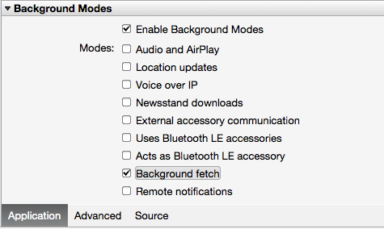
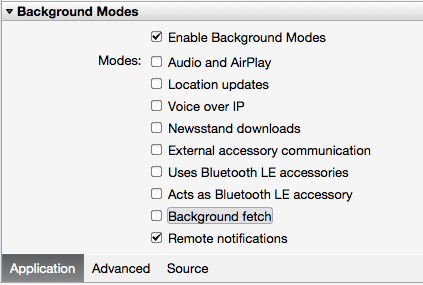
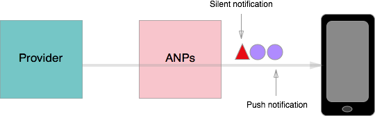

# Updating a Xamarin.iOS App in the Background

Background refresh is the process of waking an application that is suspended or not running, and updating it with new content. iOS provides three options for refreshing content in the background:

1. *Region Monitoring* and  *Significant Location Changes Service* - Location-aware APIs trigger background updates based on changes in the user's location. These APIs can be used with discretion to refresh content in non-location-based iOS 6 applications, where other options are not available.
1. *Background Fetch (iOS 7+)* - A temporal approach to refreshing  *non-critical* content that updates  *frequently* .
1. *Remote Notifications (iOS 7+)* - Applications that receive push notifications can use the notifications to trigger background content refreshes. This method can be used to update with  *important, time-sensitive* content that updates  *sporadically* .

The following sections cover the basics of these options.

## Region Monitoring and Significant Location Changes

iOS provides two location-aware APIs with backgrounding capabilities:

1. *Region Monitoring* is the process of setting up regions with boundaries, and waking the device when the user enters or exits a region. Regions are circular and can be of varying size. When the user crosses a region boundary, the device will wake up to handle the event, usually by firing a notification or kicking off a task. Region Monitoring requires GPS, and increases battery and data usage.
1. The  *Significant Location Changes Service* is a simpler, power-conserving option available for devices with cellular radios. An application listening for significant location changes will be notified when the device switches cell towers. This service can be used to wake a suspended or terminated application, and provides an opportunity to check for new content in the background. Background activity is limited to about 10 seconds, unless paired with a  [Background Task](~/ios/app-fundamentals/backgrounding/ios-backgrounding-techniques/ios-backgrounding-with-tasks.md) .

An application does not need the location `UIBackgroundMode` to use these location-aware APIs. Because iOS doesn't track the types of tasks that can run when the device is woken by changes in the user's location, these APIs provide a work-around for updating content in the background on iOS 6. *Keep in mind that triggering background updates with location-based APIs will draw on device resources, and may confuse users who don't understand why an application requires access to their location*. Use discretion when implementing Region Monitoring or Significant Location Changes for background processing in applications that aren't already using the location APIs.

Apps using location monitoring for background processing expose a flaw in iOS 6: if an application's needs don't fit into a background-necessary category, it has limited backgrounding options. With the introduction of two new APIs, *Background Fetch* and *Remote Notifications*, iOS 7 (and greater) provides backgrounding opportunities to more applications. The next two sections introduce these new APIs.

<a name="background_fetch"></a>

## Background Fetch (iOS 7 and Greater)

In iOS 6, an application entering the foreground needed time to load new content, briefly presenting users with content they've already seen. Background fetch allows applications to load new data *before* a user launches the application, and provide the user with the most up-to-date content.

To implement background fetch, edit *Info.plist* and check the **Enable Background Modes** and **Background Fetch** check boxes:

 [](updating-an-application-in-the-background-images/fetch.png#lightbox)

Next, in the `AppDelegate`, override the `FinishedLaunching` method to set the minimum fetch interval. In this example, we let the OS decide how often to fetch new content:

```csharp
public override bool FinishedLaunching (UIApplication application, NSDictionary launchOptions)
{
  UIApplication.SharedApplication.SetMinimumBackgroundFetchInterval (UIApplication.BackgroundFetchIntervalMinimum);
  return true;
}
```

Finally, perform the fetch by overriding the `PerformFetch` method in the `AppDelegate`, and passing in a *completion handler*. The completion handler is a delegate that takes a `UIBackgroundFetchResult`:

```csharp
public override void PerformFetch (UIApplication application, Action<UIBackgroundFetchResult> completionHandler)
{
  // Check for new data, and display it
  ...
  
  // Inform system of fetch results
  completionHandler (UIBackgroundFetchResult.NewData);
}
```

When we're done updating content, we let the OS know by calling the completion handler with the appropriate status. iOS offers three options for completion handler status:

1. `UIBackgroundFetchResult.NewData` - Called when new content has been fetched, and the application has been updated.
1. `UIBackgroundFetchResult.NoData` - Called when the fetch for new content went through, but no content is available.
1. `UIBackgroundFetchResult.Failed` - Useful for error handling, this is called when the fetch was unable to go through.

Applications using Background Fetch can make calls to update the UI from the background. When the user opens the app, the UI will be up to date and displaying new content. This will also update the application's App Switcher snapshot, so the user can see when the application has new content.

> [!IMPORTANT]
> Once `PerformFetch` is called, the application has approximately 30 seconds to kick off download of new content, and call the completion handler block. If this takes too long, the app will be terminated. Consider using Background Fetch with the _Background Transfer Service_ when downloading media or other large files.

### BackgroundFetchInterval

In the sample code above, we let the OS decide how often to fetch new content by setting the minimum fetch interval to `BackgroundFetchIntervalMinimum`. iOS offers three options for the fetch interval:

1. `BackgroundFetchIntervalNever` - Tell the system to never fetch new content. Use this to turn off fetching in certain situations, such as when the user is not signed in. This is the default value for the fetch interval. 
1. `BackgroundFetchIntervalMinimum` - Let the system decide how often to fetch based on user patterns, battery life, data usage, and the needs of other applications.
1. `BackgroundFetchIntervalCustom` - If you know how often an application's content gets updated, you can specify a "sleep" interval after every fetch, during which the application will be prevented from fetching new content. Once that interval is up, the system will determine when to fetch content.

Both `BackgroundFetchIntervalMinimum` and `BackgroundFetchIntervalCustom` rely on the system to schedule fetches. This interval is dynamic, adapting to the device's needs as well as the individual user's habits. For example, if one user checks an application every morning, and another checks every hour, iOS will ensure the content is up to date for both users every time they open the application.

Background Fetch should be used for applications that update frequently with non-critical content. For applications with critical updates, Remote Notifications should be used. Remote Notifications are based on Background Fetch, and share the same completion handler. We'll dive into Remote Notifications next.

 <a name="remote_notifications"></a>

## Remote Notifications (iOS 7 and Greater)

Push notifications are JSON messages sent from a provider to a device by way of the *Apple Push Notification service (APNs)*.

In iOS 6, an incoming push notifications tells the system to alert the user that something interesting has happened in an application. Clicking on the notification pulls the application out of the suspended or terminated state, and the app would begin updating content. iOS 7 (and greater) extends ordinary push notifications by giving applications a chance to update content in the background *before* notifying the user, so that the user can open the application and be presented with new content immediately.

To implement remote notifications, edit *Info.plist* and check the **Enable Background Modes** and **Remote notifications** check boxes:

 [](updating-an-application-in-the-background-images/remote.png#lightbox)

Next, set the `content-available` flag on the push notification itself to 1. This lets the application know to fetch new content before displaying the alert:

```csharp
'aps' {
  'content-available': 1,
  'alert': 'Something new has happened in your app!''
}
```

In the *AppDelegate*, override the `DidReceiveRemoteNotification` method to check the notification payload for available content, and call the appropriate completion handler block:

```csharp
public override void DidReceiveRemoteNotification (UIApplication application, NSDictionary userInfo, Action<UIBackgroundFetchResult> completionHandler)
{
  if([content-available]) {
    // fetch content
    completionHandler (UIBackgroundFetchResult.NewData);
  }
}
```

Remote notifications should be used for infrequent updates with content that is crucial to the application's functionality. For more information on remote notifications, see the Xamarin [Push Notifications in iOS](~/ios/platform/user-notifications/deprecated/remote-notifications-in-ios.md) guide.

> [!IMPORTANT]
> Because the update mechanism in Remote Notifications is based on Background Fetch, the application must kick off download of new content and call the completion handler block within 30 seconds of receiving the notification, or iOS will terminate the application. Consider pairing Remote Notifications with _Background Transfer Service_ when downloading media or other large files in the background.

### Silent Remote Notifications

Remote Notifications are a simple way to notify applications of updates and kick off fetching new content, but there are cases where we don't need to notify the user that something has changed. For example, if a user flags a file for synching, we don't need to notify them every time the file updates. File synching is not a surprising event, nor does it require the user's immediate attention. Users just expect the file to be up-to-date when they open it.

For cases like the one above, iOS allows push notifications to be sent silently - that is, without an alert. To turn a regular notification into a silent one, simply remove the alert from the notification payload:

```csharp
'aps' {
  'content-available': 1
}
```

#### Rate Limits

The biggest difference between normal and silent notifications from a developer perspective is that silent pushes are rate limited. APNs will delay the delivery of silent pushes to the device if the push rate gets too high. This is to ensure that applications don't drain device resources with too many silent notifications.

However, APNs will let silent notifications "piggyback" alongside a normal Remote Notification or keep-alive response. Because regular notifications are not rate limited, they can be used to push stored up silent notifications from the APNs to the device, as illustrated by the following diagram:

 [](updating-an-application-in-the-background-images/silent.png#lightbox)

> [!IMPORTANT]
> Apple encourages developers to send silent push notifications whenever the application requires, and let the APNs schedule their delivery.

In this section, we've covered the various options for refreshing content in the background to run tasks that don't fit into a background-necessary category. Now, let's see some of these APIs in action.

 [Next: Part 4 - iOS Backgrounding Walkthroughs](~/ios/app-fundamentals/backgrounding/ios-backgrounding-walkthroughs/index.md)
