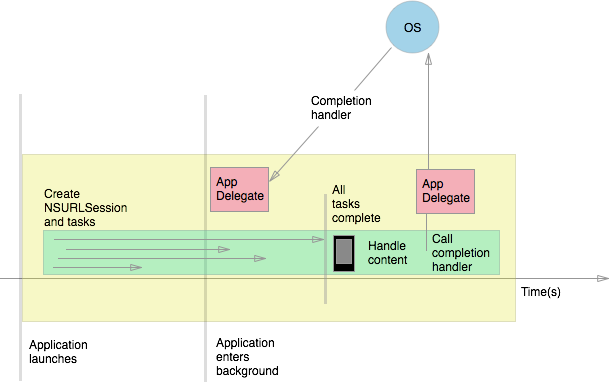

# Background transfer and NSURLSession in Xamarin.iOS

A background transfer is initiated by configuring a background `NSURLSession` and enqueuing upload or download tasks. If tasks complete while the application is backgrounded, suspended, or terminated, iOS will notify the application by calling the completion handler in the application's *AppDelegate*. The following diagram demonstrates this in action:

 [](background-transfer-walkthrough-images/transfer.png#lightbox)

## Configuring a background session

To make a background session, create a new `NSUrlSession` and configure it using an `NSUrlSessionConfiguration` object.

The configuration object determines what the session can do and the kinds of tasks it can run.
Sessions configured using the `CreateBackgroundSessionConfiguration` method will run in a separate process,
and perform discretionary (WiFi) transfers to preserve data and battery life.
The following code sample demonstrates proper setup of a background transfer session
using the `CreateBackgroundSessionConfiguration` method and a unique string identifier:

```csharp
public partial class SimpleBackgroundTransferViewController : UIViewController
{
  NSUrlSession session = null;

  NSUrlSessionConfiguration configuration =
      NSUrlSessionConfiguration.CreateBackgroundSessionConfiguration ("com.SimpleBackgroundTransfer.BackgroundSession");
  session = NSUrlSession.FromConfiguration
      (configuration, new MySessionDelegate(), new NSOperationQueue());

}
```

Apart from a configuration object, a session also requires a session delegate and a queue.
The queue determines the order in which the tasks will complete. The session delegate
chaperones the transfer process, and handles authentication, caching, and other session-related issues.

## Working with tasks and delegates

Now that we have configured a background session, let's kick off tasks to handle the transfer. We can keep track of these tasks using the an `NSUrlSessionDelegate` instance called a session delegate. The session delegate is responsible for waking a terminated or suspended application in the background to handle authentication, errors, or transfer completion.

An `NSUrlSessionDelegate` provides the following basic methods to check transfer status:

- *DidFinishEventsForBackgroundSession* - This method gets called when all tasks have finished, and the transfer is complete.
- *DidReceiveChallenge* - Called to request credentials when authorization is required.
- *DidBecomeInvalidWithError* - Called if the  `NSURLSession` becomes invalidated.

Background sessions require more specialized delegates depending on the types of tasks that are running. Background sessions are limited to two types of tasks:

- *Upload Tasks* - Tasks of type  `NSUrlSessionUploadTask` use the `INSUrlSessionTaskDelegate` interface, which implements `INSUrlSessionDelegate`. This provides additional methods to track upload progress, handle HTTP redirection, and more.
- *Download Tasks* - Tasks of type  `NSUrlSessionDownloadTask` use the `INSUrlSessionDownloadDelegate` interface, which implements `INSUrlSessionDelegate` and `INSUrlSessionTaskDelegate`. This provides all the methods for upload tasks, as well as download-specific methods to track the download progress and determine when a download task has resumed or completed.

The following code defines a task that can be used to download an image from a URL. The task is started by calling `CreateDownloadTask` on the background session, and passing in the URL request:

```csharp
const string DownloadURLString = "http://xamarin.com/images/xamarin.png"; // or other hosted file
public NSUrlSessionDownloadTask downloadTask;

NSUrl downloadURL = NSUrl.FromString (DownloadURLString);
NSUrlRequest request = NSUrlRequest.FromUrl (downloadURL);
downloadTask = session.CreateDownloadTask (request);
```

Next, create a new session download delegate to keep track of all download tasks in this session. The delegate class should inherit from `NSObject` and implement the required interface:

```csharp
public class MySessionDelegate : NSObject, INSUrlSessionDownloadDelegate
{
  public void DidWriteData (NSUrlSession session, NSUrlSessionDownloadTask downloadTask, long bytesWritten, long totalBytesWritten, long totalBytesExpectedToWrite)
  {
    Console.WriteLine (string.Format ("DownloadTask: {0}  progress: {1}", downloadTask, progress));
    InvokeOnMainThread( () => {
      // update UI with progress bar, if desired
    });
  }
  ...
}
```

To find out the progress of a download task, override the `DidWriteData` method to track progress, and even update the UI. UI updates will appear immediately if the application is in the foreground, or will be waiting for the user the next time they open the application.

The session delegate API provides a broad toolkit for interacting with tasks. For a full list of session delegate methods, refer to the `NSUrlSessionDelegate` API documentation.

> [!IMPORTANT]
> Background sessions are started on a background thread, so any calls to update the UI must be explicitly run on the UI thread by calling `InvokeOnMainThread` to avoid iOS terminating the app. 

## Handling transfer completion

The final step is to let the application know when all the tasks associated with the session have completed, and handle the new content.

In the `AppDelegate`, subscribe to the `HandleEventsForBackgroundUrl` event. When the application enters the background and a transfer session is running, this method is called and the system passes us a completion handler:

```csharp
public System.Action backgroundSessionCompletionHandler;

public void HandleEventsForBackgroundUrl (UIApplication application, string sessionIdentifier, System.Action completionHandler)
{
  this.backgroundSessionCompletionHandler = completionHandler;
}
```

Use the completion handler to let iOS know when our application is done processing.

Recall that a session can spawn several tasks to process a transfer. When the last task completes, a suspended or terminated application is re-launched into the background. Then, the application re-connects to the `NSURLSession` using the unique session identifier, and calls `DidFinishEventsForBackgroundSession` on the session delegate. This method is the application's opportunity to handle new content, including updating the UI to reflect the results of the transfer:

```csharp
public void DidFinishEventsForBackgroundSession (NSUrlSession session) {
  // Handle new information, update UI, etc.
}
```

Once finished handling new content, call the completion handler to let the system know it is safe to take a snapshot of the application and go back to sleep:

```csharp
public void DidFinishEventsForBackgroundSession (NSUrlSession session) {
  var appDelegate = UIApplication.SharedApplication.Delegate as AppDelegate;

  // Handle new information, update UI, etc.

  // call completion handler when you're done
  if (appDelegate.backgroundSessionCompletionHandler != null) {
    NSAction handler = appDelegate.backgroundSessionCompletionHandler;
    appDelegate.backgroundSessionCompletionHandler = null;
    handler.Invoke ();
  }
}
```

This walkthrough covered the basic steps to implement the Background Transfer Service in iOS 7 and newer.

## Related links

- [Simple Background Transfer (sample)](/samples/xamarin/ios-samples/simplebackgroundtransfer)