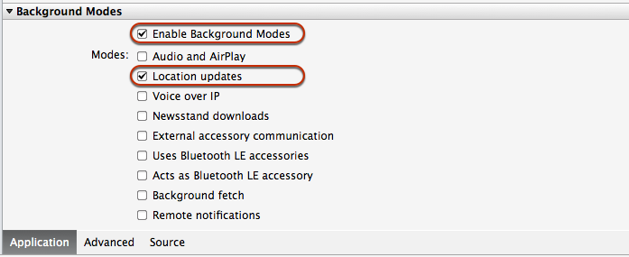
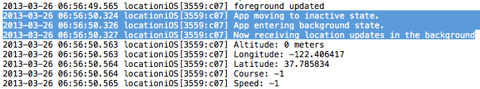

# Walkthrough - Background Location in Xamarin.iOS

In this example, we are going to build an iOS Location application that prints information about our current location: latitude, longitude, and other parameters to the screen. This application will demonstrate how to properly perform location updates while the application is either Active or Backgrounded.

This walkthrough explains some key backgrounding concepts, including registering an app as a background-necessary application, suspending UI updates when the app is backgrounded, and working with the `WillEnterBackground` and `WillEnterForeground` `AppDelegate` methods.

## Application set up

1. First, create a new **iOS > App > Single View Application (C#)**. Call it _Location_ and ensure that both iPad and iPhone have been selected.

1. A location application qualifies as a background-necessary application in iOS. Register the application as a Location application by editing the **Info.plist** file for the project.

    Under Solution Explorer, double click on the **Info.plist** file to open it, and scroll to the bottom of the list. Place a check by both the **Enable Background Modes** and the **Location Updates** checkboxes.

    In Visual Studio for Mac, it will look like something like this:

    [](location-walkthrough-images/image7.png#lightbox)

    In Visual Studio, **Info.plist** needs to be updated manually by adding the following key/value pair:

    ```xml
    <key>UIBackgroundModes</key>
    <array>
      <string>location</string>
    </array>
    ```

1. Now that the application is registered, it can get location data from the device. In iOS, the `CLLocationManager` class is used to access location information, and can raise events that provide location updates.

1. In the code, create a new class called `LocationManager` that provides a single place for various screens and code to subscribe to location updates. In the `LocationManager` class, make an instance of the `CLLocationManager` called `LocMgr`:

    ```csharp
    public class LocationManager
    {
        protected CLLocationManager locMgr;

        public LocationManager () {
            this.locMgr = new CLLocationManager();
            this.locMgr.PausesLocationUpdatesAutomatically = false;

            // iOS 8 has additional permissions requirements
            if (UIDevice.CurrentDevice.CheckSystemVersion (8, 0)) {
                locMgr.RequestAlwaysAuthorization (); // works in background
                //locMgr.RequestWhenInUseAuthorization (); // only in foreground
            }

            if (UIDevice.CurrentDevice.CheckSystemVersion (9, 0)) {
                locMgr.AllowsBackgroundLocationUpdates = true;
            }
        }

        public CLLocationManager LocMgr {
            get { return this.locMgr; }
        }
    }
    ```

    The code above sets a number of properties and permissions on the [CLLocationManager](xref:CoreLocation.CLLocationManager) class:

    - `PausesLocationUpdatesAutomatically` – This is a Boolean that can be set depending on whether the system is allowed to pause location updates. On some device it defaults to `true`, which can cause the device to stop getting background location updates after about 15 minutes.
    - `RequestAlwaysAuthorization` - You should pass this method to give the app user the option to allow the location to be accessed in the background. `RequestWhenInUseAuthorization` can also be passed if you wish to give the user the option to allow the location to be accessed only when the app is in the foreground.
    - `AllowsBackgroundLocationUpdates` – This is a Boolean property, introduced in iOS 9 that can be set to allow an app to receive location updates when suspended.

    > [!IMPORTANT]
    > iOS 8 (and greater) also requires an entry in the **Info.plist** file to show the user as part of the authorization request.

1. Add **Info.plist** keys for the permission types the app requires – `NSLocationAlwaysUsageDescription`, `NSLocationWhenInUseUsageDescription`, and/or `NSLocationAlwaysAndWhenInUseUsageDescription` – with a string that will be displayed to the user in the alert that requests location data access.

1. iOS 9 requires that when using `AllowsBackgroundLocationUpdates` the **Info.plist** includes the key `UIBackgroundModes` with the value `location`. If you have completed step 2 of this walkthrough, this should already been in your Info.plist file.

1. Inside the `LocationManager` class, create a method called `StartLocationUpdates` with the following code. This code shows the how to start receiving location updates from the   `CLLocationManager`:

    ```csharp
    if (CLLocationManager.LocationServicesEnabled) {
        //set the desired accuracy, in meters
        LocMgr.DesiredAccuracy = 1;
        LocMgr.LocationsUpdated += (object sender, CLLocationsUpdatedEventArgs e) =>
        {
            // fire our custom Location Updated event
            LocationUpdated (this, new LocationUpdatedEventArgs (e.Locations [e.Locations.Length - 1]));
        };
        LocMgr.StartUpdatingLocation();
    }
    ```

    There are several important things happening in this method. First, we perform a check to see if the application has access to location data on the device. We verify this by calling `LocationServicesEnabled` on the `CLLocationManager`. This method will return **false** if the user has denied the application access to location information.

1. Next, tell the location manager how often to update. `CLLocationManager` provides many options for filtering and configuring location data, including the frequency of updates. In this example, set the `DesiredAccuracy` to update whenever the location changes by a meter. For more information on configuring location update frequency and other preferences, refer to the [CLLocationManager Class Reference](https://developer.apple.com/library/ios/#documentation/CoreLocation/Reference/CLLocationManager_Class/CLLocationManager/CLLocationManager.html) in the Apple documentation.

1. Finally, call `StartUpdatingLocation` on the `CLLocationManager` instance. This tells the location manager to get an initial fix on the current location, and to start sending updates

So far, the location manager has been created, configured with the kinds of data we want to receive, and has determined the initial location. Now the code needs to render the location data to the user interface. We can do this with a custom event that takes a `CLLocation` as an argument:

```csharp
// event for the location changing
public event EventHandler<LocationUpdatedEventArgs>LocationUpdated = delegate { };
```

The next step is to subscribe to location updates from the `CLLocationManager`, and raise the custom `LocationUpdated` event when new location data becomes available, passing in the location as an argument. To do this, create a new class **LocationUpdateEventArgs.cs**. This code is accessible within the main application and returns the device location when the event is raised:

```csharp
public class LocationUpdatedEventArgs : EventArgs
{
    CLLocation location;

    public LocationUpdatedEventArgs(CLLocation location)
    {
       this.location = location;
    }

    public CLLocation Location
    {
       get { return location; }
    }
}
```

## User Interface

1. Use the Xcode Interface Builder to build the screen that will display location information. Double-click on the **Main.storyboard** file to begin.

    On the storyboard, drag several labels onto the screen to act as placeholders for the location information. In this example, there are labels for latitude, longitude, altitude, course, and speed.

    For more information, see [Designing user interfaces with Xcode](~/ios/user-interface/storyboards/index.md).

1. In the Solution Pad, double-click the `ViewController.cs` file and edit it to create a new instance of the LocationManager and call `StartLocationUpdates`on it.
  Change the code to look like the following:

    ```csharp
    #region Computed Properties
    public static bool UserInterfaceIdiomIsPhone {
        get { return UIDevice.CurrentDevice.UserInterfaceIdiom == UIUserInterfaceIdiom.Phone; }
    }

    public static LocationManager Manager { get; set;}
    #endregion

    #region Constructors
    public ViewController (IntPtr handle) : base (handle)
    {
    // As soon as the app is done launching, begin generating location updates in the location manager
        Manager = new LocationManager();
        Manager.StartLocationUpdates();
    }

    #endregion
    ```

    This will start the location updates on application start-up, although no data will be displayed.

1. Now that the location updates are received, update the screen with the location information. The following method gets the location from our `LocationUpdated` event and shows it in the UI:

    ```csharp
    #region Public Methods
    public void HandleLocationChanged (object sender, LocationUpdatedEventArgs e)
    {
        // Handle foreground updates
        CLLocation location = e.Location;

        LblAltitude.Text = location.Altitude + " meters";
        LblLongitude.Text = location.Coordinate.Longitude.ToString ();
        LblLatitude.Text = location.Coordinate.Latitude.ToString ();
        LblCourse.Text = location.Course.ToString ();
        LblSpeed.Text = location.Speed.ToString ();

        Console.WriteLine ("foreground updated");
    }
    #endregion
    ```

We still need to subscribe to the `LocationUpdated` event in our AppDelegate, and call the new method to update the UI. Add the following code in `ViewDidLoad,` right after the `StartLocationUpdates` call:

```csharp
public override void ViewDidLoad ()
{
    base.ViewDidLoad ();

    // It is better to handle this with notifications, so that the UI updates
    // resume when the application re-enters the foreground!
    Manager.LocationUpdated += HandleLocationChanged;

}
```

Now, when the application is run, it should look something like this:

[](location-walkthrough-images/image5.png#lightbox)

## Handling Active and Background states

1. The application is outputting location updates while it is in the foreground and active. To demonstrate what happens when the app enters the background, override the `AppDelegate` methods that track application state changes so that the application writes to the console when it transitions between the foreground and the background:

    ```csharp
    public override void DidEnterBackground (UIApplication application)
    {
        Console.WriteLine ("App entering background state.");
    }

    public override void WillEnterForeground (UIApplication application)
    {
        Console.WriteLine ("App will enter foreground");
    }
    ```

    Add the following code in the `LocationManager` to continuously print updated location data to the application output, to verify the location information is still available in the background:

    ```csharp
    public class LocationManager
    {
        public LocationManager ()
        {
        ...
        LocationUpdated += PrintLocation;
        }
        ...

        //This will keep going in the background and the foreground
        public void PrintLocation (object sender, LocationUpdatedEventArgs e) {
        CLLocation location = e.Location;
        Console.WriteLine ("Altitude: " + location.Altitude + " meters");
        Console.WriteLine ("Longitude: " + location.Coordinate.Longitude);
        Console.WriteLine ("Latitude: " + location.Coordinate.Latitude);
        Console.WriteLine ("Course: " + location.Course);
        Console.WriteLine ("Speed: " + location.Speed);
        }
    }
    ```

1. There is one remaining issue with the code: attempting to update the UI when the app is backgrounded will cause iOS will terminate it. When the app goes into the background, the code needs to unsubscribe from location updates and stop updating the UI.

    iOS provides us notifications when the app is about to transition to a different application states. In this case, we can subscribe to the `ObserveDidEnterBackground` Notification.

    The following code snippet shows how to use a notification to let the view know when to halt UI updates. This will go in `ViewDidLoad`:

    ```csharp
    UIApplication.Notifications.ObserveDidEnterBackground ((sender, args) => {
        Manager.LocationUpdated -= HandleLocationChanged;
    });
    ```

    When the app is running, the output will look something like this:

    

1. The application prints location updates to the screen when operating in the foreground, and continues to print data to the application output window while operating in the background.

Only one outstanding issue remains: the screen starts UI updates when the app is first loaded, but it has no way of knowing when the app has re-entered the foreground. If the backgrounded application is brought back into the foreground, UI updates won’t resume.

To fix this, nest a call to start UI updates inside another Notification, which will fire when the application enters the Active state:

```csharp
UIApplication.Notifications.ObserveDidBecomeActive ((sender, args) => {
  Manager.LocationUpdated += HandleLocationChanged;
});
```

Now the UI will begin updating when the application is first started, and resume updating any time the app comes back into the foreground.

In this walkthrough, we built a well-behaved, background-aware iOS application that prints location data to both the screen and the application output window.

## Related Links

- [Location (Part 4) (sample)](/samples/xamarin/ios-samples/location)
- [Core Location Framework Reference](https://developer.apple.com/library/ios/documentation/CoreLocation/Reference/CoreLocation_Framework/_index.html)