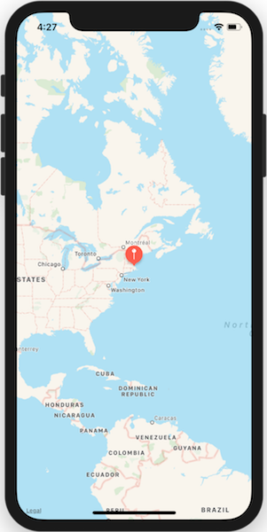
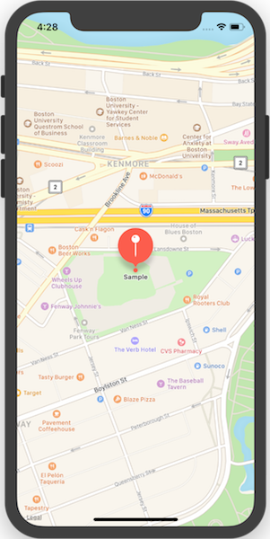

# Events, Protocols and Delegates in Xamarin.iOS

Xamarin.iOS uses controls to expose events for most user interactions.
Xamarin.iOS applications consume these events in much the same way as do
traditional .NET applications. For example, the Xamarin.iOS UIButton class has an
event called TouchUpInside and consumes this event just as if this class and
event were in a .NET app.

Besides this .NET approach, Xamarin.iOS exposes another model that can be used
for more complex interaction and data binding. This methodology uses what Apple
calls delegates and protocols. Delegates are similar in concept to delegates in
C#, but instead of defining and calling a single method, a delegate in
Objective-C is an entire class that conforms to a protocol. A protocol is
similar to an interface in C#, except that its methods can be optional. So for
example, to populate a UITableView with data, you would create a
delegate class that implements the methods defined in the UITableViewDataSource
protocol that the UITableView would call to populate itself.

In this article you’ll learn about all these topics, giving you a solid
foundation for handling callback scenarios in Xamarin.iOS, including:

- **Events** – Using .NET events with UIKit controls.
- **Protocols** – Learning what protocols are and how they are used, and creating an example that provides data for a map annotation.
- **Delegates** – Learning about Objective-C delegates by extending the map example to handle user interaction that includes an annotation, then learning the difference between strong and weak delegates and when to use each of these.

To illustrate protocols and delegates, we’ll build a simple map application
that adds an annotation to a map as shown here:

[](delegates-protocols-and-events-images/01-map.png#lightbox)
[](delegates-protocols-and-events-images/04-annotation-with-callout.png#lightbox)

Before tackling this app, let’s get started by looking at .NET events under
the UIKit.

## .NET Events with UIKit

Xamarin.iOS exposes .NET events on UIKit controls. For example, UIButton has a
TouchUpInside event, which you handle as you normally would in .NET, as shown in
the following code that uses a C# lambda expression:

```csharp
aButton.TouchUpInside += (o,s) => {
    Console.WriteLine("button touched");
};
```

You could also implement this with a C# 2.0-style anonymous method like this
one:

```csharp
aButton.TouchUpInside += delegate {
    Console.WriteLine ("button touched");
};
```

The preceding code is wired up in the `ViewDidLoad` method of the
UIViewController. The `aButton` variable references a button, which you could add
in either the Xcode Interface Builder or with code. 

Xamarin.iOS also supports the target-action style of connecting your code to an
interaction that occurs with a control. 

For more details about the iOS target-action pattern, see the Target-Action
section of [Core Application Competencies for iOS](https://developer.apple.com/library/archive/documentation/General/Conceptual/CocoaEncyclopedia/Target-Action/Target-Action.html#//apple_ref/doc/uid/TP40010810-CH12) in Apple’s iOS
Developer Library.

For more information, see [Designing user interfaces with Xcode](~/ios/user-interface/storyboards/index.md).

## Events

If you want to intercept events from UIControl, you have a range of options:
from using the C# lambdas and delegate functions to using the low-level
Objective-C APIs.

The following section shows how you would capture the TouchDown event on a button,
depending on how much control you need.

## C# Style

Using the delegate syntax:

```csharp
UIButton button = MakeTheButton ();
button.TouchDown += delegate {
    Console.WriteLine ("Touched");
};
```

If you like lambdas instead:

```csharp
button.TouchDown += () => {
   Console.WriteLine ("Touched");
};
```

If you want to have multiple buttons use the same handler to share the same
code:

```csharp
void handler (object sender, EventArgs args)
{
   if (sender == button1)
      Console.WriteLine ("button1");
   else
      Console.WriteLine ("some other button");
}

button1.TouchDown += handler;
button2.TouchDown += handler;
```

## Monitoring more than one kind of Event

The C# events for UIControlEvent flags have a one-to-one mapping to individual flags. When you want to have the same piece of code handle two or more events, use the `UIControl.AddTarget` method:

```csharp
button.AddTarget (handler, UIControlEvent.TouchDown | UIControlEvent.TouchCancel);
```

Using the lambda syntax:

```csharp
button.AddTarget ((sender, event)=> Console.WriteLine ("An event happened"), UIControlEvent.TouchDown | UIControlEvent.TouchCancel);
```

If you need to use low-level features of Objective-C, like hooking up to a
particular object instance and invoking a particular selector:

```csharp
[Export ("MySelector")]
void MyObjectiveCHandler ()
{
    Console.WriteLine ("Hello!");
}

// In some other place:

button.AddTarget (this, new Selector ("MySelector"), UIControlEvent.TouchDown);
```

Please note, if you implement the instance method in an inherited base class,
it must be a public method.

## Protocols

A protocol is an Objective-C language feature that provides a list of method
declarations. It serves a similar purpose to an interface in C#, the main
difference being that a protocol can have optional methods. Optional methods are
not called if the class that adopts a protocol does not implement them. Also, a
single class in Objective-C can implement multiple protocols, just as a C# class
can implement multiple interfaces.

Apple uses protocols throughout iOS to define contracts for classes to adopt,
while abstracting away the implementing class from the caller, thus operating
just like a C# interface. Protocols are used both in non-delegate scenarios (such as with the `MKAnnotation` example shown next), and with delegates (as presented later in this document, in the Delegates section).

### Protocols with Xamarin.ios

Let’s take a look at an example using an Objective-C protocol from
Xamarin.iOS. For this example, we’ll use the `MKAnnotation` protocol,
which is part of the `MapKit` framework. `MKAnnotation` is
a protocol that allows any object that adopts it to provide information about an
annotation that can be added to a map. For example, an object implementing `MKAnnotation` provides the location of the annotation and the title
associated with it.

In this way, the `MKAnnotation` protocol is used to provide
pertinent data that accompanies an annotation. The actual view for the
annotation itself is built from the data in the object that adopts the `MKAnnotation` protocol. For example, the text for the callout that
appears when the user taps on the annotation (as shown in the screenshot below)
comes from the `Title` property in the class that implements the
protocol:

 [](delegates-protocols-and-events-images/04-annotation-with-callout.png#lightbox)

As described in the next section, [Protocols Deep Dive](#protocols-deep-dive), Xamarin.iOS binds
protocols to abstract classes. For the `MKAnnotation` protocol, the
bound C# class is named `MKAnnotation` to mimic the name of
the protocol, and it is a subclass of `NSObject`, the root base class
for CocoaTouch. The protocol requires a getter and setter to be implemented for
the coordinate; however, a title and subtitle are optional. Therefore, in the `MKAnnotation` class, the `Coordinate` property is *abstract*, requiring it to be implemented and the `Title` and `Subtitle` properties are marked *virtual*, making them
optional, as shown below:

```csharp
[Register ("MKAnnotation"), Model ]
public abstract class MKAnnotation : NSObject
{
    public abstract CLLocationCoordinate2D Coordinate
    {
        [Export ("coordinate")]
        get;
        [Export ("setCoordinate:")]
        set;
    }

    public virtual string Title
    {
        [Export ("title")]
        get
        {
            throw new ModelNotImplementedException ();
        }
    }

    public virtual string Subtitle
    {
        [Export ("subtitle")]
        get
        {
            throw new ModelNotImplementedException ();
        }
    }
...
}
```

Any class can provide annotation data by simply deriving from `MKAnnotation`, as long as at least the `Coordinate`
property is implemented. For example, here’s a sample class that takes the
coordinate in the constructor and returns a string for the title:

```csharp
/// <summary>
/// Annotation class that subclasses MKAnnotation abstract class
/// MKAnnotation is bound by Xamarin.iOS to the MKAnnotation protocol
/// </summary>
public class SampleMapAnnotation : MKAnnotation
{
    string title;

    public SampleMapAnnotation (CLLocationCoordinate2D coordinate)
    {
        Coordinate = coordinate;
        title = "Sample";
    }

    public override CLLocationCoordinate2D Coordinate { get; set; }

    public override string Title {
        get {
            return title;
        }
    }
}
```

Through the protocol it is bound to, any class that subclasses `MKAnnotation` can provide relevant data that will be used by the map
when it creates the annotation’s view. To add an annotation to a map, simply
call the `AddAnnotation` method of an `MKMapView`
instance, as shown in the following code:

```csharp
//an arbitrary coordinate used for demonstration here
var sampleCoordinate =
    new CLLocationCoordinate2D (42.3467512, -71.0969456); // Boston

//create an annotation and add it to the map
map.AddAnnotation (new SampleMapAnnotation (sampleCoordinate));
```

The map variable here is an instance of an `MKMapView`, which is
the class that represents the map itself. The `MKMapView` will use
the `Coordinate` data derived from the `SampleMapAnnotation` instance to position the annotation view on the
map.

The `MKAnnotation` protocol provides a known set of capabilities
across any objects that implement it, without the consumer (the map in this
case) needing to know about implementation details. This streamlines adding a variety of possible annotations to a map.

### Protocols Deep Dive

Since C# interfaces don’t support optional methods, Xamarin.iOS maps
protocols to abstract classes. Therefore, adopting a protocol in Objective-C is
accomplished in Xamarin.iOS by deriving from the abstract class that is bound to
the protocol and implementing the required methods. These methods will be
exposed as abstract methods in the class. Optional methods from the protocol
will be bound to virtual methods of the C# class.

For example, here is a portion of the `UITableViewDataSource`
protocol as bound in Xamarin.iOS:

```csharp
public abstract class UITableViewDataSource : NSObject
{
    [Export ("tableView:cellForRowAtIndexPath:")]
    public abstract UITableViewCell GetCell (UITableView tableView, NSIndexPath indexPath);
    [Export ("numberOfSectionsInTableView:")]
    public virtual int NumberOfSections (UITableView tableView){...}
...
}
```

Note that the class is abstract. Xamarin.iOS makes the class abstract to support optional/required methods in protocols.
However, unlike Objective-C protocols, (or C# interfaces), C# classes don’t
support multiple inheritance. This affects the design of C# code that uses
protocols, and typically leads to nested classes. More about this issue is
covered later in this document, in the Delegates section.

 `GetCell(…)` is an abstract method, bound to the Objective-C *selector*, `tableView:cellForRowAtIndexPath:`, which is a
required method of the `UITableViewDataSource` protocol. Selector is the Objective-C term for method name. To enforce the
method as required, Xamarin.iOS declares it as abstract. The other method, `NumberOfSections(…)`, is bound to `numberOfSectionsInTableview:`. This method is optional in the
protocol, so Xamarin.iOS declares it as virtual, making it optional to override in
C#.

Xamarin.iOS takes care of all iOS binding for you. However, if you ever need to
bind a protocol from Objective-C manually, you can do so by decorating a class
with the `ExportAttribute`. This is the same method used by Xamarin.iOS
itself.

For more information about how to bind Objective-C types in Xamarin.iOS, see
the article [Binding Objective-C Types](~/ios/platform/binding-objective-c/index.md).

We’re not through with protocols yet, though. They’re also used in iOS as
the basis for Objective-C delegates, which is the topic of the next section.

## Delegates

iOS uses Objective-C delegates to implement the delegation pattern, in which
one object passes work off to another. The object doing the work is the delegate
of the first object. An object tells its delegate to do work by sending it
messages after certain things happen. Sending a message like this in Objective-C
is functionally equivalent to calling a method in C#. A delegate implements methods in response to these calls, and so provides functionality to the application.

Delegates enable you to extend the behavior of classes without needing to create subclasses. Applications in iOS often use delegates when one
class calls back to another after an important action occurs. For example, the `MKMapView` class calls back to its delegate when the user taps an
annotation on a map, giving the author of the delegate class the opportunity to
respond within the application. You can work through an example of this type of delegate usage later in this article, in Example Using a Delegate with Xamarin.iOS.

At this point, you may be wondering how a class determines what methods to call on its delegate. This is another place where you use protocols. Usually,
the methods available for a delegate come from the protocols they adopt.

### How Protocols are used with Delegates

We saw earlier how protocols are used to support adding annotations to a map.
Protocols are also used to provide a known set of methods for classes to call
after certain events occur, such as after the user taps an annotation on a map
or selects a cell in a table. The classes that implement these methods are known
as the delegates of the classes that call them.

Classes that support delegation do so by exposing a Delegate property, to
which a class implementing the delegate is assigned. The methods you implement
for the delegate will depend upon the protocol that the particular delegate
adopts. For the `UITableView` method, you implement the `UITableViewDelegate` protocol, for the `UIAccelerometer`
method, you would implement `UIAccelerometerDelegate`, and so on for
any other classes throughout iOS for which you would want to expose a
delegate.

The `MKMapView` class we saw in our earlier example also has a
property called Delegate, which it will call after various events occur. The
Delegate for `MKMapView` is of type `MKMapViewDelegate`.
You’ll use this shortly in an example to respond to the annotation after it is
selected, but first let’s discuss the difference between strong and weak
delegates.

### Strong Delegates vs. Weak Delegates

The delegates we’ve looked at so far are strong delegates, meaning they are
strongly typed. The Xamarin.iOS bindings ship with a strongly typed class for
every delegate protocol in iOS. However, iOS also has the concept of a weak
delegate. Instead of subclassing a class bound to the Objective-C protocol for a
particular delegate, iOS also lets you choose to bind the protocol methods
yourself in any class you like that derives from NSObject, decorating your
methods with the ExportAttribute, and then supplying the appropriate selectors.
When you take this approach, you assign an instance of your class to the
WeakDelegate property instead of to the Delegate property. A weak delegate
offers you the flexibility to take your delegate class down a different
inheritance hierarchy. Let’s look at a Xamarin.iOS example that uses both strong
and weak delegates.

### Example Using a Delegate with Xamarin.iOS

To execute code in response to the user tapping the annotation in
our example, we can subclass `MKMapViewDelegate` and assign an
instance to the `MKMapView`’s `Delegate` property. The `MKMapViewDelegate` protocol contains only optional methods.
Therefore, all the methods are virtual that are bound to this protocol in the
Xamarin.iOS `MKMapViewDelegate` class. When the user selects an
annotation, the `MKMapView` instance will send the `mapView:didSelectAnnotationView:` message to its delegate. To handle
this in Xamarin.iOS, we need to override the `DidSelectAnnotationView (MKMapView mapView, MKAnnotationView annotationView)` method in the
MKMapViewDelegate subclass like this:

```csharp
public class SampleMapDelegate : MKMapViewDelegate
{
    public override void DidSelectAnnotationView (
        MKMapView mapView, MKAnnotationView annotationView)
    {
        var sampleAnnotation =
            annotationView.Annotation as SampleMapAnnotation;

        if (sampleAnnotation != null) {

            //demo accessing the coordinate of the selected annotation to
            //zoom in on it
            mapView.Region = MKCoordinateRegion.FromDistance(
                sampleAnnotation.Coordinate, 500, 500);

            //demo accessing the title of the selected annotation
            Console.WriteLine ("{0} was tapped", sampleAnnotation.Title);
        }
    }
}
```

The SampleMapDelegate class shown above is implemented as a nested class in
the controller that contains the `MKMapView` instance. In
Objective-C, you’ll often see the controller adopt multiple protocols directly
within the class. However, since protocols are bound to classes in Xamarin.iOS,
the classes that implement strongly typed delegates are usually included as
nested classes.

With the delegate class implementation in place, you only need to instantiate
an instance of the delegate in the controller and assign it to the `MKMapView`’s `Delegate` property as shown here:

```csharp
public partial class Protocols_Delegates_EventsViewController : UIViewController
{
    SampleMapDelegate _mapDelegate;
    ...
    public override void ViewDidLoad ()
    {
        base.ViewDidLoad ();

        //set the map's delegate
        _mapDelegate = new SampleMapDelegate ();
        map.Delegate = _mapDelegate;
        ...
    }
    class SampleMapDelegate : MKMapViewDelegate
    {
        ...
    }
}
```

To use a weak delegate to accomplish the same thing, you need to
bind the method yourself in any class that derives from `NSObject`
and assign it to the `WeakDelegate` property of the `MKMapView`. Since the `UIViewController` class ultimately
derives from `NSObject` (like every Objective-C class in CocoaTouch),
we can simply implement a method bound to `mapView:didSelectAnnotationView:` directly in the controller and
assign the controller to `MKMapView`’s `WeakDelegate`,
avoiding the need for the extra nested class. The code below demonstrates this
approach:

```csharp
public partial class Protocols_Delegates_EventsViewController : UIViewController
{
    ...
    public override void ViewDidLoad ()
    {
        base.ViewDidLoad ();
        //assign the controller directly to the weak delegate
        map.WeakDelegate = this;
    }
    //bind to the Objective-C selector mapView:didSelectAnnotationView:
    [Export("mapView:didSelectAnnotationView:")]
    public void DidSelectAnnotationView (MKMapView mapView,
        MKAnnotationView annotationView)
    {
        ...
    }
}
```

When running this code, the application behaves exactly as it did when
running the strongly typed delegate version. The benefit from this code is that
the weak delegate doesn’t require the creation of the extra class that was
created when we used the strongly typed delegate. However, this comes at the
expense of type safety. If you were to make a mistake in the selector that was
passed to the `ExportAttribute`, you wouldn’t find out until
runtime.

### Events and Delegates

Delegates are used for callbacks in iOS similarly to the way .NET uses
events. To make iOS APIs and the way they use Objective-C delegates seem more
like .NET, Xamarin.iOS exposes .NET events in many places where delegates are used
in iOS.

For example, the earlier implementation where the `MKMapViewDelegate` responded to a selected annotation could also be
implemented in Xamarin.iOS by using a .NET event. In that case, the event would be
defined in `MKMapView` and called `DidSelectAnnotationView`. It would have an `EventArgs`
subclass of type `MKMapViewAnnotationEventsArgs`. The `View` property of `MKMapViewAnnotationEventsArgs` would
give you a reference to the annotation view, from which you could proceed with
the same implementation you had earlier, as illustrated here:

```csharp
map.DidSelectAnnotationView += (s,e) => {
    var sampleAnnotation = e.View.Annotation as SampleMapAnnotation;
    if (sampleAnnotation != null) {
        //demo accessing the coordinate of the selected annotation to
        //zoom in on it
        mapView.Region = MKCoordinateRegion.FromDistance (
            sampleAnnotation.Coordinate, 500, 500);

        //demo accessing the title of the selected annotation
        Console.WriteLine ("{0} was tapped", sampleAnnotation.Title);
    }
};
```

## Summary

This article covered how to use events, protocols, and delegates in
Xamarin.iOS. We saw how Xamarin.iOS exposes normal .NET style events for controls.
Next we learned about Objective-C protocols, including how they are different from C#
interfaces and how Xamarin.iOS uses them. Finally, we examined Objective-C
delegates from a Xamarin.iOS perspective. We saw how Xamarin.iOS supports both
strongly and weakly typed delegates, and how to bind .NET events to delegate
methods.

## Related Links

- [Protocols, Delegates, and Events (sample)](/samples/xamarin/ios-samples/protocols-delegates-events)
- [Hello, iOS](~/ios/get-started/hello-ios/index.md)
- [Binding Objective-C Types](~/ios/platform/binding-objective-c/index.md)
- [The Objective-C Programming Language](https://developer.apple.com/library/ios/#documentation/Cocoa/Conceptual/ObjectiveC/Introduction/introObjectiveC.html)
- [Designing User Interfaces in Xcode 4](https://developer.apple.com/library/ios/#documentation/IDEs/Conceptual/Xcode4TransitionGuide/InterfaceBuilder/InterfaceBuilder.html)
- [Core Application Competencies for iOS](https://developer.apple.com/library/ios/#DOCUMENTATION/General/Conceptual/Devpedia-CocoaApp/TargetAction.html)