# File system access in Xamarin.iOS

[ Download the sample](/samples/xamarin/ios-samples/filesystemsamplecode)

You can use Xamarin.iOS and the `System.IO` classes in the *.NET Base Class Library (BCL)* to access the iOS file system. The `File` class lets you create, delete, and read files, and the `Directory` class allows you to create, delete, or enumerate the
contents of directories. You can also use `Stream` subclasses, which
can provide a greater degree of control over file operations (such as
compression or position search within a file).

iOS imposes some restrictions on what an application can do with the file
system to preserve the security of an application’s data, and to protect users
from malignant apps. These restrictions are part of the *Application Sandbox* – a set of rules that limits an application’s access to files,
preferences, network resources, hardware, etc. An application is limited to
reading and writing files within its home directory (installed location); it
cannot access another application’s files.

iOS also has some file system-specific features: certain directories require
special treatment with respect to backups and upgrades, and applications can
also share files with each other and the **Files** app (since iOS 11), and via iTunes.

This article discusses the features and restrictions of the iOS file system, and includes a sample application that demonstrates how to use Xamarin.iOS to execute some simple file system operations:

[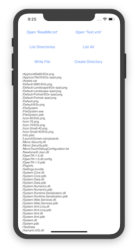](file-system-images/01-sampleapp.png#lightbox)

## General file access

Xamarin.iOS allows you to use the .NET `System.IO` classes for file
system operations on iOS.

The following code snippets illustrate some common file operations. You’ll
find them all below in the **SampleCode.cs** file, in the sample application for
this article.

### Working with directories

This code enumerates the subdirectories in the current directory (specified
by the "./" parameter), which is the location of your application executable.
Your output will be a list of all the files and folders that are deployed with
your application (displayed in the console window while you are debugging).

```csharp
var directories = Directory.EnumerateDirectories("./");
foreach (var directory in directories) {
      Console.WriteLine(directory);
}
```

### Reading files

To read a text file, you only need a single line of code. This example will
display the contents of a text file in the Application Output window.

```csharp
var text = File.ReadAllText("TestData/ReadMe.txt");
Console.WriteLine(text);
```

### XML serialization

Although working with the complete `System.Xml` namespace is
beyond the scope of this article, you can easily deserialize an XML document
from the file system by using a StreamReader like this code snippet:

```csharp
using (TextReader reader = new StreamReader("./TestData/test.xml")) {
      XmlSerializer serializer = new XmlSerializer(typeof(MyObject));
      var xml = (MyObject)serializer.Deserialize(reader);
}
```

For more information, see the documentation for [System.Xml](xref:System.Xml) and [serialization](xref:System.Xml.Serialization). See the [Xamarin.iOS documentation](~/ios/deploy-test/linker.md) on the linker – often you will need to add the `[Preserve]` attribute to classes you intend to serialize.

### Creating files and directories

This sample shows how to use the `Environment` class to access the Documents folder where we can create files and directories.

```csharp
var documents =
 Environment.GetFolderPath (Environment.SpecialFolder.MyDocuments); 
var filename = Path.Combine (documents, "Write.txt");
File.WriteAllText(filename, "Write this text into a file");
```

Creating a directory is a similar process:

```csharp
var documents =
 Environment.GetFolderPath (Environment.SpecialFolder.MyDocuments);
var directoryname = Path.Combine (documents, "NewDirectory");
Directory.CreateDirectory(directoryname);
```

For more information see the [System.IO API reference](xref:System.IO).

### Serializing JSON

[Json.NET](http://www.newtonsoft.com/json) is a high-performance JSON framework that works with Xamarin.iOS and is available on NuGet. Add the NuGet package to your application project, using **Add NuGet** in Visual Studio for Mac:

[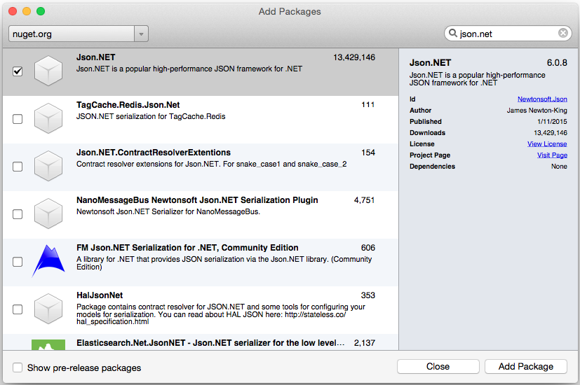](file-system-images/json01.png#lightbox)

Next, add a class to act as the data model for serialization/deserialization (in this case `Account.cs`):

```csharp
using System;
using System.Collections.Generic;
using Foundation; // for Preserve attribute, which helps serialization with Linking enabled

namespace FileSystem
{
    [Preserve]
    public class Account
    {
        public string Email { get; set; }
        public bool Active { get; set; }
        public DateTime CreatedDate { get; set; }
        public List<string> Roles { get; set; }

        public Account() {
        }
    }
}
```

Finally, create an instance of the `Account` class, serialize it to json data and write it to a file:

```csharp
// Create a new record
var account = new Account(){
    Email = "monkey@xamarin.com",
    Active = true,
    CreatedDate = new DateTime(2015, 5, 27, 0, 0, 0, DateTimeKind.Utc),
    Roles = new List<string> {"User", "Admin"}
};

// Serialize object
var json = JsonConvert.SerializeObject(account, Newtonsoft.Json.Formatting.Indented);

// Save to file
var documents = Environment.GetFolderPath (Environment.SpecialFolder.MyDocuments);
var filename = Path.Combine (documents, "account.json");
File.WriteAllText(filename, json);
```

For more information about working with json data in a .NET application, see Json.NET's [documentation](https://www.newtonsoft.com/json/help).

## Special considerations

Despite the similarities between Xamarin.iOS and .NET file operations, iOS and
Xamarin.iOS differ from .NET in some important ways.

### Making project files accessible at runtime

By default, if you add a file to your project, it won’t be included in the
final assembly, and therefore won’t be available to your application. In order
to include a file in the assembly, you must mark it with a special build action,
called Content.

To mark a file for inclusion, right-click on the file(s) and choose **Build Action &gt; Content** in Visual Studio for Mac. You can also change
the **Build Action** in the file’s **Properties**
sheet.

### Case sensitivity

It’s important to understand that the iOS file system is *case-sensitive*. Case-sensitivity means that your file and directory names must match exactly – **README.txt** and **readme.txt** would be considered different filenames.

This could be confusing for .NET developers who are more familiar with the
Windows file system, which is *case insensitive* – **Files**,
**FILES**, and **files** would all refer to the same directory.

> [!WARNING]
> The iOS Simulator is NOT case-sensitive.
> If your filename casing differs between the file itself and the references
> to it in code, your code might still work in the simulator but it will
> fail on a real device. This is one of the reasons why it’s important to deploy
> and test on an actual device early and often during iOS development.

### Path separator

iOS uses the forward slash ‘/’as the path separator (which is different
from Windows, which uses the backslash ‘\’).

Because of this confusing difference, it’s good practice to use the `System.IO.Path.Combine` method, which adjusts for the current
platform, rather than hardcode a particular path separator. This is a simple
step that makes your code more portable to other platforms.

## Application sandbox

Your application’s access to the file system (and other resources such as
the network and hardware features) is limited for security reasons. This
restriction is known as the *Application Sandbox*. In terms of the file
system, your application is limited to creating and deleting files and
directories in its home directory.

The home directory is a unique location in the file system where your
application and all its data are stored. You cannot choose (or change) the
location of the home directory for your application; however iOS and Xamarin.iOS
provide properties and methods to manage the files and directories inside.

## The application bundle

The *Application Bundle* is the folder that contains your application.
It is distinguished from other folders by having the .app suffix added to the
directory name. Your application bundle contains your executable file and all
the content (files, images, etc.) necessary for your project.

When you browse to your application bundle in Mac OS, it appears with a
different icon than you see in other directories (and the **.app** suffix is
hidden); however, it’s just a regular directory that the operating system is
displaying differently.

To view the application bundle for the sample code, right-click on the
project in **Visual Studio for Mac** and select **Reveal in Finder**. Then
navigate to the **bin/** directory where you should find an application
icon (similar to the screenshot below).

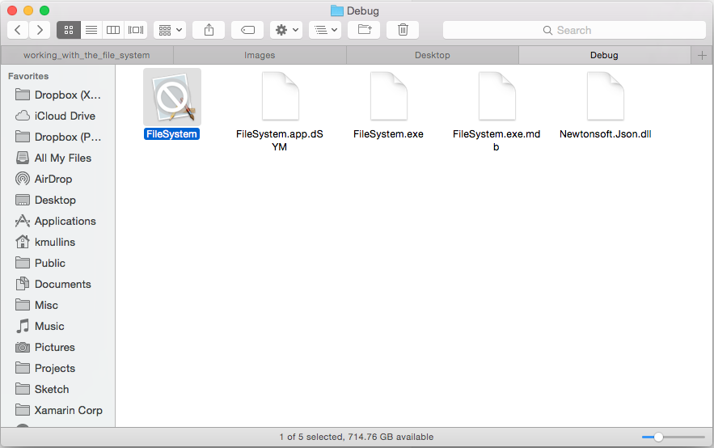

Right-click on this icon and choose **Show Package Contents** to
browse the contents of the Application Bundle directory. The contents appear
just like the contents of a regular directory, as shown here:

[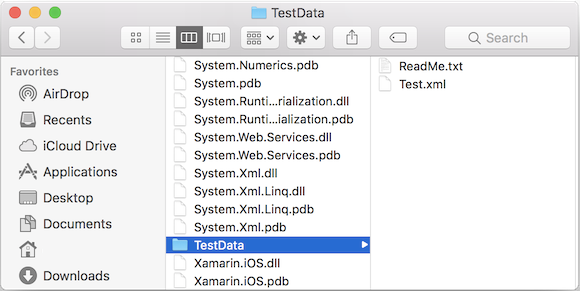](file-system-images/45-bundle.png#lightbox)

The application bundle is what’s installed on the simulator or on your
device during testing, and ultimately it is what’s submitted to Apple for
inclusion in the App Store.

## Application directories

When your application is installed on a device, the operating system creates
a home directory for your application, and creates a
number of directories within the application root directory that are available
for use. Since iOS 8, the user-accessible directories are [NOT located](https://developer.apple.com/library/ios/technotes/tn2406/_index.html) within the application root, so you can't derive the paths for the application bundle from the user directories, or vice versa.

These directories, how to determine their path, and their purposes are listed below:

&nbsp;

|Directory|Description|
|---|---|
|[ApplicationName].app/|**In iOS 7 and earlier**, this is the `ApplicationBundle` directory where your application executable is stored. The directory structure that you create in your app exists in this directory (for example, images and other file types that you’ve marked as Resources in your Visual Studio for Mac project).<br /><br />If you need to access the content files inside your Application Bundle, the path to this directory is available via the `NSBundle.MainBundle.BundlePath` property.|
|Documents/|Use this directory to store user documents and application data files.<br /><br />The contents of this directory can be made available to the user through iTunes file sharing (although this is disabled by default). Add a `UIFileSharingEnabled` Boolean key to the Info.plist file to allow users to access these files.<br /><br />Even if an application doesn’t immediately enable file sharing, you should avoid placing files that should be hidden from your users in this directory (such as database files, unless you intend to share them). As long as sensitive files remain hidden, these files will not be exposed (and potentially moved, modified, or deleted by iTunes) if file sharing is enabled in a future version.<br /><br /> You can use the `Environment.GetFolderPath (Environment.SpecialFolder.MyDocuments)` method to get the path to the Documents directory for your application.<br /><br />The contents of this directory are backed up by iTunes.|
|Library/|The Library directory is a good place to store files that are not created directly by the user, such as databases or other application-generated files. The contents of this directory are never exposed to the user via iTunes.<br /><br />You can create your own subdirectories in Library; however, there are already some system-created directories here that you should be aware of, including Preferences and Caches.<br /><br />The contents of this directory (except for the Caches subdirectory) are backed up by iTunes. Custom directories that you create in Library will be backed up.|
|Library/Preferences/|Application-specific preference files are stored in this directory. Do not create these files directly. Instead, use the `NSUserDefaults` class.<br /><br />The contents of this directory are backed up by iTunes.|
|Library/Caches/|The Caches directory is a good place to store data files that can help your application run, but that can be easily re-created. The application should create and delete these files as needed and be able to re-create these files if necessary. iOS 5 may also delete these files (under low storage situations), however it will not do so while the application is running.<br /><br />The contents of this directory are NOT backed up by iTunes, which means they will not be present if the user restores a device, and they may not be present after an updated version of your application is installed.<br /><br />For instance, in case your application can't connect to the network, you might use the Caches directory to store data or files to provide a good offline experience. The application can save and retrieve this data quickly while waiting for network responses, but it doesn’t need to be backed up and can easily be recovered or re-created after a restore or version update.|
|tmp/|Applications can store temporary files that are only needed for a short period in this directory. To conserve space, files should be deleted when they are no longer required. The operating system may also delete files from this directory when an application is not running.<br /><br />The contents of this directory are NOT backed up by iTunes.<br /><br />For example, the tmp directory might be used to store temporary files that are downloaded for display to the user (such as Twitter avatars or email attachments), but that could be deleted once they've been viewed (and downloaded again if they are required in the future).|

This screenshot shows the directory structure in a Finder window:

[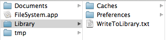](file-system-images/08-library-directory.png#lightbox)

### Accessing other directories programmatically

The earlier directory and file examples accessed the `Documents`
directory. To write to another directory, you must construct a path using the
".." syntax as shown here:

```csharp
var documents = Environment.GetFolderPath (Environment.SpecialFolder.MyDocuments);
var library = Path.Combine (documents, "..", "Library");
var filename = Path.Combine (library, "WriteToLibrary.txt");
File.WriteAllText(filename, "Write this text into a file in Library");
```

Creating a directory is similar:

```csharp
var documents = Environment.GetFolderPath (Environment.SpecialFolder.MyDocuments);
var library = Path.Combine (documents, "..", "Library");
var directoryname = Path.Combine (library, "NewLibraryDirectory");
Directory.CreateDirectory(directoryname);
```

Paths to the `Caches` and `tmp` directories can be
constructed like this:

```csharp
var documents = Environment.GetFolderPath (Environment.SpecialFolder.MyDocuments);
var cache = Path.Combine (documents, "..", "Library", "Caches");
var tmp = Path.Combine (documents, "..", "tmp");
```

## Sharing with the Files app

iOS 11 introduced the **Files** app - a file browser for iOS that allows the user to see and interact with their files in iCloud and also stored by any application that supports it. To allow the user to directly access files in your app, create a new boolean key in the **Info.plist** file `LSSupportsOpeningDocumentsInPlace` and set it to `true`, as here:

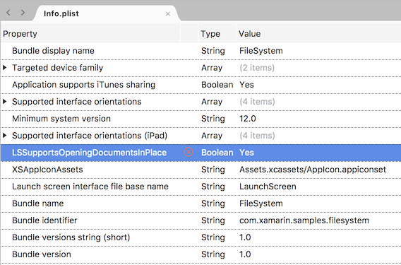

The app's **Documents** directory will now be available for browsing in the **Files** app. In the **Files** app, navigate to **On My iPhone** and each app with shared files will be visible. The screenshots below show what the [FileSystem sample app](/samples/xamarin/ios-samples/filesystemsamplecode) looks like:

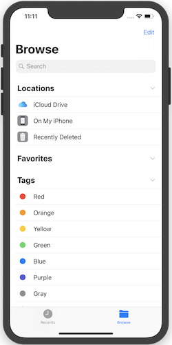 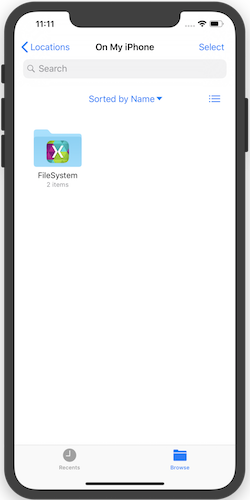 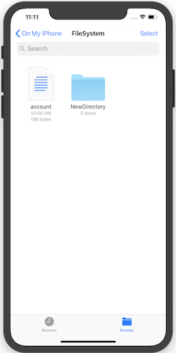

## Sharing files with the user through iTunes

Users can access the files in your application’s Documents directory by editing `Info.plist` and
creating an **Application that supports iTunes sharing** (`UIFileSharingEnabled`) entry in the **Source** view, as shown here:

[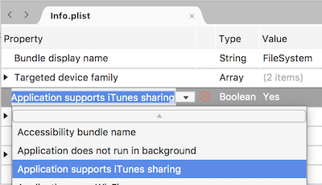](file-system-images/09-uifilesharingenabled-plist.png#lightbox)

These files can be accessed in iTunes when the device is connected and the
user chooses the `Apps` tab. For example, the following screenshot
shows the files in selected app shared
via iTunes:

[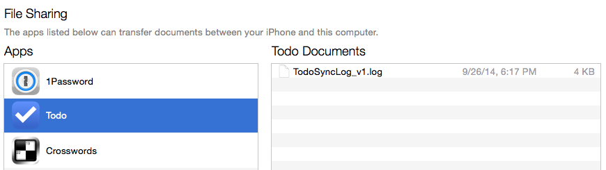](file-system-images/10-itunes-file-sharing.png#lightbox)

Users can only access the top-level items in this directory via iTunes. They
cannot see the contents of any subdirectories (although they can copy them to
their computer or delete them). For example, with GoodReader, PDF and EPUB files
can be shared with the application so that users can read them on their iOS
devices.

Users who modify the contents of their Documents folder can cause problems if
they’re not careful. Your application should take this into consideration and
be resilient to destructive updates of the Documents folder.

The sample code for this article creates both a file and a folder in the
Documents folder (in **SampleCode.cs**) and enables file sharing in the **Info.plist**
file. This screenshot shows how these appear in iTunes:

[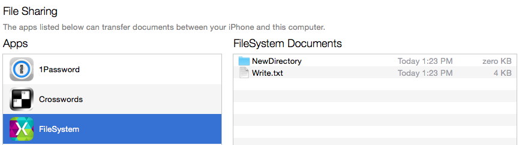](file-system-images/15-itunes-file-sharing-example.png#lightbox)

Refer to the [Working with Images](~/ios/app-fundamentals/images-icons/index.md) article for information about how to set icons for the application
and for any custom document types you create.

If the `UIFileSharingEnabled` key is false or not present, then
file sharing is, by default, disabled, and users will not be able to interact
with your Documents directory.

## Backup and restore

When a device is backed up by iTunes, all the directories created in your
application’s home directory will be saved except the following directories:

- **[ApplicationName].app** – Don't write to this directory, since it’s signed and so must remain unchanged after installation. It may contain resources that you access from your code, but they do not require backup since they would be restored by re-downloading the app.
- **Library/Caches** – The cache directory is intended for working files that do not need to be backed up.
- **tmp** – This directory is used for temporary files that are created and deleted when no longer needed, or for files that iOS deletes when it needs space.

Backing up a large amount of data can take a long time. If you decide you
need to back up any particular document or data, your application should use either
use the Documents and Library folders. For transient data or files that
can be easily retrieved from the network, use either the Caches or the tmp
directory.

> [!NOTE]
> iOS will ‘clean’ the filesystem when a device runs critically low on disk space.
> This process will remove all files from the Library/Caches and tmp folder of applications that are not currently running.

## Complying with iOS 5 iCloud backup restrictions

> [!NOTE]
> Although this policy was first introduced with iOS 5 (which seems like a long time ago)
> the guidance is still relevant to apps today.

Apple introduced *iCloud Backup* functionality with iOS 5. When iCloud
Backup is enabled, all the files in your application’s home directory
(excluding directories that are not normally backed up, e.g., the app bundle, `Caches`, and `tmp`) are backed-up to iCloud servers. This feature provides the user with a complete backup in case their device is lost, stolen, or damaged.

Because iCloud only provides 5 Gb of free space to each user and to
avoid unnecessarily using bandwidth, Apple expects applications to only backup
essential user-generated data. To comply with the iOS Data Storage Guidelines,
you should limit the amount of data that gets backed up by adhering to the
following items:

- Only store user-generated data, or data that cannot otherwise be re-created, in the Documents directory (which is backed-up).
- Store any other data that can easily be re-created or re-downloaded in `Library/Caches` or `tmp` (which is not backed-up, and could be ‘cleaned’).
- If you have files that might be appropriate for the `Library/Caches` or `tmp` folder but you do not want to be ‘cleaned’ out, store them elsewhere (such as `Library/YourData`) and apply the ‘do not back up’ attribute to prevent the files from using up iCloud Backup bandwidth and storage space. This data still uses up space on the device, so you should manage it carefully and delete it when possible.

The ‘do not back up’ attribute is set using the `NSFileManager` class. Ensure your class is `using Foundation` and call `SetSkipBackupAttribute` like this:

```csharp
var documents = Environment.GetFolderPath (Environment.SpecialFolder.MyDocuments);
var filename = Path.Combine (documents, "LocalOnly.txt");
File.WriteAllText(filename, "This file will never get backed-up. It would need to be re-created after a restore or re-install");
NSFileManager.SetSkipBackupAttribute (filename, true); // backup will be skipped for this file
```

When `SetSkipBackupAttribute` is `true` the file will
not be backed-up, regardless of the directory it is stored in (even the `Documents` directory). You can query the attribute using the `GetSkipBackupAttribute` method, and you can reset it by calling the `SetSkipBackupAttribute` method with `false`, like
this:

```csharp
NSFileManager.SetSkipBackupAttribute (filename, false); // file will be backed-up
```

## Sharing data between iOS apps and app extensions

Since App Extensions run as part of a host application (as opposed to their containing app), the sharing of data isn't automatic included so extra work is required. App Groups are the mechanism iOS uses to allow different apps to share data. If the applications have been properly configured with the correct entitlements and provisioning, they can access a shared directory outside of their normal iOS sandbox.

### Configure an App Group

The shared location is configured using an [App Group](https://developer.apple.com/library/archive/documentation/Miscellaneous/Reference/EntitlementKeyReference/Chapters/EnablingAppSandbox.html#//apple_ref/doc/uid/TP40011195-CH4-SW19),
  which is configured in the **Certificates, Identifiers & Profiles** section on
  iOS Dev Center. This value
  must also be referenced in each project's **Entitlements.plist**.

For information on creating and configuring an App Group, refer to the [App Group Capabilities](~/ios/deploy-test/provisioning/capabilities/app-groups-capabilities.md) guide.

### Files

The iOS app and the extension can also share files using a common file path (given they have been properly configured with the correct entitlements and provisioning):

```csharp
var FileManager = new NSFileManager ();
var appGroupContainer =FileManager.GetContainerUrl ("group.com.xamarin.WatchSettings");
var appGroupContainerPath = appGroupContainer.Path

Console.WriteLine ("Group Path: " + appGroupContainerPath);

// use the path to create and update files
...
```

> [!IMPORTANT]
> If the Group Path returned is `null`, check the configuration of the entitlements and the provisioning profile and make sure that they are correct.

## Application version updates

When a new version of your application is downloaded, iOS creates a new home
directory and stores the new Application Bundle in it. iOS then moves the
following folders from the previous version of your Application Bundle to your
new home directory:

- **Documents**
- **Library**

Other directories may also be copied across and put under your new home
directory, but they’re not guaranteed to be copied, so your application should
not rely on this system behavior.

## Summary

This article showed that file system operations with Xamarin.iOS are similar to any other .NET application. It also introduced the Application Sandbox
and examined the security implications that it causes. Next, it explored the
concept of an Application Bundle. Finally, it enumerated the specialized
directories available to your application and explained their roles during
application upgrades and backups.

## Related links

- [FileSystem sample code](/samples/xamarin/ios-samples/filesystemsamplecode)
- [File System Programming Guide](https://developer.apple.com/library/ios/#documentation/FileManagement/Conceptual/FileSystemProgrammingGUide/Introduction/Introduction.html)
- [Registering the File Types your App Supports](https://developer.apple.com/library/ios/#documentation/FileManagement/Conceptual/DocumentInteraction_TopicsForIOS/Articles/RegisteringtheFileTypesYourAppSupports.html#/apple_ref/doc/uid/TP40010411-SW1)