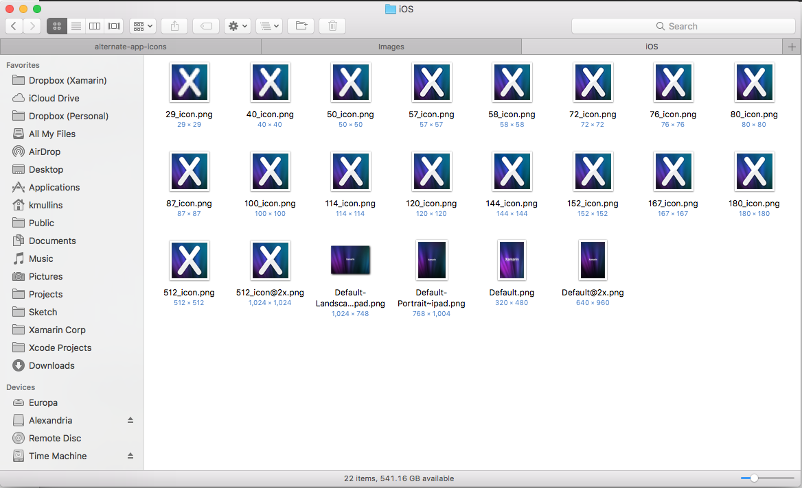
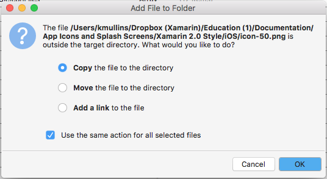
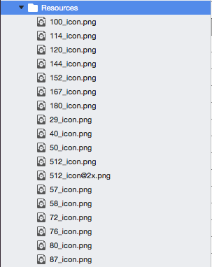
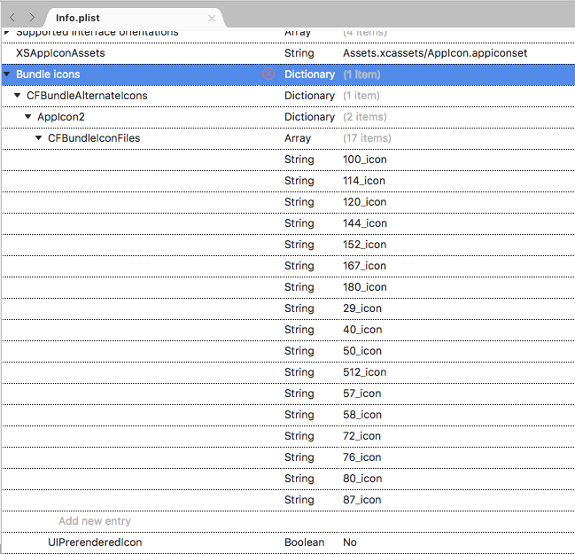

# Alternate App Icons in Xamarin.iOS

_This article covers using alternate app icons in Xamarin.iOS._

Apple has added several enhancements to iOS 10.3 that allow an app to manage its icon:

- `ApplicationIconBadgeNumber` - Gets or sets the badge of the app icon in the Springboard.
- `SupportsAlternateIcons` - If `true` the app has an alternate set of icons.
- `AlternateIconName` - Returns the name of the alternate icon currently selected or `null` if using the primary icon.
- `SetAlternameIconName` - Use this method to switch the app's icon to the given alternate icon.


<a name="Adding-Alternate-Icons"></a>

## Adding Alternate Icons to a Xamarin.iOS Project

To allow an app to switch to an alternate icon, a collection of icon images will need to be included in the Xamarin.iOS app project. These images cannot be added to the project using the typical `Assets.xcassets` method, they must be added to the **Resources** folder directly.

Do the following:

1. Select the required icon images in a folder, select all and drag them to the **Resources** folder in the **Solution Explorer**:

    

2. When prompted, select **Copy**, **Use the same action for all selected files** and click the **OK** button:

    

3. The **Resources** folder should look like the following when completed:

    

<a name="Modifying-the-Info.plist-File"></a>

## Modifying the Info.plist File

With the required images added to the **Resources** folder, the [CFBundleAlternateIcons](https://developer.apple.com/library/content/documentation/General/Reference/InfoPlistKeyReference/Articles/CoreFoundationKeys.html#//apple_ref/doc/uid/TP40009249-SW13) key will need to be added to the project's **Info.plist** file. This key will define the name of the new icon and the images that compose it.

Do the following:

1. In the **Solution Explorer**, double-click the **Info.plist** file to open it for editing.
2. Switch to the **Source** view.
3. Add a **Bundle icons** key and leave the **Type** set to **Dictionary**.
4. Add a `CFBundleAlternateIcons` key and set the **Type** to **Dictionary**.
5. Add a `AppIcon2` key and set the **Type** to **Dictionary**. This will be the name of the new alternate app icon set.
6. Add a `CFBundleIconFiles` key and set the **Type** to **Array**
7. Add a new string to the `CFBundleIconFiles` array for each icon file leaving out the extension and the `@2x`, `@3x`, etc. suffixes (example `100_icon`). Repeat this step for every file that makes up the alternate icon set.
8. Add a `UIPrerenderedIcon` key to the `AppIcon2` dictionary, set the **Type** to **Boolean** and the value to **No**.
9. Save the changes to the file.

The resulting **Info.plist** file should look like the following when completed:



Or like this if opened in a text editor:

```xml
<key>CFBundleIcons</key>
<dict>
    <key>CFBundleAlternateIcons</key>
    <dict>
        <key>AppIcon2</key>
        <dict>
            <key>CFBundleIconFiles</key>
            <array>
                <string>100_icon</string>
                <string>114_icon</string>
                <string>120_icon</string>
                <string>144_icon</string>
                <string>152_icon</string>
                <string>167_icon</string>
                <string>180_icon</string>
                <string>29_icon</string>
                <string>40_icon</string>
                <string>50_icon</string>
                <string>512_icon</string>
                <string>57_icon</string>
                <string>58_icon</string>
                <string>72_icon</string>
                <string>76_icon</string>
                <string>80_icon</string>
                <string>87_icon</string>
            </array>
            <key>UIPrerenderedIcon</key>
            <false/>
        </dict>
    </dict>
</dict>
```

<a name="Managing-the-Apps-Icon"></a>

## Managing the App's Icon 

With the icon images included in the Xamarin.iOS project and the **Info.plist** file correctly configured, the developer can use one of many new features added to iOS 10.3 to control the app's icon.

The `SupportsAlternateIcons` property of the `UIApplication` class allows the developer to see if an app supports alternate icons. For example:

```csharp
// Can the app select a different icon?
PrimaryIconButton.Enabled = UIApplication.SharedApplication.SupportsAlternateIcons;
AlternateIconButton.Enabled = UIApplication.SharedApplication.SupportsAlternateIcons;
```

The `ApplicationIconBadgeNumber` property of the `UIApplication` class allows the developer to get or set the current badge number of the app icon in the Springboard. The default value is zero (0). For example:

```csharp
// Set the badge number to 1
UIApplication.SharedApplication.ApplicationIconBadgeNumber = 1;
```

The `AlternateIconName` property of the `UIApplication` class allows the developer to get the name of the currently selected alternate app icon or it returns `null` if the app is using the Primary Icon. For example:

```csharp
// Get the name of the currently selected alternate
// icon set
var name = UIApplication.SharedApplication.AlternateIconName;

if (name != null ) {
    // Do something with the name
}
```

The `SetAlternameIconName` property of the `UIApplication` class allows the developer to change the app icon. Pass the name of the icon to select or `null` to return to the primary icon. For example:

```csharp
partial void UsePrimaryIcon (Foundation.NSObject sender)
{
    UIApplication.SharedApplication.SetAlternateIconName (null, (err) => {
        Console.WriteLine ("Set Primary Icon: {0}", err);
    });
}

partial void UseAlternateIcon (Foundation.NSObject sender)
{
    UIApplication.SharedApplication.SetAlternateIconName ("AppIcon2", (err) => {
        Console.WriteLine ("Set Alternate Icon: {0}", err);
    });
}
```

When the app is run and the user select an alternate icon, an alert like the following will be displayed:


If the user switches back to the primary icon, an alert like the following will be displayed:


<a name="Summary"></a>

## Summary

This article has covered adding alternate app icons to a Xamarin.iOS project and using them inside of the app.

## Related Links

- [iOSTenThree Sample](/samples/xamarin/ios-samples/ios10-iostenthree/)