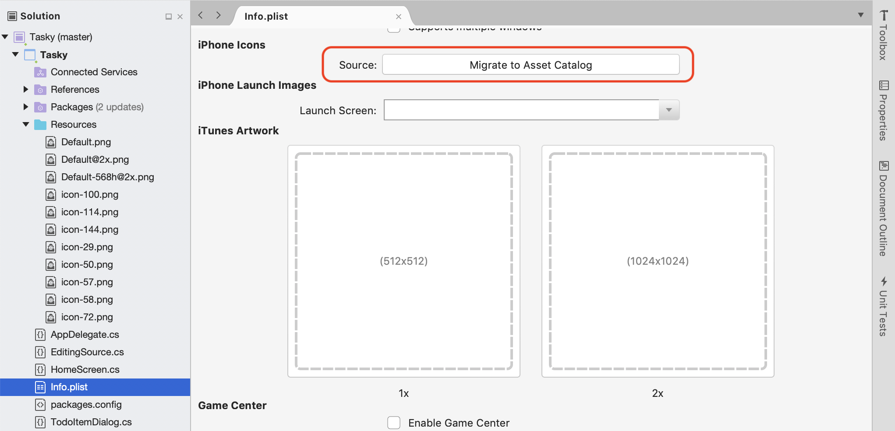

# Application Icons in Xamarin.iOS

The following topics will be covered in detail:

* [Application, Spotlight and Settings Icons](#icon-types) - The different types of icons required for an iOS app.
* [Managing Icons with Asset Catalogs](#managing) - Managing application icons using Asset Catalogs.
* [iTunes Artwork](#itunes) - Supplying the required iTunes Artwork for the Ad-Hoc method of delivering your application.

<a name="icon-types" />

## Application, Spotlight, and Settings Icons

In the same way that a Xamarin.iOS app can use image assets for UI controls and as document icons, image assets can be used to provide Application Icons. The following screenshots from an iPad illustrates the three uses of icons in iOS:

- **Application Icon** - Every iOS app must define an application icon. This is the icon that the user will tap from the iOS home screen to launch the app. Additionally, this icon is used by Game Center, if applicable. Example: 

    
- **Spotlight Icon** - Whenever the user enters the name of an app in a Spotlight Search, this icon is displayed. Example: 

    
- **Settings Icon** - If the user enters the **Settings** app on their iOS device, this icon will be displayed at the end of the **Settings** list for the app. Example: 

    

The following image asset sizes and resolutions will be needed to support all of the icon types required by an Xamarin.iOS app targeting iOS 5 through iOS 9 (or greater):

### iPhone Icon Sizes

- **iPhone: iOS 9 & 10 (iPhone 6 & 7 Plus)**

    ||3x|
    |---|---|
    |Application Icon|180x180|
    |Spotlight|120x120|
    |Settings|87x87|

- **iPhone: iOS 7 & 8**

    ||1x|2x|
    |---|---|---|
    |Application Icon|60x601|120x120|
    |Spotlight|40x402|80x80|
    |Settings|-|-|

- **iPhone: iOS 5 & 6**

    ||1x|2x|
    |---|---|---|
    |Application Icon|57x57|114x114|
    |Spotlight|29x29|58x58|
    |Settings|29x293, 4|58x583, 4|

### iPad Icon Sizes

- **iPad: iOS 9 & 10**

    ||2x (iPad Pro)|
    |---|---|
    |Application Icon|167x1676|
    |Spotlight|120x1206|
    |Settings|58x585|

- **iPad: iOS 7 & 8**

    ||1x|2x|
    |---|---|---|
    |Application Icon|76x76|152x152|
    |Spotlight|40x40|80x80|
    |Settings|-|-|

- **iPad: iOS 5 & 6**

    ||1x|2x|
    |---|---|---|
    |Application Icon|72x72|144x144|
    |Spotlight|50x50|100x100|
    |Settings|29x293, 5|58x583, 5|

 1. Both Visual Studio for Mac and Xcode no longer support setting 1x image for iOS 7.
 2. Setting a 1x image for iOS 7 is not supported when using Asset Catalogs.
 3. iOS 7 & 8 use the same image sizes as iOS 5 & 6.
 4. Uses the same images and sizes as the Spotlight Icon.
 5. Uses the same size icons as the iPhone.
 6. Only supported with Asset Catalog Image Sets.
 
 For more information about icons, please see Apple's [Icon and Image Sizes](https://developer.apple.com/library/ios/documentation/UserExperience/Conceptual/MobileHIG/IconMatrix.html#//apple_ref/doc/uid/TP40006556-CH27-SW1) documentation.

<a name="managing" />

## Managing Icons with Asset Catalogs

For icons, a special `AppIcon` image set can be added to the `Assets.xcassets` file in the app's project. All version of the image required to support all resolutions are included in the _xcasset_ and grouped together. A special editor in Visual Studio for Mac allows the developer to include and setup these images graphically.

To use an Asset Catalog, do the following:

# [Visual Studio for Mac](#tab/macos)

1. Double-click the `Info.plist` file in the **Solution Explorer** to open it for editing.
2. Scroll down to the **App Icons** section.
3. From the **Source** dropdown list, ensure **AppIcon** is selected: 

    
4. From the **Solution Explorer**, double-click the `Assets.xcassets` file to open it for editing: 

    
5. Select `AppIcon` from the list of assets to display the `Icon Editor`:

    
6. Either click on given icon type and select an image file for the required type/size or drag in an image from a folder and drop it on the desired size.
7. Click the **Open** button to include the image in the project and set it in the xcasset.
8. Repeat for all images required.

# [Visual Studio](#tab/windows)

1. Double-click the **Info.plist** file in the **Solution Explorer**:

    
2. Click on the **Visual Assets** tab and click on the **Use Asset Catalog** button under **App Icons**: 

    
4. From the **Solution Explorer**, expand the **Asset Catalog** folder: 

    
5. Double-click the **Media** file to open it in the editor: 

    
6. Under the **Properties Explorer** the developer can select the different types and sizes of icons required.
7. Click on given icon type and select an image file for the required type/size.
8. Click the **Open** button to include the image in the project and set it in the xcasset.
9. Repeat for all images required.

-----

This is the preferred method of including and managing image assets that will be used to provide Application, Spotlight and Settings icons for an app.

### Migrating from Info.plist to Asset Catalogs

For an existing Xamarin.iOS app using the `Info.plist` file to manage it's icons, it is highly suggested that the developer switch it over to use the `AppIcons` Image Asset inside the `Assets.xcassets`.

Do the following:

# [Visual Studio for Mac](#tab/macos)

1. Double-Click the `Info.plist` file in the **Solution Explorer** to open it for editing.
2. Scroll down to the **App Icons** section.
3. From the **Source** dropdown list, select **Migrate to Asset Catalogs**: 

    
4. Any existing Icons defined in the `Info.plist` file will be migrated to a `AppIcons` Image Set added to `Assets.xcassets`: 

     

# [Visual Studio](#tab/windows)

1. Double-Click the `Info.plist` file in the **Solution Explorer** to open it for editing.
2. Click on the iPhone Icons section: 

    
3. Scroll down to the **Icons** section.
4. From the **Asset Catalog** dropdown list, select **Use Asset Catalogs**.
5. Any existing Icons defined in the `Info.plist` file will be migrated to a `Images` set added to `Assets.xcassets`.
6. Save the changes to the `Info.plist` file.

-----

<a name="itunes" />

## iTunes Artwork

If using the Ad-Hoc method of delivering the app (either for corporate users or for beta testing on real devices), the developer also needs to include a 512x512 and a 1024x1024 image that will be used to represent the app in iTunes.

To specify the iTunes Artwork, do the following:

# [Visual Studio for Mac](#tab/macos)

1. Double-click the `Info.plist` file in the **Solution Explorer** to open it for editing.
2. Scroll to the **iTunes Artwork** section of the editor: 

    
3. For any missing image, click on the thumbnail in the editor, select the image file for the desired iTunes artwork from the Open File dialog box and click the **OK** button.
4. Repeat this step until all needed images have been specified for the app.

# [Visual Studio](#tab/windows)

1. Double-click the `Info.plist` file in the **Solution Explorer** to open it for editing.

2. Click on the **Visual Assets** tab and expand the **iTunes Artwork**: 

    
4. For any missing image, click on the thumbnail in the editor, select the image file for the desired iTunes artwork from the Open File dialog box and click the **Open** button.
5. Repeat this step until all needed images have been specified for the app.

-----

## Related Links

- [Working with Images (sample)](https://developer.xamarin.com/samples/WorkingWithImages/)
- [Hello, iPhone](~/ios/get-started/hello-ios/index.md)
- [Custom Icon and Image Creation Guidelines](http://developer.apple.com/library/ios/#documentation/UserExperience/Conceptual/MobileHIG/IconsImages/IconsImages.html))
