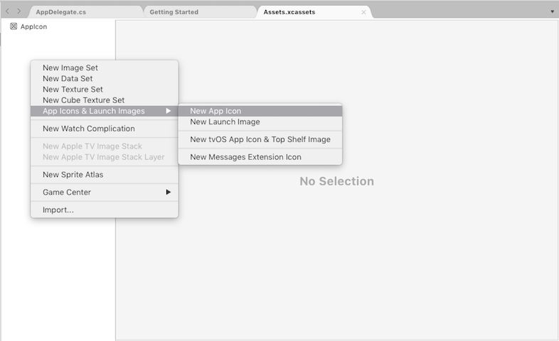
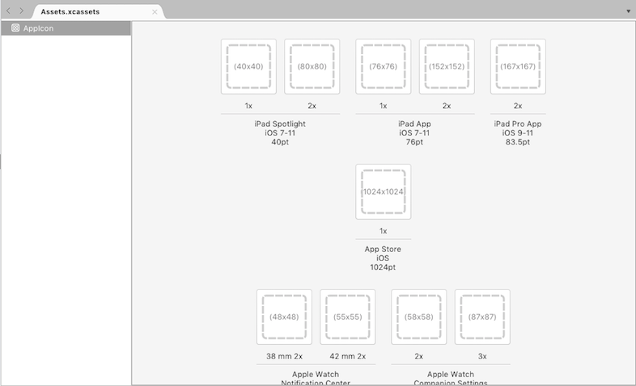

# App Store Icons in Xamarin.iOS

Before Xcode 9 all App Store icons were added through iTunes Connect. However, this is no longer the case. App Store icons now must be included as part of your project bundle and added within an asset catalog. Apps that do not contain an App Store icon will be rejected by Apple.

The App Store Icon is the face of your application to users, so it must be memorable and display well at a small size. Memorable icons are clean, simple, and immediately recognizable.

Apple suggests the following guidelines when designing your applications icon:

- Make the icon appropriate for your application.
- Create a simple icon that is consistent with the design of your application.
- Avoid using words in your icon.
- Think globally: A single app icon is used in all store territories.

A 1024 x 1024 pixel image is required for the App Icon that will be displayed in the App Store.  Apple have stated that the app store icon in the asset catalog can't be transparent nor contain an alpha channel.

For more information, see Apple's [iOS Human Interface Guidelines](https://developer.apple.com/ios/human-interface-guidelines/icons-and-images/image-size-and-resolution/).

## Adding an App Store icon

Application Store icons should now be delivered by an asset catalog. 

To add an App Store icon do the following:

1. Locate the **AppIcon** image set in the **Assets.xcassets** file of your project. 
	- All new projects should come with a an **Assets.xcassets** file that contains an AppIcon image set.
	- To add a new asset catalog, right-click on your project and select **Add > New File > Asset Catalog**.
	- To add a new an app icon image set, right-click in the icon set area and select **App Icons & Launch Images > New App Icon**:
	
	

2. Scroll to the **App Store** icon in the list:

	

3. Click on the icon and browse for your 1024 x 1024 pixel image. Save the Asset Catalog.

## Related Links

- [Managing Icons with Asset Catalogs](~/ios/app-fundamentals/images-icons/app-icons.md#managing)
