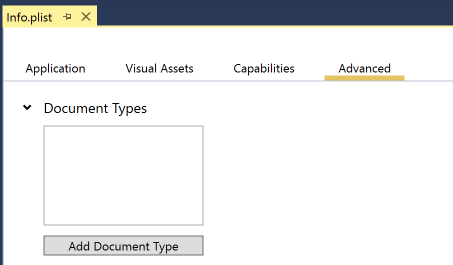
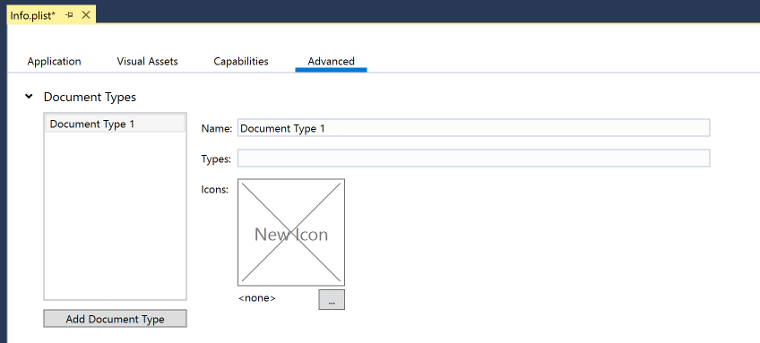

# Custom Document Icons in Xamarin.iOS

_This article covers including and managing an image asset in a Xamarin.iOS app to be used as a Custom Document Type Icon._

If a Xamarin.iOS app supports loading a particular document type, the developer can provide icons that the system will use when it encounters that document type, such as when a user holds down an attachment in the *Mail Application* as shown here:

 

The developer can add document type information for a file format the app is capable of opening by including dictionary entries for the `CFBundleTypeName` string and `LSItemContentTypes` array in the app's `Info.plist`. The icons for the document type go in the `CFBundleTypeIconFiles` array. If a document icon isn't provided, iOS will derive one from the app icon.
Icons can be supplied for several sizes, optimized for the various device resolutions. 

# [Visual Studio for Mac](#tab/macos)

To assign these values in Visual Studio for Mac, use the **Document Types** section under the **Advanced** tab on the `Info.plist`
editor to add the document type and assign image icons to it. For
example, here is a screenshot showing registration for PDF support:

 

# [Visual Studio](#tab/windows)

To assign these values in Visual Studio, use the **Document Types** section under the **Advanced** tab on the `Info.plist`:

 

Click the **Add Document Type** button and fill in the required fields:

-----

For more information about document types, see Apple’s [Uniform Type Identifiers Reference](https://developer.apple.com/library/ios/#documentation/Miscellaneous/Reference/UTIRef/Articles/System-DeclaredUniformTypeIdentifiers.html) and [Document Interaction Programming Topics for iOS](https://developer.apple.com/library/ios/#documentation/FileManagement/Conceptual/DocumentInteraction_TopicsForIOS/Introduction/Introduction.html).

## Related Links

- [Working with Images (sample)](/samples/xamarin/ios-samples/workingwithimages)
- [Hello, iPhone](~/ios/get-started/hello-ios/index.md)
- [Custom Icon and Image Creation Guidelines](https://developer.apple.com/library/ios/#documentation/UserExperience/Conceptual/MobileHIG/IconsImages/IconsImages.html)