# Displaying an image in Xamarin.iOS

_This article covers including an image asset in a Xamarin.iOS app and displaying that image either by using C# code or by assigning it to a control in the iOS Designer._

## Adding and organizing images in a Xamarin.iOS app

When adding an image for use in a Xamarin.iOS app, the developer will use an _Asset Catalog_ to support every iOS device and resolution required by an app.

Added in iOS 7, **Asset Catalogs Image Sets** contain all the versions or representations of an image that are necessary to support various devices and scale factors for an app. Instead of relying on the image assets filename, **Image Sets** use a Json file to specify which image belongs to which device and/or resolution. This is the preferred way to manage and support images in iOS (from iOS 9 or greater).

## Adding images to an asset catalog image set

As stated above, an **Asset Catalogs Image Sets** contain all the versions or representations of an image that are necessary to support various devices and scale factors for an app. Instead of relying on the image assets filename, **Image Sets** use a Json file to specify which image belongs to which device and/or resolution.

To create a new image set and add images to it, do the following:

# [Visual Studio for Mac](#tab/macos)

1. In the **Solution Explorer**, double-click the `Assets.xcassets` file to open it for editing:

    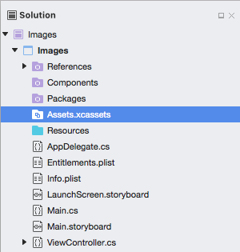
2. Right-click on the **Assets List** and select **New Image Set**:

    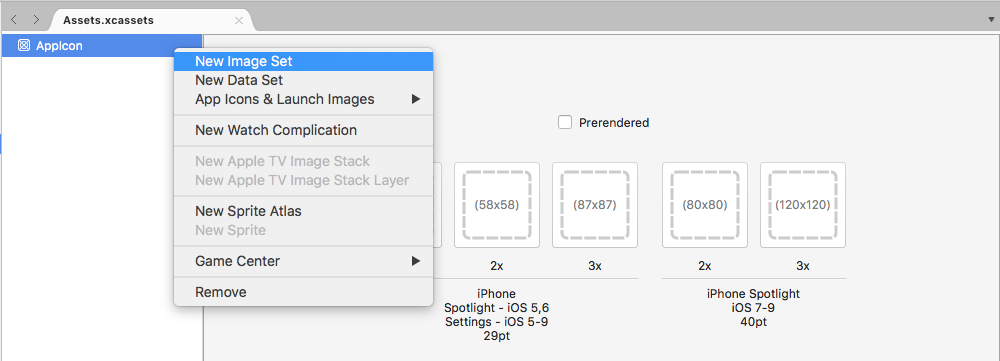
3. Select the new image set and the editor will be displayed:

    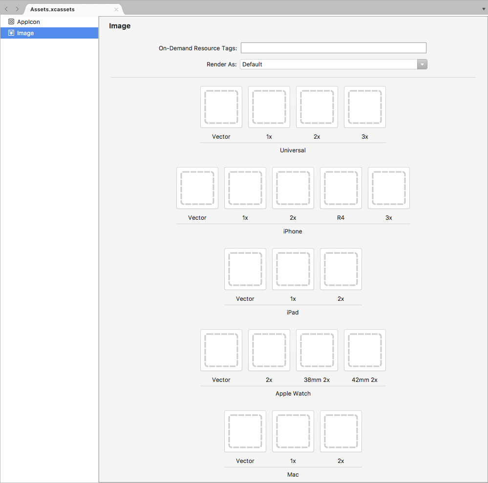
4. From here, drag in images for each of the different devices and resolutions required.
5. Double-click the new image set's **Name** in the **Assets List** to edit it: 

When using an **Image Set** in the iOS Designer, simply select the set's name from the dropdown list in the Property Editor:

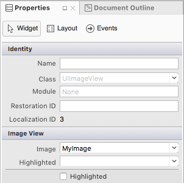

# [Visual Studio](#tab/windows)

1. Open the Asset Catalog from the **Solution Explorer**, and in the top left corner, click the **Plus** button:

    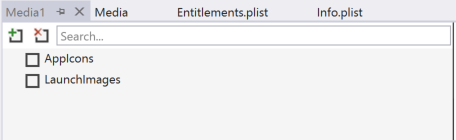

2. Select **Add Image Set** and the Image Set editor will be displayed for the new image set. From here, drag in images for each of the different devices and resolutions required.

    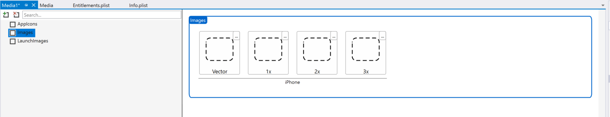

### Renaming an image set

To rename an Image Set, do the following:

1. In the **Solution Explorer**, double-click the **Asset Catalog** file to open it for editing:

    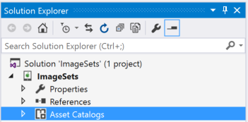
2. Select the **Image Set** to rename:

    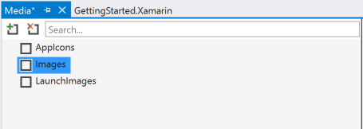
3. In the **Properties Explorer**, scroll to the bottom and select **Name**(under the **Misc** section):

    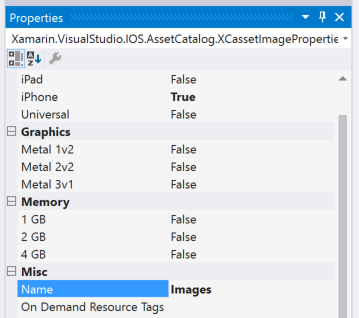
4. Enter a new **Name** for the **Image Set** and save the changes.

-----

When using an **Image Set** in code, reference it by name by calling the `FromBundle` method of the `UIImage` class. For Example:

```csharp
MonkeyImage.Image = UIImage.FromBundle ("PurpleMonkey");
```

> [!IMPORTANT]
> If the images assigned to an Image Set are not showing up correctly, ensure that the correct filename is being used with the `FromBundle` method (the **Image Set** and not the parent **Asset Catalog** name). For PNG images, the `.png` extension can be omitted. For other image formats, the extension is required (eg. `PurpleMonkey.jpg`).

### Using vector images in asset catalogs

As of iOS 8, special **Vector** class has been added to **Image Sets** that allows the developer to include a **PDF** formatted vector image in the cassette instead including individual bitmap files at the different resolutions. Using this method, supply a single vector file for the `@1x` resolution (formatted as a vector PDF file) and the `@2x` and `@3x` versions of the file will be generated at compile time and included in the application's bundle.

# [Visual Studio for Mac](#tab/macos)

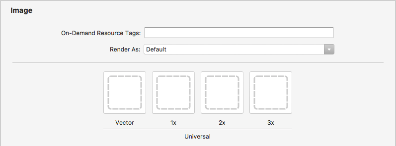

# [Visual Studio](#tab/windows)

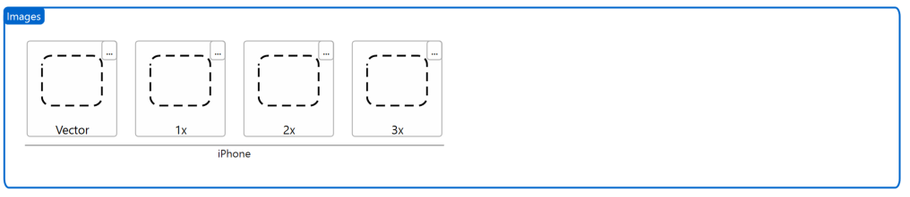

-----

For example, if the developer includes a `MonkeyIcon.pdf` file as the vector of an Asset Catalog with a resolution of 150px x 150px, the following bitmap assets would be included in the final app bundle when it was compiled:

- `MonkeyIcon@1x.png` - 150px x 150px resolution.
- `MonkeyIcon@2x.png` - 300px x 300px resolution.
- `MonkeyIcon@3x.png` - 450px x 450px resolution.

The following should be taken into consideration when using PDF vector images in Asset Catalogs:

- This is not full vector support as the PDF will be rasterized to a bitmap at compile time and the bitmaps shipped in the final application.
- The size of the image cannot be adjusted once it has been set in the Asset Catalog. If the developer attempts to resize the image (either in code or by using Auto Layout and Size Classes) the image will be distorted just like any other bitmap.
- Asset Catalogs are only compatible with iOS 7 and greater, if an app need to support iOS 6 or lower, it cannot use Asset Catalogs.

## Working with template images

Based on the design of an iOS app, there might be times when the developer needs to customize an icon or image inside of the User Interface to match a change in color scheme (for example, based on user preferences).

To easily achieve this effect, switch the _Render Mode_ of the Image Asset to **Template Image**:

# [Visual Studio for Mac](#tab/macos)

[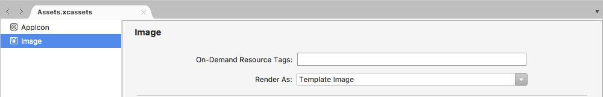](displaying-an-image-images/templateimage01.png#lightbox)

# [Visual Studio](#tab/windows)

[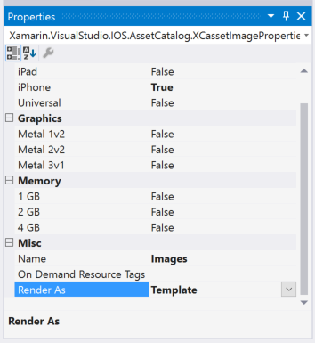](displaying-an-image-images/templateimage01vs.png#lightbox)

-----

From the iOS Designer, assign the Image Asset to a UI control, then set the **Tint** to colorize the image:

# [Visual Studio for Mac](#tab/macos)

[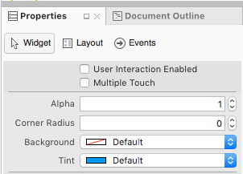](displaying-an-image-images/templateimage03.png#lightbox)

# [Visual Studio](#tab/windows)

[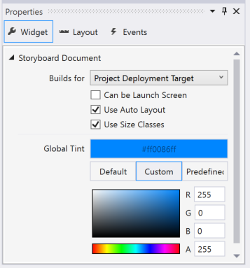](displaying-an-image-images/templateimage03vs.png#lightbox)

-----

Optionally, the Image Asset and Tint can be set directly in code:

```csharp
MyIcon.Image = UIImage.FromBundle ("MessageIcon");
MyIcon.TintColor = UIColor.Red;
```

To use a Template Image completely from code, do the following:

```csharp
if (MyIcon.Image != null) {
    var mutableImage = MyIcon.Image.ImageWithRenderingMode (UIImageRenderingMode.AlwaysTemplate);
    MyIcon.Image = mutableImage;
    MyIcon.TintColor = UIColor.Red;
}
```

Because the `RenderMode` property of a `UIImage` is read only, use the `ImageWithRenderingMode` method to create a new instance of the image with the desired Render Mode setting.

There are three possibly settings for `UIImage.RenderMode` via the `UIImageRenderingMode` enum:

- `AlwaysOriginal` - Forces the image to be rendered as the original source image file without any changes.
- `AlwaysTemplate` - Forces the image to be rendered as a Template Image by colorizing the pixels with the specified `Tint` color.
- `Automatic` -  Either renders the image as a Template or Original based on the environment that it is used in. For example, if the image is used in a `UIToolBar`, `UINavigationBar`, `UITabBar` or `UISegmentControl` it will be treated as a Template.

## Adding new assets collections

When working with images in Assets Catalogs there might be times when a new collection will be required, instead of adding all of the app's images to the `Assets.xcassets` collection. For example, when designing On-Demand Resources.

To add a new Assets Catalog to the project:

# [Visual Studio for Mac](#tab/macos)

1. Right-click on the **Project Name** in the **Solution Explorer** and select **Add** > **New File...**
2. Select **iOS** > **Asset Catalog**, enter a **Name** for the collection and click the **New** button:

    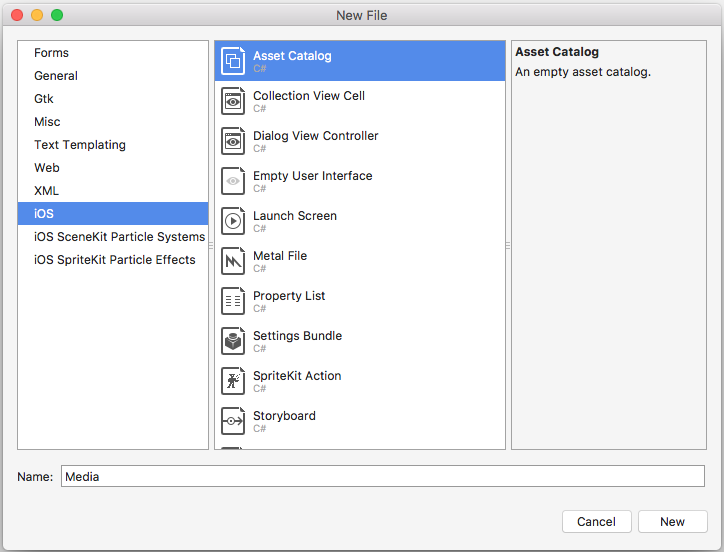

# [Visual Studio](#tab/windows)

1. In the Solution Explorer, right-click on **Asset Catalogs** folder, and select **Add > New Asset Catalog**.
2. Give it a name and click **Add**:

    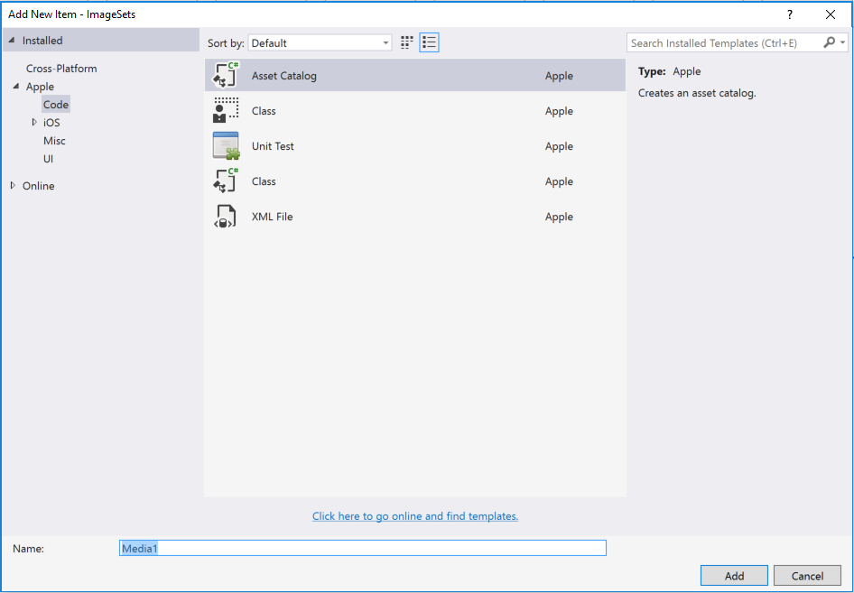

-----

From here, the collection can be worked with in the same way as the default `Assets.xcassets` collection automatically included in the project.

## Using images with controls

In addition to using images to support an app, iOS also uses images with app control types such as tab bars, toolbars, navigation bars, tables, and buttons. A simple way to make an image appear on a control is to assign a `UIImage` instance to the control’s `Image` property.

### FromBundle

The `FromBundle` method call is a synchronous (blocking) call that has a number of image loading and management features built-in, such as caching support and automatic handling of image files for various resolutions.

The following example shows how to set the image of a `UITabBarItem` on a `UITabBar`:

```csharp
TabBarItem.Image = UIImage.FromBundle ("MyImage");
```

Assuming that `MyImage` is the name of an Image Asset added to an Asset Catalog above. When working Asset Catalog images, just specify the name of the Image Set in the `FromBundle` method for **PNG** formatted images:

```csharp
TabBarItem.Image = UIImage.FromBundle ("MyImage");
```

For any other image format, include the extension with the name. For example:

```csharp
TabBarItem.Image = UIImage.FromBundle ("MyImage.jpg");
```

For more information about icons and images, see the Apple documentation on [Custom Icon and Image Creation Guidelines](https://developer.apple.com/library/ios/#documentation/UserExperience/Conceptual/MobileHIG/IconsImages/IconsImages.html).

## Displaying an image in a storyboard

Once an image has been added to a Xamarin.iOS Project using an Asset Catalogs, it can be easily displayed on a Storyboard using a `UIImageView` in the iOS Designer. For example, if the following Image Asset has been added:

# [Visual Studio for Mac](#tab/macos)

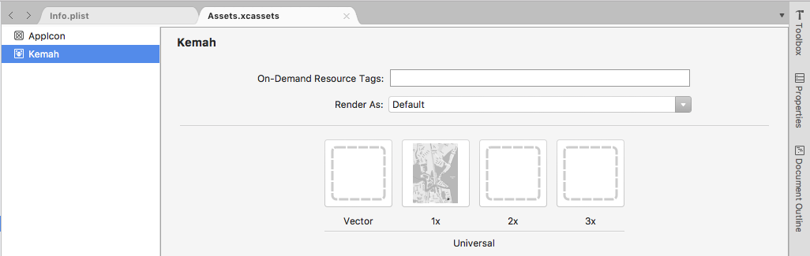

Do the following to display it on a Storyboard:

1. Double-click the `Main.storyboard` file in the **Solution Explorer** to open it for editing in the iOS Designer.
2. Select an **Image View** from the **Toolbox**:

     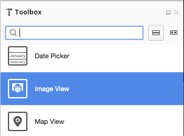
3. Drag the Image View onto the design surface and position and size it as required:

    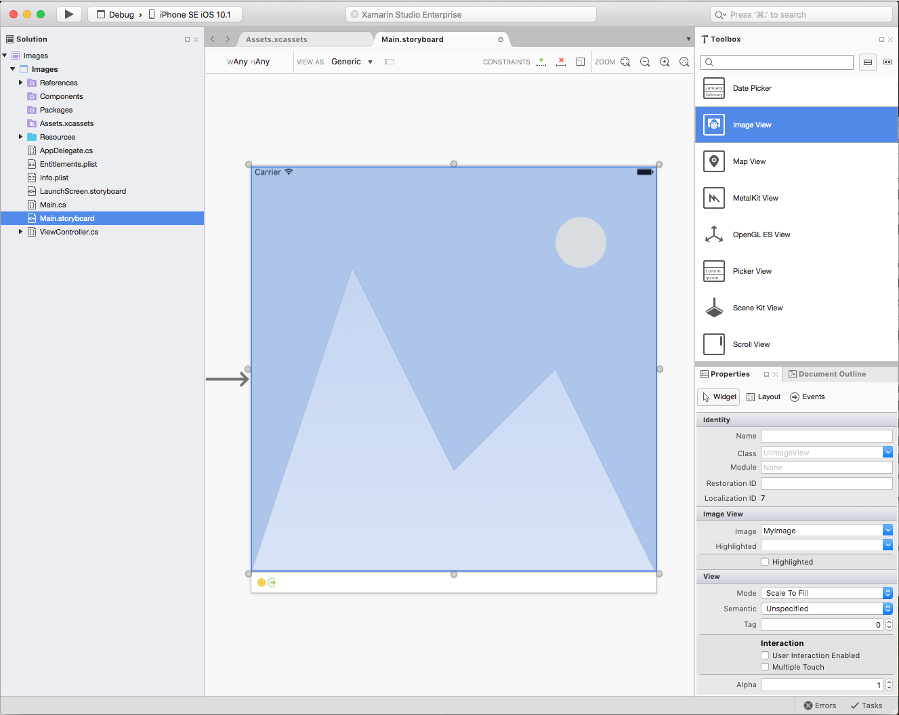
4. In the **Widget** section of the **Property Explorer** select the desired **Image** asset to be displayed:

    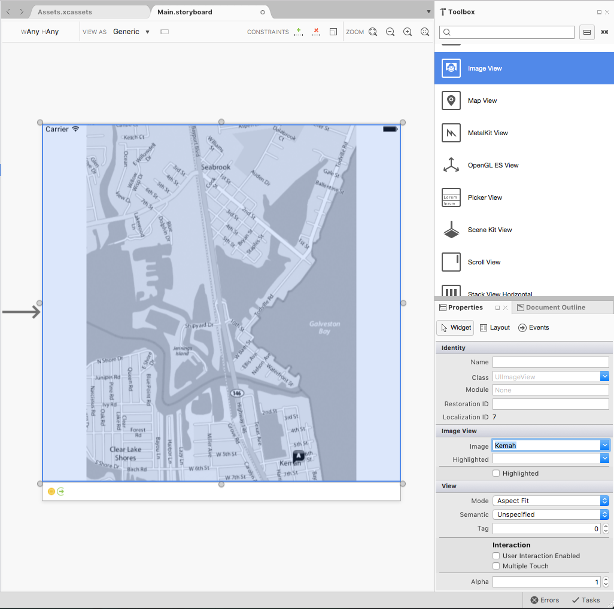
5. In the **View** section, use the **Mode** to control how the image will be resized when the **Image View** is resized.
6. With the **Image View** selected, click it again to add **Constraints**:

    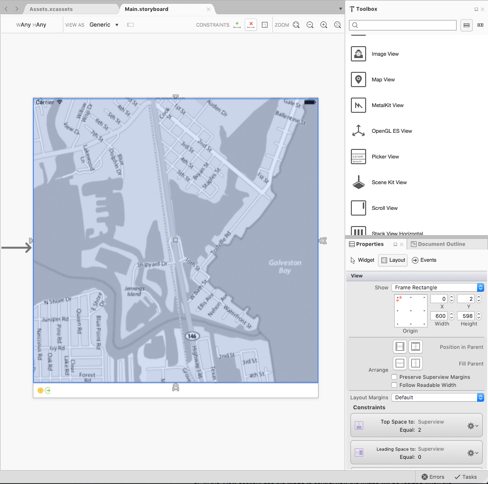
7. Drag the "T" shaped handle on each edge of the **Image View** to the corresponding side of the screen to "pin" the image to the sides. In this way, the **Image View** will shrink and grow as the screen is resized.
8. Save the changes to the Storyboard.

# [Visual Studio](#tab/windows)

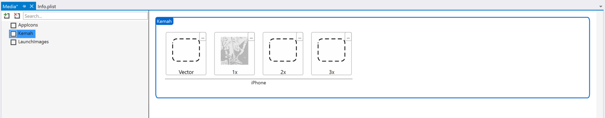

Do the following to display it on a Storyboard:

1. Double-click the `Main.storyboard` file in the **Solution Explorer** to open it for editing in the iOS Designer.
2. Select an **Image View** from the **Toolbox**:

     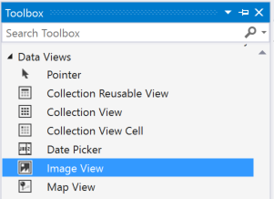
3. Drag the Image View onto the design surface and position and size it as required:

    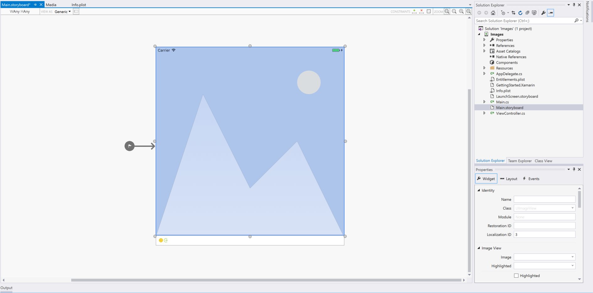
4. In the **Widget** section of the **Property Explorer** select the desired **Image** asset to be displayed:

    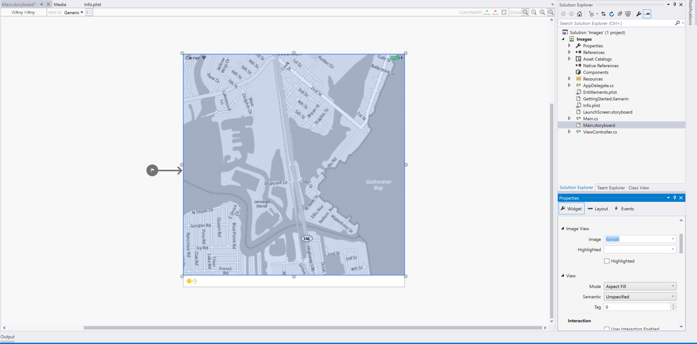
5. In the **View** section, use the **Mode** to control how the image will be resized when the **Image View** is resized.
6. With the **Image View** selected, click it again to add **Constraints**:

    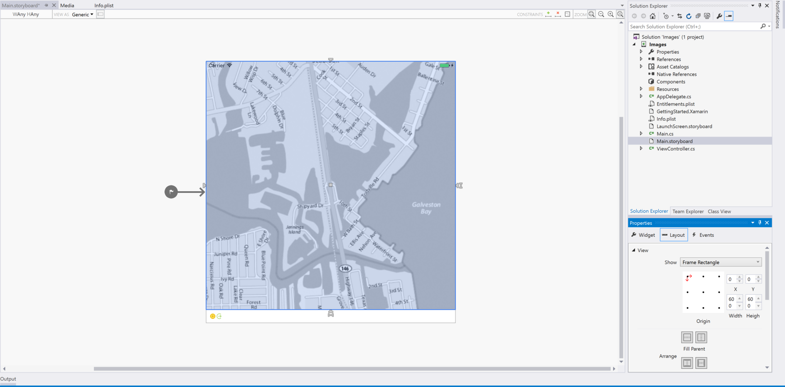
7. Drag the "T" shaped handle on each edge of the **Image View** to the corresponding side of the screen to "pin" the image to the sides. In this way, the **Image View** will shrink and grow as the screen is resized.
8. Save the changes to the Storyboard.

-----

## Displaying an image in code

Just like displaying an image in a Storyboard, once an image has been added to a Xamarin.iOS Project using an Asset Catalogs, it can be easily displayed using C# code.

Take the following example:

```csharp
// Create an image view that will fill the
// parent image view and set the image from
// an Image Asset

var imageView = new UIImageView (View.Frame);
imageView.Image = UIImage.FromBundle ("Kemah");

// Add the Image View to the parent view
View.AddSubview (imageView);
```

This code creates a new `UIImageView` and gives it an initial size and position. Then it loads the image from an Image Asset added to the project and adds the `UIImageView` to the parent `UIView` to display it.

## Related links

- [Working with Images (sample)](/samples/xamarin/ios-samples/workingwithimages)
- [Hello, iPhone](~/ios/get-started/hello-ios/index.md)
- [Image Size and Resolution (Apple)](https://developer.apple.com/design/human-interface-guidelines/ios/icons-and-images/image-size-and-resolution/)