# Launch Screens for Xamarin.iOS Apps

_This article explains how to create an app Launch Screen for all iOS devices, at any resolution and orientation, using a single Unified Storyboard._

> [!WARNING]
> The iOS Designer was deprecated in Visual Studio 2019 version 16.8 and Visual Studio 2019 for Mac version 8.8, and 
> removed in Visual Studio 2019 version 16.9 and Visual Studio for Mac version 8.9. 
> The recommended way to build iOS user interfaces is directly on a Mac running Xcode. For more information, see [Designing user interfaces with Xcode](~/ios/user-interface/storyboards/index.md). 

Before iOS 8, creating a Launch Screen for an iOS app required the
developer to provide an image asset for each of the various device form
factors and resolutions in which the app could run. Since the release of iOS
8, however, it has been possible to use a single Unified Storyboard to
create a Launch Screen that looks correct in all cases.

This brief walkthrough describes how to create a Launch Screen with either a
Storyboard provided by default in a new Project or with a Storyboard added
manually to an existing Project. It then demonstrates how to use the iOS
Designer to add an Image View and a Label to the Storyboard, to set
constraints on those views, and to verify that the Storyboard looks correct
for various devices and orientations.

## Managing Launch Screens with Storyboards

In iOS 8 (and later), the developer can create a special Unified Storyboard to provide the Launch Screen instead of using one or more static launch images. When creating a launch Storyboard in the iOS Designer, use Size Classes and Auto Layout to define different layouts for different display environments. By using Size Classes and Auto Layout, the developer can create a single launch screen that looks good on all devices and display environments.

# [Visual Studio for Mac](#tab/macos)

1. In Visual Studio for Mac, create a new project by selecting **File > New
   Solution** and then choosing **Single View App**: 

    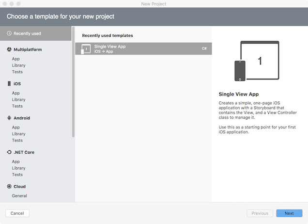

    - By default, a new Project includes a **LaunchScreen.storyboard** file that
      defines the Launch Screen interface. 
    - To instead add a Launch Screen Storyboard to an existing project,
      right-click on the project name in the **Solution Pad** and choose
      **Add > New File...** and then select **Launch Screen**:

    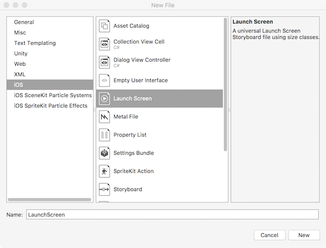

    - Name the file **LaunchScreen** or another name of your choosing.

2. Configure the Project to use the appropriate Storyboard for its Launch
   Screen:

    - Double-click the **Info.plist** file in the **Solution Pad** to open
      it for editing.
    - In the **Launch Images** section, make sure that **Launch Screen** is
      set to the name of the appropriate Storyboard:

    

    - By default, a new Project is configured to use 
      **LaunchScreen.storyboard** as its Launch Screen.

3. Add an image to the **Assets.xcassets** Asset Catalog so that it is
   available for use on the Launch Screen. For more information, see the
   [Adding Images to an Asset Catalog Image Set](~/ios/app-fundamentals/images-icons/displaying-an-image.md)
   section of the [Displaying an Image](~/ios/app-fundamentals/images-icons/displaying-an-image.md)
   guide.

4. Open **LaunchScreen.storyboard** for editing by double-clicking it in the
   **Solution Pad**.

5. Choose a device and orientation on which to preview the Launch Screen
   Storyboard in the iOS Designer. Open the device selection panel on the
   bottom toolbar and select **iPhone 4S** and **Portrait**.

    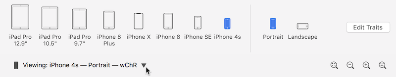

    - Note that selecting a device and orientation only changes how the iOS
      Designer previews the design. Regardless of the selection made here,
      newly added constraints are applied across all devices and
      orientations unless the **Edit Traits** button has been used to
      specify otherwise. 

6. Set the **Background** color of the View Controller's main View. Select
   the View by clicking in the middle of the View Controller and adjust the
   background color using the **Properties Pad**:

    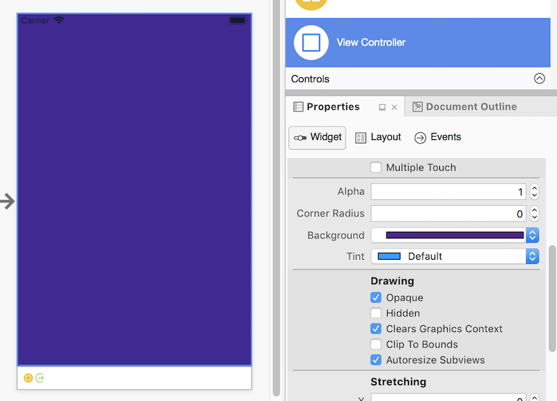

7. Add an **Image View** to the Launch Screen and set its source **Image**:

    - Drag an **Image View** from the **Toolbox Pad** to the center of the
      View.
    - With the **Image View** selected, in the **Widget** section of the
      **Properties Pad** set the **Image** property to the Image Set already
      added to the **Assets.xcassets** Asset Catalog. Reposition and size
      the **Image View** as required:
    
    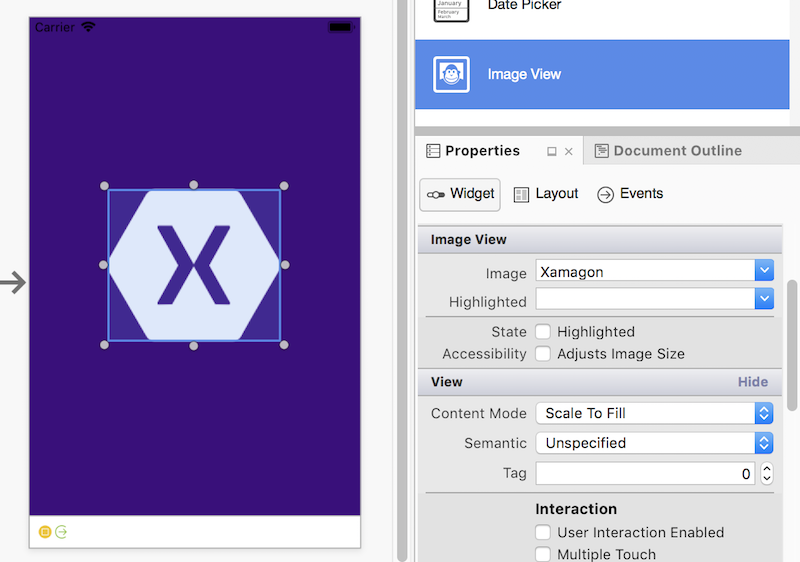

8. Add a **Label** below the **Image View** and use the **Properties Pad**
   to set its attributes: 

    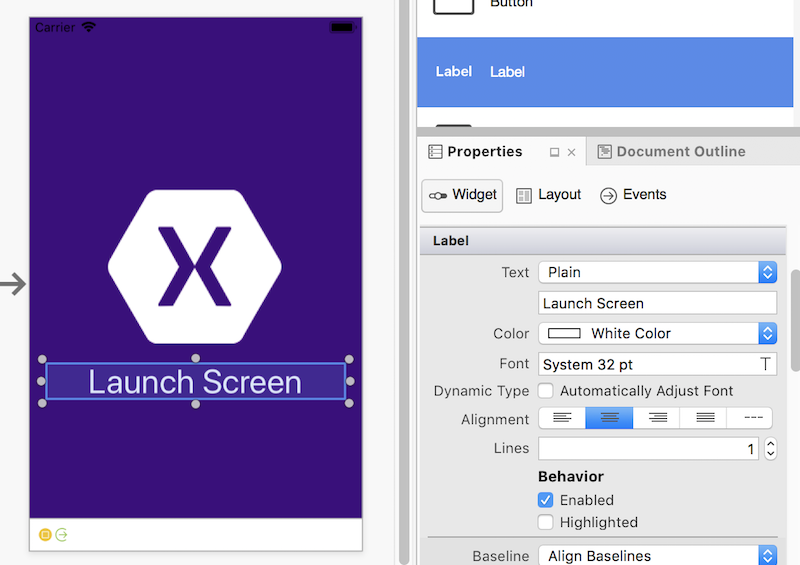

9. Switch to Constraint Editing Mode by using the right-hand button in the
   **Constraints Toolbar**:
    
    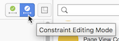

10. Add constraints to the **Image View**, setting its height and width and
    centering it horizontally and vertically:

    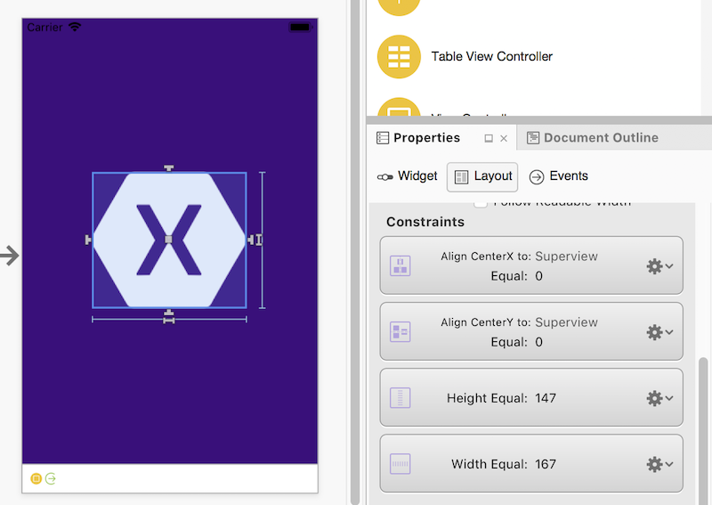

    - For more details on how to add constraints, see [Auto Layout with the
      Xamarin Designer for iOS](~/ios/user-interface/designer/designer-auto-layout.md).

11. Add constraints to the **Label**, centering it horizontally, giving it a
    height and width, and positioning it a fixed distance vertically from
    the **Image View**:

    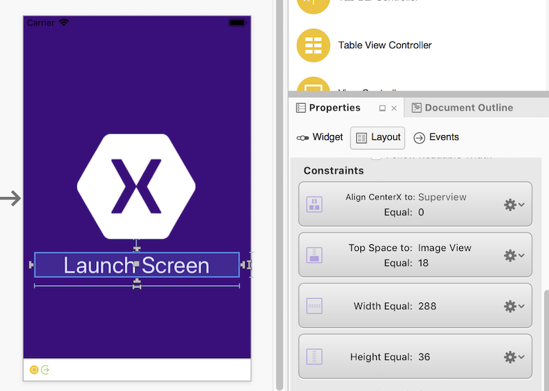

12. Test other devices and orientations to verify that the design looks as
    intended in all scenarios. In cases where adjustments need to be made
    for a specific device or orientation, use the **Edit Traits** button to
    add constraints for specific size classes:

    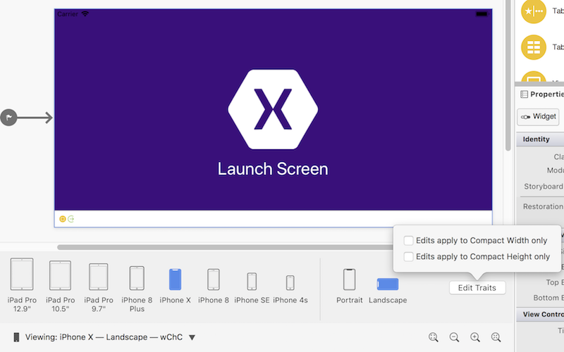

13. Save the changes to the Storyboard. Run the app on a simulator or
    device, and the Launch Screen will be visible as the app is launching.

# [Visual Studio](#tab/windows)

1. Create a new project. In Visual Studio, select **File > New > Project > Visual C# > iPhone & iPad > iOS App (Xamarin)**:

    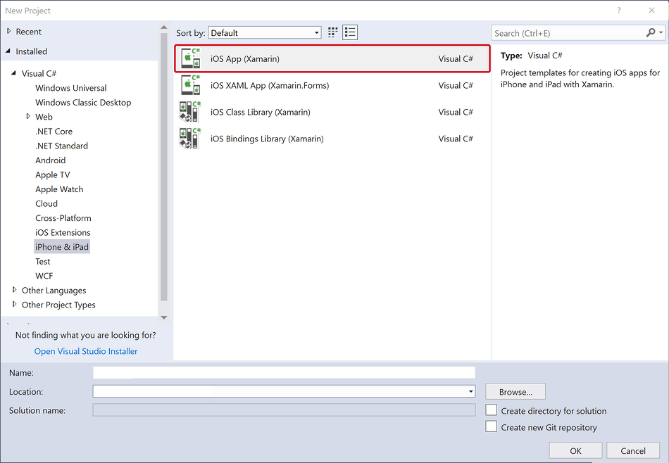

    Select the **Single View App** template, and then click **OK**:

    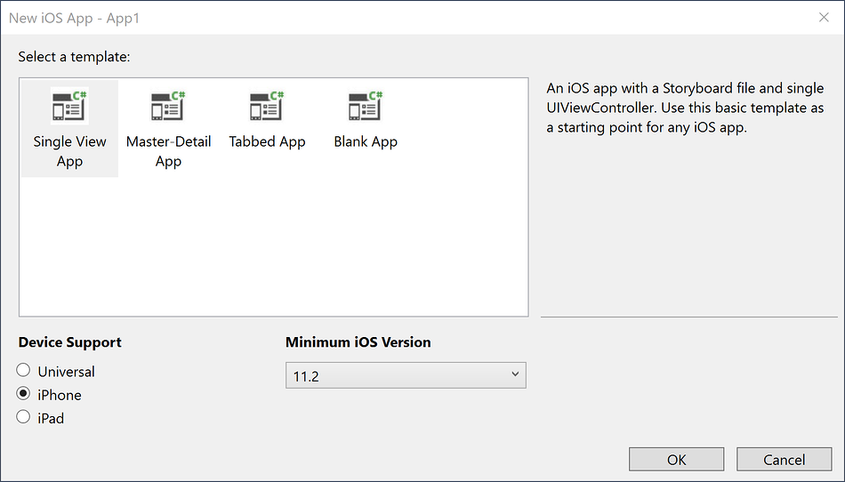

2. If **Resources > LaunchScreen.xib** exists in the **Solution Explorer**,
   delete it by right-clicking on the file and choosing **Delete**. This
   file will be replaced with a Storyboard in the next step.

3. Create a Storyboard to use as the Launch Screen. In the **Solution
   Explorer**, right-click on the Project and choose **Add > New Item...**
   followed by **Empty Storyboard**. Name this Storyboard
   **LaunchScreen.storyboard** and click **Add**:

    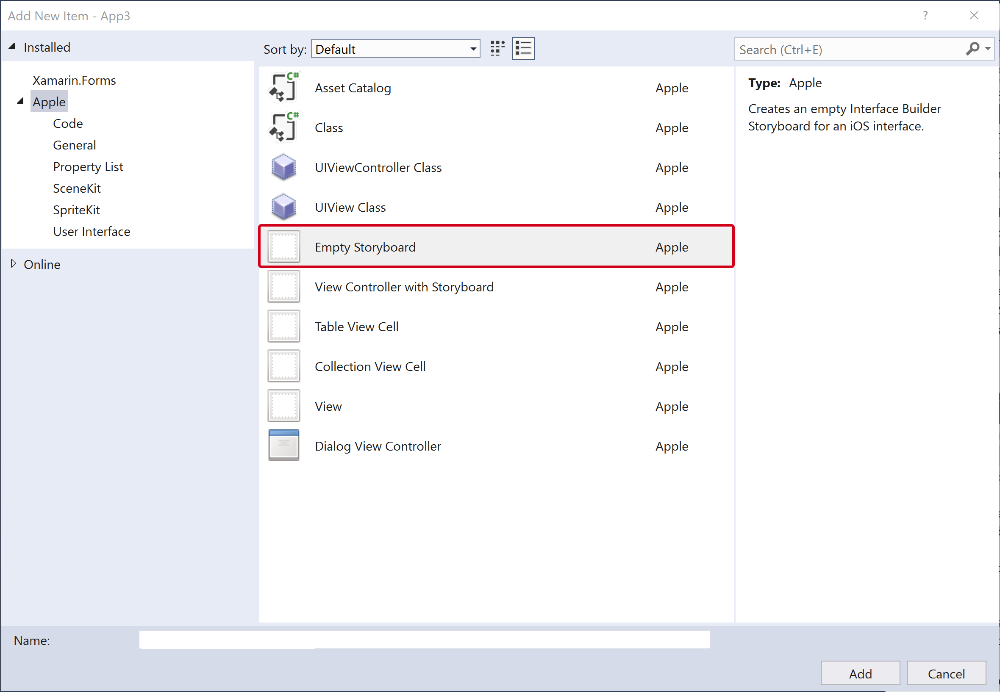

4. Configure the Project to use **LaunchScreen.storyboard** as its Launch
   Screen Storyboard:

    - Double-click the **Info.plist** file in the **Solution Explorer** to
      open it for editing. 
    - On the **Visual Assets** tab, set **Launch Screen** to
      **LaunchScreen**.

    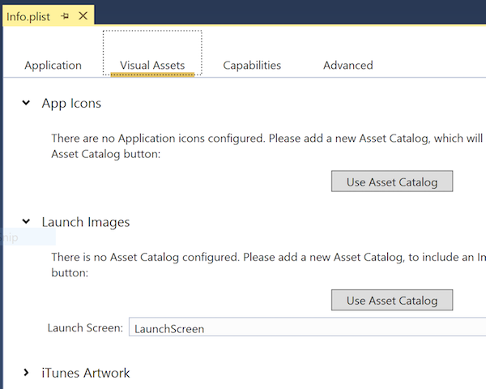

5. Add an image to an Asset Catalog in the Project so that it is available
   for use on the Launch Screen:

    - In the **Solution Explorer**, right-click on **Asset Catalogs** and
      select **Add Asset Catalog**. Name this new Asset Catalog **Assets**:

    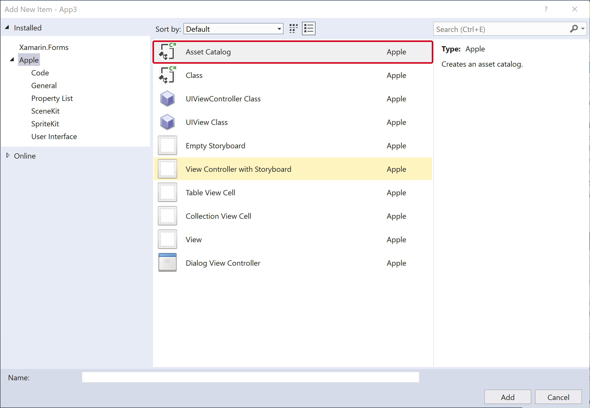

    - Add a new Image Set to the **Assets** Asset Catalog, as described in
      the [Adding Images to an Asset Catalog Image Set](~/ios/app-fundamentals/images-icons/displaying-an-image.md)
      section of the [Displaying an Image](~/ios/app-fundamentals/images-icons/displaying-an-image.md)
      guide.

6. Open **LaunchScreen.storyboard** for editing by double-clicking it in the
   **Solution Explorer**.

    - To edit a Storyboard file, Visual Studio needs an active
      connection to a Mac build host. See the [Connecting to the Mac](~/ios/get-started/installation/windows/connecting-to-mac/index.md)
      guide for details.

7. Choose a device and orientation on which to preview the Launch Screen
   Storyboard in the iOS Designer. Open the device selection panel on the
   bottom toolbar and select **iPhone 4S** and **Portrait**: 

    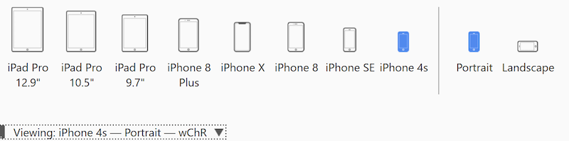

    - Note that selecting a device and orientation only changes how the iOS
      Designer previews the design. Regardless of the selection made here,
      newly added constraints are applied across all devices and
      orientations unless the **Edit Traits** button has been used to
      specify otherwise. 

8. Add a **View Controller** to the Storyboard by dragging one from the
   **Toolbox** onto the design surface: 

    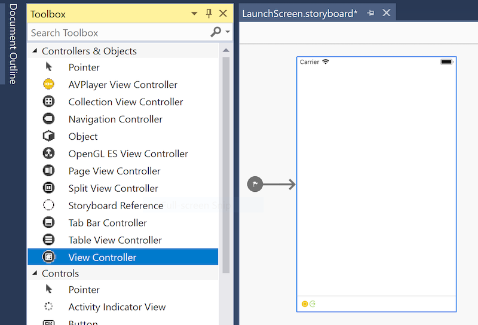

9. Set the **Background** color of the View Controller's main View. Select
   the View by clicking in the middle of the View Controller and adjust the
   background color using the **Properties Window**:
    
    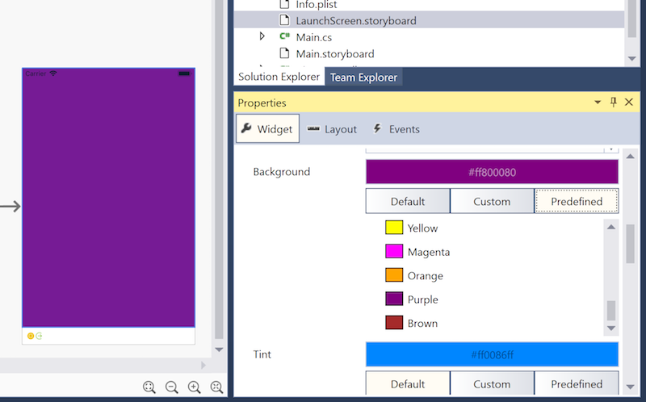

10. Add an **Image View** to the Launch Screen and set its source **Image**:

    - Drag an **Image View** from the **Toolbox** to the center of the View.
    - With the **Image View** still selected, in the **Widget** section of
      the **Properties Window** set the **Image** property to the Image Set
      already added to the **Assets** Asset Catalog. Reposition and size the
      **Image View** as required:
    
    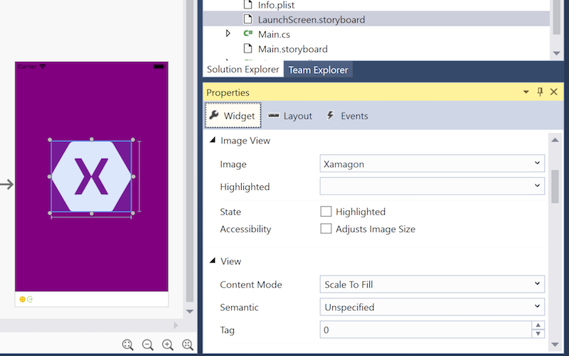

11. Add a **Label** below the **Image View**:

    - Drag a **Label** from the **Toolbox** onto the design surface, placing
      it below the **Image View**.
    - Set attributes for the **Label** using the **Properties Window**:

    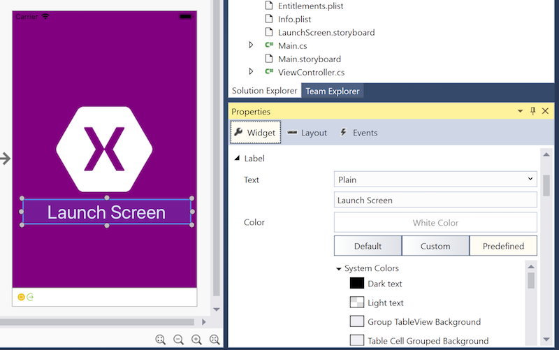 

12. Switch to Constraint Editing Mode by using the right-hand button in the
    **Constraints Toolbar**:
    
    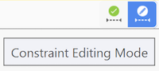 

13. Add constraints to the **Image View**, setting its height and width and
    centering it horizontally and vertically:

    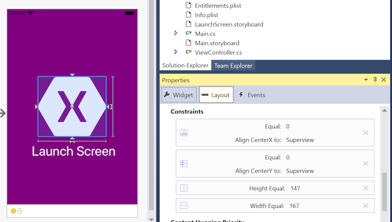 

    - For information about adding constraints, see [Auto Layout with the Xamarin Designer for iOS](~/ios/user-interface/designer/designer-auto-layout.md).

14. Add constraints to the **Label**, centering it horizontally, giving it a
    height and width, and positioning it a fixed distance vertically from
    the **Image View**:
    
    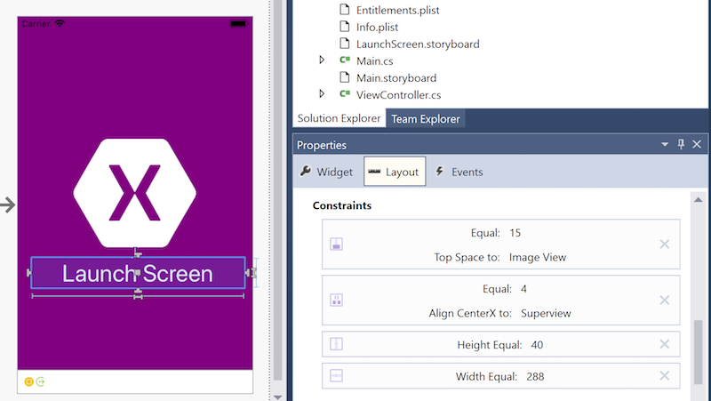 

15. Test other devices and orientations to verify that the design looks as
    intended in all scenarios. In cases where adjustments need to be made
    for a specific device or orientation, use the **Edit Traits** button to
    add constraints for specific size classes:

    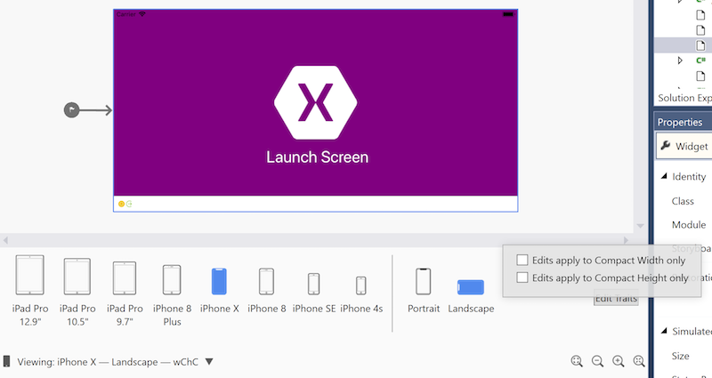 

16. Save the changes to the Storyboard. Run the app on a simulator or
    device, and the Launch Screen will be visible as the app is launching.

-----

> [!NOTE]
> A Storyboard used as a Launch Screen _must_ include only
> simple, built-in UI elements and **cannot** do any calculations or derive
> from a custom class.

For more information about creating a Launch Screen with a Unified
Storyboard, please see the [Dynamic Launch Screens](~/ios/user-interface/storyboards/unified-storyboards.md#dynamic-launch-screens)
section of the [Unified Storyboards](~/ios/user-interface/storyboards/unified-storyboards.md)
guide.

## Migrating to Launch Screen Storyboards

# [Visual Studio for Mac](#tab/macos)

When updating an existing app to use Storyboards for its Launch Screens, right click the **Project Name** in the **Solution Explorer** and select **Add** > **New File...**. Select **iOS** > **Launch Screen** and click the **New** button:

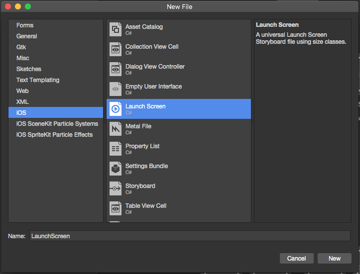

Next, double-click the `Info.plist` file in the **Solution Explorer** to open it for editing. Under **Launch Screen**, select the new Storyboard file created above.

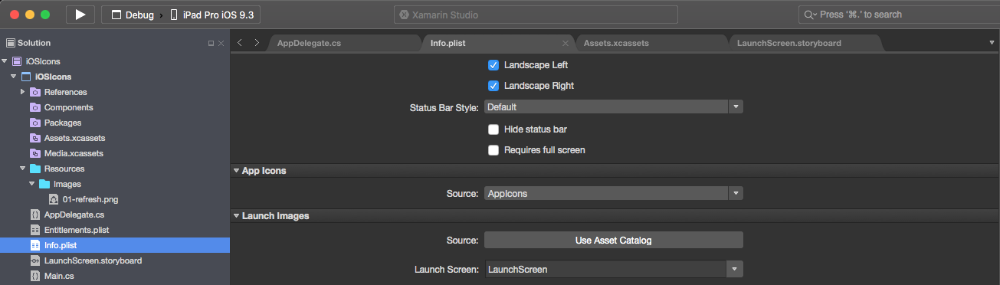

To use the new Storyboard as a launch screen, do the following:

1. Double-click the `Info.plist` file in the **Solution Explorer** to open it for editing.
2. Scroll to the **Universal Launch Images** section of the editor, open the **Launch Screen** dropdown and select the name of the storyboard created above: 

    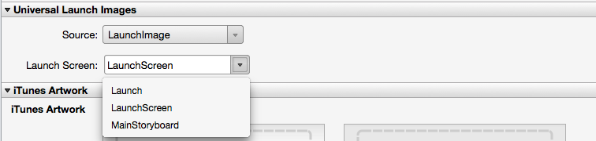

# [Visual Studio](#tab/windows)

1. Right-click on the project name in the **Solution Explorer** and select **Add** > **New File...**: 

    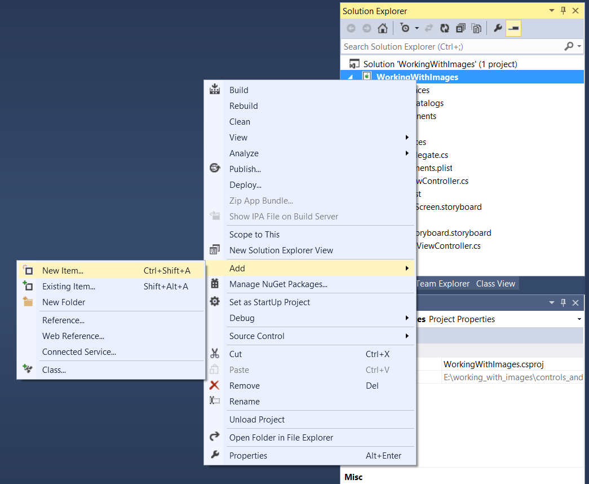
2. Enter a name for the launch screen and click the **Add** button: 

    
3. In the **Solution Explorer**, double-click the newly created storyboard file to open it for editing.
4. Ensure that the **Size Class** is set to **any:any** and the **View As** is **Generic**: 

    
5. Assembly the launch screen from Size Classes, simple UI elements (such as `UIImageView`) and images that you have included in the application's bundle: 

    
6. Save the changes to the Storyboard.

-----

## Related Links

- [Dynamic Launch Screens (sample)](/samples/xamarin/ios-samples/ios8-dynamiclaunchscreen)
- [Unified Storyboards](~/ios/user-interface/storyboards/unified-storyboards.md)
- [iOS Designer Basics](~/ios/user-interface/designer/index.md)
- [Adding Images to an Asset Catalog Image Set](~/ios/app-fundamentals/images-icons/displaying-an-image.md#adding-images-to-an-asset-catalog-image-set)
- [Auto Layout with the Xamarin Designer for iOS](~/ios/user-interface/designer/designer-auto-layout.md)
- [Human Interface Guidelines: Launch Screen](https://developer.apple.com/design/human-interface-guidelines/launching#Launch-screens)
