# Creating iOS user interfaces in code in Xamarin.iOS

The user interface of an iOS app is like a storefront – the application typically gets one Window, but it can fill the Window up with as many objects as it needs, and the objects and arrangements can be changed depending on what the app wants to display. The objects in this scenario - the things that the user sees - are called Views. To build a single screen in an application, Views are stacked on top of each other in a Content View Hierarchy, and the hierarchy is managed by a single View Controller. Applications with multiple screens have multiple Content View Hierarchies, each with its own View Controller, and the application places Views in the Window to create a different Content View Hierarchy based on the screen that the user is on.

# [Visual Studio](#tab/windows)

The diagram below illustrates the relationships between the Window, Views, Subviews, and View Controller that bring the user interface to the device screen:

[](ios-code-only-images/image9.png#lightbox)

These view hierarchies can be constructed using Xcode's Interface Builder, however it is good to have a fundamental understanding of how to work entirely in code. This article walks through some basic points to get up and running with code-only user interface development.

# [Visual Studio for Mac](#tab/macos)

The diagram below illustrates the relationships between the Window, Views, Subviews, and View Controller that bring the user interface to the device screen:

[](ios-code-only-images/image9.png#lightbox)

These view hierarchies can be constructed using Xcode's Interface Builder, however it is good to have a fundamental understanding of how to work entirely in code. This article walks through some basic points to get up and running with code-only user interface development.

-----

## Creating a code-only project

# [Visual Studio](#tab/windows)

## iOS blank project template

First, create an iOS project in Visual Studio using the **File > New Project > Visual C# > iPhone & iPad > iOS App (Xamarin)** project, shown below:

[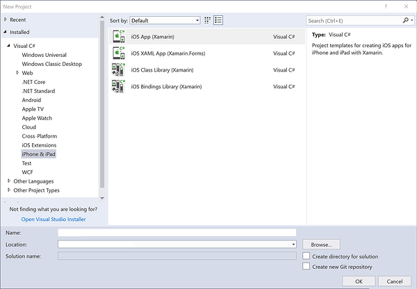](ios-code-only-images/blankapp.w157.png#lightbox)

Then select the **Blank App** project template:

[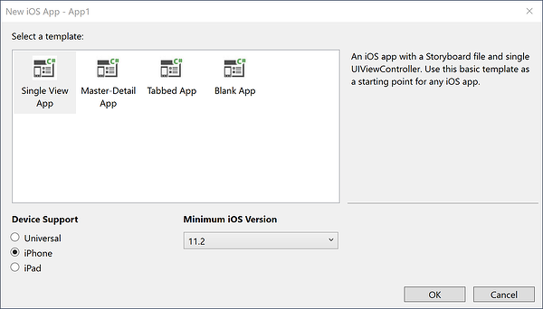](ios-code-only-images/blankapp-2.w157.png#lightbox)

The Empty Project template adds 4 files to the project:

[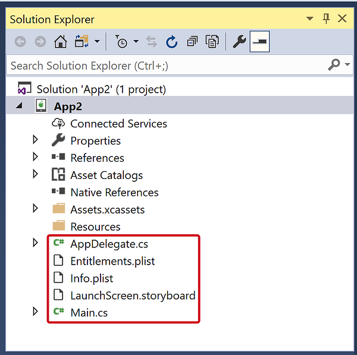](ios-code-only-images/empty-project.w157.png#lightbox)

1. **AppDelegate.cs** - Contains a  `UIApplicationDelegate` subclass,  `AppDelegate` , which is used to handle application events from iOS. The application window is created in the `AppDelegate`'s  `FinishedLaunching` method.
1. **Main.cs** - Contains the entry point for the application, which specifies the class for the  `AppDelegate` .
1. **Info.plist** - Property list file that contains application configuration information.
1. **Entitlements.plist** – Property list file that contains information about the capabilities and permissions of the application.

# [Visual Studio for Mac](#tab/macos)

## iOS templates

Visual Studio for Mac does not provide an Empty template. All templates come with Storyboard support, which Apple recommends as the primary way to create a UI. However, it is possible to create your UI completely in code.

The steps below guide you through removing the Storyboard from an application:

1. Use the Single View App template to create a new iOS Project:

    [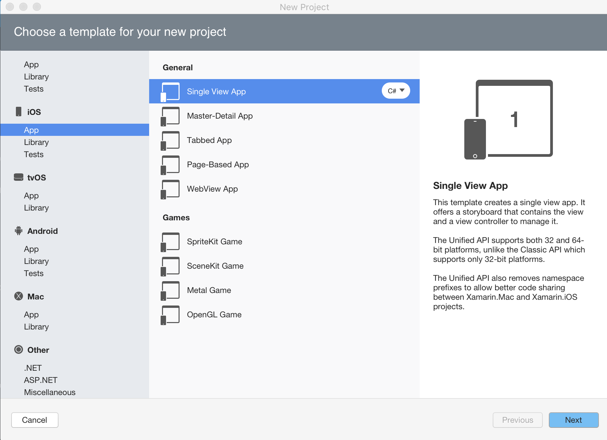](ios-code-only-images/single-view-app.png#lightbox)

1. Delete the `Main.Storyboard` and `ViewController.cs` files. Do **not** delete the `LaunchScreen.Storyboard`. The View Controller should be deleted as it is the code behind for the view controller that is created in the Storyboard:
1. Make sure to select **Delete** from the pop-up dialog:

    [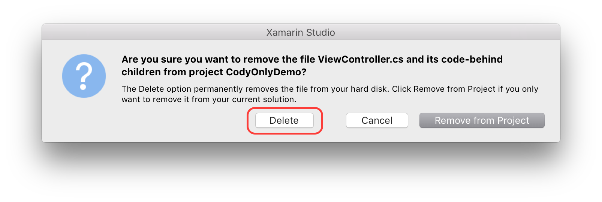](ios-code-only-images/delete.png#lightbox)

1. In the Info.plist, delete the information inside the **Deployment Info > Main Interface** option:

    [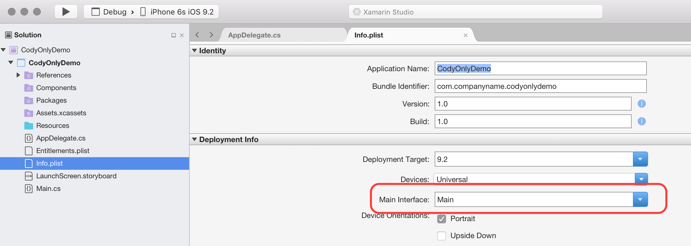](ios-code-only-images/main-interface.png#lightbox)

1. Finally, add the following code to your `FinishedLaunching` method in the AppDelegate class:

    ```csharp
    public override bool FinishedLaunching(UIApplication app, NSDictionary options)
    {
        // create a new window instance based on the screen size
        Window = new UIWindow(UIScreen.MainScreen.Bounds);

        // make the window visible
        Window.MakeKeyAndVisible();

        return true;
    }
    ```

The code that was added to the `FinishedLaunching` method in step 5 above, is the minimum amount of code required to create a Window for your iOS application.

-----

iOS applications are built using the [MVC pattern](~/ios/get-started/hello-ios-multiscreen/hello-ios-multiscreen-deepdive.md#model-view-controller-mvc). The first screen that an application displays is created from the window's root view controller. See the [Hello, iOS Multiscreen](~/ios/get-started/hello-ios-multiscreen/index.md) guide for more details on the MVC pattern itself.

The implementation for the `AppDelegate` added by the template creates the application window, of which there is only one for every iOS application, and makes it visible with the following code:

```csharp
public class AppDelegate : UIApplicationDelegate
{
    public override UIWindow Window
            {
                get;
                set;
            }

    public override bool FinishedLaunching(UIApplication app, NSDictionary options)
    {
        // create a new window instance based on the screen size
        Window = new UIWindow(UIScreen.MainScreen.Bounds);

        // make the window visible
        Window.MakeKeyAndVisible();

        return true;
    }
}
```

If you were to run this application now, you would likely get an exception thrown stating that `Application windows are expected to have a root view controller at the end of application launch`. Let's add a Controller and make it the app's Root View Controller.

## Adding a controller

Your app can contain many View Controllers, but it needs to have one Root View Controller to control all the View Controllers.  Add a controller to the window by creating a `UIViewController` instance and setting it to the `Window.RootViewController` property:

```csharp
public class AppDelegate : UIApplicationDelegate
{
    // class-level declarations

    public override UIWindow Window
    {
        get;
        set;
    }

    public override bool FinishedLaunching(UIApplication application, NSDictionary launchOptions)
    {
        // create a new window instance based on the screen size
        Window = new UIWindow(UIScreen.MainScreen.Bounds);

        var controller = new UIViewController();
        controller.View.BackgroundColor = UIColor.LightGray;

        Window.RootViewController = controller;

        // make the window visible
        Window.MakeKeyAndVisible();

        return true;
    }
}
```

Every controller has an associated view, which is accessible from the `View` property. The above code changes the view's `BackgroundColor` property to `UIColor.LightGray` so that it will be visible, as shown below:

 [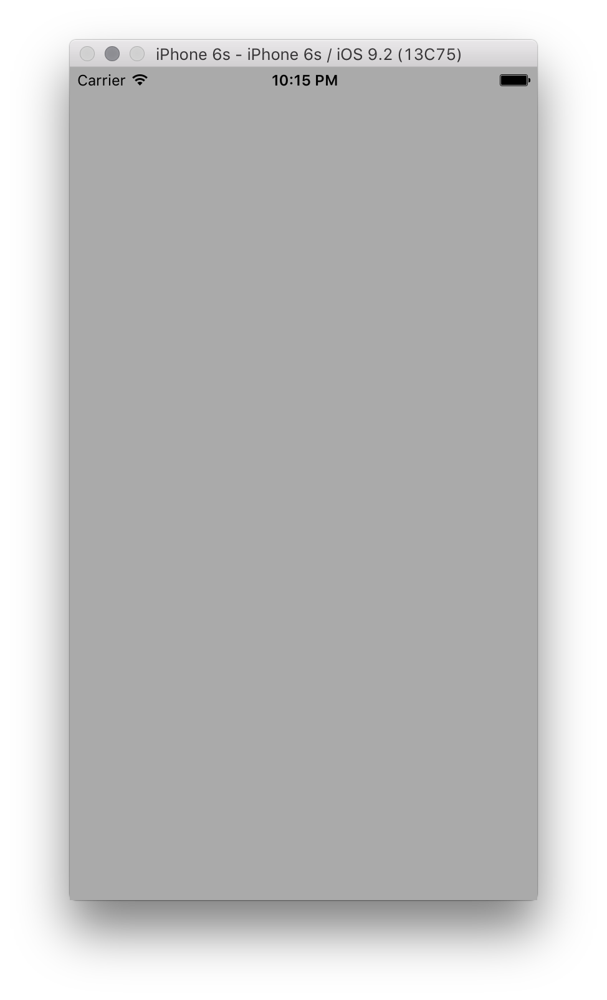](ios-code-only-images/image1.png#lightbox)

We could set any `UIViewController` subclass as the `RootViewController` in this way as well, including controllers from UIKit as well as those we write ourselves. For example, the following code adds a `UINavigationController` as the `RootViewController`:

```csharp
public class AppDelegate : UIApplicationDelegate
{
    // class-level declarations

    public override UIWindow Window
    {
        get;
        set;
    }

    public override bool FinishedLaunching(UIApplication application, NSDictionary launchOptions)
    {
        // create a new window instance based on the screen size
        Window = new UIWindow(UIScreen.MainScreen.Bounds);

        var controller = new UIViewController();
        controller.View.BackgroundColor = UIColor.LightGray;
        controller.Title = "My Controller";

        var navController = new UINavigationController(controller);

        Window.RootViewController = navController;

        // make the window visible
        Window.MakeKeyAndVisible();

        return true;
    }
}
```

This produces the controller nested within the navigation controller as shown below:

 [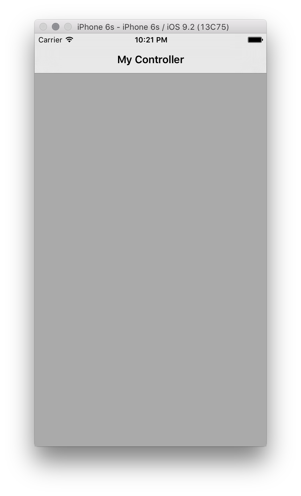](ios-code-only-images/image2.png#lightbox)

## Creating a view controller

Now that we've seen how to add a controller as the `RootViewController` of the window, let's see how to create a custom view controller in code.

Add a new class named `CustomViewController` as shown below:

# [Visual Studio](#tab/windows)

[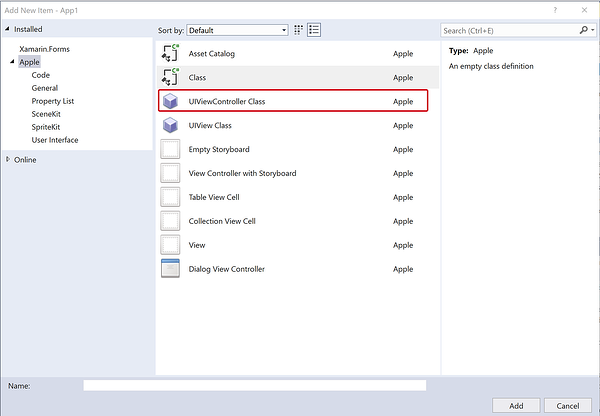](ios-code-only-images/customviewcontroller.w157.png#lightbox)

# [Visual Studio for Mac](#tab/macos)

[](ios-code-only-images/new-file.png#lightbox)

-----

The class should inherit from `UIViewController`, which is in the `UIKit` namespace, as shown:

```csharp
using System;
using UIKit;

namespace CodeOnlyDemo
{
    class CustomViewController : UIViewController
    {
    }
}
```

## Initializing the view

`UIViewController` contains a method called `ViewDidLoad` that is called when the View controller is first loaded into memory. This is an appropriate place to do initialization of the view, such as setting it's properties.

For example, the following code adds a button and an event handler to push a new View Controller onto the navigation stack when the button is pressed:

```csharp
using System;
using CoreGraphics;
using UIKit;

namespace CodyOnlyDemo
{
    public class CustomViewController : UIViewController
    {
        public CustomViewController ()
        {
        }

        public override void ViewDidLoad ()
        {
            base.ViewDidLoad ();

            View.BackgroundColor = UIColor.White;
            Title = "My Custom View Controller";

            var btn = UIButton.FromType (UIButtonType.System);
            btn.Frame = new CGRect (20, 200, 280, 44);
            btn.SetTitle ("Click Me", UIControlState.Normal);

            var user = new UIViewController ();
            user.View.BackgroundColor = UIColor.Magenta;

            btn.TouchUpInside += (sender, e) => {
                this.NavigationController.PushViewController (user, true);
            };

            View.AddSubview (btn);

        }
    }
}
```

To load this controller in your application, and demonstrate the simple navigation, create a new instance of `CustomViewController`. Create a new navigation controller, pass in your view controller instance and set the new navigation controller to the window's `RootViewController` in the `AppDelegate` as before:

```csharp
var cvc = new CustomViewController ();

var navController = new UINavigationController (cvc);

Window.RootViewController = navController;
```

Now when the application loads, the `CustomViewController` is loaded inside a navigation controller:

 [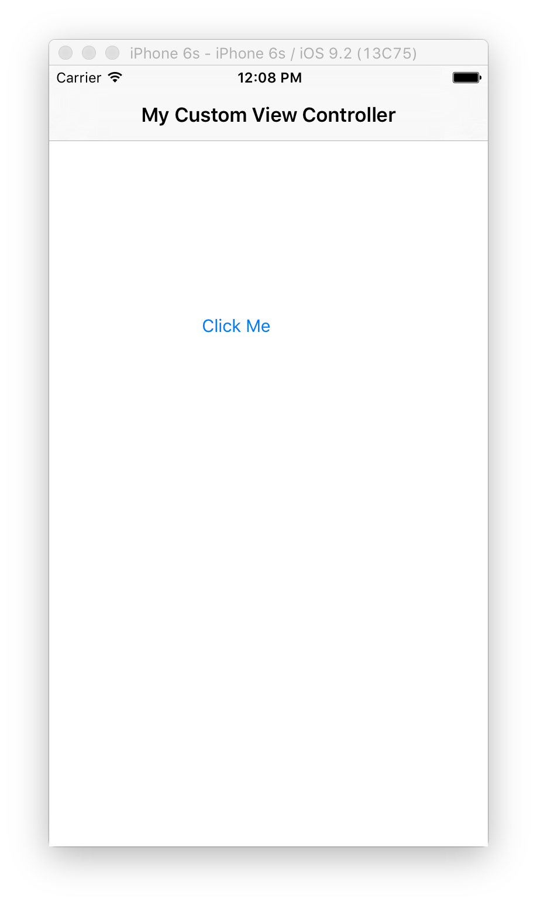](ios-code-only-images/customvc.png#lightbox)

Clicking the button, will _push_ a new View Controller onto the navigation stack:

[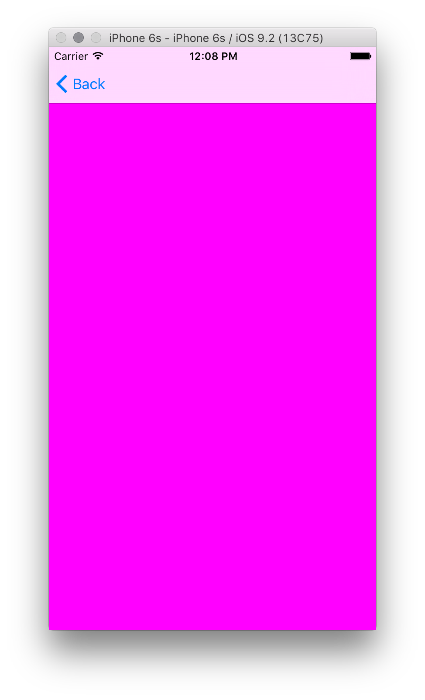](ios-code-only-images/customvca.png#lightbox)

## Building the view hierarchy

In the example above, we started to create a user interface in code by adding a button to the View Controller.

iOS user interfaces are comprised of a view hierarchy. Additional views, such as labels, buttons, sliders, etc. are added as subviews of some parent view.

For example, let's edit the `CustomViewController` to create a login screen where the user can enter a username and password. The screen will consist of two text fields and a button.

### Adding the text fields

First, remove the button and event handler that was added in the [Initializing the View](#initializing-the-view) section.

Add a control for the username by creating and initializing a `UITextField` and then adding it to the view hierarchy, as shown below:

```csharp
class CustomViewController : UIViewController
{
    UITextField usernameField;

    public override void ViewDidLoad()
    {
        base.ViewDidLoad();

        View.BackgroundColor = UIColor.Gray;

        nfloat h = 31.0f;
        nfloat w = View.Bounds.Width;

        usernameField = new UITextField
        {
            Placeholder = "Enter your username",
            BorderStyle = UITextBorderStyle.RoundedRect,
            Frame = new CGRect(10, 82, w - 20, h)
        };

        View.AddSubview(usernameField);
    }
}
```

When we create the `UITextField`, we set the `Frame` property to define its location and size. In iOS the 0,0 coordinate is in the upper left with +x to the right and +y down. After setting the `Frame` along with a couple other properties, we call `View.AddSubview` to add the `UITextField` to the view hierarchy. This makes the `usernameField` a subview of the `UIView` instance that the `View` property references. A subview is added with a z-order that is higher than its parent view, so it appears in front of the parent view on the screen.

The application with the `UITextField` included is shown below:

 [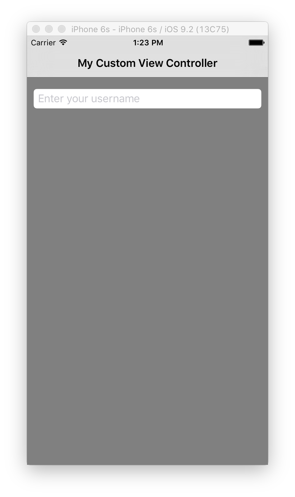](ios-code-only-images/image4.png#lightbox)

We can add a `UITextField` for the password in a similar fashion, only this time we set the `SecureTextEntry` property to true, as shown below:

```csharp
public class CustomViewController : UIViewController
{
    UITextField usernameField, passwordField;
    public override void ViewDidLoad()
    {
       // keep the code the username UITextField
        passwordField = new UITextField
        {
            Placeholder = "Enter your password",
            BorderStyle = UITextBorderStyle.RoundedRect,
            Frame = new CGRect(10, 114, w - 20, h),
            SecureTextEntry = true
        };

      View.AddSubview(usernameField);
      View.AddSubview(passwordField);
   }
}

```

Setting `SecureTextEntry = true` hides the text entered in the `UITextField` by the user as shown below:

 [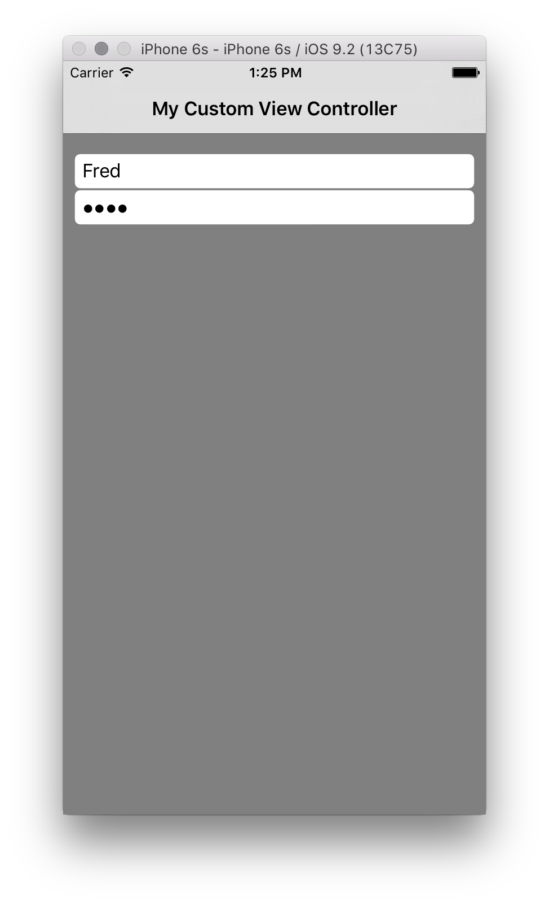](ios-code-only-images/image4a.png#lightbox)

### Adding the button

Next, we'll add a button so the user can submit the username and password. The button is added to the view hierarchy like any other control, by passing it as an argument to the parent view's `AddSubview` method again.

The following code adds the button and registers an event handler for the `TouchUpInside` event:

```csharp
var submitButton = UIButton.FromType (UIButtonType.RoundedRect);

submitButton.Frame = new CGRect (10, 170, w - 20, 44);
submitButton.SetTitle ("Submit", UIControlState.Normal);

submitButton.TouchUpInside += (sender, e) => {
    Console.WriteLine ("Submit button pressed");
};

View.AddSubview(submitButton);
```

With this in place, the login screen now appears as shown below:

 [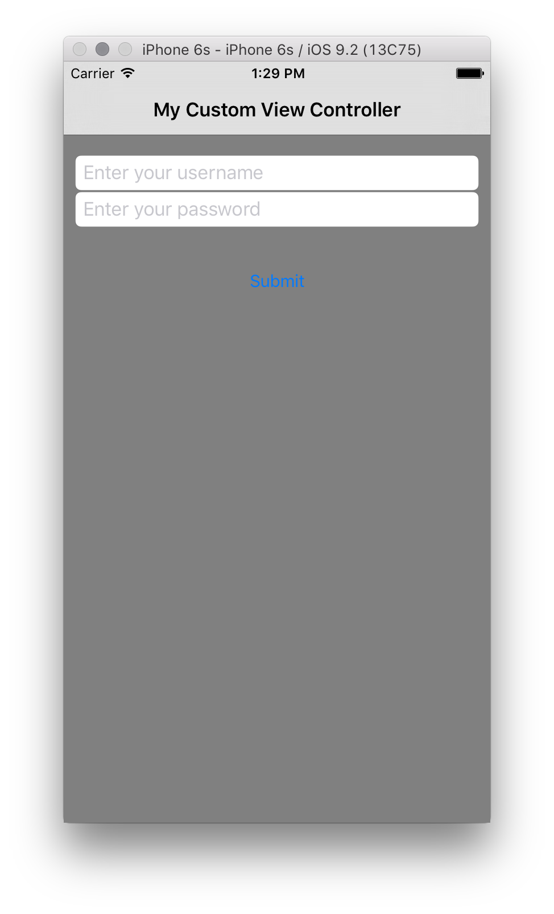](ios-code-only-images/image5.png#lightbox)

Unlike in previous versions of iOS, the default button background is transparent. Altering the button’s `BackgroundColor` property changes this:

```csharp
submitButton.BackgroundColor = UIColor.White;
```

This will result in a square button rather than the typical rounded edged button. To obtain the rounded edge, use the following snippet:

```csharp
submitButton.Layer.CornerRadius = 5f;
```

With these changes, the view will look like this:

[](ios-code-only-images/image6.png#lightbox)

## Adding multiple views to the view hierarchy

iOS provides a facility to add multiple views to the view hierarchy by using `AddSubviews`.

```csharp
View.AddSubviews(new UIView[] { usernameField, passwordField, submitButton });
```

## Adding button functionality

When a button is clicked, your users will expect something to happen. For example, an alert is shown or navigation is performed to another screen.

Let's add some code to push a second view controller onto the navigation stack.

First, create the second view controller:

```csharp
var loginVC = new UIViewController () { Title = "Login Success!"};
loginVC.View.BackgroundColor = UIColor.Purple;
```

Then, add the functionality to the `TouchUpInside` event:

```csharp
submitButton.TouchUpInside += (sender, e) => {
                this.NavigationController.PushViewController (loginVC, true);
            };
```

The navigation is illustrated below:

[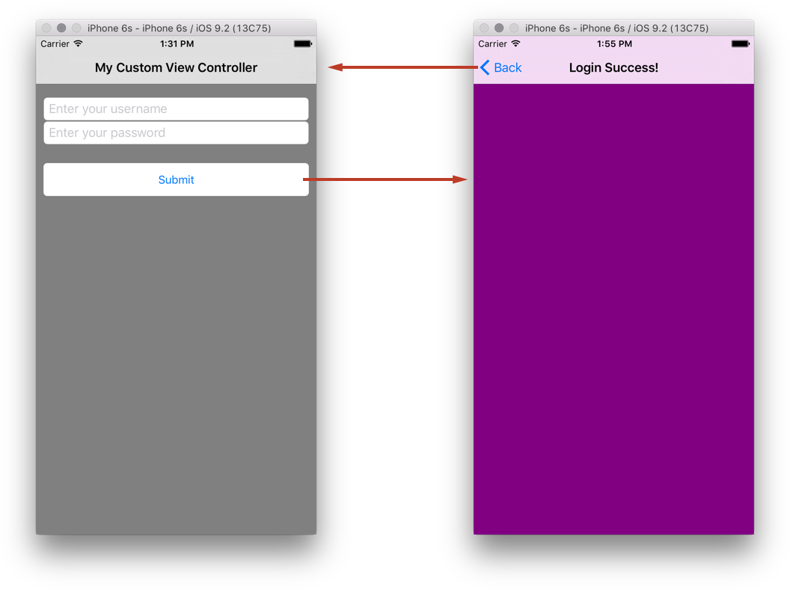](ios-code-only-images/navigation.png#lightbox)

Notice that by default, when you use a Navigation Controller, iOS gives the application a navigation bar and a back button to allow you to move back through the stack.

## Iterating through the view hierarchy

It is possible to iterate through the subview hierarchy and pick out any particular view. For example, to find each `UIButton` and give that button a different `BackgroundColor`, the following snippet can be used

```csharp
foreach(var subview in View.Subviews)
{
    if (subview is UIButton)
    {
         var btn = subview as UIButton;
         btn.BackgroundColor = UIColor.Green;
    }
}
```

This, however will not work if the view being iterated for is a `UIView` as all views will come back as being a `UIView` as the objects added to the parent view themselves inherit `UIView`.

## Handling rotation

If the user rotates the device to landscape, the controls do not resize appropriately, as the following screenshot illustrates:

[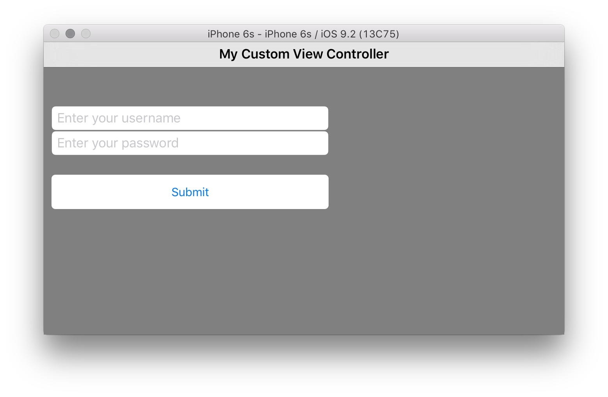](ios-code-only-images/image7.png#lightbox)

One way to fix this is by setting the `AutoresizingMask` property on each view. In this case we want the controls to stretch horizontally, so we would set each `AutoresizingMask`. The following example is for `usernameField`, but the same would need to be applied to each gadget in the view hierarchy.

```csharp
usernameField.AutoresizingMask = UIViewAutoresizing.FlexibleWidth;
```

Now when we rotate the device or simulator, everything stretches to fill the additional space, as shown below:

[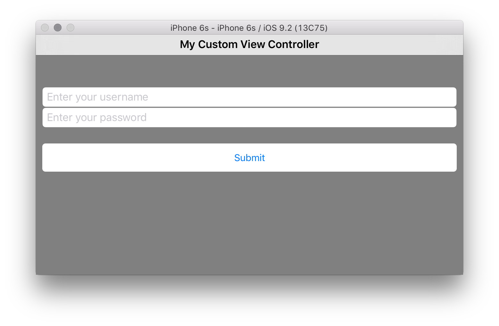](ios-code-only-images/image8.png#lightbox)

## Creating custom views

In addition to using controls that are part of UIKit, custom views can also be used. A custom view can be created by inheriting from `UIView` and overriding `Draw`. Let's create a custom view and add it to the view hierarchy to demonstrate.

### Inheriting from UIView

The first thing we need to do is create a class for the custom view. We'll do this using the **Class** template in Visual Studio to add an empty class named `CircleView`. The base class should be set to `UIView`, which we recall is in the `UIKit` namespace. We'll also need the `System.Drawing` namespace as well. The other various `System.*` namespaces won't be used in this example, so feel free to remove them.

The class should look like this:

```csharp
using System;

namespace CodeOnlyDemo
{
    class CircleView : UIView
    {
    }
}
```

### Drawing in a UIView

Every `UIView` has a `Draw` method that is called by the system when it needs to be drawn. `Draw` should never be called directly. It is called by the system during run loop processing. The first time through the run loop after a view is added to the view hierarchy, its `Draw` method is called. Subsequent calls to `Draw` occur when the view is marked as needing to be drawn by calling either `SetNeedsDisplay` or `SetNeedsDisplayInRect` on the view.

We can add drawing code to our view by adding such code inside the overridden `Draw` method as shown below:

```csharp
public override void Draw(CGRect rect)
{
    base.Draw(rect);

    //get graphics context
    using (var g = UIGraphics.GetCurrentContext())
    {
        // set up drawing attributes
        g.SetLineWidth(10.0f);
        UIColor.Green.SetFill();
        UIColor.Blue.SetStroke();

        // create geometry
        var path = new CGPath();
        path.AddArc(Bounds.GetMidX(), Bounds.GetMidY(), 50f, 0, 2.0f * (float)Math.PI, true);

        // add geometry to graphics context and draw
        g.AddPath(path);
        g.DrawPath(CGPathDrawingMode.FillStroke);
    }
}
```

Since `CircleView` is a `UIView`, we can also set `UIView` properties as well. For example, we can set the `BackgroundColor` in the constructor:

```csharp
public CircleView()
{
    BackgroundColor = UIColor.White;
}
```

To use the `CircleView` we just created, we can either add it as a subview to the view hierarchy in an existing controller, as we did with the `UILabels` and `UIButton` earlier, or we can load it as the view of a new controller. Let's do the latter.

### Loading a View

 `UIViewController` has a method named `LoadView` that is called by the controller to create its view. This is an appropriate place to create a view and assign it to the controller's `View` property.

First, we need a controller, so create a new empty class named `CircleController`.

In `CircleController` add the following code to set the `View` to a `CircleView`
  (you should not call the `base` implementation in your override):

```csharp
using UIKit;

namespace CodeOnlyDemo
{
    class CircleController : UIViewController
    {
        CircleView view;

        public override void LoadView()
        {
            view = new CircleView();
            View = view;
        }
    }
}
```

Finally, we need to present the controller at runtime. Let's do this by adding an event handler on the submit button that we added earlier, as follows:

```csharp
submitButton.TouchUpInside += delegate
{
    Console.WriteLine("Submit button clicked");

    //circleController is declared as class variable
    circleController = new CircleController();
    PresentViewController(circleController, true, null);
};
```

Now, when we run the application and tap the submit button, the new view with a circle is displayed:

[](ios-code-only-images/circles.png#lightbox)

## Creating a launch screen

A [launch screen](~/ios/app-fundamentals/images-icons/launch-screens.md) is displayed when your app starts up as a way to display to your users that it is responsive. Because a launch screen is displayed when your app is loading, it cannot be created in code as the application is still being loaded into memory.

# [Visual Studio](#tab/windows)

When you create an iOS Project in Visual Studio, a Launch Screen is provided for you in the form of a .xib file, which can be found in the **Resources** folder inside your project.

# [Visual Studio for Mac](#tab/macos)

When you create an iOS Project in Visual Studio for Mac, a Launch Screen is provided for you in the form of a Storyboard file.

-----

This can be edited by double clicking on it and opening it in the Xcode Interface Builder.

Apple recommends that a .xib or Storyboard file is used for applications targeting iOS 8 or later, When you launch either file in the Xcode Interface Builder, you can use Size Classes and Auto Layout to adapt your layout so that it looks good, and displays correctly, for all device sizes. A static launch image can be used in addition to a .xib or Storyboard to allow support for applications targeting earlier versions.

For more information on creating a Launch Screen, refer to the documents below:

- [Creating a Launch Screen Using a .xib](https://github.com/xamarin/recipes/tree/master/Recipes/ios/general/templates/launchscreen-xib)
- [Managing Launch Screens with Storyboards](~/ios/app-fundamentals/images-icons/launch-screens.md)

> [!IMPORTANT]
> As of iOS 9, Apple recommends that Storyboards should be used as the primary method of creating a Launch Screen.

### Creating a launch image for pre-iOS 8 applications

A static image can be used in addition to a .xib or Storyboard launch screen if you application targets versions previous to iOS 8.

This static image can be set in the Info.plist file, or as an Asset Catalog (for iOS 7) in your application. You will need to provide separate images for each device size (320x480, 640x960, 640x1136) that your application may run on. For more information on Launch Screen sizes, view the [Launch Screen Images](~/ios/app-fundamentals/images-icons/launch-screens.md) guide.

> [!IMPORTANT]
> If your app has no Launch Screen, you may notice that it doesn't fully fit the screen. If this is the case, you should make sure to include, at least, a 640x1136 image named `Default-568@2x.png` to your Info.plist.

## Summary

# [Visual Studio](#tab/windows)

This article discussed how to develop iOS applications programmatically in Visual Studio. We looked at how to build up a project from an empty project template, discussing how to create and add a root view controller to the window. We then showed how to use controls from UIKit to create a view hierarchy within a controller to develop an application screen. Next we examined how to make the views lay out appropriately in different orientations and we saw how to create a custom view by subclassing `UIView`, as well as how to load the view within a controller. Finally we explored how to add a launch screen to an application.

# [Visual Studio for Mac](#tab/macos)

This article discussed how to develop iOS applications programmatically in Visual Studio for Mac. We looked at how to build up a project from a Single View template, discussing how to create and add a root view controller to the window. We then showed how to use controls from UIKit to create a view hierarchy within a controller to develop an application screen. Next we examined how to make the views lay out appropriately in different orientations and we saw how to create a custom view by subclassing `UIView`, as well as how to load the view within a controller. Finally we explored how to add a launch screen to an application.

-----

## Related Links

- [SimpleLogin (sample)](/samples/xamarin/ios-samples/simplelogin)