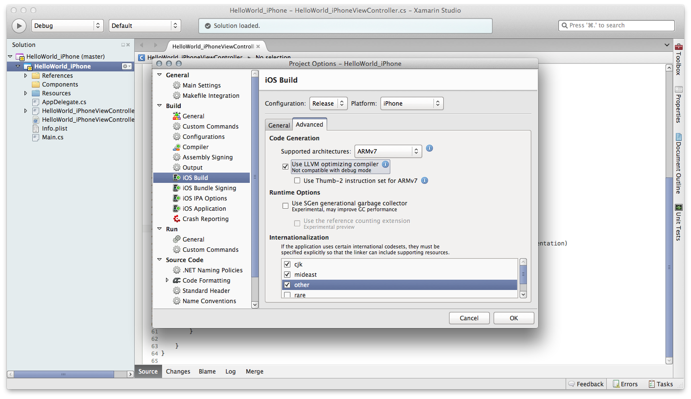
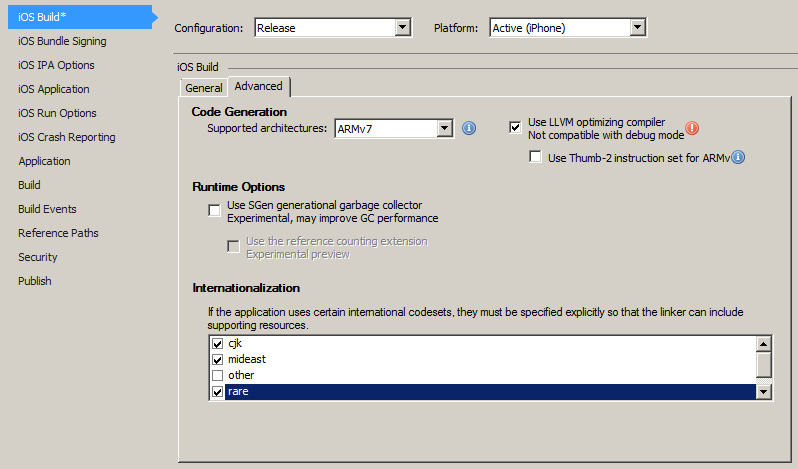

# Internationalization Encodings in Xamarin.iOS

Not all encodings are included in the Xamarin.iOS class library by default.

To reduce the size of the application, Xamarin.iOS doesn't include any specific
encoding, and you have to instruct mtouch to include the assemblies containing
the support for the encoding you need.

This is done by selecting the extra encodings from the iOS Build/Advanced
pane in Visual Studio for Mac or Visual Studio:

 

 

You can select one of these:

- cjk: for Chineese, Japanese and Korean
- mideast: Arabic, Hebrew, Turkish and Latin5.
- other: Cyrillic, Baltic, Vietnamese, Ukrainian and Thai
- rare: EBCDIC encodings and other rare code pages
- west: Latin languages, Easter and Western European
- all

 

## cjk

- CP51932
- CP932
- CP936
- CP949
- CP950
- CP54936

 

## mideast

- CP1254
- CP1255
- CP1256
- CP28596
- CP28598
- CP28599
- CP38598

 

## other

- CP1251
- CP1257
- CP1258
- CP20866
- CP21866
- CP28594
- CP28595
- CP57002
- CP874

 

## rare

- CP1026
- CP1047
- CP1140
- CP1141
- CP1142
- CP1143
- CP1144
- CP1145
- CP1146
- CP1147
- CP1148
- CP1149
- CP20273
- CP20277
- CP20278
- CP20280
- CP20284
- CP20285
- CP20290
- CP20297
- CP20420
- CP20424
- CP20871
- CP21025
- CP37
- CP500
- CP708
- CP852
- CP855
- CP857
- CP858
- CP862
- CP864
- CP866
- CP869
- CP870
- CP875

 

## west

- CP10000
- CP10079
- CP1250
- CP1252
- CP1253
- CP28592
- CP28593
- CP28597
- CP28605
- CP437
- CP850
- CP860
- CP861
- CP863
- CP865
