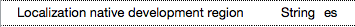

# iOS Localization

_This document covers the localization features of the iOS SDK and how to access them with Xamarin._

Refer to the [Internationalization Encodings](encodings.md) for instructions on including
character sets/code pages in applications that must process non-Unicode data.

## iOS Platform Features

This section describes some of the localization features in iOS. Skip to the
[next section](#basics) to see specific code and examples.

### Language

Users choose their language in the **Settings** app. This setting affects the
language strings and images displayed by the operating system as well as applications
that detect language settings.

This is where users will decide whether they want to see English, Spanish,
Japanese, French or other language displayed in their apps.

The actual list of supported languages in iOS 7 is:
English (U.S.), English (UK), Chinese (Simplified), Chinese (Traditional), French, German, Italian, Japanese, Korean, Spanish, Arabic, Catalan, Croatian, Czech, Danish, Dutch, Finnish, Greek, Hebrew, Hungarian, Indonesian, Malay, Norwegian, Polish, Portuguese, Portuguese (Brazil), Romanian, Russian, Slovak, Swedish, Thai, Turkish, Ukrainian, Vietnamese, English (Australian), Spanish (Mexican).

The current language can be queried by accessing the first element of the `PreferredLanguages` array:

```csharp
var lang = NSBundle.MainBundle.PreferredLocalizations[0];
```

This value will be a language code such as `en` for English, `es` for Spanish,
`ja` for Japanese, etc. _The value returned is restricted to one of the localizations supported by the application (using fallback rules to determine the best match)._

Application code does not always need to check for this value - Xamarin and iOS both
provide features that help to automatically provide the correct string or resource
for the user's language. These features are described in the remainder of this document.

> [!NOTE]
> **NOTE:** Prior to iOS 9, the recommended code was `var lang = NSLocale.PreferredLanguages [0];`.
>
> The results returned by this code changed in iOS 9 - see [Technical Note TN2418](https://developer.apple.com/library/content/technotes/tn2418/_index.html) for more information.
>
> You can continue to use `NSLocale.PreferredLanguages [0]` to determine the
> actual values selected by the user (regardless of the localizations your app supports).

### Locale

Users choose their locale in the **Settings** app. This setting affects the way
that dates, times, numbers and currency are formatted.

This lets users choose whether they see 12 hour or 24 hour time formats, whether
their decimal separator is a comma or a point, and the order of day, month and
year in date display.

With Xamarin you have access to both Apple’s iOS classes (`NSNumberFormatter`) as
well as the .NET classes in System.Globalization. Developers should evaluate
which is better suited to their needs, as there are different features available
in each. In particular, if you are retrieving and displaying In App Purchase
prices using StoreKit you should definitely use Apple’s formatting classes for
the price information returned.

The current locale can be queried by either:

- `NSLocale.CurrentLocale.LocaleIdentifier`
- `NSLocale.AutoUpdatingCurrentLocale.LocaleIdentifier`

The first value can be cached by the operating system and so might not always
reflect the user’s currently selected locale. Use the second value to obtain the
currently selected locale.


### NSCurrentLocaleDidChangeNotification

iOS generates an `NSCurrentLocaleDidChangeNotification` when the user updates
their locale. Applications can listen for this notification while they are
running, and make appropriate changes to the UI.

<a name="basics" />

## Localization Basics in iOS

The following features of iOS are easily leveraged in Xamarin to provide
localized resources for display to the user. Refer to the [TaskyL10n sample](https://github.com/conceptdev/xamarin-samples/tree/master/TaskyL10n)
to see how to implement these ideas.

### Info.plist

Before you begin, configure the **Info.plist** file with the following keys:

- `CFBundleDevelopmentRegion` - the default language for the application (typically
  the language spoken by the developers, and used in the storyboards and string and
  image resources). In the example below, **en** (for English) is specified.
- `CFBundleLocalizations` - an array of other localizations supported by the
  application, also using langauge codes like **es** (Spanish) and **pt-PT**
  (Portuguese spoken in Portugal).

```xml
<key>CFBundleDevelopmentRegion</key>
<string>en</string>
<key>CFBundleLocalizations</key>
<array>
  <string>de</string>
  <string>es</string>
  <string>ja</string>
  ...
</array>
```

### LocalizedString method

The `NSBundle.MainBundle.LocalizedString` method looks up localized text
that has been stored in **.strings** files in the project. These files are
organized by language, in specially named directories with an **.lproj** suffix.

#### .strings file locations

- **Base.lproj** is the directory that contains resources for the default language.
  It is often located in the project root (but can also be placed in the **Resources** folder).
- **<language>.lproj** directories are created for each supported language, usually
  in the **Resources** folder.

There can be a number of different **.strings** files in each language directory:

- **Localizable.strings** - the main list of localized text.
- **InfoPlist.strings** - certain specific keys are allowed in this file to
  translate things like the application name.
- **<storyboard-name>.strings** - optional file that contains translations
  for user interface elements in a storyboard.

The **Build Action** for these files should be **Bundle Resource**.

#### .strings file format

The syntax for localized string values is:

```csharp
/* comment */
"key"="localized-value";
```

You should escape the following characters in strings:

* `\"`	quote
* `\\`	backslash
* `\n`	newline

This is an example **es/Localizable.strings** (ie. Spanish) file from the sample:

```csharp
"<new task>" = "<new task>";
"Task Details" = "Detalles de la tarea";
"Name" = "Nombre";
"task name" = "nombre de la tarea";
"Notes" = "Notas";
"other task info"= "otra información de tarea";
"Done" = "Completo";
"Save" = "Guardar";
"Delete" = "Eliminar";
```

### Images

To localize an image in iOS:

1. Refer to the image in code, for example:

  ```csharp
  UIImage.FromBundle("flag");
  ```

2. Place the default image file **flag.png** in **Base.lproj**
  (the native development language directory).

3. Optionally place localized versions of the image  in **.lproj**
  folders for each language (eg. **es.lproj**, **ja.lproj**). Use the same
  filename **flag.png** in each language directory.

If an image is not present for a particular language, iOS will fall back to the
default native language folder and load the image from there.


#### Launch Images

Use the standard naming conventions for the launch images (and the XIB or
Storyboard for iPhone 6 models) when placing them in
the **.lproj** directories for each language.

```csharp
Default.png
Default@2x.png
Default-568h@2x.png
LaunchScreen.xib
```

### App name

Placing an **InfoPlist.strings** file in an **.lproj** directory lets you
override some values from the app's **Info.plist**, including the application name:

```csharp
"CFBundleDisplayName" = "LeónTodo";
```

Other keys that you can use to [localize application-specific strings](https://developer.apple.com/library/ios/documentation/MacOSX/Conceptual/BPInternational/LocalizingYourApp/LocalizingYourApp.html#//apple_ref/doc/uid/10000171i-CH5-SW21) are:

- CFBundleName
- CFBundleShortVersionString
- NSHumanReadableCopyright


<!--
## App icon

Does not seem to be possible (although it definitely used to be!).
-->

### Localization Native Development Region

The default strings (located in the **Base.lproj** folder) will be assumed
to be the ‘fallback’ language. This means that if a translation is requested in
the code and is not found for a the current language, the **Base.lproj** folder will
be searched for the default string to use (if no match is found, the translation
identifier string itself is displayed).

Developers can choose a different language to be the fallback by setting the
plist key `CFBundleDevelopmentRegionKey`. Its value should be set to the language
code for the native development language. This screenshot shows a plist in Xamarin
Studio with the Native Development Region set to Spanish (es):



If the default language used in your storyboards and throughout your code is not
English, set this value to reflect the native language being
used throughout the app code.

### Dates and Times

Although it is possible to use the built-in .NET date and time functions
(along with the current `CultureInfo`) to format dates and times for a
locale, this would ignore locale-specific user-settings (which can be set
separately from language).

Use the iOS `NSDateFormatter` to produce output that matches the
user's locale preference. The following sample code demonstrates
the basic date and time formatting options:

```csharp
var date = NSDate.Now;
var df = new NSDateFormatter ();
df.DateStyle = NSDateFormatterStyle.Full;
df.TimeStyle = NSDateFormatterStyle.Long;
Debug.WriteLine ("Full,Long: " + df.StringFor(date));
df.DateStyle = NSDateFormatterStyle.Short;
df.TimeStyle = NSDateFormatterStyle.Short;
Debug.WriteLine ("Short,Short: " + df.StringFor(date));
df.DateStyle = NSDateFormatterStyle.Medium;
df.TimeStyle = NSDateFormatterStyle.None;
Debug.WriteLine ("Medium,None: " + df.StringFor(date));
```

Results for English in the United States:

```csharp
Full,Long: Friday, August 7, 2015 at 10:29:32 AM PDT
Short,Short: 8/7/15, 10:29 AM
Medium,None: Aug 7, 2015
```

Results for Spanish in Spain:

```csharp
Full,Long: viernes, 7 de agosto de 2015, 10:26:58 GMT-7
Short,Short: 7/8/15 10:26
Medium,None: 7/8/2015
```

Refer to the Apple [Date Formatters](https://developer.apple.com/library/mac/documentation/Cocoa/Conceptual/DataFormatting/Articles/dfDateFormatting10_4.html) documentation for more information. When testing locale-sensitive
date and time formatting, check both **iPhone Language** and **Region** settings.

<a name="rtl" />

### Right-to-Left (RTL) Layout

iOS provides a number of features to assist in building RTL-aware apps:

* Use **Auto-Layout** `leading` and `trailing` attributes for control aligment
  (which corresponds to *left* and *right* for English, for example, but is reversed for RTL languages).
  The [`UIStackView`](~/ios/user-interface/controls/uistackview.md)
  control is particularly useful for laying out controls to be RTL-aware.
* Use `TextAlignment = UITextAlignment.Natural` for text alignment (which will be *left*
  for most languages but *right* for RTL).
* `UINavigationController` automatically flips the back button and reverses swipe direction.

The following screenshots show the [localized **Tasky** sample](https://github.com/conceptdev/xamarin-samples/tree/master/TaskyL10n) in Arabic and Hebrew (although
English has been entered in the fields):

[](images/rtl-ar.png#lightbox "Arabic") 

[](images/rtl-he.png#lightbox "Hebrew")

iOS automatically reverses the `UINavigationController`, and the other controls
are placed inside `UIStackView` or aligned with Auto-Layout.
RTL text is localized using **.strings** files in the same
way as LTR text.


<a name="code"/>

## Localizing the UI in Code

The [Tasky (localized in code)](https://github.com/conceptdev/xamarin-samples/tree/master/TaskyL10n)
sample shows how to localize an application where the user-interface is
built in code (rather than XIBs or storyboards).

### Project Structure


### Localizable.strings file

As described above, the **Localizable.strings** file format
consists of key-value pairs, where the key is a user-selected string that
indicates

The Spanish (**es**) localizations for the sample are shown below:

```csharp
"<new task>" = "<new task>";
"Task Details" = "Detalles de la tarea";
"Name" = "Nombre";
"task name" = "nombre de la tarea";
"Notes" = "Notas";
"other task info"= "otra información de tarea";
"Done" = "Completo";
"Save" = "Guardar";
"Delete" = "Eliminar";
```

### Performing the localization

In the application code, wherever a user interface's display text is
set (whether it is a label's text, or an input's placeholder, etc) the code
uses the iOS `LocalizedString` function to retrieve the correct translation
to display:

```csharp
var localizedString = NSBundle.MainBundle.LocalizedString ("key", "optional");
someControl.Text = localizedString;
```

<a name="storyboard"/>

## Localizing Storyboard UIs

The sample [Tasky (localized storyboard)](https://github.com/conceptdev/xamarin-samples/tree/master/TaskyL10nStoryboard)
shows how to localize text on controls in a storyboard.

### Project Structure

The **Base.lproj** directory contains the storyboard, and should also contain
any images used in the application.

The other language directories contain a **Localizable.strings** file for any
string resources referenced in code, as well as a **MainStoryboard.strings** file
that contains translations for text in the storyboard.


The language directories should contain a copy of any images that
have been localized, to override the one present in **Base.lproj**.

### Object ID / Localization ID

When creating and editing controls in a storyboard, select each control
and check the ID to use for localization:

* in Visual Studio for Mac, it's located in the Properties pad and called  **Localization ID**.
* in Xcode, it's called **Object ID**.

It is a string value that often has a form like **"NF3-h8-xmR"**:


This value is used in the **.strings** file to assign translated text automatically
to each control.

### MainStoryboard.strings

The format of the storyboard translation file is similar to the **Localizable.strings**
file, except that the key (the value on the left) cannot be user-defined but
instead must have a very specific format: `ObjectID.property`.

In the example **Mainstoryboard.strings** below you can see `UITextField`s have
a `placeholder` text property that can be localized; `UILabel`s have a `text`
property; and `UIButton`s default text is set using `normalTitle`:

```csharp
"SXg-TT-IwM.placeholder" = "nombre de la tarea";
"Pqa-aa-ury.placeholder"= "otra información de tarea";
"zwR-D9-hM1.text" = "Detalles de la tarea";
"bAM-2j-Rzw.text" = "Notas";           /* Notes */
"NF3-h8-xmR.text" = "Completo";        /* Done */
"MWt-Ya-pMf.normalTitle" = "Guardar";  /* Save */
"IGr-pR-05L.normalTitle" = "Eliminar"; /* Delete */
```

> [!IMPORTANT]
> **Using a storyboard with Size Classes** may result in the translations
not appearing. This is probably related to [this issue](http://stackoverflow.com/questions/24989208/xcode-6-does-not-localize-interface-builder)
where Apple's documentation says:
> Localization A storyboard or XIB will not localize correctly if all of the following three conditions are true: The storyboard or XIB uses size classes. The base localization and the build target are set to Universal. The build targets iOS 7.0.
> The fix is to duplicate your storyboard strings file into two identical files: **MainStoryboard~iphone.strings**
and **MainStoryboard~ipad.strings**:

> 


<!--
# Native Formatting

Xamarin.iOS applications can take advantage of the .NET framework's formatting options for localizing
numbers and dates.

### Date string formatting

https://developer.apple.com/library/ios/documentation/Cocoa/Conceptual/DataFormatting/Articles/dfDateFormatting10_4.html#//apple_ref/doc/uid/TP40002369-SW1


NSDateFormatter formatter = new NSDateFormatter ();
formatter.DateFormat = "MMMM/dd/yyyy";
NSString dateString = new NSString (formatter.ToString (d));


### Number formatting

https://developer.apple.com/library/ios/documentation/Cocoa/Conceptual/DataFormatting/Articles/dfNumberFormatting10_4.html#//apple_ref/doc/uid/TP40002368-SW1

-->

<a name="appstore" />

## App Store listing

Follows Apple's FAQ on [App Store Localization](https://itunespartner.apple.com/en/apps/faq/App%20Store_Localization)
to enter translations for each country your app is on sale. Note their warning
that the translations will only appear if your app also contains a localized
**.lproj** directory for the language.

<!--

Once you’ve entered your application into iTunes Connect the default language
metadata and screenshots will appear as shown:


Use the language list on the right to select other languages to provide
translated application name, description, search keywords, URLs and screenshots.
The complete list of languages is shown in this screenshot:


-->

## Summary

This article covers the basics of localizing iOS applications using the built-in
resource handling and storyboard features.

You can learn more about i18n and L10n for iOS, Android and cross-platform apps
(including Xamarin.Forms) in [this cross-platform guide](~/cross-platform/app-fundamentals/localization.md).


## Related Links

- [Tasky (localized in code) (sample)](https://github.com/conceptdev/xamarin-samples/tree/master/TaskyL10n)
- [Tasky (localized storyboard) (sample)](https://github.com/conceptdev/xamarin-samples/tree/master/TaskyL10nStoryboard)
- [Apple Localization Guide](https://developer.apple.com/library/ios/documentation/MacOSX/Conceptual/BPInternational/InternationalizingYourUserInterface/InternationalizingYourUserInterface.html)
- [Cross-Platform Localization Overview](~/cross-platform/app-fundamentals/localization.md)
- [Xamarin.Forms Localization](~/xamarin-forms/app-fundamentals/localization.md)
- [Android Localization](~/android/app-fundamentals/localization.md)
